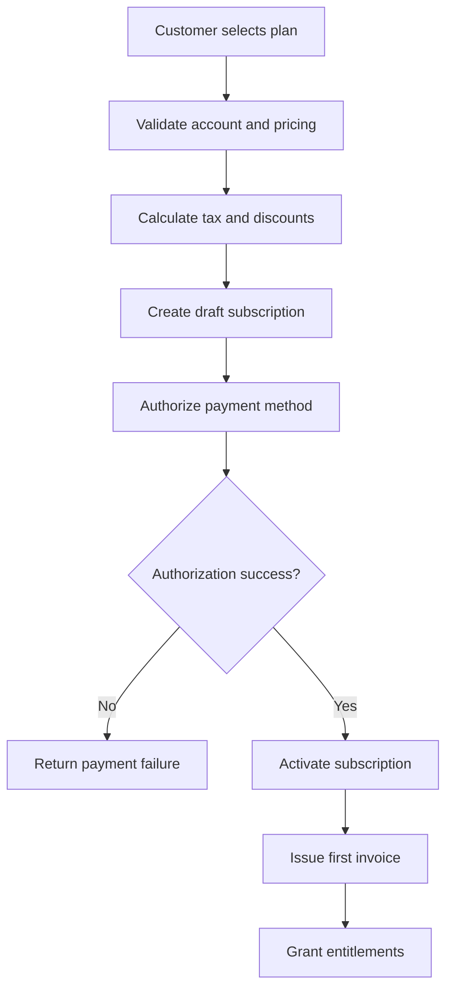
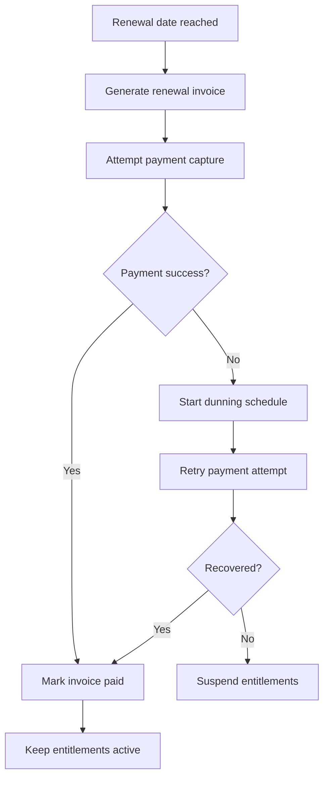
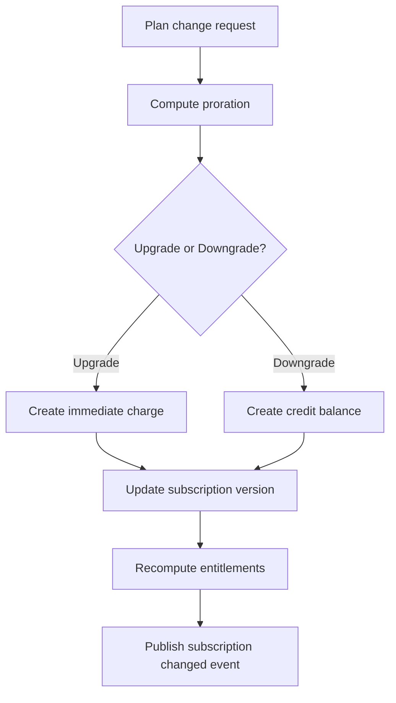

# Activity Diagrams

## New Subscription Checkout

```mermaid
flowchart TD
    A[Customer selects plan] --> B[Validate account and pricing]
    B --> C[Calculate tax and discounts]
    C --> D[Create draft subscription]
    D --> E[Authorize payment method]
    E --> F{Authorization success?}
    F -- No --> G[Return payment failure]
    F -- Yes --> H[Activate subscription]
    H --> I[Issue first invoice]
    I --> J[Grant entitlements]
```

## Renewal and Dunning

```mermaid
flowchart TD
    A[Renewal date reached] --> B[Generate renewal invoice]
    B --> C[Attempt payment capture]
    C --> D{Payment success?}
    D -- Yes --> E[Mark invoice paid]
    E --> F[Keep entitlements active]
    D -- No --> G[Start dunning schedule]
    G --> H[Retry payment attempt]
    H --> I{Recovered?}
    I -- Yes --> E
    I -- No --> J[Suspend entitlements]
```

## Mid-Cycle Plan Change

```mermaid
flowchart TD
    A[Plan change request] --> B[Compute proration]
    B --> C{Upgrade or Downgrade?}
    C -- Upgrade --> D[Create immediate charge]
    C -- Downgrade --> E[Create credit balance]
    D --> F[Update subscription version]
    E --> F
    F --> G[Recompute entitlements]
    G --> H[Publish subscription changed event]
```
