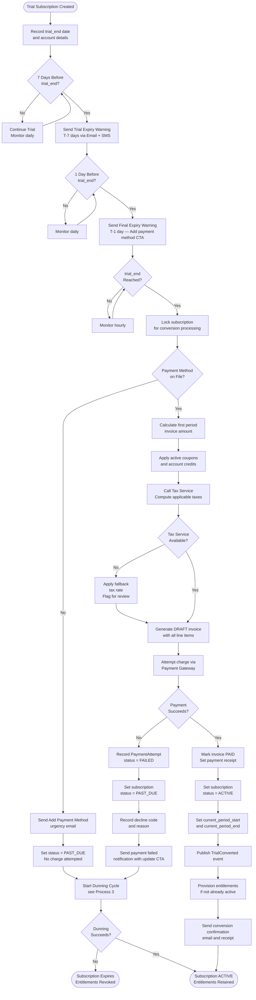
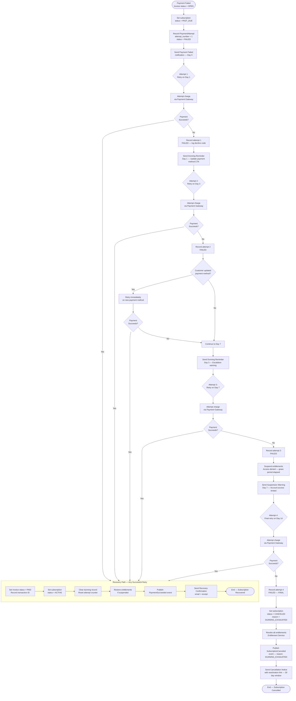

# Activity Diagrams — Subscription Billing and Entitlements Platform

## 1. Overview

This document presents activity diagrams for the three most critical operational workflows in the Subscription Billing and Entitlements Platform. Each diagram is expressed as a Mermaid flowchart (top-down orientation) and accompanied by a detailed narrative describing decision points, data transformations, system interactions, and error handling.

The three workflows covered are:

1. **Trial-to-Paid Conversion** — the automated process of transitioning a trialling account to a paying subscription.
2. **Invoice Generation and Payment Collection** — the end-of-cycle workflow that generates an invoice, computes tax, and collects payment.
3. **Dunning Cycle** — the retry and escalation workflow executed when a payment fails.

---

## 2. Process 1: Trial-to-Paid Conversion

### 2.1 Activity Diagram

### 2.2 Narrative

**Trigger:** The scheduling service evaluates all subscriptions in `TRIALING` status daily, hourly within the last 24 hours of trial, and at the precise `trial_end` timestamp.

**T-7 Days Warning:** An email and (if opted in) SMS is sent to the Account Owner summarising what they will be charged and prompting them to verify their payment method. This touchpoint reduces conversion failures by allowing customers to proactively fix expired or invalid cards.

**T-1 Day Warning:** A final nudge email is sent with a direct link to the payment method management screen. The email includes the exact charge amount, billing cycle details, and a clear cancellation link if the customer does not wish to convert.

**Payment Method Check:** At `trial_end`, the system locks the subscription record (optimistic concurrency token) to prevent race conditions if the customer manually converts simultaneously.

**No Payment Method Path:** If no payment method exists, the subscription transitions to `PAST_DUE` without generating a charge attempt. The dunning cycle handles the follow-up, treating Day 0 as the day the trial expired. Entitlements are suspended (not revoked) for the configured grace period (default: 3 days).

**Tax Calculation:** The Tax Service is called with itemised line items, the account's billing address, and the applicable product tax code. If unavailable, the system applies the account's pre-configured fallback rate and flags the invoice for reconciliation review.

**Successful Conversion:** The invoice is marked paid, the subscription is set to `ACTIVE`, and the entitlement engine is instructed to ensure all feature grants are in the `ACTIVE` state. A `TrialConverted` event is published to the event bus for downstream analytics and CRM updates.

**Failed Payment at Conversion:** The dunning cycle begins immediately, treating the trial conversion attempt as Attempt #0. The standard dunning schedule (Day 1, Day 3, Day 7, Day 14) starts from this point.

---

## 3. Process 2: Invoice Generation and Payment Collection

### 3.1 Activity Diagram

```mermaid
flowchart TD
    A([Billing Cycle End Date Reached\nfor Subscription]) --> B[Acquire idempotency lock\nfor billing_period + subscription_id]
    B --> C{Lock Acquired?\nNot already invoiced?}
    C -- No --> D([Exit — Already Invoiced\nfor this period])
    C -- Yes --> E[Fetch subscription,\nplan, and pending adjustments]
    E --> F[Calculate recurring\nplan charges\nflat or per-seat]

    F --> G{Plan has\nUsage Meters?}
    G -- No --> H[Skip usage calculation]
    G -- Yes --> I[Wait for usage_collection_deadline\ndefault: 2h after period end]
    I --> J[Fetch all UsageRecord entries\nfor billing period]
    J --> K[Aggregate usage per meter\nApply pricing tiers]
    K --> L{Late events\nstill expected?}
    L -- Yes --> M[Flag invoice for\npotential amendment\nProceed anyway]
    L -- No --> H

    H --> N[Apply active coupon\ndiscounts to subtotal]
    M --> N
    N --> O[Apply account\ncredit balance]
    O --> P{Invoice subtotal\n≤ 0 after credits?}

    P -- Yes --> Q[Mark invoice PAID\nZero amount — credits covered it]
    Q --> R[Publish InvoiceGenerated event]
    R --> S[Send Invoice Ready\nnotification email]
    S --> T[Advance billing period\nSet next_billing_date]
    T --> U([End — No Payment Needed])

    P -- No --> V[Call Tax Service\nwith line items + billing address]
    V --> W{Tax Service\nAvailable?}
    W -- No --> X[Apply fallback tax rate\nAlert operations team]
    W -- Yes --> Y[Record tax breakdown\nper jurisdiction]
    X --> Z
    Y --> Z[Compute final invoice total\nsubtotal - discounts - credits + tax]
    Z --> AA[Create Invoice record\nstatus = OPEN]
    AA --> AB[Publish InvoiceGenerated event]
    AB --> AC[Send Invoice Ready\nnotification email]
    AC --> AD[Attempt Payment Collection\nsee UC-006]
    AD --> AE{Payment\nSucceeds?}

    AE -- Yes --> AF[Set Invoice status = PAID\nRecord transaction ID]
    AF --> AG[Publish PaymentSucceeded event]
    AG --> AH[Send Payment Receipt email]
    AH --> AI[Advance subscription\nbilling period]
    AI --> AJ([End — Invoice Paid Successfully])

    AE -- No --> AK[Record PaymentAttempt\nstatus = FAILED]
    AK --> AL[Set subscription\nstatus = PAST_DUE]
    AL --> AM[Publish PaymentFailed event]
    AM --> AN[Start Dunning Cycle\nsee Process 3]
    AN --> AO([End — Dunning Initiated])
```

### 3.2 Narrative

**Idempotency Lock:** Before generating any invoice, the system acquires a distributed lock keyed on `subscription_id + billing_period_start`. This prevents double-invoicing if the scheduler fires multiple times or if a manual invoice generation is triggered concurrently.

**Usage Collection Deadline:** For plans with usage-based meters, the system waits up to the configured `usage_collection_deadline` (default: 2 hours after the billing period end) to allow in-flight usage events to be processed. After this deadline, the invoice is generated with whatever usage data is available. Any late events received after the deadline are handled via adjustment invoices.

**Tier Pricing Evaluation:** Usage charges are calculated using the plan's configured pricing model:
- **Flat pricing:** A fixed price per unit regardless of volume.
- **Graduated pricing:** Different rates applied to successive tiers cumulatively. E.g., $0.10/unit for the first 1,000 units, $0.08/unit for 1,001–10,000, $0.05/unit beyond.
- **Volume pricing:** The tier rate for the total volume applies to all units. The applicable tier is determined by the total usage quantity.
- **Package pricing:** Usage is charged in predefined bundle increments (e.g., 100 API calls per $5 block).

**Credit Application:** Account credit balance is consumed in FIFO order (oldest credit first) and applied before tax calculation. Credits reduce the taxable invoice amount.

**Zero-Amount Invoices:** When credits fully cover the invoice, a zero-amount `PAID` invoice is still created for record-keeping and accounting reconciliation purposes.

**Tax Line Items:** The Tax Service returns a per-line-item, per-jurisdiction breakdown. This granularity is required for accurate accounting export to QuickBooks / NetSuite and for tax reporting compliance.

**Invoice Finalisation:** Once the invoice is created with `status = OPEN`, it is immutable. Any corrections require a credit note or adjustment invoice.

**Payment Collection:** Payment is attempted synchronously (or via webhook callback within 30 seconds). The invoice ID and attempt number form the idempotency key sent to the Payment Gateway to prevent double charges.

---

## 4. Process 3: Dunning Cycle

### 4.1 Activity Diagram

### 4.2 Narrative

**Dunning Schedule:** The default dunning schedule is configurable per plan. The standard schedule is:

| Attempt | Day | Action | Notification |
|---|---|---|---|
| 0 | Day 0 | Initial failure recorded | "Payment failed" email + SMS |
| 1 | Day 1 | First retry | "Retry scheduled" notice |
| 2 | Day 3 | Second retry | "Action required" reminder |
| 3 | Day 7 | Third retry | "Account suspended" warning |
| 4 | Day 14 | Final retry | "Final notice" |
| — | Day 15+ | Cancellation | "Subscription cancelled" |

Enterprise plans can be configured with extended dunning windows (up to 30 days, 6 retries).

**Grace Period and Entitlement Suspension:** After Day 3 of failed payments, entitlement *access* is suspended (the grants remain in the database but evaluations return `has_access = false`). This is distinct from revocation: if the account recovers payment, entitlements are restored without re-provisioning. Full revocation only occurs on confirmed cancellation.

**Payment Method Update During Dunning:** If the Account Owner updates their payment method at any point during the dunning cycle, the system detects the `PaymentMethodUpdated` event and triggers an immediate out-of-schedule retry. This can bypass the standard retry schedule and recover the subscription faster.

**Exponential Backoff at Gateway Level:** Each charge attempt uses a unique idempotency key (`invoice_id + attempt_number`). Within a single attempt, the Payment Gateway adapter applies 3 exponential-backoff retries (1 s, 2 s, 4 s) for transient network errors. These are lower-level retries distinct from the dunning schedule retries.

**Decline Code Analysis:** The system categorises gateway decline codes:
- **Hard declines** (e.g., `card_not_supported`, `do_not_honor_permanent`): The dunning cycle is skipped or accelerated. An immediate notification is sent prompting the customer to use a different payment method.
- **Soft declines** (e.g., `insufficient_funds`, `card_velocity_exceeded`): Standard dunning schedule applies.
- **Network errors:** Treated as retriable; the attempt is rescheduled without counting against the dunning attempt limit.

**Post-Cancellation Reactivation Window:** After cancellation due to dunning exhaustion, the Account Owner has a 30-day window to reactivate the subscription. Reactivation requires providing a valid payment method and immediately collecting the outstanding balance. The subscription is restored on the same plan with a new billing period starting from the reactivation date. Historical usage and invoices are retained.

**Metrics and Alerting:** The dunning system emits the following metrics to Datadog:
- `dunning.active_count` — Number of subscriptions currently in dunning
- `dunning.recovery_rate` — Percentage of dunning cycles that result in recovery (by cohort and plan)
- `dunning.cancellation_rate` — Percentage resulting in cancellation
- `dunning.attempt_latency` — Time between scheduled retry and actual attempt execution

A Datadog alert fires if `dunning.active_count` increases by more than 20% in a 1-hour window, which may indicate a systematic payment gateway issue.
