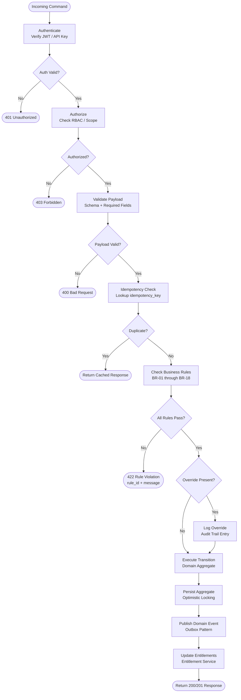

# Business Rules

**Platform:** Subscription Billing and Entitlements Platform  
**Document Version:** 1.0.0  
**Status:** Approved  
**Last Reviewed:** 2025-01-01  
**Owner:** Billing Engineering and Finance Operations

---

## Table of Contents

1. [Purpose and Scope](#1-purpose-and-scope)
2. [Enforceable Rules](#2-enforceable-rules)
3. [Rule Evaluation Pipeline](#3-rule-evaluation-pipeline)
4. [Exception and Override Handling](#4-exception-and-override-handling)
5. [Rule Conflict Resolution](#5-rule-conflict-resolution)
6. [Rule Versioning and Change Management](#6-rule-versioning-and-change-management)

---

## 1. Purpose and Scope

This document defines the complete set of enforceable business rules governing the Subscription Billing and Entitlements Platform. Every billing operation—plan changes, payment collection, invoice generation, entitlement management, and refund processing—must pass rule evaluation before execution is permitted.

Rules are enforced at the domain layer, not in the API or persistence layers. Any bypass of the rule engine without an approved override constitutes a policy violation subject to compliance review.

**Scope Boundaries:**

- Applies to all subscription types: trial, monthly, annual, usage-based, and hybrid.
- Applies to all payment currencies supported by the platform.
- Applies to all customer tiers: self-serve, sales-assisted, and enterprise.
- Does not govern internal chargebacks or payment processor disputes (handled by the Finance Ops runbook).

---

## Enforceable Rules

Each rule carries an identifier, a human-readable name, the governing domain, the enforcement action on violation, and the configurable scope (global or per-plan override allowed).

---

### BR-01 — Proration Calculation on Mid-Cycle Plan Change

**Domain:** Billing / Subscription  
**Enforcement:** Hard block — transaction rejected if proration amounts cannot be computed  
**Configurable:** Per-plan (proration policy may be set to `none`, `credit_only`, or `credit_and_charge`)

When a customer changes plans mid-billing-cycle, the platform must calculate a credit for unused time on the old plan and a charge for the remaining time on the new plan.

**Formula:**

```
credit_amount   = (days_remaining / days_in_cycle) x current_plan_amount
charge_amount   = (days_remaining / days_in_cycle) x new_plan_amount
net_adjustment  = charge_amount - credit_amount
```

- `days_remaining` is computed as the number of calendar days from the change date (inclusive) to the cycle end date (inclusive).
- `days_in_cycle` is the total calendar days in the current billing period.
- Fractional cents are rounded to two decimal places using banker's rounding (round-half-to-even).
- If `net_adjustment` is negative, the difference is applied as an account credit (not a cash refund unless explicitly requested under BR-05).
- Proration is computed in the account's locked currency (see BR-10).
- Plan downgrades that produce a negative net adjustment must still generate a credit note (see BR-09).

**Trigger Conditions:** `PlanChange` command with `effective_immediately: true`.

---

### BR-02 — Trial Period Limits

**Domain:** Subscription Lifecycle  
**Enforcement:** Hard block — second trial attempt on same account/plan combination rejected  
**Configurable:** Per-plan (trial duration, credit card requirement)

One trial period is permitted per account per plan. The combination of `(account_id, plan_id)` is the uniqueness key—not `(account_id, plan_version_id)`. A customer who trials Plan A on version 1.0 cannot start a new trial on Plan A version 2.0.

- Credit card capture is controlled by the plan's `trial_payment_method_required` flag.
- If a credit card is required and none is on file, the trial cannot start.
- If a trial is cancelled early by the customer, the trial slot for that plan is considered consumed; no second trial is granted.
- Trial duration is defined in whole days (minimum 1, maximum 90). Fractional days are not supported.
- System clock is UTC for all trial boundary calculations.

---

### BR-03 — Dunning Retry Schedule

**Domain:** Payment Collection / Dunning  
**Enforcement:** System-automated scheduling; deviations require finance-manager override  
**Configurable:** Per-plan (retry offsets and maximum attempts)

When an initial payment attempt fails, the dunning cycle begins. The default retry schedule is:

| Attempt | Day Offset from Failure | Action on Failure          |
|---------|------------------------|----------------------------|
| Retry 1 | Day 1                  | Retry charge               |
| Retry 2 | Day 3                  | Retry charge + email       |
| Retry 3 | Day 7                  | Retry charge + email       |
| Retry 4 | Day 14                 | Retry charge + final email |
| Terminal| Day 15 (no retry)      | Subscription Cancelled     |

- Retries are attempted at 09:00 UTC. Customer-facing communications use the account's configured timezone.
- A successful retry at any step terminates the dunning cycle and resets to normal billing.
- If the payment method is removed during dunning, all remaining retries are cancelled and the subscription moves to `Cancelled` state immediately.

---

### BR-04 — Grace Period After Failed Payment

**Domain:** Entitlement Management  
**Enforcement:** Soft enforcement — entitlements suspended after grace period expiry  
**Configurable:** Per-plan (`grace_period_days`, default: 3 calendar days)

From the moment of the first failed payment charge, a grace period begins during which the customer's entitlements remain active.

- Default grace period: **3 calendar days**.
- Grace period countdown starts at the timestamp of the failed payment attempt (not end of business day).
- During the grace period, the subscription remains in the `PastDue` state; entitlements are `Active`.
- At grace period expiry, entitlements transition to `Suspended` state.
- If a payment succeeds during the grace period, the grace period terminates immediately and entitlements remain `Active`.
- Grace period extension requires a `billing-admin` override (see Section 4).

---

### BR-05 — Refund Eligibility Window

**Domain:** Billing / Refunds  
**Enforcement:** Hard block — refund requests outside eligibility rejected  
**Configurable:** Global only (refund window cannot be extended per plan)

A refund may only be issued when all of the following conditions are met:

1. The charge was made within the preceding **30 calendar days**.
2. The invoice associated with the charge has **not already been refunded** (partial or full).
3. The refund amount does not exceed the original charge amount.
4. The invoice is in `Paid` status.

Only one refund per invoice is permitted. Partial refunds are allowed but the invoice is then marked `PartiallyRefunded`, blocking further refund requests.

Refunds are processed as:
- Credit card reversal via the payment processor where supported.
- ACH reversal with 5-business-day processing window.
- Wire transfer returns are handled via Finance Ops manual process and are not automated.

---

### BR-06 — Usage Aggregation Cutoff

**Domain:** Metered Billing / Usage  
**Enforcement:** Hard block — late usage records rejected after grace window  
**Configurable:** Per-plan (`usage_late_grace_hours`, default: 2 hours)

Usage records are accepted and aggregated for billing if:

- The `event_timestamp` on the usage record falls **on or before 23:59:59 UTC on the billing cycle end date**.
- The record is **submitted to the platform within 2 hours after the cycle end date** (i.e., before 02:00:00 UTC on the day following the cycle end date).

Records submitted after the 2-hour grace window are rejected with error code `USAGE_LATE_SUBMISSION`. They must be credited manually via a credit note if the amount is material (over $1.00).

De-duplication: usage records carry an idempotency key (`usage_record_id`). Duplicate submissions are silently acknowledged but not double-counted.

---

### BR-07 — Trial-to-Paid Conversion

**Domain:** Subscription Lifecycle  
**Enforcement:** System-automated; requires valid payment method to be on file  
**Configurable:** Per-plan (`auto_convert_on_trial_end`, default: true)

When a trial period expires:

1. A notification email is dispatched **24 hours before** the trial end timestamp.
2. At the trial end timestamp (00:00:00 UTC on the trial end date), the platform evaluates the default payment method.
3. If a valid payment method exists and `auto_convert_on_trial_end` is `true`, a charge is initiated for the first full billing cycle.
4. If no payment method exists or the charge fails, the subscription moves to `Expired` (not `PastDue`) and entitlements are immediately revoked.
5. A `TrialExpired` event is emitted regardless of conversion outcome.
6. If conversion succeeds, a `SubscriptionActivated` event is emitted alongside `InvoiceFinalized` and `PaymentSucceeded`.

---

### BR-08 — Entitlement Overage Handling

**Domain:** Entitlement Management / Metered Billing  
**Enforcement:** Enforced at entitlement check time  
**Configurable:** Per-entitlement (`overage_policy`: `hard_cap`, `soft_cap`, or `metered`)

Three overage policies govern what happens when usage reaches the entitlement limit:

| Policy     | Behavior at Limit                                      | Billing Impact                          |
|------------|--------------------------------------------------------|-----------------------------------------|
| hard_cap   | Request blocked; error returned to client              | No additional charge                    |
| soft_cap   | Request allowed; alert triggered to account owner      | No additional charge; manual review     |
| metered    | Request allowed; overage units recorded                | Charged at `overage_unit_price` at EOM  |

- Overage charges are line items on the next invoice, not mid-cycle charges.
- `EntitlementOverageDetected` event is emitted on first breach per billing cycle.
- Subsequent overage records in the same cycle increment the counter but do not emit additional events.

---

### BR-09 — Invoice Immutability After Payment

**Domain:** Billing / Invoicing  
**Enforcement:** Hard block — edit operations on paid invoices are rejected  
**Configurable:** No override permitted

Once an invoice transitions to `Paid` status, its line items, tax amounts, discount applications, and total are immutable. No PUT or PATCH operations on the invoice or its line items are accepted.

If an adjustment is necessary post-payment:

1. Issue a **credit note** (`CreditNote`) for the over-billed amount, referencing the original invoice.
2. Create a **new invoice** for any amount owed above the original.
3. The original invoice retains its `Paid` status and the credit note is linked via `original_invoice_id`.

Finance-manager approval is required to initiate a credit note above $500 or 20% of the invoice value (whichever is lower).

---

### BR-10 — Currency Consistency

**Domain:** Account / Billing  
**Enforcement:** Hard block — currency mismatch on charge rejected  
**Configurable:** No override permitted

An account is locked to a single ISO-4217 currency after its first successful payment. The locked currency is stored on the `Account` entity as `billing_currency`.

- Attempts to charge an account in a different currency are rejected with error code `CURRENCY_MISMATCH`.
- Quotes, estimates, and trial invoices before first payment may carry any currency; they do not lock the account.
- Changing billing currency requires creating a new account. There is no migration path.
- This rule prevents multi-currency reconciliation errors and simplifies tax computation.

---

### BR-11 — Tax Calculation Trigger

**Domain:** Billing / Tax  
**Enforcement:** System-automated  
**Configurable:** Per-jurisdiction (tax provider configuration)

Tax is computed at the moment an invoice transitions from `Draft` to `Finalized`. Tax rates are **not** computed at line-item creation time.

- At finalization, the platform calls the configured tax provider with the full line-item payload.
- Tax rates are snapshotted onto the invoice at finalization time; subsequent rate changes do not affect the finalized invoice.
- If the tax provider call fails, the invoice remains in `Draft` and the finalization is retried up to 3 times with exponential backoff.
- A `TaxCalculated` event is emitted after successful tax application.
- Tax-exempt accounts must have a valid exemption certificate on file before any line item can be marked tax-exempt.

---

### BR-12 — Coupon Stackability

**Domain:** Billing / Discounts  
**Enforcement:** Hard block — second percentage-off coupon rejected  
**Configurable:** Per-coupon (`stackable` flag, default: false)

The following stacking rules apply to a single invoice:

- **Percentage-off coupons:** Maximum one per invoice. Attempting to apply a second percentage-off coupon results in error `COUPON_STACK_LIMIT`.
- **Fixed-amount coupons:** Multiple fixed-amount coupons may be stacked, but the total discount cannot exceed the invoice subtotal (before tax). Excess discount is silently capped at the subtotal.
- A percentage coupon and a fixed-amount coupon may coexist on the same invoice; the percentage is applied first, then the fixed amount to the reduced subtotal.
- Expired coupons are rejected at application time.
- Per-customer usage limits are enforced at application time; coupons exceeding `max_redemptions_per_customer` are rejected.

---

### BR-13 — Credit Application Order

**Domain:** Billing / Credits  
**Enforcement:** System-automated  
**Configurable:** No override permitted

When an invoice is finalized and account credits exist, credits are applied automatically in the following order:

1. **Oldest credits first** (by `created_at` ascending).
2. Credits with earlier `expires_at` are prioritized within the same creation date.
3. Credits are consumed in full before moving to the next credit record.
4. Credits expire **12 months** after their `created_at` timestamp if not fully consumed.
5. Expired credits are written off as zero-value and marked `Expired`; no reversal is possible.
6. A `CreditApplied` event is emitted for each credit record consumed against an invoice.

---

### BR-14 — Subscription Pause Limits

**Domain:** Subscription Lifecycle  
**Enforcement:** Hard block — pause requests exceeding limits rejected  
**Configurable:** Per-plan (`pause_allowed`: true/false; `max_pause_months_per_year`: default 3)

Subscriptions may be paused subject to the following constraints:

- Maximum cumulative pause duration: **3 calendar months per rolling 12-month window**.
- The rolling window is computed from the pause request date looking back 12 months.
- Pausing is **not permitted** while a subscription is in `PastDue` or `Dunning` state (see BR-03).
- Pausing is not permitted during the final 7 days of an annual billing cycle.
- The billing cycle clock stops during a pause; the cycle end date shifts forward by the pause duration.
- Entitlements are immediately suspended at pause start and restored at resume.

---

### BR-15 — Plan Version Locking

**Domain:** Subscription / Plan Management  
**Enforcement:** System-automated  
**Configurable:** No override permitted

When a subscription is created or when a customer changes plans, the subscription is pinned to the **plan version active at the time of purchase or change**. This is recorded as `plan_version_id` on the subscription.

- Subsequent edits to the plan (pricing, features, limits) create a new `PlanVersion` and do not affect existing subscriptions.
- There is no automatic migration of subscriptions to newer plan versions.
- Customers who wish to move to a new plan version must initiate a plan change, which may trigger BR-01 proration.
- Plan version archival does not cancel subscriptions on that version.

---

### BR-16 — Invoice Generation Timing

**Domain:** Billing / Invoicing  
**Enforcement:** System-automated  
**Configurable:** Per-plan (`invoice_lead_days_monthly`: default 3; `invoice_lead_days_annual`: default 7)

Invoices are generated in advance of the billing cycle end date to allow time for payment processing:

| Billing Interval | Invoice Generated         | Payment Due          |
|------------------|---------------------------|----------------------|
| Monthly          | 3 days before cycle end   | On cycle end date    |
| Annual           | 7 days before cycle end   | On cycle end date    |
| Usage-based      | On cycle end date         | Net-7 from cycle end |

- Invoice generation triggers the `InvoiceGenerated` event.
- If invoice generation fails, the system retries up to 5 times before alerting the on-call engineer.
- Generated invoices are in `Draft` status until finalization (see BR-11).

---

### BR-17 — Payment Method Validation

**Domain:** Payment / Account  
**Enforcement:** Hard block — invalid payment methods not persisted  
**Configurable:** No override permitted

Before a new payment method is saved to an account:

1. A **$0.00 authorization** (or minimum-amount authorization per processor requirements) is performed.
2. If the authorization is declined, the payment method is rejected with error `PAYMENT_METHOD_INVALID` and not stored.
3. If the authorization is approved, it is voided immediately (not captured).
4. The payment method is stored with a processor-assigned token; raw card data is never stored (PCI DSS compliance).
5. Payment methods with an expiration date in the past are rejected at submission time without contacting the processor.

---

### BR-18 — Subscription Cancellation Timing

**Domain:** Subscription Lifecycle  
**Enforcement:** System-automated  
**Configurable:** Per-account request (`cancel_at_period_end`: true/false)

A subscription cancellation may be immediate or deferred to the end of the current billing cycle:

| Cancellation Type | Effect on Billing                                         | Effect on Entitlements                     |
|-------------------|-----------------------------------------------------------|--------------------------------------------|
| Immediate         | Invoice finalized for current period (pro-rated if applicable) | Entitlements revoked immediately      |
| End-of-cycle      | No additional charge; no proration credit                 | Entitlements remain active until cycle end |

- A `SubscriptionCancelled` event is emitted at the time of cancellation request, with `cancel_at` set to either `now` or the cycle end timestamp.
- Cancellations cannot be reversed after the `cancel_at` timestamp has passed.
- Before the `cancel_at` timestamp, cancellations may be reversed by the customer (reactivation), which creates a new subscription record.

---

## Rule Evaluation Pipeline

All mutating commands pass through the rule evaluation pipeline before domain state is modified. The pipeline is sequential; failure at any stage aborts the operation and returns a structured error response.



### Pipeline Stage Descriptions

| Stage | Responsibility | Failure Mode |
|---|---|---|
| Authenticate | Verify bearer token or API key signature and expiry | 401 — no rule evaluation |
| Authorize | Confirm the caller has the required permission scope | 403 — no rule evaluation |
| Validate Payload | JSON Schema validation; required fields; type and format checks | 400 — structured validation errors |
| Idempotency Check | Lookup `idempotency_key` in distributed cache; return cached result if found | Cached response returned |
| Check Business Rules | Evaluate all applicable rules BR-01 through BR-18 in dependency order | 422 — identifies first failing rule |
| Execute Transition | Apply command to the aggregate; domain invariants enforced in aggregate | 500 — operational alert triggered |
| Persist Aggregate | Write aggregate to database with optimistic locking via version counter | 409 — concurrency conflict, caller retries |
| Publish Domain Event | Write event to outbox table; relay process delivers to message broker | Async — delivery not guaranteed in-request |
| Update Entitlements | Entitlement service consumes events to grant or revoke access rights | Async — eventual consistency |

---

## Exception and Override Handling

Certain business scenarios require authorized personnel to bypass one or more rules. All overrides are classified, logged, time-limited, and fully auditable.

### Override Classes

| Override Class      | Who Can Grant       | Max Duration | Rules That Can Be Overridden                    |
|---------------------|---------------------|--------------|-------------------------------------------------|
| billing-admin       | Billing Team Lead   | 7 days       | BR-04 (grace extension), BR-05 (refund window)  |
| finance-manager     | Finance Manager     | 30 days      | BR-09 (credit note), BR-12 (coupon stacking)    |
| system-automated    | Platform automation | Single-use   | BR-16 (invoice timing during migrations)        |
| executive-approval  | VP Finance or above | 90 days      | BR-10 (currency), BR-05 refunds over $10,000    |

### Override Request Requirements

An override request must include:

- `override_class` — one of the classes listed above.
- `rule_ids` — list of rule identifiers being overridden (e.g., `["BR-04"]`).
- `justification` — free-text business justification (minimum 50 characters).
- `approved_by` — identity of the approver (must match override class authority).
- `expires_at` — ISO-8601 UTC timestamp; must not exceed the class maximum duration.
- `account_id` and `subscription_id` — scope of the override (overrides are never platform-wide).

### Override Logging Requirements

Every override application is recorded in the `override_audit_log` table with:

- `override_id` (UUIDv4)
- `override_class`
- `rule_ids` (array)
- `applied_by` (user identity)
- `approved_by` (approver identity)
- `applied_at` (timestamp)
- `expires_at` (timestamp)
- `justification`
- `account_id`, `subscription_id`
- `original_command_payload` (sanitized — no raw card data)
- `outcome` (`applied`, `rejected`, or `expired`)

### Override Expiration Rules

- Expired overrides are not applied even if the override record exists in the database.
- The rule engine checks `expires_at` at evaluation time, not at approval time.
- No automatic renewal of overrides is permitted; a new override request must be submitted.
- Finance-manager overrides that exceed 30 days require an `executive-approval` override instead.
- System-automated overrides are single-use; they are consumed and cannot be applied a second time.

### Audit Trail Requirements

The audit trail for overrides must:

- Be **append-only** — no updates or deletes are permitted on `override_audit_log`.
- Be **replicated to the compliance data warehouse** within 24 hours of each entry.
- Be **retained for 7 years** in compliance with financial record-keeping regulations.
- Be **queryable by regulators** through a read-only finance audit role with no write access.
- Trigger a **SIEM alert** when more than 5 overrides are applied to the same account within a 7-day rolling window.
- Include the full request context (command type, relevant entity IDs, timestamps) to enable forensic reconstruction.

---

## 5. Rule Conflict Resolution

When two or more rules produce conflicting outcomes for the same operation, the following priority order applies (highest to lowest):

1. **Regulatory requirements** — any rule derived from a legal or regulatory obligation cannot be overridden under any class.
2. **Financial integrity rules** — BR-09 (invoice immutability), BR-10 (currency consistency).
3. **Customer protection rules** — BR-05 (refund eligibility), BR-04 (grace period).
4. **Operational rules** — BR-03 (dunning), BR-16 (invoice timing), BR-17 (payment validation).
5. **Product rules** — BR-02 (trial limits), BR-08 (overage), BR-12 (coupon stacking).

When a conflict cannot be resolved by priority order alone, the operation is blocked and routed to the billing-admin queue for manual resolution within 4 business hours.

---

## 6. Rule Versioning and Change Management

Each rule version is tracked in the `business_rule_versions` table:

| Field            | Description                                               |
|------------------|-----------------------------------------------------------|
| `rule_id`        | Identifier (e.g., `BR-01`)                                |
| `version`        | Semantic version of the rule definition (e.g., `1.2.0`)  |
| `effective_from` | ISO-8601 UTC timestamp when this version became active    |
| `effective_until`| ISO-8601 UTC timestamp when superseded (null if current)  |
| `changed_by`     | Identity of the approver who ratified the change          |
| `change_summary` | Human-readable description of what changed and why        |

Rule changes require:

1. Engineering implementation in a dedicated feature branch.
2. Product owner sign-off on the updated rule specification.
3. Finance review for any rule affecting monetary calculations or refund logic.
4. Legal review for any rule with compliance, tax, or data-retention implications.
5. Deployment with a feature flag enabling rollback within 48 hours of production release.
6. Post-deployment monitoring of rule violation rates for 72 hours to detect regression.
