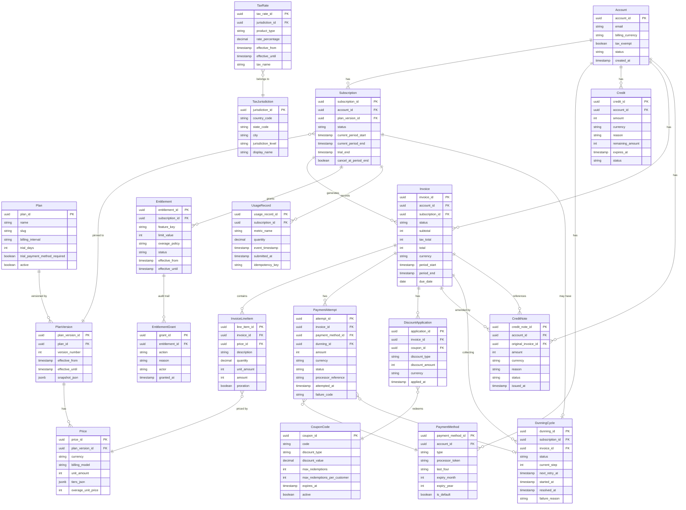

# Data Dictionary

**Platform:** Subscription Billing and Entitlements Platform  
**Document Version:** 1.0.0  
**Status:** Approved  
**Last Reviewed:** 2025-01-01  
**Owner:** Data Engineering and Billing Engineering

---

## Table of Contents

1. [Purpose and Scope](#1-purpose-and-scope)
2. [Core Entities](#2-core-entities)
3. [Canonical Relationship Diagram](#3-canonical-relationship-diagram)
4. [Entity Attribute Reference](#4-entity-attribute-reference)
5. [Data Quality Controls](#5-data-quality-controls)
6. [Sensitive Data Classification](#6-sensitive-data-classification)
7. [Retention Policies](#7-retention-policies)

---

## 1. Purpose and Scope

This data dictionary provides the authoritative reference for every entity in the Subscription Billing and Entitlements Platform. It defines what each entity represents, the key attributes it holds, how it relates to other entities, and the data quality controls that govern its lifecycle.

All database schemas, API response bodies, and event payloads must conform to the definitions in this document. Deviations require a data model change request reviewed by the Data Engineering and Billing Engineering teams.

**Conventions Used:**

- Attribute names are in `snake_case`.
- UUIDs are version 4 unless noted otherwise.
- All timestamps are stored in UTC and formatted as ISO-8601.
- Monetary amounts are stored as integers in the currency's smallest unit (e.g., cents for USD) to avoid floating-point rounding errors.
- Soft deletes are used for all financial entities; hard deletes are prohibited.

---

## Core Entities

The following table provides a high-level summary of every entity in the platform. Detailed attribute specifications are in Section 4.

| Entity | Description | Key Attributes | Relationships |
|---|---|---|---|
| Account | A customer account that owns one or more subscriptions and holds billing configuration such as currency lock, tax status, and contact details. | `account_id`, `email`, `billing_currency`, `tax_exempt`, `created_at` | Has many Subscriptions; has many PaymentMethods; has many Credits; has many Invoices |
| Subscription | A customer's active agreement to receive a plan at a defined price, tracked through its full lifecycle from trial through cancellation. | `subscription_id`, `account_id`, `plan_version_id`, `status`, `current_period_start`, `current_period_end` | Belongs to Account; belongs to PlanVersion; has many Invoices; has many Entitlements; has one DunningCycle |
| Plan | A product package definition that groups pricing, entitlements, and trial configuration. Plans are not changed in-place; edits produce new PlanVersions. | `plan_id`, `name`, `slug`, `billing_interval`, `trial_days`, `trial_payment_method_required`, `active` | Has many PlanVersions; has many Prices; has many EntitlementGrants |
| PlanVersion | A frozen, immutable snapshot of a plan's configuration at a specific point in time. Subscriptions pin to a PlanVersion at purchase time per BR-15. | `plan_version_id`, `plan_id`, `version_number`, `effective_from`, `effective_until`, `snapshot_json` | Belongs to Plan; referenced by Subscription; referenced by Price |
| Price | Pricing configuration for a plan, supporting flat-rate, per-unit, tiered, and volume pricing models. A plan version may have multiple prices (e.g., base seat + overage). | `price_id`, `plan_version_id`, `currency`, `billing_model`, `unit_amount`, `tiers_json`, `overage_unit_price` | Belongs to PlanVersion; referenced by InvoiceLineItem |
| UsageRecord | A metered usage event submitted by the customer or their systems, recording consumption of a billable resource during a billing cycle. | `usage_record_id`, `subscription_id`, `metric_name`, `quantity`, `event_timestamp`, `submitted_at`, `idempotency_key` | Belongs to Subscription; aggregated into InvoiceLineItem |
| Invoice | The primary billing document for a subscription period, containing all charges, discounts, tax, and payment status for that cycle. | `invoice_id`, `account_id`, `subscription_id`, `status`, `subtotal`, `tax_total`, `total`, `currency`, `period_start`, `period_end`, `due_date` | Belongs to Account; belongs to Subscription; has many InvoiceLineItems; has many PaymentAttempts; has many CreditNotes; has many DiscountApplications |
| InvoiceLineItem | An individual charge or credit line on an invoice, representing a specific priced item such as a base subscription fee, usage charge, or proration adjustment. | `line_item_id`, `invoice_id`, `price_id`, `description`, `quantity`, `unit_amount`, `amount`, `proration`, `period_start`, `period_end` | Belongs to Invoice; belongs to Price; may reference UsageRecord |
| PaymentMethod | A stored, tokenized payment instrument (credit card, ACH, wire) that has passed the $0 authorization validation described in BR-17. | `payment_method_id`, `account_id`, `type`, `processor_token`, `last_four`, `expiry_month`, `expiry_year`, `is_default`, `created_at` | Belongs to Account; referenced by PaymentAttempt |
| PaymentAttempt | A single attempt to collect payment against an invoice, recording the outcome, processor response, and timing for audit and dunning purposes. | `attempt_id`, `invoice_id`, `payment_method_id`, `amount`, `currency`, `status`, `processor_reference`, `attempted_at`, `failure_code` | Belongs to Invoice; belongs to PaymentMethod; belongs to DunningCycle (if dunning) |
| Credit | An account-level balance credit that is applied automatically to future invoices in oldest-first order per BR-13. Credits expire 12 months after creation. | `credit_id`, `account_id`, `amount`, `currency`, `reason`, `remaining_amount`, `expires_at`, `created_at`, `status` | Belongs to Account; consumed by Invoice (via CreditApplication); may originate from CreditNote |
| CreditNote | A formal financial document that reduces the amount owed on a paid invoice, required for post-payment adjustments per BR-09. | `credit_note_id`, `account_id`, `original_invoice_id`, `amount`, `currency`, `reason`, `status`, `issued_at`, `approved_by` | Belongs to Account; references Invoice; may generate a Credit |
| Entitlement | An access right granted to a subscription, representing a specific feature, resource limit, or capability that the customer is permitted to use. | `entitlement_id`, `subscription_id`, `feature_key`, `limit_value`, `overage_policy`, `status`, `effective_from`, `effective_until` | Belongs to Subscription; has many EntitlementGrants; has many UsageRecords |
| EntitlementGrant | A historical record of an entitlement being granted or revoked, providing a full audit trail of access changes over the subscription lifecycle. | `grant_id`, `entitlement_id`, `action`, `reason`, `actor`, `granted_at`, `metadata_json` | Belongs to Entitlement; immutable record |
| CouponCode | A promotional discount code that can be applied to invoices to reduce the amount charged, subject to the stacking and eligibility rules in BR-12. | `coupon_id`, `code`, `discount_type`, `discount_value`, `max_redemptions`, `max_redemptions_per_customer`, `expires_at`, `active` | Has many DiscountApplications; referenced by DiscountApplication |
| DiscountApplication | A record of a coupon or promotional discount being applied to a specific invoice, preserving the discount value and coupon details at time of application. | `application_id`, `invoice_id`, `coupon_id`, `discount_type`, `discount_amount`, `currency`, `applied_at` | Belongs to Invoice; belongs to CouponCode |
| TaxRate | A tax rate configuration for a specific product type and jurisdiction, snapshotted onto invoices at finalization time per BR-11. | `tax_rate_id`, `jurisdiction_id`, `product_type`, `rate_percentage`, `effective_from`, `effective_until`, `tax_name` | Belongs to TaxJurisdiction; applied to InvoiceLineItem at finalization |
| TaxJurisdiction | A geographic tax zone (country, state, or city level) that determines which tax rates apply to a customer based on their billing address. | `jurisdiction_id`, `country_code`, `state_code`, `city`, `jurisdiction_level`, `display_name` | Has many TaxRates; referenced by Account billing address |
| DunningCycle | The collection retry workflow initiated when a payment fails, tracking the state of each retry attempt and governing when a subscription is cancelled per BR-03. | `dunning_id`, `subscription_id`, `invoice_id`, `status`, `current_step`, `next_retry_at`, `started_at`, `resolved_at`, `failure_reason` | Belongs to Subscription; belongs to Invoice; has many PaymentAttempts |

---

## Canonical Relationship Diagram

The following entity-relationship diagram shows all entities and their cardinality. This diagram is the authoritative reference for the platform's data model.

---

## 4. Entity Attribute Reference

### Account

| Attribute | Type | Required | Description | Constraints |
|---|---|---|---|---|
| `account_id` | UUID v4 | Yes | Primary key | Immutable after creation |
| `email` | string | Yes | Primary contact email for billing notifications | Valid email format; unique across accounts |
| `billing_currency` | string | No | ISO-4217 currency code locked after first payment | Set automatically on first successful payment; immutable after set |
| `tax_exempt` | boolean | Yes | Whether account is exempt from tax | Default: false; requires valid exemption certificate if true |
| `status` | enum | Yes | `active`, `suspended`, `closed` | Default: active |
| `created_at` | timestamp | Yes | Account creation timestamp (UTC) | Immutable |
| `updated_at` | timestamp | Yes | Last modification timestamp (UTC) | Updated on every write |
| `metadata_json` | jsonb | No | Arbitrary key-value metadata for integrations | Max 4 KB; keys must be ASCII alphanumeric |

### Subscription

| Attribute | Type | Required | Description | Constraints |
|---|---|---|---|---|
| `subscription_id` | UUID v4 | Yes | Primary key | Immutable after creation |
| `account_id` | UUID v4 | Yes | Foreign key to Account | Immutable after creation |
| `plan_version_id` | UUID v4 | Yes | Foreign key to PlanVersion (pinned per BR-15) | Updated only on plan change |
| `status` | enum | Yes | `trialing`, `active`, `past_due`, `paused`, `cancelled`, `expired` | State machine transitions only |
| `current_period_start` | timestamp | Yes | Start of the current billing cycle | UTC |
| `current_period_end` | timestamp | Yes | End of the current billing cycle | UTC; must be after period_start |
| `trial_end` | timestamp | No | End timestamp of the trial period | Null if not on trial |
| `cancel_at_period_end` | boolean | Yes | Whether cancellation deferred to cycle end | Default: false |
| `cancelled_at` | timestamp | No | Timestamp when cancellation was requested | Null if not cancelling |
| `pause_started_at` | timestamp | No | Timestamp when pause began | Null if not paused |
| `created_at` | timestamp | Yes | Subscription creation timestamp | Immutable |

### Invoice

| Attribute | Type | Required | Description | Constraints |
|---|---|---|---|---|
| `invoice_id` | UUID v4 | Yes | Primary key | Immutable |
| `account_id` | UUID v4 | Yes | Foreign key to Account | Immutable |
| `subscription_id` | UUID v4 | Yes | Foreign key to Subscription | Immutable |
| `status` | enum | Yes | `draft`, `finalized`, `paid`, `partially_refunded`, `refunded`, `void` | Paid invoices immutable per BR-09 |
| `subtotal` | integer | Yes | Sum of all line items before tax and discounts (cents) | Non-negative |
| `discount_total` | integer | Yes | Total discount applied (cents) | Non-negative; max = subtotal |
| `tax_total` | integer | Yes | Total tax amount (cents) | Non-negative; set at finalization per BR-11 |
| `total` | integer | Yes | Final amount due: subtotal - discount + tax (cents) | Non-negative |
| `currency` | string | Yes | ISO-4217 currency code | Must match account billing_currency |
| `period_start` | timestamp | Yes | Start of billing period covered | UTC |
| `period_end` | timestamp | Yes | End of billing period covered | UTC |
| `due_date` | date | Yes | Payment due date | Must be on or after period_end |
| `finalized_at` | timestamp | No | When invoice moved to Finalized status | Set by system; null if still Draft |

---

## Data Quality Controls

### Required Field Validation Rules

All writes to the platform's persistence layer are validated against the following rules before acceptance:

- **UUID format:** All `*_id` fields must be valid UUID v4 strings. Nil UUIDs (`00000000-...`) are rejected.
- **Timestamps:** All timestamp fields must be valid ISO-8601 UTC strings. Local timestamps without timezone offset are rejected.
- **Currency codes:** All `currency` fields must be valid ISO-4217 three-letter uppercase codes.
- **Email addresses:** The `Account.email` field must pass RFC 5322 syntax validation.
- **Monetary amounts:** All integer monetary fields must be non-negative. Negative values are only permitted on `InvoiceLineItem.amount` for proration credits (must have `proration: true`).
- **Enum values:** All enum fields must contain one of the explicitly defined values; unknown values are rejected.
- **Foreign keys:** All foreign key references must point to existing, non-deleted records. Orphaned references are rejected at the database constraint level.

### Referential Integrity Constraints

The following constraints are enforced at the database level and must not be bypassed in application code:

| Constraint | Tables | Rule |
|---|---|---|
| Subscription currency match | Subscription, Invoice | Invoice.currency must equal Account.billing_currency |
| Plan version active at creation | Subscription, PlanVersion | PlanVersion.effective_until must be null or in the future when subscription is created |
| PaymentAttempt invoice match | PaymentAttempt, Invoice | PaymentAttempt.invoice_id must reference an invoice belonging to the same account |
| Credit currency match | Credit, Account | Credit.currency must equal Account.billing_currency after first payment |
| DunningCycle uniqueness | DunningCycle | At most one active DunningCycle per Subscription at any time |
| CreditNote invoice reference | CreditNote, Invoice | CreditNote.original_invoice_id must reference a Paid invoice |

### Duplicate Detection Rules

| Entity | Deduplication Key | Behavior on Duplicate |
|---|---|---|
| UsageRecord | `idempotency_key` (per subscription) | Silently acknowledged; quantity not double-counted |
| PaymentAttempt | `processor_reference` | Second attempt with same reference rejected as duplicate |
| DiscountApplication | `(invoice_id, coupon_id)` | Second application of same coupon to same invoice rejected with `COUPON_ALREADY_APPLIED` |
| EntitlementGrant | `(entitlement_id, action, granted_at)` | Duplicate grants within 1-second window rejected |
| Invoice | `(subscription_id, period_start, period_end)` | Duplicate invoice for same period rejected with `INVOICE_PERIOD_CONFLICT` |

### Data Consistency Invariants

The following invariants are checked by automated reconciliation jobs that run every 6 hours:

- Every `active` or `past_due` Subscription has at least one `active` Entitlement.
- Every Subscription in `Dunning` status has exactly one active DunningCycle.
- Every `Paid` Invoice has at least one `succeeded` PaymentAttempt.
- Every `Draft` Invoice older than 24 hours without finalization triggers an alert.
- The sum of `InvoiceLineItem.amount` values on a Finalized Invoice equals `Invoice.subtotal`.
- `Credit.remaining_amount` never exceeds `Credit.amount`.

---

## 6. Sensitive Data Classification

| Attribute | Entity | Classification | Handling |
|---|---|---|---|
| `email` | Account | PII — Confidential | Encrypted at rest; masked in logs; GDPR subject access right |
| `processor_token` | PaymentMethod | PCI DSS — Restricted | Stored in isolated vault schema; never logged; no SELECT in application code |
| `last_four` | PaymentMethod | PCI DSS — Internal | Masked in all non-finance UIs as `**** **** **** {last_four}` |
| `expiry_month`, `expiry_year` | PaymentMethod | PCI DSS — Internal | Masked in logs |
| `metadata_json` | Account | PII — Potentially | Scanned for PII patterns on write; flagged for review if detected |
| `justification` | override_audit_log | Internal — Confidential | Read access limited to billing-admin and above; excluded from external API responses |
| `original_command_payload` | override_audit_log | Internal — Restricted | Sanitized before storage; card fields stripped |
| `snapshot_json` | PlanVersion | Internal | Contains pricing configuration; read-only after creation |

---

## 7. Retention Policies

| Entity | Active Retention | Archive Retention | Deletion Policy |
|---|---|---|---|
| Account | Indefinite while active | 7 years after closure | Soft-delete only; GDPR erasure on request (PII fields nulled) |
| Subscription | Indefinite while active | 7 years after cancellation | Soft-delete only |
| Invoice | Indefinite | 7 years from invoice date | Immutable; never hard-deleted; financial record |
| InvoiceLineItem | Same as Invoice | Same as Invoice | Immutable with parent Invoice |
| PaymentAttempt | Indefinite | 7 years | Financial record; never hard-deleted |
| PaymentMethod | Until removed by customer | 90 days after removal (processor token expiry) | Hard delete of token after 90 days; record retained with nulled token |
| Credit | Until fully consumed or expired | 3 years after expiry | Soft-delete after expiry |
| CreditNote | Indefinite | 7 years from issue date | Financial record; never hard-deleted |
| UsageRecord | 13 months (one full year + buffer) | 7 years cold storage | Required for billing disputes |
| DunningCycle | Until resolved | 3 years | Soft-delete after resolution |
| EntitlementGrant | Indefinite | 5 years | Append-only audit log |
| override_audit_log | Indefinite | 7 years | Append-only; compliance record |
| TaxRate | While effective | Indefinite (tax compliance) | Never deleted; only superseded by effective_until |
