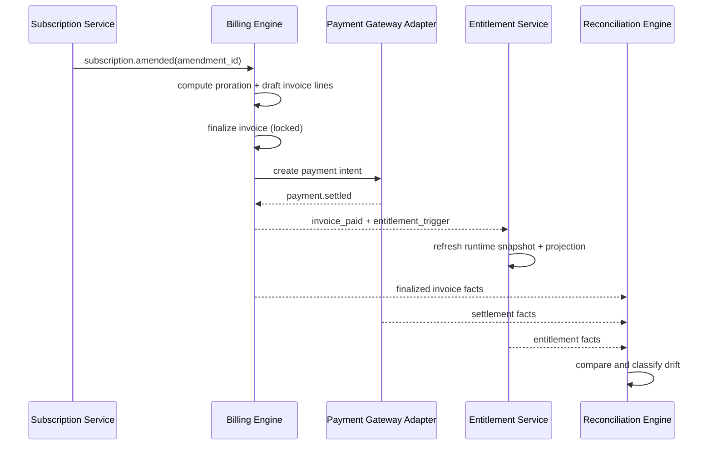
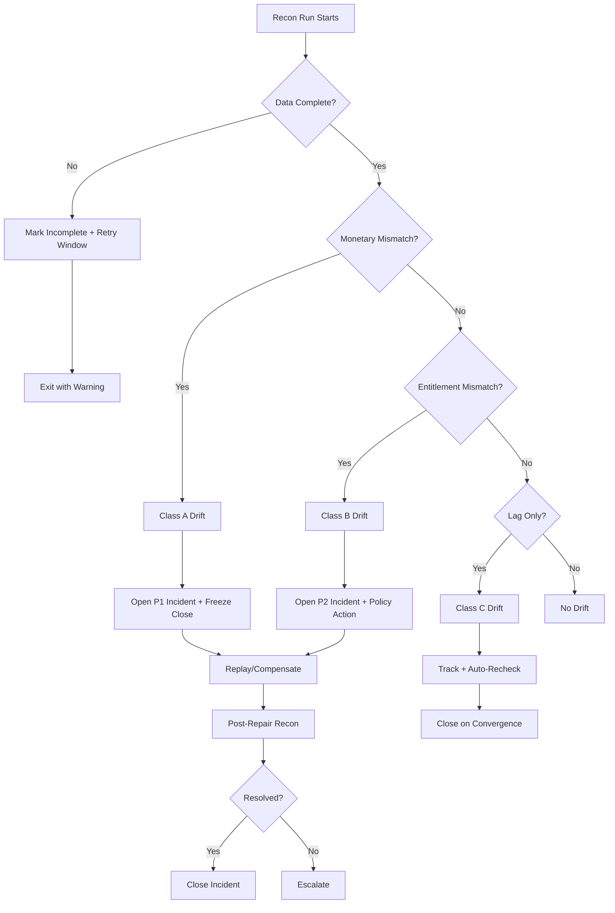

# Analysis: Versioning, Invoice Lifecycle, Proration, Entitlement, and Reconciliation Flows

## 1. Plan/Price Versioning Model (Conceptual)
- **Plan**: commercial package identity (`plan_id`).
- **PlanVersion**: immutable contract snapshot (`plan_version_id`, effective window, migration policy).
- **PriceBookVersion**: market/channel-specific prices and tax metadata.
- **SubscriptionItemBinding**: pins subscriber item to plan + version + price book version.

### Key Constraints
- No in-place mutation of commercial terms after a version is published.
- Every invoice line must trace to exact `plan_version_id` + `price_component_id`.
- Backdated version activations require finance approval + reconciliation task.

## 2. Invoice Lifecycle (Business Analysis View)

| Stage | Owner | Inputs | Outputs | Risk |
|---|---|---|---|---|
| Draft | Billing Engine | Rated usage, recurring commitments | Candidate lines | Missing usage window |
| Finalize | Finance Controls | Draft totals, taxes, discounts | Locked invoice | Tax/FX drift |
| Issue | Notification + AR | Finalized invoice | Customer artifact + due date | Delivery failure |
| Collect | Payments | Payment intents, retries | Paid/partial/failed | Provider outages |
| Resolve | AR Ops | Credits, write-off policy | Voided/uncollectible/closed | Policy bypass |

## 3. Proration Logic (Analyst View)
- **Time basis**: billable seconds between `period_start` and `period_end`.
- **Upgrade formula**:
  - Credit = old_unit_amount × unused_fraction
  - Charge = new_unit_amount × remaining_fraction
- **Downgrade policy options**:
  - Immediate credit + lower run-rate
  - End-of-term schedule only
- **Determinism rule**: repeated runs with same inputs produce same lines + same IDs.

## 4. Entitlement Enforcement Paths

### Path A: Synchronous Enforcement (Runtime Gate)
1. Request arrives with tenant + subject context.
2. Entitlement API evaluates cached grant record + grace policy.
3. Decision returns `allow | deny | soft-limit` within latency SLO.

### Path B: Asynchronous Projection (Control Plane)
1. Billing/Payment events emitted.
2. Entitlement projector updates materialized access tables.
3. Admin UI and support tooling consume projected state.

### Failure Handling
- If projector lags, runtime gate falls back to event-time cache with staleness ceiling.
- If payment provider webhook is delayed, grace rules maintain temporary access.

## 5. Reconciliation and Error Recovery Strategy

### Reconciliation Scopes
1. **Usage↔Invoice**: quantity and rating consistency.
2. **Invoice↔Ledger**: posting totals and currency precision.
3. **Payments↔Ledger**: settlement and fee alignment.
4. **Invoice/Payment↔Entitlements**: access state correctness.

### Recovery Patterns
- **Idempotent replay** for dropped/failed events.
- **Compensating documents** (credit/debit notes) for finalized inaccuracies.
- **Operator-assisted repair workflow** with mandatory approvals for high-impact changes.
- **Automated quarantine queues** for poison events to avoid pipeline blocking.

## 6. Control Objectives
- End-to-end traceability by correlation ID across billing, payments, and entitlement systems.
- Daily reconciliation SLA completion by 08:00 tenant-local time.
- Mean-time-to-detect critical drift < 15 minutes.
- Mean-time-to-recover from recoverable pipeline faults < 30 minutes.

## Beginner Walkthrough: How the Pieces Connect
Think of the system as two loops:
1. **Money loop**: usage/subscription changes -> invoice -> payment -> ledger.
2. **Access loop**: invoice/payment state -> entitlement update -> feature access decision.

Reconciliation connects both loops and asks:
- "Did we charge the right amount?"
- "Did we record the same amount in accounting?"
- "Did access reflect payment reality?"

## Typical Failure Story (Simple)
- A payment webhook is delayed for 20 minutes.
- Billing sees invoice as unpaid; entitlement service still grants grace access.
- Webhook arrives; entitlement updates to active paid state.
- Reconciliation confirms final agreement and no manual intervention is required.

## Analyst Checklist Before Sign-Off
- Confirm each invoice stage has a clear owner.
- Confirm proration policy for upgrade vs downgrade is explicit.
- Confirm grace-period limits are business-approved.
- Confirm every drift class has an action path and SLA.

## In-Depth Domain Event Contract Set
| Event | Producer | Required Keys | Consumer Impact |
|---|---|---|---|
| `catalog.plan_version.published` | Catalog Service | tenant_id, plan_id, plan_version_id, effective_from | subscription eligibility refresh |
| `subscription.amended` | Subscription Service | subscription_id, amendment_id, proration_policy | proration + invoice line generation |
| `invoice.finalized` | Billing Service | invoice_id, amount_due, currency, line_hash | AR, ledger posting, entitlement pending |
| `payment.settled` | Payment Service | payment_id, invoice_id, net_amount, fees | invoice status + entitlement activation |
| `entitlement.snapshot.updated` | Entitlement Projector | subject_id, feature_set_hash, as_of | runtime cache refresh + admin views |
| `recon.drift.detected` | Recon Engine | recon_run_id, class, object_refs | incident queue + recovery orchestration |

## Swimlane-Style Sequence (Conceptual)

## Reconciliation Decision Tree

## Failure Mode Coverage Checklist
- Duplicate event delivery for invoice finalization.
- Out-of-order payment events (`failed` after `settled`).
- Missing entitlement update despite paid invoice.
- Replay job retries that could double-post ledger entries.
- Delayed upstream tax result causing draft/finalize mismatch.
