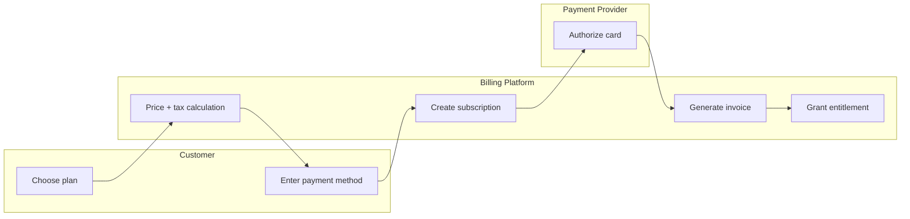
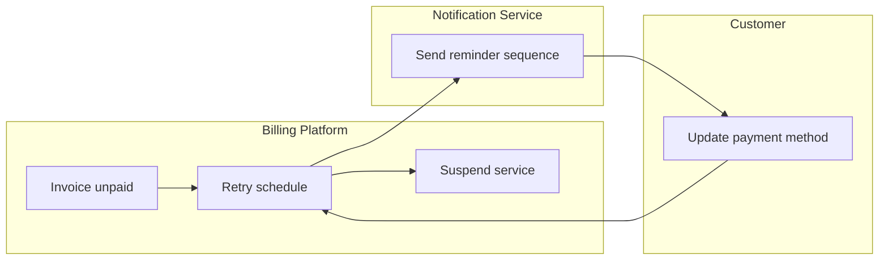

# Swimlane Diagrams

## Subscription Signup Swimlane

```mermaid
flowchart LR
    subgraph Customer
      A[Choose plan]
      B[Enter payment method]
    end

    subgraph Billing[Billing Platform]
      C[Price + tax calculation]
      D[Create subscription]
      E[Generate invoice]
      F[Grant entitlement]
    end

    subgraph PSP[Payment Provider]
      G[Authorize card]
    end

    A --> C --> B --> D --> G --> E --> F
```

## Dunning Swimlane

```mermaid
flowchart LR
    subgraph Billing[Billing Platform]
      A[Invoice unpaid]
      B[Retry schedule]
      C[Suspend service]
    end

    subgraph Notify[Notification Service]
      D[Send reminder sequence]
    end

    subgraph Customer
      E[Update payment method]
    end

    A --> B --> D --> E --> B
    B --> C
```
