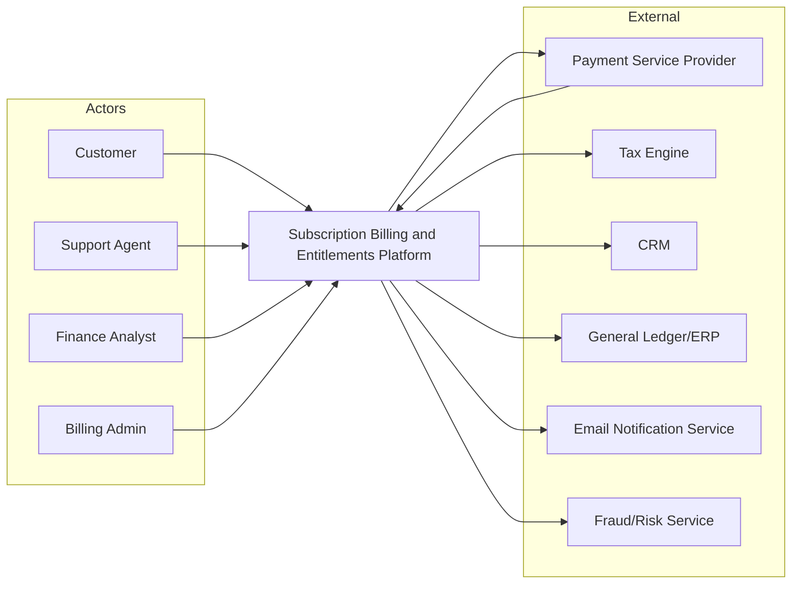

# System Context Diagram

```mermaid
flowchart LR
    subgraph Actors
      Customer[Customer]
      Support[Support Agent]
      Finance[Finance Analyst]
      Admin[Billing Admin]
    end

    SBEP[Subscription Billing and Entitlements Platform]

    subgraph External
      PSP[Payment Service Provider]
      Tax[Tax Engine]
      CRM[CRM]
      GL[General Ledger/ERP]
      Notify[Email Notification Service]
      Fraud[Fraud/Risk Service]
    end

    Customer --> SBEP
    Support --> SBEP
    Finance --> SBEP
    Admin --> SBEP

    SBEP --> PSP
    PSP --> SBEP
    SBEP --> Tax
    SBEP --> CRM
    SBEP --> GL
    SBEP --> Notify
    SBEP --> Fraud
```
