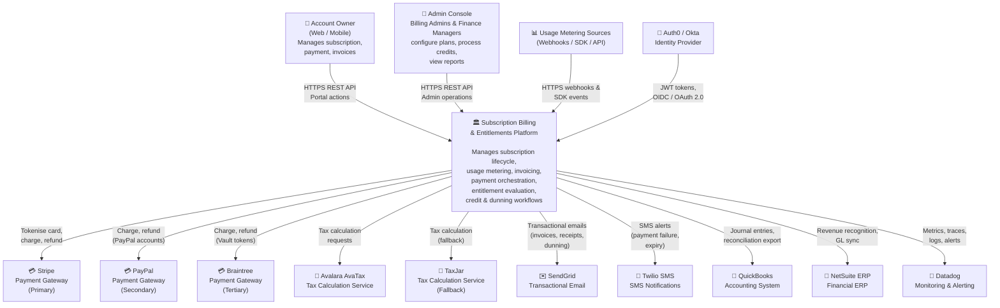
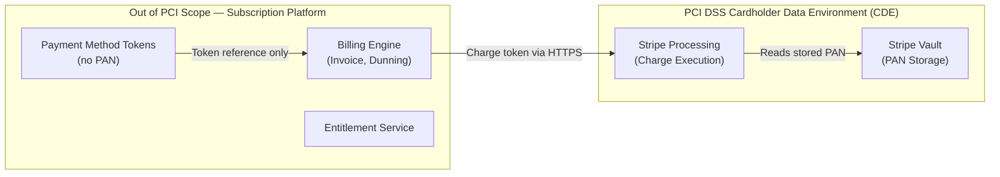
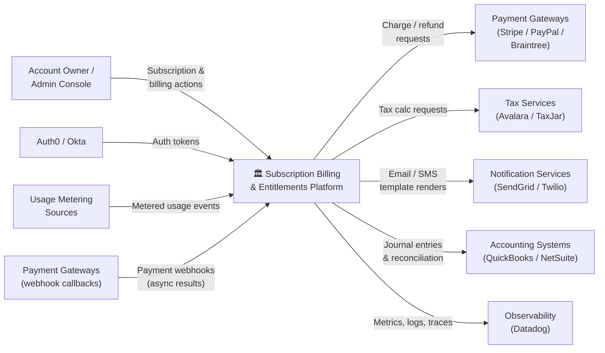

# System Context Diagram — Subscription Billing and Entitlements Platform

## 1. Overview

This document presents the C4 Level 1 (System Context) view of the Subscription Billing and Entitlements Platform. It identifies all people and external software systems that interact with the platform, describes the nature and protocol of each integration, and defines the security and compliance boundary within which the platform operates.

---

## 2. C4 Level 1 — System Context Diagram

---

## 3. External System Descriptions

### 3.1 Account Owner (Web / Mobile)

| Attribute | Detail |
|---|---|
| **Type** | Human user / browser / mobile app |
| **Protocol** | HTTPS REST, WebSocket (real-time usage dashboard) |
| **Authentication** | OAuth 2.0 Bearer token (issued by Auth0 / Okta) |
| **Data Sent to Platform** | Subscription selections, payment method tokens, coupon codes, usage queries, invoice download requests, pause / cancel requests |
| **Data Received from Platform** | Subscription state, invoice list and PDFs, entitlement summary, usage aggregates, payment history |
| **SLA Dependency** | Portal read operations: 200 ms p99. Checkout / payment: 3 s p99. |

### 3.2 Admin Console

| Attribute | Detail |
|---|---|
| **Type** | Internal web application |
| **Protocol** | HTTPS REST |
| **Authentication** | OAuth 2.0 Bearer token with `admin` scope, enforced RBAC |
| **Data Sent to Platform** | Plan catalog changes, manual subscription overrides, credit note creation, dunning config, refund approvals, coupon management |
| **Data Received from Platform** | Full subscription list, audit logs, revenue reports, reconciliation reports, entitlement grant status |
| **SLA Dependency** | Non-critical path: 500 ms p99 acceptable. Report generation: async, up to 60 s. |

### 3.3 Stripe Payment Gateway (Primary)

| Attribute | Detail |
|---|---|
| **Type** | External SaaS — PCI DSS Level 1 certified |
| **Protocol** | HTTPS REST (Stripe API v2024), webhook callbacks |
| **Authentication** | Secret API key (server-side), publishable key (client-side tokenisation) |
| **Data Sent to Gateway** | Charge requests (amount, currency, customer ID, payment method token, idempotency key), refund requests, customer creation, subscription schedule metadata |
| **Data Received from Gateway** | Charge result (success / decline / pending), transaction ID, card decline codes, webhook events (`payment_intent.succeeded`, `payment_intent.payment_failed`, `charge.refunded`) |
| **Idempotency** | All mutating requests include a `Idempotency-Key` header (UUID v4 derived from invoice ID + attempt index) |
| **SLA** | Stripe SLA: 99.99% uptime. Platform timeout: 30 s per request with 3 exponential-backoff retries. |
| **PCI Scope** | Card data never passes through the platform. Tokens only. Stripe handles card storage and raw PAN. |

### 3.4 PayPal Payment Gateway (Secondary)

| Attribute | Detail |
|---|---|
| **Type** | External SaaS — PCI DSS Level 1 certified |
| **Protocol** | HTTPS REST (PayPal Orders v2 API) |
| **Authentication** | OAuth 2.0 client credentials flow |
| **Use Case** | PayPal account holders and PayPal One-Touch checkout flow |
| **Data Exchanged** | Order creation, capture, void, and refund requests; webhook events for payment capture and refund completion |
| **SLA** | PayPal SLA: 99.9% uptime. Platform timeout: 30 s. Activated only when account's preferred payment method type is `PAYPAL`. |

### 3.5 Braintree Payment Gateway (Tertiary)

| Attribute | Detail |
|---|---|
| **Type** | External SaaS — PayPal subsidiary, PCI DSS Level 1 |
| **Protocol** | HTTPS REST / GraphQL (Braintree v4 API) |
| **Use Case** | Enterprise customers requiring vault-based recurring billing with ACH support |
| **Data Exchanged** | Vault token creation, transaction creation, refund, dispute webhooks |
| **SLA** | Braintree SLA: 99.95% uptime. Platform timeout: 30 s. |

### 3.6 Avalara AvaTax (Primary Tax Service)

| Attribute | Detail |
|---|---|
| **Type** | External SaaS — tax compliance engine |
| **Protocol** | HTTPS REST (Avalara REST v2) |
| **Authentication** | Basic auth (account ID + licence key) |
| **Data Sent** | `CreateTransaction` request: invoice line items (amount, product tax code, quantity), ship-from address (platform nexus address), ship-to address (customer billing address), transaction date |
| **Data Received** | Tax amount per line item per jurisdiction, effective tax rate, tax breakdown by state / county / city / special district |
| **SLA** | Avalara SLA: 99.9% uptime, 500 ms p95 response. Platform timeout: 5 s. Fallback: TaxJar. |
| **Compliance** | Avalara handles sales tax nexus determination and multi-jurisdiction apportionment. The platform does not compute tax logic internally. |

### 3.7 TaxJar (Fallback Tax Service)

| Attribute | Detail |
|---|---|
| **Type** | External SaaS — tax compliance engine |
| **Protocol** | HTTPS REST (TaxJar v2 API) |
| **Authentication** | Bearer token |
| **Activation** | Activated automatically when Avalara returns a 5xx error or times out after 5 s |
| **Data Exchanged** | Same as Avalara (line items, addresses); TaxJar response mapped to internal tax breakdown model |
| **SLA** | TaxJar SLA: 99.9% uptime. Used only as fallback; primary must recover before next invoice cycle. |

### 3.8 SendGrid (Transactional Email)

| Attribute | Detail |
|---|---|
| **Type** | External SaaS — email delivery |
| **Protocol** | HTTPS REST (SendGrid Mail Send v3 API) |
| **Authentication** | API key |
| **Emails Sent** | Subscription confirmation, trial expiry warning (T-7, T-1), trial converted, payment receipt, payment failure, dunning reminders (Day 1, Day 3, Day 7, Day 14), credit note, plan change confirmation, cancellation confirmation, invoice ready, invoice PDF |
| **Data Sent** | Template ID, dynamic template data (account name, invoice amount, due date, invoice URL), recipient email, from address, reply-to address |
| **SLA** | SendGrid SLA: 99.95% uptime, delivery initiation within 5 s. Platform queues emails internally; SendGrid failures do not block billing operations. |

### 3.9 Twilio SMS

| Attribute | Detail |
|---|---|
| **Type** | External SaaS — SMS delivery |
| **Protocol** | HTTPS REST (Twilio Messaging v2010 API) |
| **Authentication** | Account SID + Auth Token |
| **Messages Sent** | Payment failure alert, dunning Day 1 reminder, final payment warning (Day 14), account cancellation notice |
| **Opt-in / Opt-out** | SMS notifications are opt-in only. The platform respects `STOP` replies processed via Twilio webhook. |
| **SLA** | Twilio SLA: 99.95% uptime. SMS is supplementary to email; SMS failures are logged but do not trigger retries beyond one attempt. |

### 3.10 QuickBooks Accounting

| Attribute | Detail |
|---|---|
| **Type** | External SaaS — SMB accounting |
| **Protocol** | HTTPS REST (QuickBooks Online Accounting API v3) |
| **Authentication** | OAuth 2.0 (QuickBooks app credentials + customer-authorised refresh token) |
| **Data Exported** | Invoice records (as QuickBooks Invoice objects), payment records (as QuickBooks Payment objects), credit notes (as QuickBooks Credit Memo objects), refunds (as QuickBooks Refund Receipt objects) |
| **Sync Frequency** | Nightly batch export at 02:00 UTC for the previous day's transactions. Real-time webhook export for amounts above $10,000. |
| **SLA** | QuickBooks SLA: 99.5% uptime. Export failures are retried with exponential backoff for 24 hours. |

### 3.11 NetSuite ERP

| Attribute | Detail |
|---|---|
| **Type** | External SaaS — enterprise ERP |
| **Protocol** | REST (NetSuite REST Record API), SuiteScript webhooks |
| **Authentication** | OAuth 1.0a (token-based authentication) |
| **Use Case** | Enterprise customers whose finance teams use NetSuite for general ledger, revenue recognition (ASC 606), and consolidated reporting |
| **Data Exported** | Customer master records, invoice journal entries, deferred revenue schedules, payment application records, refund / credit memo records |
| **Sync Frequency** | Real-time for invoice and payment events above $1,000; nightly batch for all records. |
| **SLA** | NetSuite SLA: 99.9% uptime. Sync failures are queued with at-least-once delivery guarantee. |

### 3.12 Datadog (Monitoring and Alerting)

| Attribute | Detail |
|---|---|
| **Type** | External SaaS — observability platform |
| **Protocol** | HTTPS REST (Datadog API), Datadog Agent (host / container), OpenTelemetry OTLP |
| **Data Sent** | Application metrics (payment success rate, invoice generation latency, entitlement cache hit rate, dunning retry count), distributed traces (per-request spans), structured logs, custom events (billing anomalies, tax service fallback activations) |
| **Alerts Configured** | Payment failure rate > 5% in 5 min, invoice generation errors > 1%, entitlement check p99 > 100 ms, tax service fallback > 10 requests/min, dunning exhaustion spike |
| **SLA** | Datadog SLA: 99.9% uptime. Platform continues to operate if Datadog is unavailable; metrics are buffered locally and flushed on reconnection. |

### 3.13 Auth0 / Okta (Identity Provider)

| Attribute | Detail |
|---|---|
| **Type** | External SaaS — identity and access management |
| **Protocol** | OpenID Connect (OIDC) / OAuth 2.0 |
| **Authentication Flow** | Authorization Code Flow with PKCE (browser clients), Client Credentials Flow (machine-to-machine API access) |
| **Data Received by Platform** | Signed JWT containing `sub` (user ID), `email`, `roles`, `account_id` claim (custom claim injected by Auth0 Rule / Okta Policy), token expiry |
| **Token Validation** | Platform validates JWT signature against the IdP's JWKS endpoint on every API request. JWKS is cached with a 5-minute TTL. |
| **SLA** | Auth0 SLA: 99.99% uptime. If JWKS endpoint is unavailable, previously cached keys are used for up to 5 minutes before rejecting new requests. |

### 3.14 Usage Metering Sources (Webhooks / SDK / API)

| Attribute | Detail |
|---|---|
| **Type** | Customer-integrated systems (SaaS products using the platform's metering capabilities) |
| **Protocol** | HTTPS REST (Usage Events API), language-specific SDKs (Node.js, Python, Go, Java, Ruby) |
| **Authentication** | API key scoped to account |
| **Data Sent** | Usage events: `{ meter_id, quantity, timestamp, idempotency_key, metadata }` |
| **Volume** | Up to 10,000 events per second per deployment. Events are ingested asynchronously into a high-throughput queue (Kafka) and processed within 5 seconds. |
| **SLA** | Usage API availability: 99.99%. Missed events (due to developer-side failures) are the responsibility of the integrating system; late-event correction is supported within 24 hours. |

---

## 4. Security Boundary (PCI DSS Scope)

**Key Security Controls:**

| Control | Implementation |
|---|---|
| No raw card data | All card capture is handled by Stripe.js / Elements (client-side tokenisation). Raw PANs never reach the platform. |
| TLS 1.2+ | All HTTPS communication enforces TLS 1.2 minimum. TLS 1.3 preferred. |
| API key rotation | API keys support rotation without downtime. Revocation takes effect within 60 seconds. |
| Secret management | All credentials (Stripe secret key, SendGrid API key, etc.) are stored in Vault (HashiCorp) and injected at runtime. Never stored in environment variables or code. |
| Webhook signature validation | All inbound webhooks (Stripe, PayPal, Braintree) are validated using HMAC-SHA256 signature headers before processing. |
| Network segmentation | Payment adapter services are deployed in an isolated network segment. Egress to payment gateways is restricted by IP allowlisting. |
| Audit logging | All state-changing API operations are recorded in an immutable audit log with actor identity, timestamp, IP, and payload hash. |

---

## 5. Data Flow Directions

---

## 6. Integration SLA Summary

| External System | Timeout | Retry Policy | Fallback Strategy | Impact if Unavailable |
|---|---|---|---|---|
| Stripe | 30 s | 3× exponential backoff (1s, 2s, 4s) | Route to PayPal (manual config) | Payment collection halted |
| PayPal | 30 s | 3× exponential backoff | Route to Braintree | PayPal payments halted |
| Braintree | 30 s | 3× exponential backoff | None | ACH payments halted |
| Avalara | 5 s | 2× (1s, 2s) | TaxJar | Tax uses fallback rate |
| TaxJar | 5 s | 2× (1s, 2s) | Hardcoded fallback rates | Tax uses static fallback |
| SendGrid | 10 s | 3× with backoff | Queue for 24h retry | Emails delayed; billing unaffected |
| Twilio | 10 s | 1× | No retry | SMS not sent; email still sends |
| QuickBooks | 30 s | 5× over 24h | Queue with dead-letter | Accounting sync delayed |
| NetSuite | 30 s | 5× over 24h | Queue with dead-letter | ERP sync delayed |
| Datadog | 5 s | Non-blocking | Buffer locally 15 min | Observability gap; platform operational |
| Auth0 / Okta | 2 s | 2× with cached JWKS | 5-min JWKS cache | Auth fails after 5-min cache TTL |
