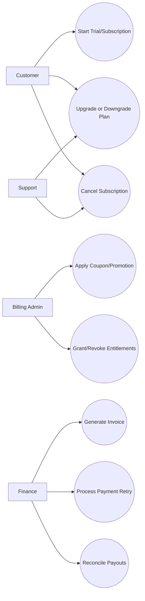

# Use Case Diagram

```mermaid
flowchart LR
    Customer[Customer]
    Admin[Billing Admin]
    Support[Support]
    Finance[Finance]

    UC1((Start Trial/Subscription))
    UC2((Upgrade or Downgrade Plan))
    UC3((Cancel Subscription))
    UC4((Apply Coupon/Promotion))
    UC5((Generate Invoice))
    UC6((Process Payment Retry))
    UC7((Grant/Revoke Entitlements))
    UC8((Reconcile Payouts))

    Customer --> UC1
    Customer --> UC2
    Customer --> UC3

    Admin --> UC4
    Admin --> UC7

    Support --> UC2
    Support --> UC3

    Finance --> UC5
    Finance --> UC6
    Finance --> UC8
```
