# Use Case Diagram — Subscription Billing and Entitlements Platform

## 1. Overview

This document describes the complete use case model for the Subscription Billing and Entitlements Platform. It identifies all system actors, their roles, and the functional use cases they interact with. The diagram and descriptions serve as the authoritative reference for system scope during analysis and design.

---

## 2. Actors

### 2.1 Primary Actors (Initiating)

| Actor | Type | Description |
|---|---|---|
| **Account Owner** | Human | The individual or organization that owns a subscription. Manages their own plan, payment method, and billing details. May be a self-service user acting through the customer portal. |
| **Billing Admin** | Human | Internal operator with elevated permissions to manage subscriptions on behalf of customers, override billing, issue credits, and configure plans. |
| **Developer (API)** | Human / System | An engineer or automated system integrating with the platform via REST API. Performs actions such as recording usage events, checking entitlements, and provisioning subscriptions programmatically. |
| **Finance Manager** | Human | Internal finance team member responsible for revenue reporting, reconciliation, tax configuration, and audit. Has read access to all financial records and write access to tax and refund workflows. |
| **Customer Success** | Human | Internal support agent who assists customers with subscription management, applies coupons, processes refunds, and resolves billing disputes on behalf of Account Owners. |

### 2.2 Secondary Actors (Supporting / External Systems)

| Actor | Type | Description |
|---|---|---|
| **Payment Gateway** | External System | Third-party payment processor (Stripe, PayPal, Braintree) that tokenizes cards, charges payment methods, processes refunds, and returns transaction results. |
| **Tax Service** | External System | Third-party tax calculation engine (Avalara, TaxJar) that computes applicable tax rates based on customer address, product tax codes, and nexus rules. |
| **Email Notification Service** | External System | Transactional email provider (SendGrid, Postmark) that delivers invoices, payment receipts, dunning notices, trial expiry warnings, and subscription change confirmations. |

---

## 3. Use Case Inventory

### 3.1 Subscription Lifecycle

| ID | Use Case | Primary Actor | Secondary Actors |
|---|---|---|---|
| UC-001 | Subscribe to Plan | Account Owner | Payment Gateway, Tax Service, Email Notification Service |
| UC-002 | Trial-to-Paid Conversion | System (Scheduler) | Payment Gateway, Email Notification Service |
| UC-003 | Upgrade Plan | Account Owner, Billing Admin | Payment Gateway, Tax Service, Email Notification Service |
| UC-004 | Downgrade Plan | Account Owner, Billing Admin | Email Notification Service |
| UC-011 | Pause Subscription | Account Owner, Billing Admin | Email Notification Service |
| UC-011b | Resume Subscription | Account Owner, Billing Admin | Email Notification Service |
| UC-012 | Cancel Subscription | Account Owner, Billing Admin | Email Notification Service |

### 3.2 Usage and Metering

| ID | Use Case | Primary Actor | Secondary Actors |
|---|---|---|---|
| UC-004 | Record Usage Event | Developer (API) | — |
| UC-013 | View Usage Summary | Account Owner, Billing Admin | — |

### 3.3 Invoicing and Payment

| ID | Use Case | Primary Actor | Secondary Actors |
|---|---|---|---|
| UC-005 | Generate Monthly Invoice | System (Scheduler) | Tax Service |
| UC-006 | Process Payment | System (Scheduler), Account Owner | Payment Gateway |
| UC-007 | Handle Failed Payment and Dunning | System (Scheduler) | Payment Gateway, Email Notification Service |
| UC-014 | View Invoices | Account Owner, Finance Manager | — |
| UC-015 | Download Invoice PDF | Account Owner, Finance Manager | — |
| UC-016 | Update Payment Method | Account Owner | Payment Gateway |
| UC-017 | Make Payment (Manual) | Account Owner | Payment Gateway |

### 3.4 Credits, Coupons, and Refunds

| ID | Use Case | Primary Actor | Secondary Actors |
|---|---|---|---|
| UC-009 | Issue Credit Note | Billing Admin, Finance Manager | Email Notification Service |
| UC-010 | Apply Coupon Code | Account Owner, Billing Admin | — |
| UC-018 | Request Refund | Account Owner, Customer Success | Payment Gateway, Email Notification Service |

### 3.5 Entitlements

| ID | Use Case | Primary Actor | Secondary Actors |
|---|---|---|---|
| UC-008 | Check Entitlement Access | Developer (API) | — |
| UC-019 | Provision Entitlements | System | — |
| UC-020 | Revoke Entitlements | System | — |

### 3.6 Configuration and Reporting

| ID | Use Case | Primary Actor | Secondary Actors |
|---|---|---|---|
| UC-021 | Configure Plan Catalog | Billing Admin | — |
| UC-022 | Configure Tax Rates | Finance Manager | Tax Service |
| UC-023 | Generate Revenue Report | Finance Manager | — |
| UC-024 | Manage Dunning Cycle | Billing Admin | — |

---

## 4. Use Case Diagram

```mermaid
flowchart LR
    %% Actors
    AO([Account Owner])
    BA([Billing Admin])
    DEV([Developer / API])
    FM([Finance Manager])
    CS([Customer Success])
    PG([Payment Gateway])
    TS([Tax Service])
    EN([Email Notification Service])

    %% ── Subscription Lifecycle ──────────────────────────────────
    subgraph SUB["Subscription Lifecycle"]
        UC001(Subscribe to Plan)
        UC002(Trial-to-Paid Conversion)
        UC003(Upgrade Plan)
        UC004(Downgrade Plan)
        UC011A(Pause Subscription)
        UC011B(Resume Subscription)
        UC012(Cancel Subscription)
    end

    %% ── Usage & Metering ────────────────────────────────────────
    subgraph USAGE["Usage & Metering"]
        UC004B(Record Usage Event)
        UC013(View Usage Summary)
    end

    %% ── Invoicing & Payment ─────────────────────────────────────
    subgraph INV["Invoicing & Payment"]
        UC005(Generate Monthly Invoice)
        UC006(Process Payment)
        UC007(Handle Failed Payment & Dunning)
        UC014(View Invoices)
        UC015(Download Invoice PDF)
        UC016(Update Payment Method)
        UC017(Make Payment Manual)
    end

    %% ── Credits, Coupons & Refunds ──────────────────────────────
    subgraph CREDIT["Credits, Coupons & Refunds"]
        UC009(Issue Credit Note)
        UC010(Apply Coupon Code)
        UC018(Request Refund)
    end

    %% ── Entitlements ────────────────────────────────────────────
    subgraph ENT["Entitlements"]
        UC008(Check Entitlement Access)
        UC019(Provision Entitlements)
        UC020(Revoke Entitlements)
    end

    %% ── Configuration & Reporting ───────────────────────────────
    subgraph CONFIG["Configuration & Reporting"]
        UC021(Configure Plan Catalog)
        UC022(Configure Tax Rates)
        UC023(Generate Revenue Report)
        UC024(Manage Dunning Cycle)
    end

    %% ── Actor → Use Case edges ──────────────────────────────────
    AO --> UC001
    AO --> UC003
    AO --> UC004
    AO --> UC011A
    AO --> UC011B
    AO --> UC012
    AO --> UC013
    AO --> UC014
    AO --> UC015
    AO --> UC016
    AO --> UC017
    AO --> UC010
    AO --> UC018
    AO --> UC008

    BA --> UC001
    BA --> UC003
    BA --> UC004
    BA --> UC011A
    BA --> UC011B
    BA --> UC012
    BA --> UC009
    BA --> UC010
    BA --> UC021
    BA --> UC024

    DEV --> UC004B
    DEV --> UC008
    DEV --> UC001

    FM --> UC009
    FM --> UC014
    FM --> UC015
    FM --> UC022
    FM --> UC023

    CS --> UC003
    CS --> UC004
    CS --> UC009
    CS --> UC010
    CS --> UC018
    CS --> UC012

    %% ── External System edges ───────────────────────────────────
    UC001 --> PG
    UC006 --> PG
    UC007 --> PG
    UC016 --> PG
    UC017 --> PG
    UC018 --> PG

    UC005 --> TS
    UC022 --> TS

    UC001 --> EN
    UC002 --> EN
    UC007 --> EN
    UC009 --> EN
    UC012 --> EN
    UC003 --> EN
    UC004 --> EN
```

---

## 5. Actor–Use Case Responsibility Matrix

The following RACI matrix summarises which actors are **Responsible** (R), **Accountable** (A), **Consulted** (C), or **Informed** (I) for each primary use case.

| Use Case | Account Owner | Billing Admin | Developer | Finance Mgr | Customer Success | Payment Gateway | Tax Service | Email Service |
|---|:---:|:---:|:---:|:---:|:---:|:---:|:---:|:---:|
| Subscribe to Plan | R/A | C | C | — | C | C | C | I |
| Trial-to-Paid Conversion | I | C | — | — | — | C | — | I |
| Upgrade / Downgrade Plan | R/A | C | C | — | C | C | C | I |
| Record Usage Event | — | — | R/A | — | — | — | — | — |
| Generate Monthly Invoice | I | C | — | A | — | — | C | I |
| Process Payment | I | C | — | A | — | R | — | I |
| Handle Failed Payment | I | C | — | A | C | C | — | I |
| Check Entitlement | R | — | R/A | — | — | — | — | — |
| Issue Credit Note | I | R | — | A | C | C | — | I |
| Apply Coupon Code | R | C | C | — | C | — | — | — |
| Pause / Resume Subscription | R/A | C | — | — | C | — | — | I |
| Cancel Subscription | R/A | C | — | — | C | — | — | I |
| Configure Plan Catalog | — | R/A | C | C | — | — | — | — |
| Configure Tax Rates | — | C | — | R/A | — | — | C | — |
| Generate Revenue Report | — | — | — | R/A | — | — | — | — |
| Manage Dunning Cycle | — | R/A | — | C | — | C | — | I |

---

## 6. System Boundary

The Subscription Billing and Entitlements Platform system boundary encompasses:

- **In scope:** Plan catalog management, subscription state machine, usage metering and aggregation, invoice generation, proration engine, payment orchestration, dunning workflow, entitlement provisioning and evaluation, credit notes, coupon/discount engine, customer portal API, admin API, webhook delivery, audit logging, and revenue reporting.
- **Out of scope:** Payment gateway card vaulting (delegated to PCI-compliant gateways), tax jurisdiction law updates (delegated to Tax Service), email rendering beyond template parameters (delegated to Email Service), ERP general ledger entries (delegated to accounting integrations), identity authentication (delegated to IdP).

---

## 7. Key Relationships Between Use Cases

### 7.1 Include Relationships

- **Subscribe to Plan** `<<include>>` **Provision Entitlements** — Every successful subscription creation triggers entitlement provisioning.
- **Generate Monthly Invoice** `<<include>>` **Calculate Tax** — Invoice generation always calls the Tax Service for applicable tax amounts.
- **Process Payment** `<<include>>` **Send Payment Receipt** — Every successful payment triggers a receipt notification.
- **Cancel Subscription** `<<include>>` **Revoke Entitlements** — Cancellation always revokes all active entitlements.

### 7.2 Extend Relationships

- **Handle Failed Payment** `<<extend>>` **Process Payment** — The dunning workflow is an extension triggered only on payment failure.
- **Apply Coupon Code** `<<extend>>` **Subscribe to Plan** — A coupon may optionally be applied during subscription creation.
- **Trial-to-Paid Conversion** `<<extend>>` **Subscribe to Plan** — Automatic conversion is an extension of the initial trial subscription.
- **Issue Credit Note** `<<extend>>` **Generate Monthly Invoice** — A credit note adjusts the balance after an invoice has been generated.

---

## 8. Constraints and Notes

1. All financial operations must be idempotent. Duplicate calls to charge, refund, or invoice must be detected and rejected using idempotency keys.
2. The Payment Gateway actor represents a class of gateways (Stripe, PayPal, Braintree) abstracted behind the platform's payment adapter layer. Individual gateway behaviours are isolated to their adapter implementations.
3. The Tax Service actor represents Avalara or TaxJar depending on customer geography configuration. The platform sends a standardised tax calculation request; gateway-specific mapping is handled internally.
4. Account Owner actions initiated through Customer Success on behalf of a customer are logged with a dual audit trail: the acting CS agent identity and the affected account identity.
5. Developer API access is governed by API keys scoped to a specific account or tenant. A developer cannot access entitlements or billing data for accounts outside their scope.
