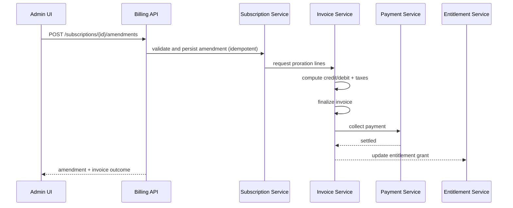

# API Design (Implementation Ready)

## 1. API Design Principles
- Idempotency required for all mutating endpoints.
- Correlation IDs (`X-Correlation-Id`) required for cross-service tracing.
- Explicit versioning with `/v1` path and backward-compatible contract evolution.
- Error model standardized with machine-readable `code`, `category`, and `retryable`.

## 2. Authentication and Authorization
- Service-to-service: mTLS + JWT with scoped claims.
- User APIs: OAuth2 access token + tenant scoping.
- Sensitive recovery endpoints require elevated role + approval token.

## 3. Endpoint Catalog

### 3.1 Plans and Versions
- `POST /v1/plans`
- `POST /v1/plans/{plan_id}/versions`
- `GET /v1/plans/{plan_id}/versions?effective_at=...`
- `POST /v1/plans/{plan_id}/migrations`

### 3.2 Subscriptions and Amendments
- `POST /v1/subscriptions`
- `POST /v1/subscriptions/{subscription_id}/amendments`
- `GET /v1/subscriptions/{subscription_id}`

### 3.3 Invoices and Payments
- `POST /v1/invoices:generate`
- `POST /v1/invoices/{invoice_id}:finalize`
- `POST /v1/invoices/{invoice_id}:issue`
- `POST /v1/invoices/{invoice_id}/payments`

### 3.4 Entitlements
- `POST /internal/entitlements/check`
- `GET /v1/accounts/{account_id}/entitlements`

### 3.5 Reconciliation and Recovery
- `POST /internal/recon/runs`
- `GET /internal/recon/runs/{recon_run_id}/drifts`
- `POST /internal/recovery/replay`
- `POST /internal/recovery/compensate`

## 4. Critical Request/Response Examples

### 4.1 Create Subscription Amendment
```json
{
  "change_type": "upgrade",
  "target_plan_version_id": "pv_2026_03_pro",
  "effective_at": "2026-03-28T12:00:00Z",
  "proration_policy": "credit_unused_and_charge_remaining",
  "idempotency_key": "amnd-acc42-20260328-01"
}
```

### 4.2 Finalize Invoice Response
```json
{
  "invoice_id": "inv_123",
  "status": "finalized",
  "line_hash": "sha256:...",
  "total": "145.62",
  "currency": "USD",
  "finalized_at": "2026-03-28T12:05:00Z"
}
```

### 4.3 Standard Error Envelope
```json
{
  "error": {
    "code": "INVOICE_STATE_INVALID",
    "message": "Invoice cannot transition from paid to finalized.",
    "category": "validation",
    "retryable": false
  },
  "correlation_id": "corr_9a2"
}
```

## 5. API Sequence: Upgrade with Proration


## 6. Rate Limits and Retry Semantics
- Mutating APIs: 100 req/min/tenant default.
- Read APIs: 500 req/min/tenant default.
- `429` responses include `Retry-After` header.
- Clients must retry only when `retryable=true` or 5xx.

## 7. Compatibility and Versioning Policy
- Additive changes only in minor revisions.
- Breaking changes require `/v2` and deprecation window.
- Event/API schema changes must pass compatibility checks in CI.

## 8. API Test Requirements
- Contract tests for each endpoint and major error path.
- Idempotency tests for duplicate submissions.
- Authorization tests for tenant and role boundaries.
- Chaos tests for timeout/retry behavior.
