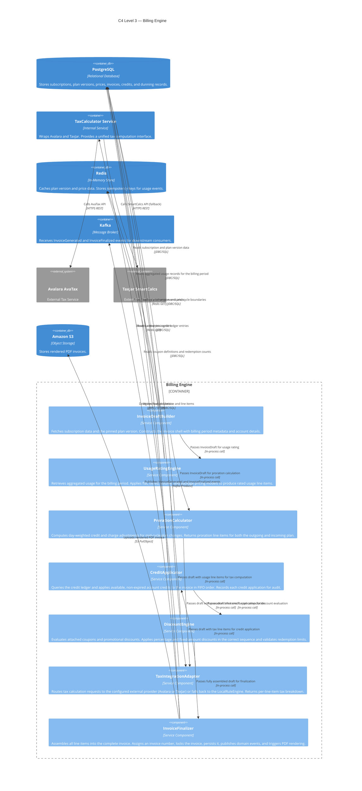
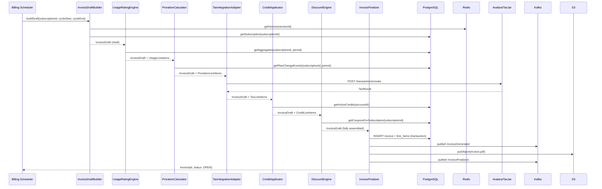

# C4 Level 3 — Billing Engine Component Diagram

## Overview

This document provides a C4 Model Level 3 (Component) diagram for the **Billing Engine**, the core subsystem responsible for generating, rating, and finalizing invoices. Level 3 drills inside the container boundary to show the individual components, their responsibilities, and their interactions with each other and with external systems.

The Billing Engine is a container within the broader Subscription Billing and Entitlements Platform. It is invoked on a scheduled basis at the end of each billing cycle and on-demand for proration events triggered by subscription changes.

---

## C4 Component Diagram

---

## Component Responsibilities

### InvoiceDraftBuilder

**Purpose:** Entry point for the Billing Engine. Initializes the billing run for a given subscription.

**Responsibilities:**
- Loads the `Subscription` record from PostgreSQL, including account ID, plan version pin, billing cycle dates, currency, and collection method.
- Resolves the pinned `PlanVersion` from the `CatalogCache` (Redis). Falls back to PostgreSQL on a cache miss and warms the cache.
- Constructs the `InvoiceDraft` struct with billing period, empty line-item list, account reference, and tax configuration.
- Detects whether a plan change event has occurred within the billing period to trigger the `ProrationCalculator`.

**Interfaces Consumed:**
- `SubscriptionRepository.getById(subscriptionId): Subscription`
- `CatalogCache.getVersion(versionId): PlanVersion`

**Outputs:**
- `InvoiceDraft` — the mutable work-in-progress invoice object passed to downstream components.

---

### UsageRatingEngine

**Purpose:** Converts raw usage aggregates into monetary line items using the plan's pricing rules.

**Responsibilities:**
- Queries `AggregationWorker`'s output in PostgreSQL for all usage metrics registered on the plan during the billing period.
- Applies the pricing model for each metric:
  - **Flat:** `quantity × unit_price`
  - **Tiered:** iterates through pricing tiers; each tier applies to the portion of usage within its range.
  - **Volume:** selects the single tier that matches total volume; applies that unit price to all units.
  - **Package:** rounds usage up to the nearest package size; applies package price.
- Produces one `UsageLineItem` per metric.

**Interfaces Consumed:**
- `UsageRepository.getAggregates(subscriptionId, metricName, from, to): UsageAggregate`
- `PriceRepository.getPricesByVersion(versionId): Price[]`

**Outputs:**
- `UsageLineItem[]` appended to `InvoiceDraft.lineItems`

---

### ProrationCalculator

**Purpose:** Computes mid-cycle billing adjustments when a plan change (upgrade or downgrade) occurs.

**Responsibilities:**
- Receives the `PlanChangeEvent` recorded at plan-change time (old plan, new plan, change timestamp).
- Computes:
  - `D_remaining = billing_cycle_end - change_timestamp` (in fractional days)
  - `D_total = billing_cycle_end - billing_cycle_start`
  - `credit = (D_remaining / D_total) × old_plan_price`
  - `new_charge = (D_remaining / D_total) × new_plan_price`
- Handles same-day changes: if change occurs on cycle boundary, skips proration entirely.
- Handles annual plan mid-year: uses 365-day denominator with day-precise numerator.
- Produces one credit line item (negative amount) and one charge line item (positive amount).

**Interfaces Consumed:**
- `SubscriptionRepository.getPlanChangeEvents(subscriptionId, cycleStart, cycleEnd): PlanChangeEvent[]`
- `PlanVersionRepository.getById(versionId): PlanVersion`

**Outputs:**
- `ProrationLineItem[]` appended to `InvoiceDraft.lineItems`

---

### TaxIntegrationAdapter

**Purpose:** Abstracts the external tax calculation call from the rest of the billing pipeline.

**Responsibilities:**
- Receives the `InvoiceDraft` with all fixed, usage, and proration line items assembled.
- Resolves the customer's billing address and applicable tax-exempt status.
- Selects the tax provider based on account configuration (`avalara` | `taxjar` | `local`).
- Sends the transaction request to `TaxCalculator` service (which wraps the external providers).
- Parses the response and maps external tax codes to internal `TaxLineItem` objects.
- Falls back to `LocalRuleEngine` if the external provider returns a non-retriable error.

**Interfaces Consumed:**
- `TaxCalculatorService.compute(transaction: TaxRequest): TaxResult`

**Outputs:**
- `TaxLineItem[]` appended to `InvoiceDraft.lineItems`

---

### CreditApplicator

**Purpose:** Reduces the invoice balance using available customer account credits.

**Responsibilities:**
- Queries the credit ledger for the account, filtering to credits with status `ACTIVE` and non-expired `expires_at`.
- Applies credits in FIFO order (oldest first) up to the invoice total.
- Records a `CreditApplicationRecord` for each credit consumed, noting the amount applied and remaining balance.
- Produces a `CreditLineItem` (negative amount) on the draft for audit and display purposes.

**Interfaces Consumed:**
- `CreditRepository.getActiveCredits(accountId): Credit[]`
- `CreditRepository.applyCredit(creditId, amount): void`

**Outputs:**
- `CreditLineItem[]` appended to `InvoiceDraft.lineItems`
- Updated `InvoiceDraft.credit_applied` total

---

### DiscountEngine

**Purpose:** Applies promotional and contractual discounts to the invoice.

**Responsibilities:**
- Loads coupons attached to the subscription (via `SubscriptionCoupon` join table).
- Validates each coupon: checks `valid_from`, `valid_until`, `max_redemptions`, and `duration_in_months` window.
- Applies discounts in sequence:
  1. Percentage discounts applied first to subtotal.
  2. Fixed-amount discounts applied to remaining balance after percentage discounts.
- Increments the redemption counter for `duration: "once"` coupons.
- Produces a `DiscountLineItem` per applied coupon.

**Interfaces Consumed:**
- `CouponRepository.getCouponsForSubscription(subscriptionId): SubscriptionCoupon[]`
- `CouponRepository.incrementRedemption(couponId): void`

**Outputs:**
- `DiscountLineItem[]` appended to `InvoiceDraft.lineItems`
- Updated `InvoiceDraft.discount_total`

---

### InvoiceFinalizer

**Purpose:** Commits the fully assembled invoice and triggers all downstream side effects.

**Responsibilities:**
- Assigns a sequential human-readable invoice number (e.g., `INV-2024-00423`).
- Transitions invoice status from `DRAFT` to `OPEN`.
- Persists the `Invoice` record and all associated `LineItem` records to PostgreSQL within a single database transaction.
- Publishes `InvoiceGenerated` event to Kafka topic `billing-events` (payload includes invoice ID, account ID, amount, currency, due date).
- Triggers `PDFRenderer` asynchronously to generate the invoice PDF; stores the returned S3 URL on the invoice record.
- Publishes `InvoiceFinalized` event after PDF URL is stored.

**Interfaces Consumed:**
- `InvoiceRepository.create(invoice, lineItems): Invoice` (transactional)
- `KafkaProducer.publish(topic, event)`
- `PDFRenderer.render(invoice): S3URL`

**Outputs:**
- Persisted `Invoice` entity returned to the orchestrating billing scheduler.

---

## Data Flow Summary

---

## External System Interactions

| External System | Interaction | Protocol | Failure Handling |
|-----------------|-------------|----------|-----------------|
| **PostgreSQL** | Read subscriptions, plan versions, usage aggregates, credits, coupons. Write invoices, line items, credit applications. | JDBC over TCP | Retry 3× with exponential backoff. Transactions roll back on failure. |
| **Redis** | Read cached plan versions and prices. Write idempotency keys. | Redis Protocol | Cache miss falls back to PostgreSQL. Redis unavailability is non-fatal. |
| **Avalara AvaTax** | POST `/transactions/create` with line items and customer address. | HTTPS REST | Falls back to TaxJar. If both fail, falls back to `LocalRuleEngine`. |
| **TaxJar SmartCalcs** | POST `/taxes` as secondary tax provider. | HTTPS REST | Falls back to `LocalRuleEngine` on failure. |
| **Kafka** | Publish `InvoiceGenerated` and `InvoiceFinalized` to `billing-events` topic. | Kafka Producer API | Retry with producer retries=3. Non-blocking: PDF rendering proceeds independently. |
| **Amazon S3** | `PutObject` with rendered invoice PDF. URL stored on invoice record. | AWS SDK (HTTPS) | Retry 3× with exponential backoff. PDF URL stored asynchronously; invoice status is not blocked. |
