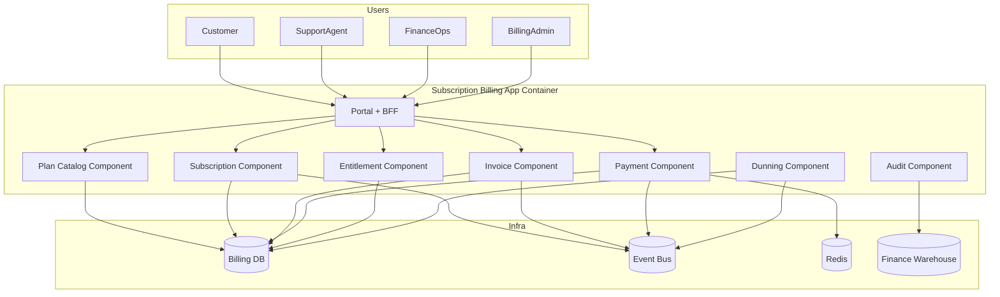

# C4 Component Diagram

```mermaid
flowchart TB
    subgraph Users
      Customer
      SupportAgent
      FinanceOps
      BillingAdmin
    end

    subgraph SBEP[Subscription Billing App Container]
      UIBFF[Portal + BFF]
      PlanCmp[Plan Catalog Component]
      SubCmp[Subscription Component]
      InvoiceCmp[Invoice Component]
      PaymentCmp[Payment Component]
      EntCmp[Entitlement Component]
      DunningCmp[Dunning Component]
      AuditCmp[Audit Component]
    end

    subgraph Infra
      OLTP[(Billing DB)]
      Bus[(Event Bus)]
      Cache[(Redis)]
      Warehouse[(Finance Warehouse)]
    end

    Customer --> UIBFF
    SupportAgent --> UIBFF
    FinanceOps --> UIBFF
    BillingAdmin --> UIBFF

    UIBFF --> PlanCmp
    UIBFF --> SubCmp
    UIBFF --> InvoiceCmp
    UIBFF --> PaymentCmp
    UIBFF --> EntCmp

    PlanCmp --> OLTP
    SubCmp --> OLTP
    InvoiceCmp --> OLTP
    PaymentCmp --> OLTP
    EntCmp --> OLTP
    DunningCmp --> OLTP

    SubCmp --> Bus
    InvoiceCmp --> Bus
    PaymentCmp --> Bus
    DunningCmp --> Bus
    PaymentCmp --> Cache
    AuditCmp --> Warehouse
```
