# Class Diagrams — Subscription Billing and Entitlements Platform

## Overview

This document defines the full domain model for the Subscription Billing and Entitlements Platform using UML class diagrams. Classes are organized into six bounded contexts: **Account & Identity**, **Plan & Pricing**, **Subscription**, **Billing & Invoicing**, **Entitlements**, and **Tax & Compliance**.

---

## Full Domain Class Diagram

```mermaid
classDiagram
    direction TB

    %% ─────────────────────────────────────────
    %% Account & Identity Context
    %% ─────────────────────────────────────────
    class Account {
        +UUID accountId
        +String email
        +String currency
        +AccountStatus status
        +DateTime createdAt
        +DateTime updatedAt
        +getActiveSubscriptions() Subscription[]
        +getCredits() Credit[]
        +getDefaultPaymentMethod() PaymentMethod
        +getOpenInvoices() Invoice[]
    }

    class PaymentMethod {
        +UUID paymentMethodId
        +UUID accountId
        +PaymentMethodType type
        +String last4
        +String gatewayToken
        +Integer expiryMonth
        +Integer expiryYear
        +Boolean isDefault
        +DateTime createdAt
        +charge(amount: Decimal, currency: String) PaymentAttempt
        +isExpired() Boolean
        +setAsDefault() void
    }

    class Credit {
        +UUID creditId
        +UUID accountId
        +Decimal amount
        +Decimal remainingAmount
        +String reason
        +DateTime expiresAt
        +DateTime createdAt
        +isExpired() Boolean
        +consume(amount: Decimal) Decimal
        +getConsumedAmount() Decimal
    }

    %% ─────────────────────────────────────────
    %% Plan & Pricing Context
    %% ─────────────────────────────────────────
    class Plan {
        +UUID planId
        +String name
        +String description
        +PlanStatus status
        +Integer trialDays
        +DateTime createdAt
        +getPlanVersions() PlanVersion[]
        +getLatestVersion() PlanVersion
        +getActiveVersion() PlanVersion
        +archive() void
    }

    class PlanVersion {
        +UUID planVersionId
        +UUID planId
        +Integer version
        +DateTime effectiveFrom
        +DateTime effectiveTo
        +PlanVersionStatus status
        +DateTime createdAt
        +getPrices() Price[]
        +getPriceForCurrency(currency: String) Price
        +isEffective(at: DateTime) Boolean
    }

    class Price {
        +UUID priceId
        +UUID planVersionId
        +PricingModel pricingModel
        +String currency
        +Decimal unitAmount
        +TierConfig[] tiers
        +BillingPeriod billingPeriod
        +Integer billingPeriodCount
        +DateTime createdAt
        +calculateCharge(quantity: Decimal) Decimal
        +getEffectiveTier(quantity: Decimal) TierConfig
    }

    class TierConfig {
        +Integer upTo
        +Decimal unitAmount
        +Decimal flatAmount
    }

    class CouponCode {
        +UUID couponId
        +String code
        +DiscountType discountType
        +Decimal discountValue
        +Integer maxRedemptions
        +Integer redemptionsCount
        +DateTime expiresAt
        +DateTime createdAt
        +validate() ValidationResult
        +redeem() void
        +calculateDiscount(subtotal: Decimal) Decimal
        +isActive() Boolean
        +hasRedemptionsLeft() Boolean
    }

    %% ─────────────────────────────────────────
    %% Subscription Context
    %% ─────────────────────────────────────────
    class Subscription {
        +UUID subscriptionId
        +UUID accountId
        +UUID planVersionId
        +SubscriptionStatus status
        +DateTime trialEndDate
        +DateTime currentPeriodStart
        +DateTime currentPeriodEnd
        +DateTime cancelledAt
        +DateTime pausedAt
        +DateTime createdAt
        +DateTime updatedAt
        +activate() void
        +pause() void
        +cancel(immediately: Boolean) void
        +upgrade(newPlanVersionId: UUID) SubscriptionChangePreview
        +downgrade(newPlanVersionId: UUID) SubscriptionChangePreview
        +resumeFromPause() void
        +isInTrial() Boolean
        +getRemainingTrialDays() Integer
        +getEntitlements() Entitlement[]
    }

    class UsageRecord {
        +UUID usageId
        +UUID subscriptionId
        +String metricName
        +Decimal quantity
        +DateTime recordedAt
        +String idempotencyKey
        +DateTime createdAt
        +isDuplicate() Boolean
    }

    %% ─────────────────────────────────────────
    %% Billing & Invoicing Context
    %% ─────────────────────────────────────────
    class Invoice {
        +UUID invoiceId
        +UUID accountId
        +UUID subscriptionId
        +InvoiceStatus status
        +DateTime periodStart
        +DateTime periodEnd
        +Decimal subtotal
        +Decimal taxAmount
        +Decimal total
        +Decimal amountDue
        +String currency
        +DateTime finalizedAt
        +DateTime paidAt
        +DateTime createdAt
        +finalize() void
        +void(reason: String) void
        +applyCredit(credit: Credit, amount: Decimal) void
        +applyDiscount(coupon: CouponCode) DiscountApplication
        +getLineItems() InvoiceLineItem[]
        +getPaymentAttempts() PaymentAttempt[]
        +calculateAmountDue() Decimal
        +markPaid(attemptId: UUID) void
    }

    class InvoiceLineItem {
        +UUID lineItemId
        +UUID invoiceId
        +String description
        +Decimal quantity
        +Decimal unitPrice
        +Decimal amount
        +Decimal taxAmount
        +LineItemType lineItemType
        +String metricName
        +DateTime periodStart
        +DateTime periodEnd
        +DateTime createdAt
        +getNetAmount() Decimal
        +getGrossAmount() Decimal
    }

    class PaymentAttempt {
        +UUID attemptId
        +UUID invoiceId
        +UUID paymentMethodId
        +Decimal amount
        +String currency
        +PaymentAttemptStatus status
        +String gatewayTransactionId
        +JSON gatewayResponse
        +String failureCode
        +String failureMessage
        +DateTime attemptedAt
        +isSuccessful() Boolean
        +isRetriable() Boolean
        +getGatewayStatus() String
    }

    class CreditNote {
        +UUID creditNoteId
        +UUID invoiceId
        +UUID accountId
        +Decimal amount
        +String reason
        +CreditNoteStatus status
        +DateTime createdAt
        +apply() Credit
        +void() void
        +isApplied() Boolean
    }

    class DiscountApplication {
        +UUID applicationId
        +UUID invoiceId
        +UUID couponId
        +Decimal discountAmount
        +DateTime appliedAt
        +getEffectiveDiscountPct(subtotal: Decimal) Decimal
    }

    %% ─────────────────────────────────────────
    %% Entitlements Context
    %% ─────────────────────────────────────────
    class Entitlement {
        +UUID entitlementId
        +UUID subscriptionId
        +String featureKey
        +LimitType limitType
        +Decimal limitValue
        +Decimal currentUsage
        +DateTime createdAt
        +DateTime updatedAt
        +check() EntitlementCheckResult
        +consume(quantity: Decimal) EntitlementCheckResult
        +reset() void
        +getRemainingUsage() Decimal
        +isWithinLimit() Boolean
        +getUsagePercentage() Decimal
    }

    class EntitlementGrant {
        +UUID grantId
        +UUID entitlementId
        +String grantedBy
        +Decimal grantedAmount
        +DateTime validFrom
        +DateTime validTo
        +DateTime createdAt
        +isActive() Boolean
        +isExpired() Boolean
        +getRemainingValidity() Duration
    }

    %% ─────────────────────────────────────────
    %% Tax & Compliance Context
    %% ─────────────────────────────────────────
    class TaxJurisdiction {
        +UUID jurisdictionId
        +String country
        +String countryCode
        +String state
        +String stateCode
        +String city
        +String zipCode
        +String code
        +DateTime createdAt
        +getActiveTaxRates() TaxRate[]
        +getRateForDate(at: DateTime) TaxRate
    }

    class TaxRate {
        +UUID taxRateId
        +UUID jurisdictionId
        +Decimal rate
        +TaxType taxType
        +DateTime effectiveFrom
        +DateTime effectiveTo
        +DateTime createdAt
        +isEffective(at: DateTime) Boolean
        +calculateTax(amount: Decimal) Decimal
    }

    %% ─────────────────────────────────────────
    %% Dunning Context
    %% ─────────────────────────────────────────
    class DunningCycle {
        +UUID dunningCycleId
        +UUID subscriptionId
        +UUID invoiceId
        +DunningStatus status
        +Integer currentStep
        +DateTime startedAt
        +DateTime resolvedAt
        +DateTime createdAt
        +getNextRetryDate() DateTime
        +advance() DunningStep
        +resolve(reason: String) void
        +abandon() void
        +getSteps() DunningStep[]
        +isActive() Boolean
    }

    class DunningStep {
        +UUID stepId
        +UUID dunningCycleId
        +Integer stepNumber
        +DateTime scheduledAt
        +DateTime executedAt
        +DunningStepResult result
        +String failureReason
        +DateTime createdAt
        +execute() DunningStepResult
        +isPending() Boolean
        +isExecuted() Boolean
    }

    %% ─────────────────────────────────────────
    %% Enumerations
    %% ─────────────────────────────────────────
    class AccountStatus {
        <<enumeration>>
        ACTIVE
        SUSPENDED
        CLOSED
    }

    class SubscriptionStatus {
        <<enumeration>>
        TRIALING
        ACTIVE
        PAST_DUE
        PAUSED
        CANCELLED
        EXPIRED
    }

    class InvoiceStatus {
        <<enumeration>>
        DRAFT
        OPEN
        FINALIZED
        PAID
        VOID
    }

    class PricingModel {
        <<enumeration>>
        FLAT
        PER_UNIT
        TIERED
        VOLUME
        PACKAGE
    }

    class BillingPeriod {
        <<enumeration>>
        DAILY
        WEEKLY
        MONTHLY
        QUARTERLY
        ANNUAL
    }

    class LimitType {
        <<enumeration>>
        HARD_CAP
        SOFT_CAP
        METERED
        UNLIMITED
    }

    class DiscountType {
        <<enumeration>>
        PERCENTAGE
        FIXED_AMOUNT
    }

    class PaymentAttemptStatus {
        <<enumeration>>
        PENDING
        PROCESSING
        SUCCEEDED
        FAILED
        REFUNDED
    }

    class DunningStatus {
        <<enumeration>>
        INITIATED
        IN_PROGRESS
        RESOLVED
        ABANDONED
    }

    class LineItemType {
        <<enumeration>>
        SUBSCRIPTION_FEE
        USAGE_CHARGE
        PRORATION
        CREDIT_ADJUSTMENT
        DISCOUNT
        TAX
    }

    class TaxType {
        <<enumeration>>
        VAT
        GST
        SALES_TAX
        SERVICE_TAX
    }

    %% ─────────────────────────────────────────
    %% Relationships
    %% ─────────────────────────────────────────

    Account "1" --> "0..*" Subscription : has
    Account "1" --> "0..*" PaymentMethod : owns
    Account "1" --> "0..*" Credit : holds
    Account "1" --> "0..*" Invoice : receives
    Account "1" --> "0..*" CreditNote : receives

    Plan "1" --> "1..*" PlanVersion : versioned by
    PlanVersion "1" --> "1..*" Price : priced by
    Price "1" --> "0..*" TierConfig : structured with
    Price ..> PricingModel : uses
    Price ..> BillingPeriod : billed per

    Subscription "1" --> "1" PlanVersion : on version
    Subscription "1" --> "0..*" UsageRecord : accumulates
    Subscription "1" --> "0..*" Invoice : generates
    Subscription "1" --> "0..*" Entitlement : grants access via
    Subscription "1" --> "0..*" DunningCycle : subject to
    Subscription ..> SubscriptionStatus : has status

    Invoice "1" --> "1..*" InvoiceLineItem : contains
    Invoice "1" --> "0..*" PaymentAttempt : paid via
    Invoice "1" --> "0..*" DiscountApplication : discounted by
    Invoice "1" --> "0..*" CreditNote : adjusted by
    Invoice ..> InvoiceStatus : has status

    InvoiceLineItem ..> LineItemType : typed as

    PaymentAttempt "1" --> "1" PaymentMethod : charged to
    PaymentAttempt ..> PaymentAttemptStatus : has status

    Entitlement "1" --> "0..*" EntitlementGrant : extended by
    Entitlement ..> LimitType : limited by

    CouponCode "1" --> "0..*" DiscountApplication : applied as
    CouponCode ..> DiscountType : typed as

    TaxJurisdiction "1" --> "1..*" TaxRate : governs
    TaxRate ..> TaxType : typed as

    DunningCycle "1" --> "1..*" DunningStep : composed of
    DunningCycle ..> DunningStatus : has status

    Account ..> AccountStatus : has status
```

---

## Class Descriptions

### Account & Identity Context

| Class | Responsibility |
|---|---|
| `Account` | Root aggregate for a billing customer. Holds currency preference and lifecycle status. All billing activity is scoped to an account. |
| `PaymentMethod` | Represents a tokenized payment instrument (card, bank account, wallet). Delegates charge operations to the payment gateway. |
| `Credit` | Redeemable store of value issued to an account (refunds, goodwill, promotions). Tracks consumed vs. remaining balance with optional expiry. |

### Plan & Pricing Context

| Class | Responsibility |
|---|---|
| `Plan` | A billing product template. Immutable in structure; new prices or terms require a new `PlanVersion`. |
| `PlanVersion` | A time-bounded snapshot of a plan's pricing. Enables non-breaking changes to pricing without affecting existing subscribers. |
| `Price` | Encapsulates how a plan version is charged. Supports flat fees, per-unit, tiered, and volume pricing models with multi-currency support. |
| `TierConfig` | A single breakpoint in a tiered or volume pricing structure, defining the per-unit price and flat fee for a usage band. |
| `CouponCode` | A promotional discount instrument with configurable type (percentage or fixed), redemption limits, and expiry. |

### Subscription Context

| Class | Responsibility |
|---|---|
| `Subscription` | Core lifecycle entity. Ties an account to a plan version and drives invoice generation cycles. Manages trial periods, pauses, and cancellations. |
| `UsageRecord` | An immutable metered event associated with a subscription. The `idempotencyKey` ensures at-most-once ingestion semantics. |

### Billing & Invoicing Context

| Class | Responsibility |
|---|---|
| `Invoice` | The financial document generated at the end of a billing period. Transitions through a strict lifecycle from DRAFT to PAID or VOID. |
| `InvoiceLineItem` | An individual charge line on an invoice — subscription fee, usage-based charge, proration, or adjustment. |
| `PaymentAttempt` | A single attempt to collect payment for an invoice. Stores the raw gateway response for audit and reconciliation. |
| `CreditNote` | A formal adjustment document that reduces a previously finalized invoice balance, typically triggering a credit on the account. |
| `DiscountApplication` | The record of a coupon being applied to an invoice at a specific discount amount. |

### Entitlements Context

| Class | Responsibility |
|---|---|
| `Entitlement` | A feature access grant tied to a subscription. Enforces hard caps, soft caps, or metered limits on feature usage. |
| `EntitlementGrant` | A time-bounded extension of entitlement capacity, typically issued manually or as part of a promotion. |

### Tax & Compliance Context

| Class | Responsibility |
|---|---|
| `TaxJurisdiction` | Represents a billing tax authority at country, state, or city level. Used to determine applicable tax rates. |
| `TaxRate` | A point-in-time tax percentage for a jurisdiction. Time-bounded to support tax law changes without modifying historical invoices. |

### Dunning Context

| Class | Responsibility |
|---|---|
| `DunningCycle` | Orchestrates the retry campaign for a failed invoice. Manages step sequencing, scheduling, and terminal resolution or abandonment. |
| `DunningStep` | A single scheduled payment retry attempt within a dunning cycle. Records execution outcome for audit and escalation logic. |

---

## Key Design Decisions

### Immutability of PlanVersions
`Plan` is a logical grouping; all pricing is expressed through `PlanVersion`. When a plan's pricing needs to change, a new version is created with a future `effectiveFrom` date. Existing subscriptions remain on the version they subscribed to until explicitly migrated, preventing involuntary price changes.

### Idempotent UsageRecord Ingestion
`UsageRecord.idempotencyKey` carries a unique client-generated token (e.g., `sub_123:api_calls:2024-01-15T10:00:00Z:batch-42`). The ingestion layer performs a pre-insert deduplication check using Redis before writing to PostgreSQL, ensuring duplicate SDK submissions do not double-count usage.

### Credit Consumption Model
Credits track both `amount` (original) and `remainingAmount` (unconsumed). The `consume()` method applies credits against an invoice's `amountDue` and returns the actually applied amount, capping at the remaining balance. Credits are consumed FIFO ordered by `expiresAt`.

### Entitlement Hard vs. Soft Caps
- `HARD_CAP`: The `check()` method returns a rejection; the platform refuses the operation.
- `SOFT_CAP`: The `check()` method returns a warning; the operation proceeds but triggers an overage notification.
- `METERED`: No cap enforcement; usage is tracked and billed at period end via usage-based line items.

### Dunning Cycle Isolation
Each failed invoice spawns exactly one `DunningCycle`. If a subscription has multiple past-due invoices simultaneously, each invoice has its own independent cycle. The `DunningCycle` drives `DunningStep` scheduling; the `Subscription` status transitions to `PAST_DUE` as soon as the first cycle is initiated.
