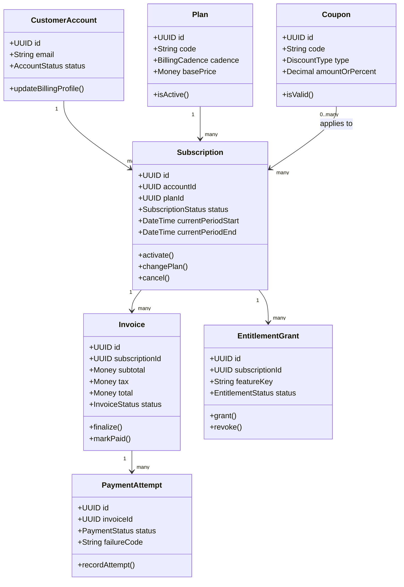

# Class Diagrams

```mermaid
classDiagram
    class CustomerAccount {
      +UUID id
      +String email
      +AccountStatus status
      +updateBillingProfile()
    }

    class Plan {
      +UUID id
      +String code
      +BillingCadence cadence
      +Money basePrice
      +isActive()
    }

    class Subscription {
      +UUID id
      +UUID accountId
      +UUID planId
      +SubscriptionStatus status
      +DateTime currentPeriodStart
      +DateTime currentPeriodEnd
      +activate()
      +changePlan()
      +cancel()
    }

    class Invoice {
      +UUID id
      +UUID subscriptionId
      +Money subtotal
      +Money tax
      +Money total
      +InvoiceStatus status
      +finalize()
      +markPaid()
    }

    class PaymentAttempt {
      +UUID id
      +UUID invoiceId
      +PaymentStatus status
      +String failureCode
      +recordAttempt()
    }

    class EntitlementGrant {
      +UUID id
      +UUID subscriptionId
      +String featureKey
      +EntitlementStatus status
      +grant()
      +revoke()
    }

    class Coupon {
      +UUID id
      +String code
      +DiscountType type
      +Decimal amountOrPercent
      +isValid()
    }

    CustomerAccount "1" --> "many" Subscription
    Plan "1" --> "many" Subscription
    Subscription "1" --> "many" Invoice
    Invoice "1" --> "many" PaymentAttempt
    Subscription "1" --> "many" EntitlementGrant
    Coupon "0..many" --> "many" Subscription : applies to
```
