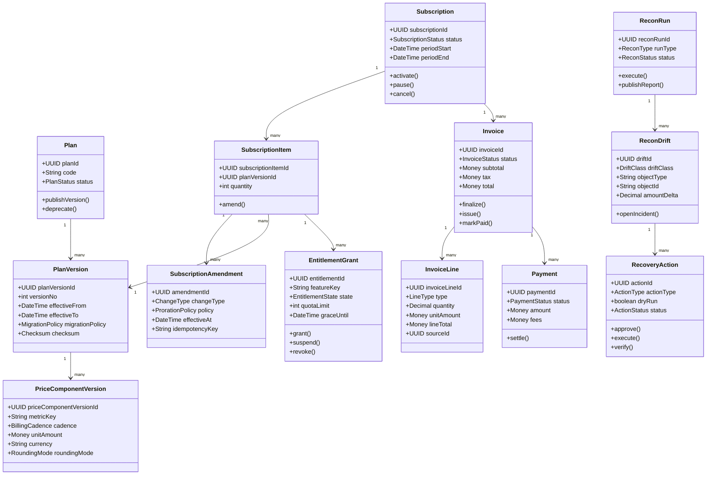

# Class Diagrams (Implementation Ready)

## 1. Domain Model Classes

## 2. Aggregate Ownership and Transaction Boundaries
- **Catalog Aggregate**: `Plan`, `PlanVersion`, `PriceComponentVersion` (immutable post-publish).
- **Subscription Aggregate**: `Subscription`, `SubscriptionItem`, `SubscriptionAmendment`.
- **Billing Aggregate**: `Invoice`, `InvoiceLine`, `Payment` with state transition logs.
- **Integrity Aggregate**: `ReconRun`, `ReconDrift`, `RecoveryAction`.

## 3. Invariants at Class Level
- `PlanVersion` cannot mutate economic fields after publish.
- `InvoiceLine` mutations are disallowed when parent invoice is finalized or later.
- `RecoveryAction.execute()` requires approved status unless `dryRun=true`.
