# Component Diagrams — Subscription Billing and Entitlements Platform

## Overview

This document describes the internal component architecture of every major service in the Subscription Billing and Entitlements Platform. Each service is decomposed into its constituent components with responsibilities, interfaces, and inter-component dependencies documented.

---

## System-Level Component Map

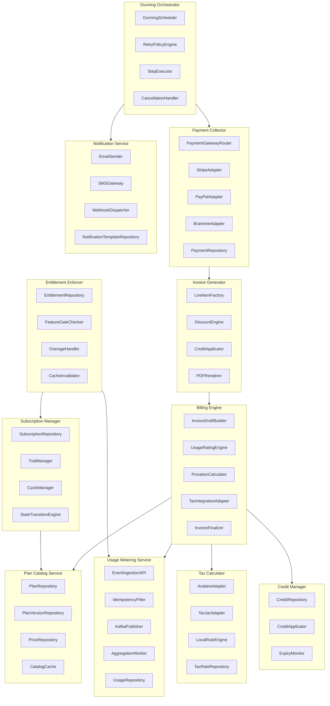

---

## 1. BillingEngine

**Responsibility:** Orchestrates the full billing cycle for a subscription. Pulls subscription state, applies pricing, computes prorations, integrates tax, and delegates invoice finalization.

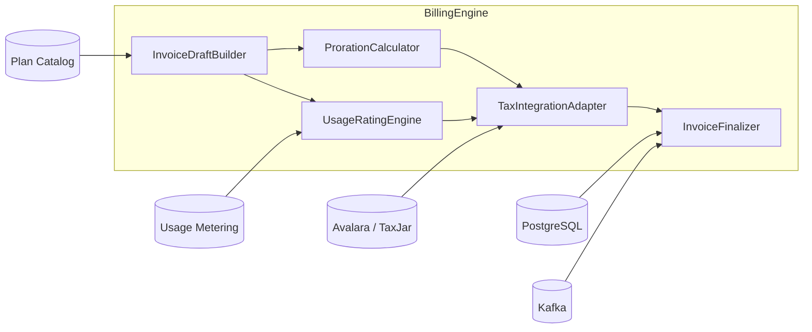

### InvoiceDraftBuilder

- **Responsibility:** Constructs a draft invoice shell by fetching the subscription record, resolving the pinned plan version, and assembling billing period metadata.
- **Inputs:** `subscription_id`, `billing_cycle_start`, `billing_cycle_end`
- **Outputs:** `InvoiceDraft` object with period, account, currency, and empty line-item list
- **Dependencies:** `SubscriptionRepository`, `PlanVersionRepository`, `CatalogCache`
- **Interface:**
  ```
  buildDraft(subscriptionId: UUID, cycleStart: DateTime, cycleEnd: DateTime): InvoiceDraft
  ```

### UsageRatingEngine

- **Responsibility:** Fetches raw usage aggregates for the billing period and converts them into monetary amounts using the plan's pricing rules (flat, tiered, volume, package).
- **Inputs:** `InvoiceDraft`, usage aggregates per metric
- **Outputs:** List of rated `UsageLineItem` objects
- **Dependencies:** `AggregationWorker`, `PriceRepository`
- **Interface:**
  ```
  rateUsage(draft: InvoiceDraft, aggregates: UsageAggregate[]): UsageLineItem[]
  ```

### ProrationCalculator

- **Responsibility:** Computes mid-cycle credit and charge adjustments when a plan change occurs. Calculates day-weighted values for both the outgoing and incoming plan.
- **Inputs:** `plan_change_event` (old plan, new plan, change timestamp, cycle boundaries)
- **Outputs:** List of `ProrationLineItem` objects (credits and charges)
- **Dependencies:** `PlanVersionRepository`
- **Interface:**
  ```
  calculate(event: PlanChangeEvent): ProrationLineItem[]
  ```

### TaxIntegrationAdapter

- **Responsibility:** Sends a tax calculation request to the configured external tax engine (Avalara or TaxJar) or falls back to `LocalRuleEngine`. Returns line-item-level tax breakdown.
- **Inputs:** `InvoiceDraft` with line items, customer billing address
- **Outputs:** List of `TaxLineItem` objects
- **Dependencies:** `TaxCalculator` service (internal), customer address resolver
- **Interface:**
  ```
  computeTax(draft: InvoiceDraft, billingAddress: Address): TaxLineItem[]
  ```

### InvoiceFinalizer

- **Responsibility:** Takes a fully assembled draft invoice, assigns an invoice number, locks it against further mutation, persists it to PostgreSQL, publishes `InvoiceGenerated` event to Kafka, and triggers PDF generation.
- **Inputs:** Completed `InvoiceDraft` with all line items
- **Outputs:** Persisted `Invoice` entity with status `OPEN`
- **Dependencies:** `PostgreSQL`, `Kafka`, `PDFRenderer`
- **Interface:**
  ```
  finalize(draft: InvoiceDraft): Invoice
  ```

---

## 2. UsageMeteringService

**Responsibility:** Accepts high-throughput usage events, deduplicates them, publishes to Kafka, and aggregates them for billing and real-time entitlement enforcement.

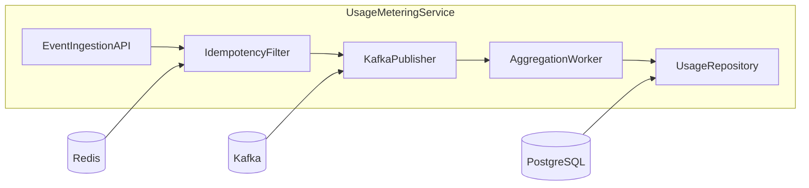

### EventIngestionAPI

- **Responsibility:** Exposes the `POST /usage` HTTP endpoint. Validates event schema, enforces `metric_name` registration, and hands off to the idempotency filter.
- **Inputs:** Raw `UsageEvent` JSON payload
- **Outputs:** `202 Accepted` or validation error
- **Dependencies:** `IdempotencyFilter`, plan metric registry

### IdempotencyFilter

- **Responsibility:** Checks a Redis key `usage:dedup:{event_id}` with a 24-hour TTL. Drops duplicate events silently to maintain at-least-once delivery semantics without double-billing.
- **Inputs:** `UsageEvent`
- **Outputs:** Pass-through or `DUPLICATE` signal
- **Dependencies:** `Redis`

### KafkaPublisher

- **Responsibility:** Publishes validated, deduplicated events to the `usage-events` Kafka topic. Uses `subscription_id` as the partition key to ensure ordering per subscription.
- **Inputs:** Validated `UsageEvent`
- **Outputs:** Kafka produce acknowledgment
- **Dependencies:** Kafka broker

### AggregationWorker

- **Responsibility:** Consumes from `usage-events` topic and applies the configured aggregation strategy (SUM, MAX, LAST, COUNT) per metric per billing period. Writes aggregated buckets to `UsageRepository`.
- **Inputs:** Kafka `UsageEvent` stream
- **Outputs:** Updated `UsageAggregate` records
- **Dependencies:** `UsageRepository`, `PlanCatalogService` (for aggregation config)

### UsageRepository

- **Responsibility:** Persists raw usage events and aggregated usage buckets. Provides query APIs for billing period aggregation retrieval.
- **Inputs:** Write: `UsageEvent`; Read: `(subscriptionId, metricName, from, to)`
- **Outputs:** `UsageAggregate[]`
- **Dependencies:** `PostgreSQL`

---

## 3. PlanCatalogService

**Responsibility:** Manages the lifecycle of plans, plan versions, and prices. Provides catalog data to all downstream services.

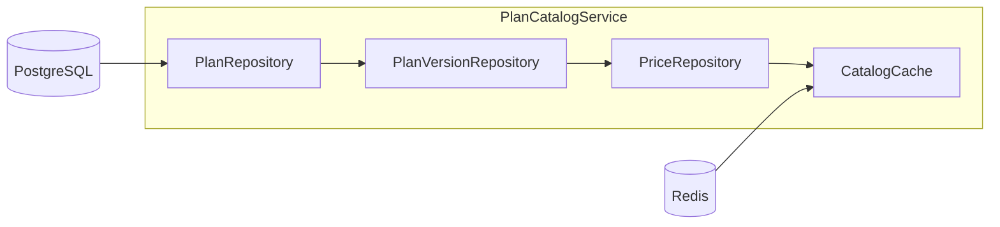

### PlanRepository

- **Responsibility:** CRUD operations for `Plan` entities. A plan is the top-level product offering (e.g., "Starter", "Pro").
- **Interface:** `createPlan`, `getPlanById`, `listPlans`, `archivePlan`
- **Dependencies:** `PostgreSQL`

### PlanVersionRepository

- **Responsibility:** Manages `PlanVersion` entities. Each version captures a snapshot of prices, features, and trial settings at a point in time. Versions progress through `Draft → Published → Deprecated → Archived`.
- **Interface:** `createVersion`, `publishVersion`, `deprecateVersion`, `getVersionById`, `listVersionsByPlan`
- **Dependencies:** `PostgreSQL`

### PriceRepository

- **Responsibility:** Stores `Price` entities tied to a plan version and a billing interval. Supports flat, per-unit, tiered, volume, and package pricing models.
- **Interface:** `createPrice`, `getPricesByVersion`, `getPriceByMetric`
- **Dependencies:** `PostgreSQL`

### CatalogCache

- **Responsibility:** Caches frequently-read plan version and price data in Redis. Cache keys are invalidated on version publish or deprecation. Reduces database load for high-frequency entitlement checks.
- **Interface:** `getVersion(versionId)`, `invalidate(versionId)`
- **Dependencies:** `Redis`

---

## 4. SubscriptionManager

**Responsibility:** Owns the subscription lifecycle from creation through cancellation. Manages trial periods, billing cycles, and state transitions.

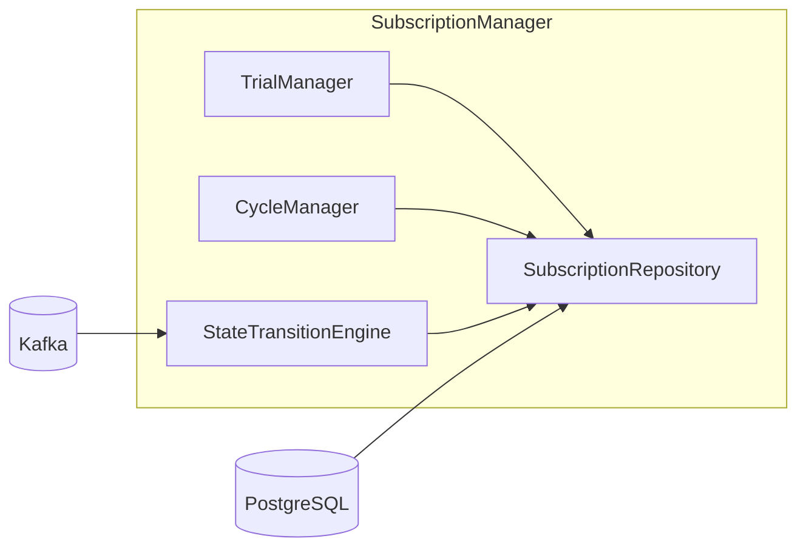

### SubscriptionRepository

- **Responsibility:** CRUD and query operations for `Subscription` entities. Provides list APIs filtered by account, status, and renewal date.
- **Interface:** `create`, `getById`, `update`, `listByAccount`, `listDueForRenewal`
- **Dependencies:** `PostgreSQL`

### TrialManager

- **Responsibility:** Handles trial-period creation, end-of-trial conversion logic, and trial extension. Publishes `TrialEnding` events 3 days before trial expiry.
- **Interface:** `startTrial`, `endTrial`, `extendTrial`, `convertToActive`
- **Dependencies:** `SubscriptionRepository`, `Kafka`

### CycleManager

- **Responsibility:** Computes billing cycle start/end dates for monthly, quarterly, and annual subscriptions. Handles calendar-based anchoring and day-of-month edge cases (e.g., subscriptions starting on the 31st).
- **Interface:** `computeNextCycle(subscription)`, `getCurrentCycle(subscription)`
- **Dependencies:** `SubscriptionRepository`

### StateTransitionEngine

- **Responsibility:** Enforces valid state transitions (e.g., `TRIALING → ACTIVE`, `ACTIVE → PAUSED`, `PAST_DUE → CANCELLED`). Rejects illegal transitions and publishes `SubscriptionStateChanged` events.
- **Interface:** `transition(subscriptionId, targetState, reason)`
- **Dependencies:** `SubscriptionRepository`, `Kafka`

---

## 5. InvoiceGenerator

**Responsibility:** Assembles the final invoice by delegating to line item construction, discount application, credit application, and PDF rendering.

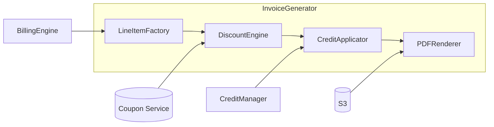

### LineItemFactory

- **Responsibility:** Creates structured `LineItem` objects from raw billing data (fixed charges, usage charges, proration adjustments). Ensures all amounts are in the subscription's currency.
- **Interface:** `buildFixedLineItem`, `buildUsageLineItem`, `buildProrationLineItem`

### DiscountEngine

- **Responsibility:** Evaluates applicable coupons and promotional discounts for the invoice. Applies percentage-off and fixed-amount discounts in the correct order. Validates coupon validity windows and redemption limits.
- **Interface:** `applyDiscounts(invoice, coupons[]): DiscountLineItem[]`
- **Dependencies:** `CouponRepository`

### CreditApplicator

- **Responsibility:** Queries the credit ledger for the account and applies available credits against the invoice amount. Respects credit expiry dates. Generates credit application records.
- **Interface:** `applyCredits(invoice, accountId): CreditApplicationRecord[]`
- **Dependencies:** `CreditManager`

### PDFRenderer

- **Responsibility:** Renders the finalized invoice as a PDF document using a template. Uploads the rendered PDF to S3 and returns the signed URL stored on the invoice record.
- **Interface:** `render(invoice): S3URL`
- **Dependencies:** `S3`

---

## 6. PaymentCollector

**Responsibility:** Routes payment requests to the appropriate gateway adapter, records attempts, and communicates outcomes.

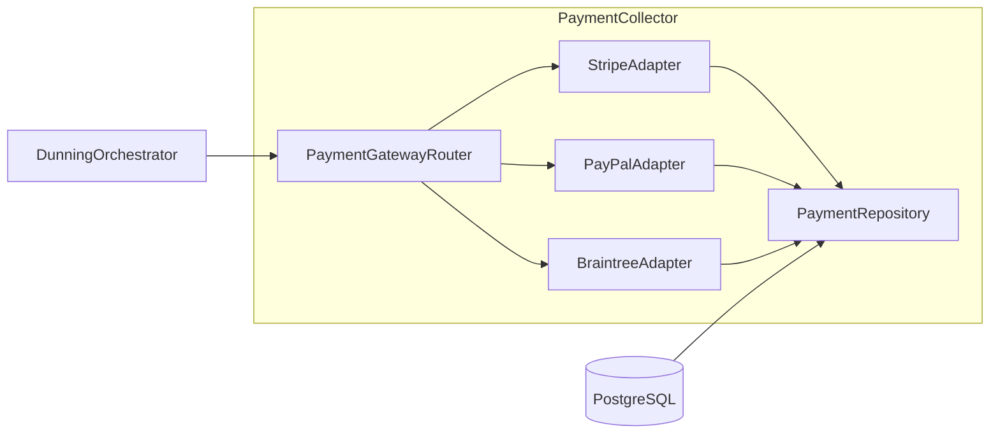

### PaymentGatewayRouter

- **Responsibility:** Selects the correct gateway adapter based on the payment method type and account configuration. Supports failover to a secondary gateway if the primary returns a retriable error.
- **Interface:** `route(paymentRequest): PaymentResult`
- **Dependencies:** `StripeAdapter`, `PayPalAdapter`, `BraintreeAdapter`

### StripeAdapter

- **Responsibility:** Wraps Stripe's PaymentIntent and charge APIs. Handles card authentication (3DS), captures, refunds, and dispute webhooks.
- **Interface:** `charge`, `refund`, `getPaymentMethod`
- **Dependencies:** Stripe API

### PayPalAdapter

- **Responsibility:** Wraps PayPal Orders and Capture APIs. Handles PayPal Billing Agreements for recurring charges.
- **Interface:** `charge`, `refund`, `getPaymentMethod`
- **Dependencies:** PayPal API

### BraintreeAdapter

- **Responsibility:** Wraps Braintree's Transaction and Vault APIs. Supports both credit card and PayPal-via-Braintree flows.
- **Interface:** `charge`, `refund`, `vaultPaymentMethod`
- **Dependencies:** Braintree API

### PaymentRepository

- **Responsibility:** Persists `PaymentAttempt` records with gateway responses, amounts, statuses, and timestamps. Provides query APIs for dunning history.
- **Interface:** `create`, `getById`, `listByInvoice`, `listBySubscription`
- **Dependencies:** `PostgreSQL`

---

## 7. DunningOrchestrator

**Responsibility:** Manages the automated retry process for failed payments. Schedules retries, enforces retry policies, and escalates to cancellation when the policy is exhausted.

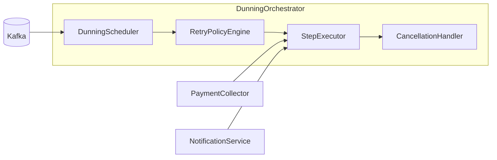

### DunningScheduler

- **Responsibility:** Listens for `PaymentFailed` Kafka events and creates `DunningCycle` records. Schedules retry jobs based on the plan's dunning policy (e.g., retry on Day 1, Day 3, Day 7, Day 14).
- **Interface:** `startCycle(invoiceId, subscriptionId)`, `listActiveCycles`

### RetryPolicyEngine

- **Responsibility:** Evaluates the dunning policy associated with the subscription's plan. Returns the next retry timestamp and the action to take at each step (retry, notify, suspend, cancel).
- **Interface:** `getNextStep(dunningCycle): DunningStep`

### StepExecutor

- **Responsibility:** Executes a single dunning step: triggers payment retry via `PaymentCollector`, sends notification via `NotificationService`, updates subscription state if required.
- **Interface:** `execute(dunningStep)`
- **Dependencies:** `PaymentCollector`, `NotificationService`, `SubscriptionManager`

### CancellationHandler

- **Responsibility:** Invoked when the dunning policy is exhausted without a successful payment. Initiates subscription cancellation, revokes entitlements, and publishes `SubscriptionCancelled` event.
- **Interface:** `cancel(subscriptionId, reason)`
- **Dependencies:** `SubscriptionManager`, `EntitlementEnforcer`, `Kafka`

---

## 8. EntitlementEnforcer

**Responsibility:** Enforces feature access limits in real time and handles overage scenarios.

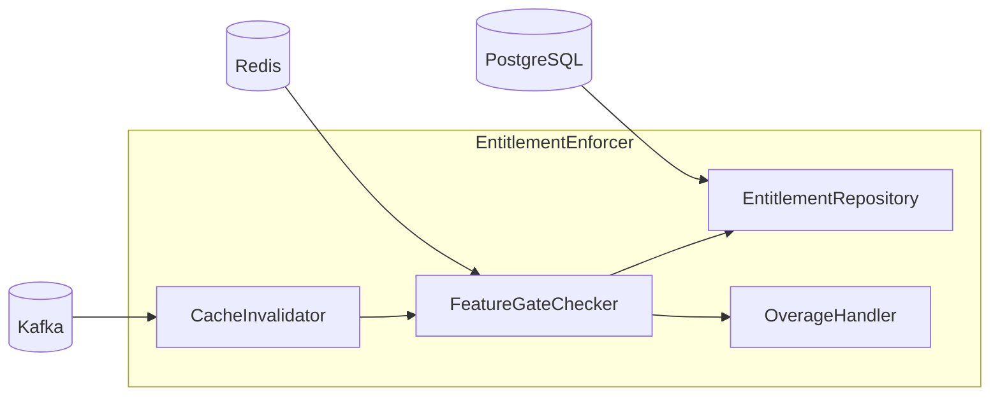

### EntitlementRepository

- **Responsibility:** Stores granted entitlements per subscription, feature key, limit, and overage policy. Provides bulk-fetch APIs for cache warming.
- **Interface:** `grantEntitlement`, `revokeEntitlement`, `getBySubscription`, `getByFeature`
- **Dependencies:** `PostgreSQL`

### FeatureGateChecker

- **Responsibility:** Performs sub-millisecond entitlement checks using Redis counters. Returns `ALLOWED` or `DENIED` with the remaining quota. Falls back to database if cache is cold.
- **Interface:** `check(subscriptionId, featureKey, requestedQty): EntitlementCheckResult`
- **Dependencies:** `Redis`, `EntitlementRepository`

### OverageHandler

- **Responsibility:** Handles overage according to the feature's policy: hard cap (reject), soft cap (allow + alert), or metered (allow + record for billing).
- **Interface:** `handleOverage(subscriptionId, featureKey, overage)`
- **Dependencies:** `UsageMeteringService`, `NotificationService`

### CacheInvalidator

- **Responsibility:** Listens for `SubscriptionStateChanged`, `PlanVersionPublished`, and `EntitlementRevoked` Kafka events and invalidates affected Redis entitlement keys.
- **Interface:** `invalidate(subscriptionId)`, `invalidateFeature(subscriptionId, featureKey)`
- **Dependencies:** `Redis`, `Kafka`

---

## 9. TaxCalculator

**Responsibility:** Computes tax amounts for invoice line items based on jurisdiction rules, customer tax exemptions, and product tax codes.

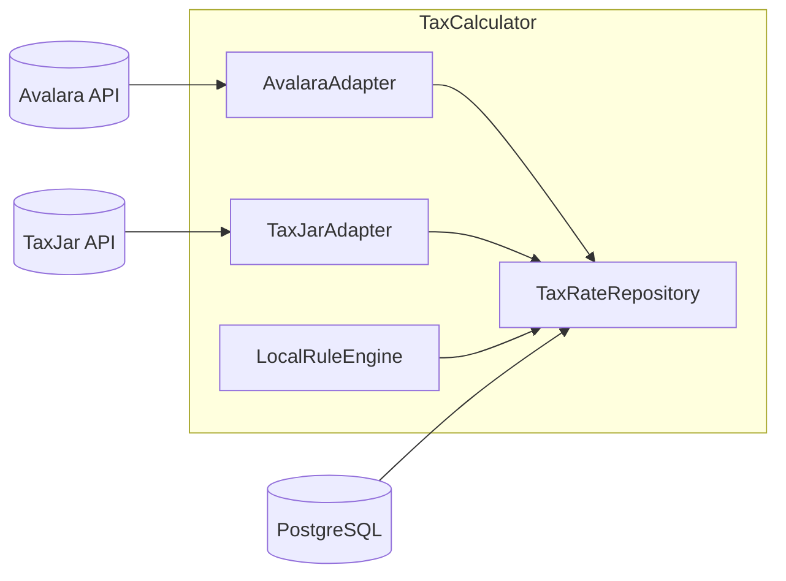

### AvalaraAdapter

- **Responsibility:** Calls Avalara's AvaTax API with a transaction document and receives line-item tax breakdowns. Handles multi-jurisdiction, VAT, GST, and US sales tax.
- **Interface:** `calculateTax(transaction: AvalaraTransactionRequest): TaxResult`

### TaxJarAdapter

- **Responsibility:** Calls TaxJar's SmartCalcs API as an alternative provider. Used when account-level configuration specifies TaxJar or as a failover.
- **Interface:** `calculateTax(transaction: TaxJarRequest): TaxResult`

### LocalRuleEngine

- **Responsibility:** Applies simple tax rules stored in `TaxRateRepository` when no external provider is configured. Supports flat-rate jurisdictional rules and product-category exemptions.
- **Interface:** `applyRules(lineItems[], address: Address): TaxLineItem[]`

### TaxRateRepository

- **Responsibility:** Stores tax rate records per jurisdiction and product tax code. Used by `LocalRuleEngine` and for audit trail when external providers return results.
- **Interface:** `getRatesByJurisdiction`, `upsertRate`, `listRates`
- **Dependencies:** `PostgreSQL`

---

## 10. CreditManager

**Responsibility:** Manages the customer credit ledger. Issues, applies, expires, and reports on credit balances.

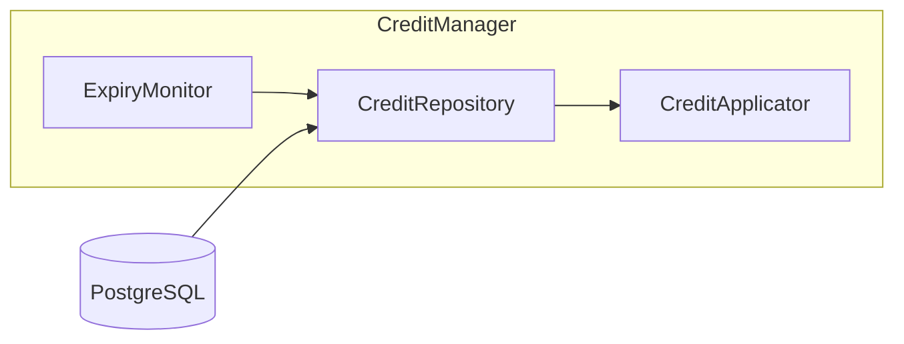

### CreditRepository

- **Responsibility:** Persists `Credit` and `CreditLedgerEntry` records. Provides current balance queries with optional as-of-date filtering.
- **Interface:** `issueCredit`, `applyCredit`, `getBalance`, `listTransactions`
- **Dependencies:** `PostgreSQL`

### CreditApplicator

- **Responsibility:** Applies available credits to an invoice in FIFO order (oldest credit first), respecting expiry dates. Generates `CreditApplication` records for audit.
- **Interface:** `apply(invoiceId, accountId): CreditApplication[]`
- **Dependencies:** `CreditRepository`

### ExpiryMonitor

- **Responsibility:** Runs nightly to identify credits past their expiry date and marks them as `EXPIRED`. Publishes `CreditExpired` events so notifications can be sent to customers.
- **Interface:** `runExpiryJob()`
- **Dependencies:** `CreditRepository`, `Kafka`

---

## 11. NotificationService

**Responsibility:** Delivers outbound communications to customers and operators via email, SMS, and webhooks.

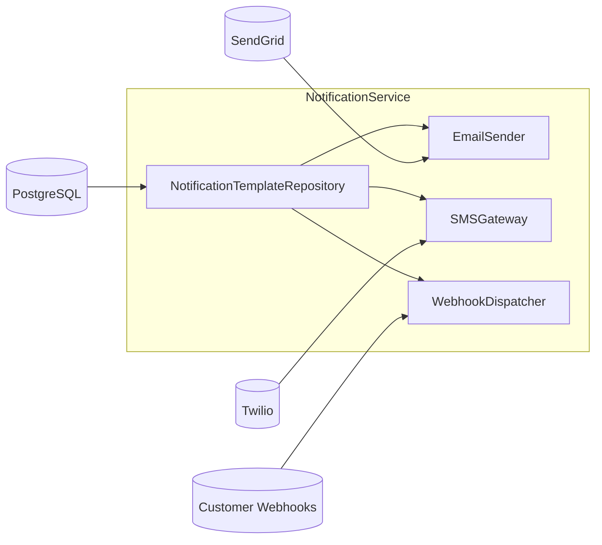

### EmailSender

- **Responsibility:** Renders email templates with event-specific variables and sends via SendGrid. Handles bounce and unsubscribe feedback loops.
- **Interface:** `send(event: NotificationEvent, recipient: EmailAddress)`
- **Dependencies:** `NotificationTemplateRepository`, SendGrid API

### SMSGateway

- **Responsibility:** Sends SMS notifications for critical billing events (payment failure, trial ending) via Twilio. Respects opt-out preferences.
- **Interface:** `send(event: NotificationEvent, recipient: PhoneNumber)`
- **Dependencies:** `NotificationTemplateRepository`, Twilio API

### WebhookDispatcher

- **Responsibility:** Dispatches signed webhook payloads to customer-registered endpoints. Implements exponential backoff retry (up to 5 attempts) and records delivery status.
- **Interface:** `dispatch(event: BillingEvent, endpoints: WebhookEndpoint[])`
- **Dependencies:** HTTP client, `WebhookDeliveryRepository`

### NotificationTemplateRepository

- **Responsibility:** Stores versioned notification templates for each event type and locale. Supports Liquid/Handlebars template syntax with variable substitution.
- **Interface:** `getTemplate(eventType, locale)`, `upsertTemplate`
- **Dependencies:** `PostgreSQL`

---

## Cross-Service Communication Summary

| Producer Service        | Event Name                  | Consumer Services                          |
|-------------------------|-----------------------------|--------------------------------------------|
| SubscriptionManager     | SubscriptionStateChanged    | EntitlementEnforcer, NotificationService   |
| SubscriptionManager     | TrialEnding                 | NotificationService                        |
| BillingEngine           | InvoiceGenerated            | NotificationService, DunningOrchestrator   |
| BillingEngine           | InvoiceFinalized            | PaymentCollector                           |
| PaymentCollector        | PaymentSucceeded            | SubscriptionManager, NotificationService   |
| PaymentCollector        | PaymentFailed               | DunningOrchestrator, NotificationService   |
| DunningOrchestrator     | SubscriptionCancelled       | EntitlementEnforcer, NotificationService   |
| CreditManager           | CreditExpired               | NotificationService                        |
| PlanCatalogService      | PlanVersionPublished        | EntitlementEnforcer, SubscriptionManager   |
