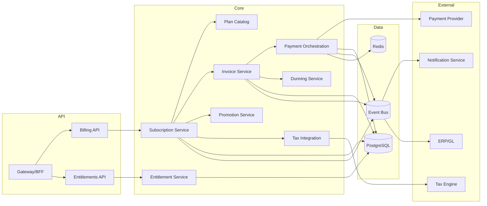

# Component Diagrams

```mermaid
flowchart LR
    subgraph API
      GW[Gateway/BFF]
      BillingAPI[Billing API]
      EntAPI[Entitlements API]
    end

    subgraph Core
      Catalog[Plan Catalog]
      SubSvc[Subscription Service]
      InvoiceSvc[Invoice Service]
      PaymentSvc[Payment Orchestration]
      DunningSvc[Dunning Service]
      EntSvc[Entitlement Service]
      PromoSvc[Promotion Service]
      TaxSvc[Tax Integration]
    end

    subgraph External
      PSP[Payment Provider]
      Tax[Tax Engine]
      ERP[ERP/GL]
      Notify[Notification Service]
    end

    subgraph Data
      DB[(PostgreSQL)]
      MQ[(Event Bus)]
      Cache[(Redis)]
    end

    GW --> BillingAPI --> SubSvc
    GW --> EntAPI --> EntSvc

    SubSvc --> Catalog
    SubSvc --> InvoiceSvc
    InvoiceSvc --> PaymentSvc
    PaymentSvc --> PSP
    InvoiceSvc --> DunningSvc
    SubSvc --> PromoSvc
    SubSvc --> TaxSvc
    TaxSvc --> Tax

    SubSvc --> DB
    InvoiceSvc --> DB
    PaymentSvc --> DB
    EntSvc --> DB

    SubSvc --> MQ
    InvoiceSvc --> MQ
    PaymentSvc --> MQ
    MQ --> Notify
    MQ --> ERP
    PaymentSvc --> Cache
```
