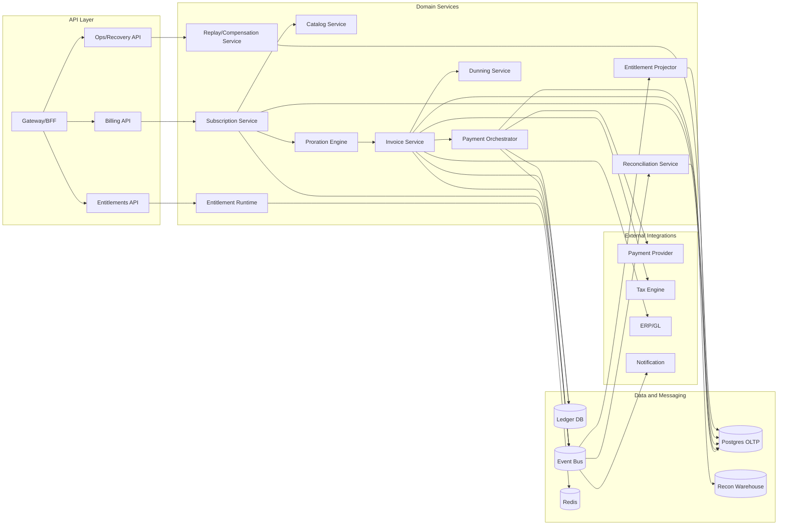
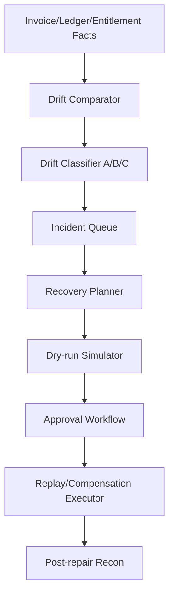

# Component Diagrams (Implementation Ready)

## 1. Service Component Topology


## 2. Entitlement Enforcement Components
```mermaid
flowchart TD
    Req[Incoming API Request] --> Decision[Entitlement Decision Engine]
    Decision --> CacheRead[Snapshot Cache Read]
    CacheRead --> Policy[Policy Evaluator]
    Policy --> Grace[Grace Window Evaluator]
    Grace --> Quota[Quota Validator]
    Quota --> Result[allow | deny | soft_limit]

    BusEvents[Billing/Payment Events] --> Projector[Entitlement Projector]
    Projector --> SnapshotStore[(Snapshot Store)]
    SnapshotStore --> CacheRead
```

## 3. Reconciliation and Recovery Components

