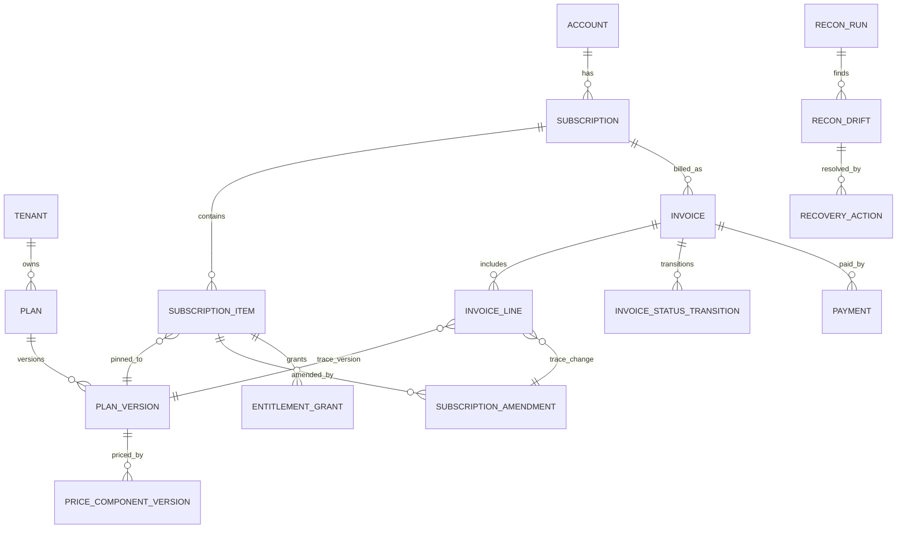

# ERD and Database Schema (Implementation Ready)

## 1. Objective
Define relational schema, constraints, indexes, and lifecycle/audit patterns for:
- Plan and price versioning
- Subscription state and amendments
- Invoice lifecycle and payments
- Entitlement grants
- Reconciliation and recovery

## 2. Logical ERD


## 3. Core Tables and Columns

### 3.1 Catalog and Versioning
- `plan(plan_id, tenant_id, code, status, created_at)`
- `plan_version(plan_version_id, plan_id, version_no, effective_from, effective_to, migration_policy, checksum)`
- `price_component_version(price_component_version_id, plan_version_id, metric_key, cadence, unit_amount, currency, rounding_mode, tax_category)`

### 3.2 Subscription and Amendments
- `subscription(subscription_id, tenant_id, account_id, status, current_period_start, current_period_end)`
- `subscription_item(subscription_item_id, subscription_id, plan_version_id, quantity, status)`
- `subscription_amendment(amendment_id, subscription_item_id, change_type, policy_snapshot, effective_at, idempotency_key)`

### 3.3 Billing and Collections
- `invoice(invoice_id, tenant_id, subscription_id, currency, subtotal, tax, total, status, due_at, issued_at)`
- `invoice_line(invoice_line_id, invoice_id, type, quantity, unit_amount, line_total, source_type, source_id, plan_version_id, amendment_id)`
- `invoice_status_transition(invoice_id, from_status, to_status, reason_code, actor_type, actor_id, occurred_at)`
- `payment(payment_id, invoice_id, provider, provider_ref, status, amount, fee_amount, settled_at)`

### 3.4 Entitlements and Integrity
- `entitlement_grant(entitlement_id, subscription_item_id, feature_key, state, quota_limit, grace_until, derived_from_invoice_id, updated_at)`
- `recon_run(recon_run_id, tenant_id, run_type, status, started_at, completed_at, input_snapshot_hash)`
- `recon_drift(drift_id, recon_run_id, class, object_type, object_id, amount_delta, status, correlation_id)`
- `recovery_action(action_id, drift_id, action_type, dry_run, approved_by, executed_by, result, created_at)`

## 4. Constraints and Invariants
1. `plan_version` is immutable after publish (`UPDATE` blocked except metadata fields).
2. `invoice.status` changes only through `invoice_status_transition` writes.
3. `invoice_line` cannot be modified once invoice is `finalized` or later.
4. `subscription_item.plan_version_id` updates only through amendment workflow.
5. `recovery_action` execution requires non-null approver for non-dry-run actions.

## 5. Required Indexes
- `plan_version(plan_id, effective_from DESC)`
- `subscription_item(subscription_id, status)`
- `invoice(tenant_id, status, due_at)`
- `invoice_line(invoice_id, source_type, source_id)`
- `payment(invoice_id, status, settled_at)`
- `entitlement_grant(subscription_item_id, feature_key)`
- `recon_drift(recon_run_id, class, status)`

## 6. Partitioning and Retention
- Partition `invoice`, `invoice_line`, and `payment` by billing month for scalability.
- Partition recon artifacts by run date.
- Retain immutable financial records according to statutory retention policy.
- Archive cold partitions to lower-cost storage while preserving replayability.

## 7. Example DDL Snippets
```sql
create table invoice (
  invoice_id uuid primary key,
  tenant_id uuid not null,
  subscription_id uuid not null,
  currency char(3) not null,
  subtotal numeric(18,6) not null,
  tax numeric(18,6) not null,
  total numeric(18,6) not null,
  status text not null check (status in ('draft','finalized','issued','partially_paid','paid','overdue','void','uncollectible')),
  due_at timestamptz,
  issued_at timestamptz,
  created_at timestamptz not null default now()
);

create unique index ux_amendment_idempotency on subscription_amendment (subscription_item_id, idempotency_key);
```

## 8. Migration Strategy
- Use additive-first migrations (add columns/tables before reads/writes switch).
- Backfill in chunks with watermark checkpoints.
- Enforce invariant triggers after backfill validation.
- Keep rollback scripts for every forward migration.
