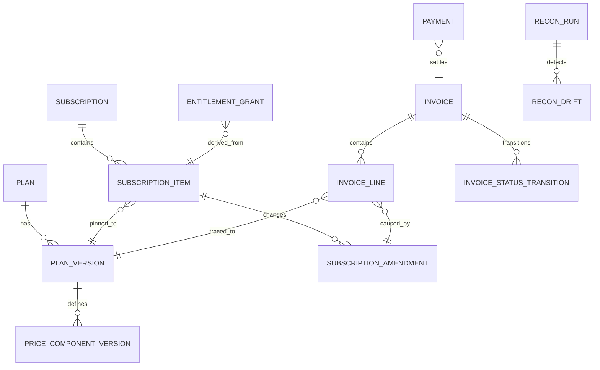

# Detailed Design: Plan Versioning, Invoice Lifecycle, Proration, Entitlement Enforcement, and Reconciliation

## 1. Data Model Additions

### 1.1 Catalog and Versioning
- `plan` (`plan_id`, `code`, `status`)
- `plan_version` (`plan_version_id`, `plan_id`, `version_number`, `effective_from`, `effective_to`, `migration_policy`, `created_by`)
- `price_component_version` (`price_component_version_id`, `plan_version_id`, `metric`, `billing_period`, `unit_amount`, `currency`, `rounding_mode`)

### 1.2 Subscription Binding
- `subscription_item` includes immutable foreign keys to `plan_version_id` and selected price component versions.
- `subscription_amendment` stores change reason, trigger time, and proration policy snapshot.

### 1.3 Invoice Lifecycle
- `invoice` status enum: `draft|finalized|issued|partially_paid|paid|overdue|void|uncollectible`.
- `invoice_line` carries traceability fields: `source_type`, `source_id`, `plan_version_id`, `amendment_id`.
- `invoice_status_transition` stores actor, timestamp, old/new state, and reason code.

## 2. State Transitions and Guards

### 2.1 Invoice
- `draft -> finalized`: requires tax lock success + no open mutation locks.
- `finalized -> issued`: requires document generation + delivery enqueue.
- `issued -> partially_paid|paid|overdue`: driven by payment and due-date evaluators.
- `issued|overdue -> void|uncollectible`: requires policy authorization.

### 2.2 Subscription/Entitlement Coupling
- Payment success on required invoice transitions entitlement to `active`.
- Payment failure beyond grace threshold transitions entitlement to `limited`/`suspended`.

## 3. Proration Computation

### Inputs
- Old and new price component versions
- Amendment timestamp
- Billing period boundaries
- Currency precision and rounding policy

### Algorithm
1. Compute elapsed and remaining seconds in cycle.
2. Determine unused fraction from old component; generate credit line if policy allows.
3. Determine remaining fraction for new component; generate charge line.
4. Recompute tax for prorated taxable bases.
5. Attach deterministic idempotency key:
   `tenant_id:subscription_item_id:amendment_id:component_id`.

## 4. Entitlement Enforcement Paths

### 4.1 Runtime Decision API
- Endpoint: `POST /internal/entitlements/check`
- Request: subject, tenant, feature key, quantity intent.
- Decision pipeline:
  1. Read snapshot cache by subject+tenant.
  2. Evaluate policy + grace window + quota.
  3. Return allow/deny/soft_limit with reason codes.

### 4.2 Event-Driven Projection
- Input topics: `invoice.*`, `payment.*`, `subscription.*`, `catalog.*`.
- Projector upserts current and historical entitlement grants.
- Staleness guard emits alert when lag exceeds threshold.

## 5. Reconciliation Jobs

### 5.1 Job Set
1. `usage_invoice_recon_daily`
2. `invoice_ledger_recon_daily`
3. `payment_ledger_recon_hourly`
4. `entitlement_billing_recon_hourly`

### 5.2 Drift Classification
- **Class A** (critical): monetary mismatch impacting ledger.
- **Class B** (major): entitlement mismatch with paid status.
- **Class C** (minor): delayed but convergent projections.

## 6. Error Recovery Flows
- Retry with exponential backoff for transient connector failures.
- Quarantine unrecoverable events after retry budget exhaustion.
- Provide operator endpoint for replay:
  `POST /internal/recovery/replay` with correlation range and dry-run mode.
- Compensation workflow emits explicit correcting entries; never mutates finalized history.

## 7. Observability Requirements
- Metrics: finalize latency, proration delta count, entitlement deny reason distribution, reconciliation drift rate.
- Tracing: propagate correlation IDs from subscription change to invoice + entitlement outcomes.
- Audit: all manual recovery operations require ticket reference and approver identity.

## Beginner Notes: Reading This Detailed Design
- Read section **1 + 2** first to understand data and state constraints.
- Read section **3** next if you are implementing billing math.
- Read section **4** if you are implementing API gating or admin visibility.
- Read section **5 + 6** if you are implementing operational integrity tooling.

## Worked Proration Example
Assume monthly cycle (30 days), Basic = $30/month, Pro = $60/month.
Upgrade happens after 12 days:
- Unused Basic fraction = 18/30 -> credit = $18.00
- Remaining Pro fraction = 18/30 -> charge = $36.00
- Net proration delta before tax = +$18.00
This example is intentionally simple; production logic must still apply currency rounding and tax rules.

## Common Implementation Mistakes to Avoid
- Mutating existing invoice lines after finalization.
- Recomputing proration with non-deterministic timestamps.
- Granting entitlements directly from UI actions instead of payment/billing events.
- Running replay without idempotency keys and creating duplicate postings.


## 8. Logical ERD (Mermaid)


## 9. API Contracts (Implementation-Oriented)

### 9.1 `POST /internal/entitlements/check`
**Request (example)**
```json
{
  "tenant_id": "t_001",
  "subject_id": "user_42",
  "feature": "advanced_export",
  "quantity": 1,
  "request_ts": "2026-03-28T10:00:00Z"
}
```

**Response (example)**
```json
{
  "decision": "allow",
  "reason_code": "PAID_ACTIVE",
  "grace_expires_at": null,
  "snapshot_version": "ent_v_1023"
}
```

### 9.2 `POST /internal/recovery/replay`
**Request (example)**
```json
{
  "correlation_id": "corr_8f3",
  "domain": "billing",
  "from_event_id": "evt_1000",
  "to_event_id": "evt_1100",
  "dry_run": true,
  "requested_by": "ops@example.com",
  "ticket_id": "INC-12345"
}
```

**Response (example)**
```json
{
  "replay_job_id": "rpl_991",
  "status": "accepted",
  "estimated_impact": {
    "invoice_lines_recomputed": 12,
    "ledger_entries_to_compare": 12
  }
}
```

## 10. Proration Pseudocode
```text
function calculate_proration(old_price, new_price, period_start, period_end, amend_ts, policy):
    total = seconds(period_start, period_end)
    elapsed = seconds(period_start, amend_ts)
    remaining = total - elapsed

    old_unused_fraction = remaining / total
    new_remaining_fraction = remaining / total

    credit = 0
    if policy.allows_credit:
        credit = round_currency(old_price * old_unused_fraction)

    debit = round_currency(new_price * new_remaining_fraction)
    tax = compute_tax(debit - credit)

    return {credit_line, debit_line, tax_line, deterministic_key}
```

## 11. Transaction Boundaries and Idempotency
- `invoice.finalize` and ledger posting must run in an atomic boundary or compensatable saga.
- External side effects (emails/webhooks) must be emitted only after durable status persistence.
- Idempotency keys must be stored with TTL >= replay window to prevent duplicate writes.

## 12. Test Matrix (Minimum)
| Test Type | Scenario | Expected Result |
|---|---|---|
| Unit | proration with edge timestamp at period boundary | zero/near-zero delta correctness |
| Unit | rounding for 0-decimal and 3-decimal currencies | deterministic monetary output |
| Integration | invoice finalize + payment settle | entitlement becomes active |
| Integration | failed payment + grace expiry | entitlement becomes limited/suspended |
| E2E | drift detected then replay | drift resolves without double-posting |
| Chaos | delayed webhook + out-of-order events | consistent eventual state + no data loss |
