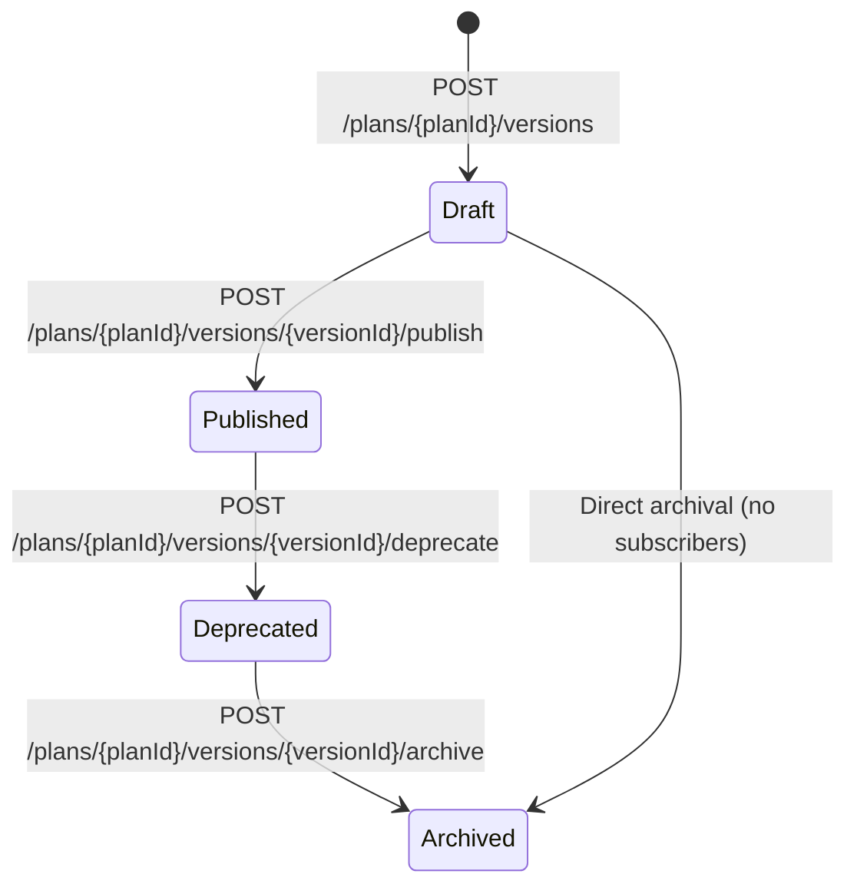

# Plan Versioning, Invoice Proration, and Entitlements — Deep Dive

## Overview

This document provides a detailed technical reference for three tightly coupled subsystems: plan version lifecycle management, proration calculation for mid-cycle plan changes, invoice line item generation, and entitlement grant/revoke mechanics. These subsystems interact during subscription creation, plan upgrades/downgrades, and billing cycle finalization.

---

## 1. Plan Version Lifecycle

### 1.1 What Is a Plan Version?

A `Plan` is the top-level product offering (e.g., "Starter", "Pro", "Enterprise"). A `PlanVersion` is an immutable snapshot of that plan's configuration at a point in time, including:

- Base price amounts per billing interval (monthly, quarterly, annual)
- Usage-based pricing rules per metric (flat, tiered, volume, package)
- Feature entitlement definitions (feature key, limit, overage policy)
- Trial period settings
- Dunning policy reference

Each plan can have multiple versions. Subscriptions are pinned to a specific `plan_version_id`, not just a `plan_id`. This ensures that existing customers are never retroactively affected by pricing changes.

---

### 1.2 Version States



| State | Description |
|-------|-------------|
| **Draft** | Version is being configured. Prices and features can be edited. New subscriptions cannot be placed on a Draft version. |
| **Published** | Version is live and available for new subscriptions. Only one version per plan can be `Published` at a time — publishing a new version automatically deprecates the previous one. |
| **Deprecated** | Version is no longer available for new subscriptions. Existing subscribers are grandfathered on this version until they upgrade or the subscription ends. |
| **Archived** | Version has no active subscribers. It is retained for historical invoice accuracy but is otherwise inactive. |

**State Transition Rules:**
- `Draft → Published`: Requires at least one price defined. Atomically marks the previous `Published` version as `Deprecated`.
- `Published → Deprecated`: Only triggered automatically when a new version is published. Cannot be manually triggered on a version with active subscribers without first migrating them.
- `Deprecated → Archived`: Only allowed when `SELECT COUNT(*) FROM subscriptions WHERE plan_version_id = :id AND status IN ('trialing','active','paused','past_due') = 0`.

---

### 1.3 How Subscriptions Pin to Versions

When a subscription is created, the API accepts an optional `plan_version_id`. If omitted, the system resolves the currently `Published` version of the given `plan_id` and stores it on the subscription record.

```sql
-- Subscription record stores the pinned version
CREATE TABLE subscriptions (
    id UUID PRIMARY KEY,
    account_id UUID NOT NULL,
    plan_id UUID NOT NULL REFERENCES plans(id),
    plan_version_id UUID NOT NULL REFERENCES plan_versions(id),
    status VARCHAR(32) NOT NULL,
    -- ...
);
```

The `plan_version_id` on a subscription record is immutable unless:
1. The customer explicitly upgrades or downgrades via `PATCH /subscriptions/{id}` with a new `plan_version_id`.
2. The operations team performs a bulk migration with `proration_behavior: "none"` for an administrative repricing.

Every billing run reads `plan_version_id` from the subscription and loads the corresponding version from cache to determine prices and entitlements. This guarantees billing accuracy regardless of subsequent catalog changes.

---

### 1.4 Grandfathering Mechanics

Grandfathering means a customer continues to pay the old price even after a newer, more expensive version is published.

**How it works:**
- When a new plan version is published, all subscriptions pinned to the previous version are **not automatically migrated**. They continue on `plan_version_id = old_version`.
- The `Deprecated` status signals to the catalog that the old version is no longer acquirable, but existing subscribers are unaffected.
- The billing engine reads the subscription's pinned version at each billing cycle. A grandfathered subscriber will be billed at the old version's price indefinitely.

**Opting Subscribers Into a New Version:**
Operators can migrate grandfathered subscribers by:
1. Calling `PATCH /subscriptions/{id}` with `plan_version_id = new_version_id` and `proration_behavior = "create_prorations"`.
2. Running a bulk migration job that targets all subscriptions on a deprecated version and issues prorated adjustments.

**Version-specific entitlements:**
Entitlements are resolved from the subscription's pinned `PlanVersion.features[]` at the time of each entitlement check and at each billing cycle start (when entitlements are refreshed). A grandfathered subscriber retains the feature limits from their pinned version.

---

### 1.5 Version Metadata and Audit Trail

Every version stores:
- `created_at`, `created_by` (operator user ID)
- `published_at`, `published_by`
- `deprecated_at`
- `change_summary` (text field for internal notes, e.g., "Increased API call limit to 200k, raised base price by $10")

Version history is immutable. Once a version is published, its prices and feature definitions cannot be edited — a new version must be created.

---

## 2. Proration Calculation Algorithm

### 2.1 When Proration Triggers

Proration is computed when a subscription's `plan_version_id` changes mid-billing-cycle due to:
- **Upgrade:** Customer moves to a higher-priced plan.
- **Downgrade:** Customer moves to a lower-priced plan.
- **Cancellation with immediate effect:** Customer cancels before the billing cycle ends (partial cycle credit may apply depending on policy).

Proration does **not** trigger for:
- Pausing/resuming (handled via invoice voiding, not proration).
- Changes made exactly on a cycle boundary (same day as `current_period_end`).
- Changes made during a trial period (trial has no billing impact).

---

### 2.2 Core Proration Algorithm

Given:
- `T_change` = timestamp of the plan change
- `D_start` = current billing cycle start date
- `D_end` = current billing cycle end date
- `P_old` = old plan version's base price (in cents)
- `P_new` = new plan version's base price (in cents)

**Step 1: Compute days remaining**
```
D_remaining = D_end - T_change   (in fractional days, using precise seconds)
D_total     = D_end - D_start
```

**Step 2: Compute proration fraction**
```
fraction = D_remaining / D_total
```
The fraction is computed using full-precision floating point and rounded to 8 decimal places before multiplication to avoid floating-point drift.

**Step 3: Compute credit for unused old plan time**
```
credit = round(fraction × P_old)
```
This is a negative line item: "Remaining time on [Old Plan Name] — X days".

**Step 4: Compute charge for new plan time**
```
new_charge = round(fraction × P_new)
```
This is a positive line item: "Time on [New Plan Name] — X days".

**Step 5: Compute net amount**
```
net = new_charge - credit
```
- If `net > 0`: charge the customer the difference immediately (upgrade case).
- If `net < 0`: issue the credit to the account ledger (downgrade case, to be applied to next invoice).
- If `net = 0`: no immediate billing action; plans have same price.

**Step 6: Generate line items**
```
ProrationLineItem {
    type:        "proration_credit",
    description: "Remaining time on Pro (15 days)",
    amount:      -2499,   // cents, negative
    period_start: T_change,
    period_end:   D_end
}

ProrationLineItem {
    type:        "proration_charge",
    description: "Time on Enterprise (15 days)",
    amount:      4165,    // cents, positive
    period_start: T_change,
    period_end:   D_end
}
```

---

### 2.3 Rounding Policy

All monetary amounts are computed and stored in integer cents. The `round()` function uses **half-up rounding** (banker's rounding is not used to avoid systematically favoring the platform over the customer on `.5` amounts). Both the credit and new_charge are independently rounded; the net is computed from the rounded values, not from the unrounded intermediate.

---

### 2.4 Edge Cases

#### Same-Day Change (Change on Cycle Boundary)

If `T_change` falls on the same calendar day as `D_end` (i.e., `D_remaining < 1 day`), proration is **skipped**. The new plan takes effect from the next billing cycle. This prevents confusing sub-cent proration amounts.

```
if (D_remaining_in_hours < 24) → skip proration, apply new plan from next cycle
```

#### Upgrade on Cycle Boundary

If `T_change == D_end` exactly (billing cycle renewal day), there is no remaining time on the old plan and no proration necessary. The subscription renews at the new plan's price.

#### Annual Plan Mid-Year Change

For annual subscriptions:
- `D_total = 365` days (or actual days in the subscription year if straddling a leap year).
- `D_remaining` is computed using the exact number of days from `T_change` to `D_end`.
- Because amounts are larger on annual plans, the proration amounts are significant. The platform generates an immediate invoice for upgrade prorations on annual plans.

#### Multiple Changes in One Billing Cycle

If a subscriber changes plan twice within a single billing cycle (e.g., Starter → Pro → Enterprise), each change generates its own `PlanChangeEvent`. The proration algorithm is applied sequentially:

1. At first change: credit for unused Starter time, charge for Pro time from change to next change.
2. At second change: credit for unused Pro time, charge for Enterprise time from second change to cycle end.

All proration line items are consolidated into a single invoice at billing cycle end.

#### Downgrades with Credit Ledger

For downgrades (`net < 0`), the credit is not refunded to the payment method. Instead:
- A `CreditLedgerEntry` is created for the account with the credit amount.
- The credit is applied automatically on the next invoice via `CreditApplicator`.
- If the credit exceeds the next invoice, the remainder carries forward.

---

## 3. Invoice Line Item Generation

### 3.1 Line Item Types

| Type | Description | Amount Sign |
|------|-------------|-------------|
| `subscription` | Fixed base charge for the billing period. | Positive |
| `usage` | Metered usage charge rated per the pricing model. | Positive |
| `proration_charge` | Charge for partial-cycle time on new plan. | Positive |
| `proration_credit` | Credit for unused time on old plan. | Negative |
| `discount` | Coupon or promotional discount applied. | Negative |
| `credit` | Account credit applied. | Negative |
| `tax` | Tax amount for a taxable line item. | Positive |

---

### 3.2 Fixed Charge Line Items

For plans with a flat base price:
1. Load `Price` record for the plan version and billing interval.
2. Verify the subscription's current period overlaps with the invoice period.
3. Create one `LineItem` of type `subscription`:
   ```
   description: "{Plan Name} — {Month Year}"
   quantity:    1
   unit_amount: P_base (in cents)
   amount:      P_base
   ```

---

### 3.3 Usage Charge Line Items

For each metered metric on the plan:
1. Query aggregated usage for `(subscription_id, metric_name, period_start, period_end)`.
2. Load the pricing rule for this metric from the plan version.
3. Apply the pricing model to compute amount:

**Flat Rate:**
```
amount = quantity × unit_price
description: "{Metric Display Name} — {quantity} {unit}"
```

**Tiered (ascending tiers):**
```
remaining = total_quantity
amount    = 0
for tier in tiers (ordered by up_to ASC):
    tier_qty = min(remaining, tier.up_to - previous_tier.up_to)
    amount  += tier_qty × tier.unit_amount
    remaining -= tier_qty
    if remaining == 0: break
description: "{Metric} — {total_quantity} {unit} (tiered)"
```

**Volume:**
```
applicable_tier = first tier where total_quantity <= tier.up_to (or last tier)
amount          = total_quantity × applicable_tier.unit_amount
description: "{Metric} — {total_quantity} {unit} at ${applicable_tier.unit_amount / 100} each"
```

**Package:**
```
packages = ceil(total_quantity / package_size)
amount   = packages × package_price
description: "{Metric} — {packages} × {package_size} {unit} packages"
```

---

### 3.4 Proration Line Items

Generated by `ProrationCalculator` as described in Section 2. Added to the invoice in sequence after fixed and usage line items.

---

### 3.5 Discount Line Items

For each valid coupon applied to the subscription:
1. Compute the discount base: sum of all `subscription` and `usage` line items (before tax).
2. Apply discount:
   - `percentage`: `discount_amount = round(base × (rate / 100))`
   - `fixed_amount`: `discount_amount = min(coupon_amount, base)`
3. Create a `LineItem` of type `discount`:
   ```
   description: "Coupon: {coupon_code} ({discount_value}% off)"
   amount:      -discount_amount
   ```
4. Discounts do not apply to proration credits (they would compound the credit).

---

### 3.6 Tax Line Items

For each taxable `LineItem`:
1. Send the net taxable amount (after discounts, before credits) to `TaxIntegrationAdapter`.
2. Receive tax breakdown per jurisdiction.
3. Create one `LineItem` of type `tax` per jurisdiction:
   ```
   description: "Sales Tax — {jurisdiction_name} ({rate}%)"
   amount:      tax_amount
   tax_rate_id: {id}
   jurisdiction: {jurisdiction_id}
   ```

Tax lines are always the last lines added before credits.

---

### 3.7 Credit Application

Credits are applied after tax computation. The `amount_due` of the invoice is reduced by the credit applied, but the tax line items and subtotal reflect the pre-credit invoice for tax reporting accuracy.

---

## 4. Entitlement Grant and Revoke Mechanics

### 4.1 When Entitlements Are Granted

Entitlements are provisioned whenever a subscription gains access to a plan's features:

| Event | Trigger | Action |
|-------|---------|--------|
| Subscription created (active state) | `SubscriptionStateChanged: ACTIVE` | Grant all features defined in `PlanVersion.features[]` |
| Trial started | `SubscriptionStateChanged: TRIALING` | Grant all features defined in `PlanVersion.features[]` |
| Plan upgraded | `PATCH /subscriptions/{id}` with new `plan_version_id` | Revoke old entitlements, grant new entitlements |
| Manual grant | `POST /entitlements/grant` | Grant the specified feature with optional custom limit and expiry |
| Subscription resumed | `SubscriptionStateChanged: ACTIVE` (from PAUSED) | Reinstate entitlements that were suspended during pause |

**Grant Process:**
1. Load `PlanVersion.features[]` for the new plan version.
2. For each feature: `INSERT INTO entitlements (subscription_id, feature_key, limit, overage_policy, status) VALUES (...) ON CONFLICT (subscription_id, feature_key) DO UPDATE SET limit = ..., overage_policy = ..., status = 'active'`.
3. Publish `EntitlementGranted` event to Kafka.
4. `CacheInvalidator` receives the event and deletes affected Redis keys (`ent:{subscription_id}:{feature_key}`).
5. Next entitlement check hits Redis cold and warms the cache from PostgreSQL.

---

### 4.2 When Entitlements Are Revoked

| Event | Trigger | Action |
|-------|---------|--------|
| Subscription cancelled (immediate) | `SubscriptionStateChanged: CANCELLED` | Hard revoke all entitlements |
| Subscription cancelled at period end | End of billing period | Hard revoke all entitlements on `current_period_end` |
| Dunning exhausted (payment failure) | `DunningOrchestrator: EXHAUSTED` | Hard revoke all entitlements |
| Plan downgraded | `PATCH /subscriptions/{id}` with lower version | Revoke old entitlements, grant new (reduced) entitlements |
| Manual revoke | `POST /entitlements/revoke` | Revoke the specified feature |
| Subscription paused | `SubscriptionStateChanged: PAUSED` | Suspend (not delete) entitlements |

**Revoke Process:**
1. Update `entitlements.status = 'revoked'` and set `revoked_at = now()` for the subscription's features.
2. Publish `EntitlementRevoked` event to Kafka.
3. `CacheInvalidator` immediately deletes affected Redis keys.
4. Subsequent `FeatureGateChecker` calls return `DENIED` on the next check (no stale cache).

---

### 4.3 Grace Period During Dunning

To avoid disrupting paying customers over temporary payment failures, entitlements are not immediately revoked when a payment fails. Instead, a **dunning grace period** is applied:

```
Grace period = dunning_policy.grace_period_days (default: 14 days)
```

During the grace period:
- Subscription status transitions to `PAST_DUE`.
- Entitlements remain `ACTIVE`.
- `DunningOrchestrator` executes retry steps (Day 1, Day 3, Day 7, Day 14 by default).
- A `USAGE_SUSPENDED` flag is set on the entitlement record for features with `overage_policy = "metered"` — new overage is not accrued during the grace period.

If payment succeeds during grace period:
- Subscription status → `ACTIVE`
- Entitlements remain `ACTIVE` uninterrupted

If dunning policy is exhausted without payment:
- Subscription status → `CANCELLED`
- All entitlements → `REVOKED` immediately
- `CancellationHandler` triggers hard revoke

---

### 4.4 Overage Handling

Each feature has an `overage_policy` that determines behavior when the entitlement limit is reached:

#### Hard Cap

- `FeatureGateChecker` returns `DENIED` when `used >= limit`.
- HTTP callers receive `429 Too Many Requests` with error code `ENTITLEMENT_EXCEEDED`.
- No overage is billed.
- Example use case: seat limits, maximum number of active projects.

```
Redis check: GET ent:{sub_id}:{feature_key}:used
if (used + requested_quantity) > limit → return DENIED
```

#### Soft Cap

- `FeatureGateChecker` returns `OVERAGE_ALLOWED` when `used >= limit`.
- Usage is permitted; no billing impact.
- An alert notification is sent on first overage breach and at 50% / 100% / 200% of limit.
- Example use case: soft storage limits, informational bandwidth thresholds.

#### Metered Overage

- `FeatureGateChecker` returns `OVERAGE_ALLOWED` with `overage_units` counted.
- Overage is tracked separately in the `usage_events` table with `is_overage = true`.
- At billing cycle end, `UsageRatingEngine` rates all overage events using the plan's overage price (a separate pricing rule on the plan version).
- Example use case: API calls beyond the plan's included amount.

```
if (used + requested_quantity) > limit:
    overage = (used + requested_quantity) - limit
    emit UsageEvent(metric_name=feature_key, quantity=overage, is_overage=true)
    return OVERAGE_ALLOWED
```

---

### 4.5 Real-Time vs Cached Entitlement Checks

#### Real-Time Check (Sub-millisecond, Redis-Backed)

The `POST /entitlements/check` endpoint uses a Redis-backed counter for immediate feedback:

1. Read `ent:{subscription_id}:{feature_key}` hash from Redis: `{limit, used, overage_policy, status}`.
2. If key does not exist (cold cache): load from PostgreSQL, warm Redis with 60-second TTL, return result.
3. Atomically increment `used` by `requested_quantity` using `HINCRBY`.
4. Compare `used` against `limit`.
5. Return `ALLOWED`, `OVERAGE_ALLOWED`, or `DENIED` with remaining quota.

**Redis Key Structure:**
```
HSET ent:{subscription_id}:{feature_key}
    limit         100000
    used          87432
    overage_policy metered
    status        active
EX 3600
```

Redis is the source of truth for real-time checks. The authoritative billing count is in PostgreSQL (see Section 5.6 of the Usage Metering document for reconciliation details).

#### Batch Enforcement (Nightly Reconciliation)

For features where Redis drift is a concern (e.g., extreme-high-throughput metrics), a nightly reconciliation job:
1. Queries PostgreSQL for the accurate aggregate per subscription per metric.
2. Overwrites the Redis `used` counter with the PostgreSQL value.
3. Logs any significant discrepancies (>1% drift) for alerting.

This ensures that even if Redis loses data (restart, eviction), billing accuracy is maintained from PostgreSQL's Kafka-sourced aggregations.

---

### 4.6 Entitlement State on Plan Change

When a subscriber upgrades or downgrades mid-cycle:

**Upgrade (old version → new version with higher limits):**
1. The old entitlements are updated in-place (`ON CONFLICT DO UPDATE`) with the new limits.
2. Redis counters are NOT reset — used counts carry over within the billing period.
3. The higher limit takes effect immediately.

**Downgrade (old version → new version with lower limits):**
1. The old entitlements are updated with the new (lower) limits.
2. If `current_used > new_limit`, the entitlement is immediately in overage territory.
3. Based on the new version's `overage_policy`:
   - `hard_cap`: entitlement is immediately at limit; new requests denied until next billing cycle resets the counter.
   - `metered`: overage events continue to accrue and will be billed.
   - `soft_cap`: overage alert sent; usage continues.
