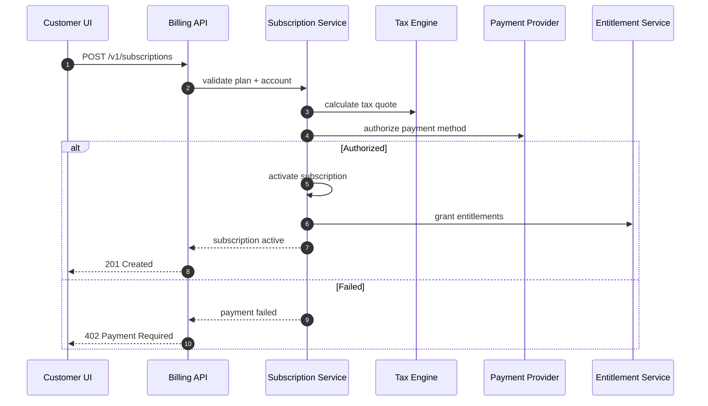
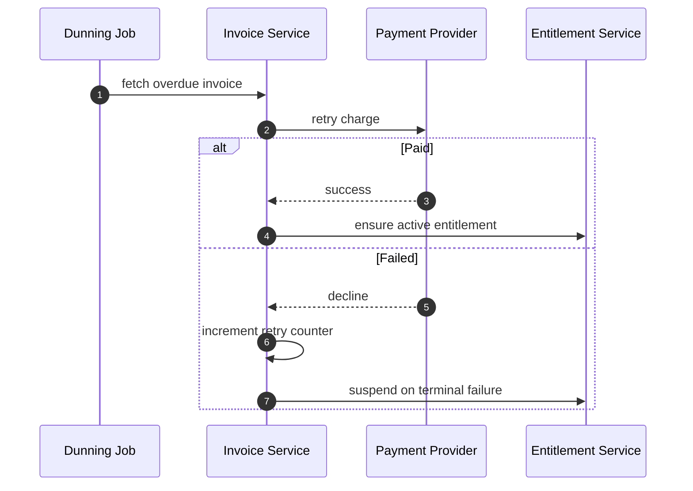

# Sequence Diagrams

## Checkout and Activation

```mermaid
sequenceDiagram
    autonumber
    participant C as Customer UI
    participant API as Billing API
    participant SUB as Subscription Service
    participant TAX as Tax Engine
    participant PSP as Payment Provider
    participant ENT as Entitlement Service

    C->>API: POST /v1/subscriptions
    API->>SUB: validate plan + account
    SUB->>TAX: calculate tax quote
    SUB->>PSP: authorize payment method
    alt Authorized
      SUB->>SUB: activate subscription
      SUB->>ENT: grant entitlements
      SUB-->>API: subscription active
      API-->>C: 201 Created
    else Failed
      SUB-->>API: payment failed
      API-->>C: 402 Payment Required
    end
```

## Invoice Collection Retry

```mermaid
sequenceDiagram
    autonumber
    participant Job as Dunning Job
    participant INV as Invoice Service
    participant PSP as Payment Provider
    participant ENT as Entitlement Service

    Job->>INV: fetch overdue invoice
    INV->>PSP: retry charge
    alt Paid
      PSP-->>INV: success
      INV->>ENT: ensure active entitlement
    else Failed
      PSP-->>INV: decline
      INV->>INV: increment retry counter
      INV->>ENT: suspend on terminal failure
    end
```
