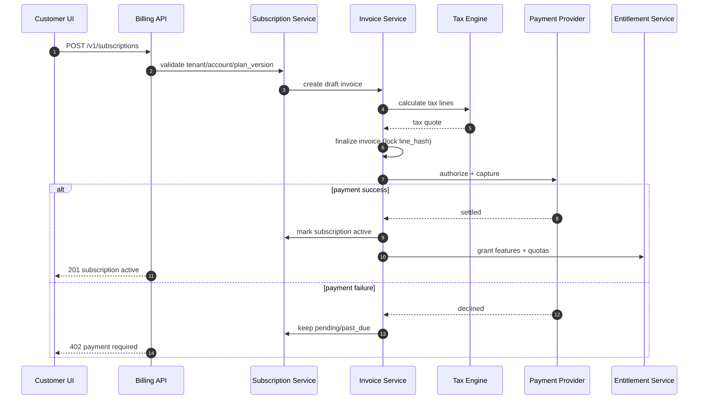
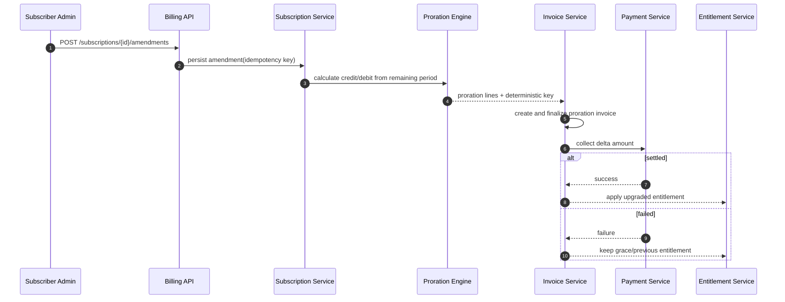
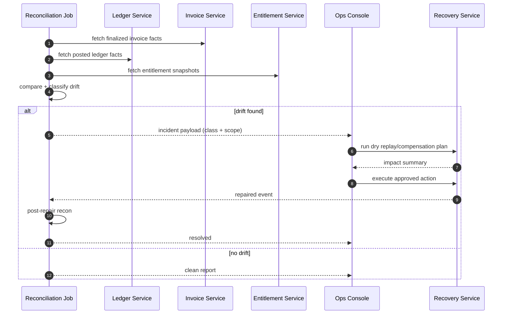
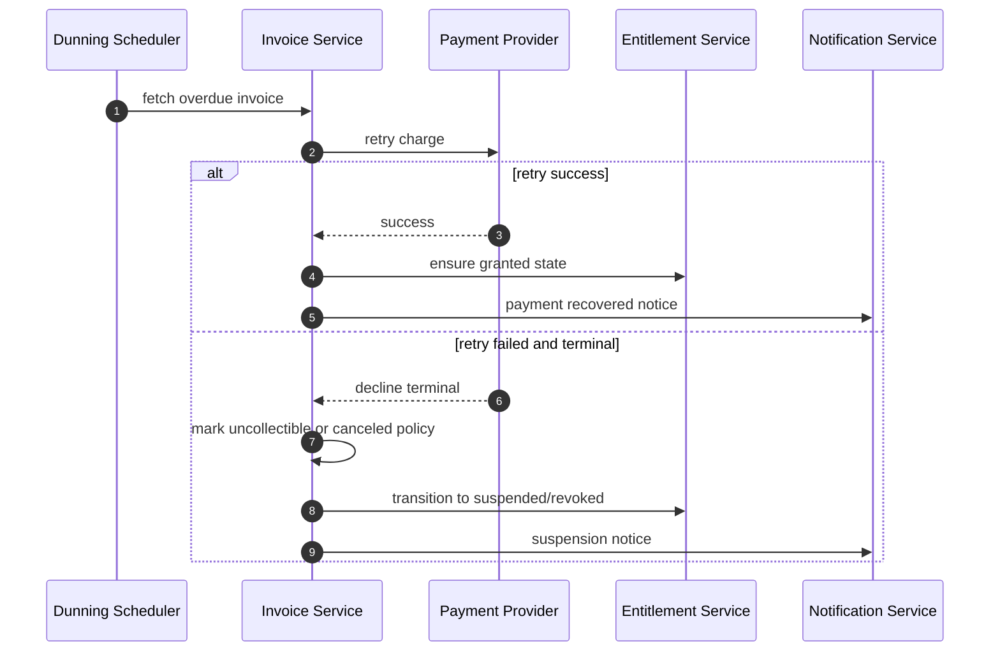

# Sequence Diagrams (Implementation Ready)

## 1. Checkout, Invoice Finalization, and Entitlement Activation

## 2. Mid-Cycle Upgrade with Proration

## 3. Reconciliation Drift to Repair Closure

## 4. Terminal Dunning and Entitlement Suspension

