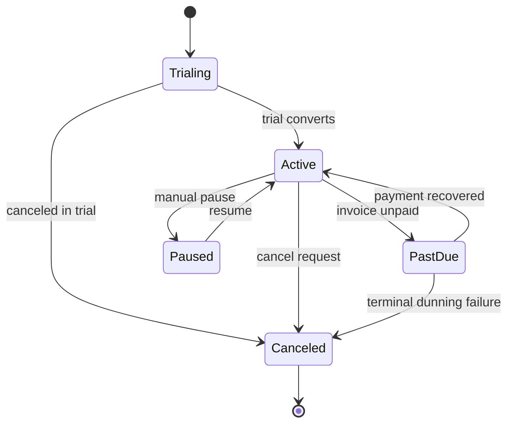
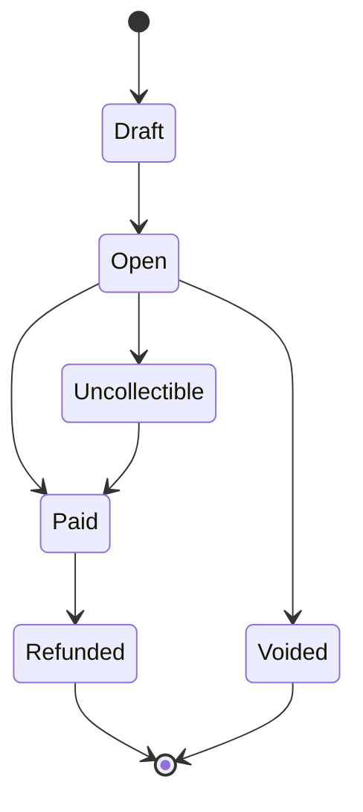
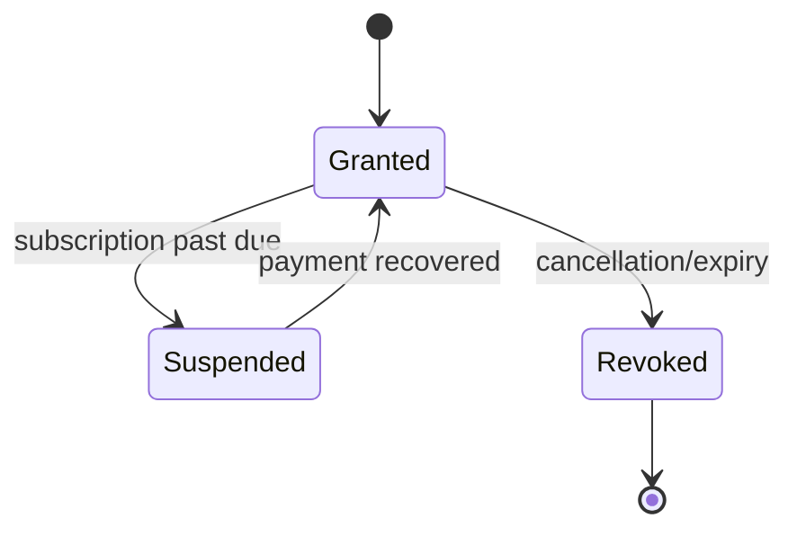

# State Machine Diagrams

## Subscription Lifecycle

```mermaid
stateDiagram-v2
    [*] --> Trialing
    Trialing --> Active: trial converts
    Trialing --> Canceled: canceled in trial
    Active --> PastDue: invoice unpaid
    PastDue --> Active: payment recovered
    Active --> Canceled: cancel request
    PastDue --> Canceled: terminal dunning failure
    Active --> Paused: manual pause
    Paused --> Active: resume
    Canceled --> [*]
```

## Invoice Lifecycle

```mermaid
stateDiagram-v2
    [*] --> Draft
    Draft --> Open
    Open --> Paid
    Open --> Uncollectible
    Open --> Voided
    Paid --> Refunded
    Uncollectible --> Paid
    Refunded --> [*]
    Voided --> [*]
```

## Entitlement Lifecycle

```mermaid
stateDiagram-v2
    [*] --> Granted
    Granted --> Suspended: subscription past due
    Suspended --> Granted: payment recovered
    Granted --> Revoked: cancellation/expiry
    Revoked --> [*]
```
