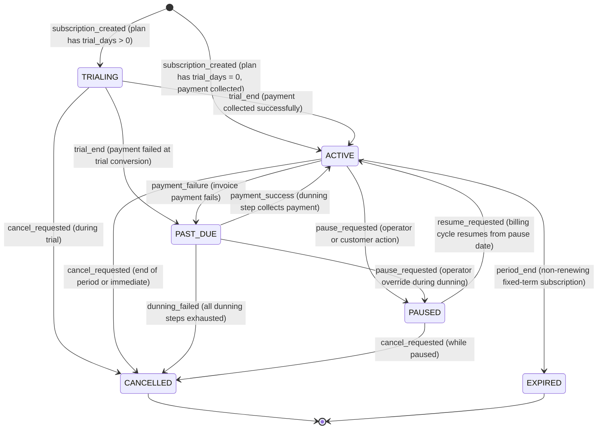

```mermaid
stateDiagram-v2
    [*] --> PENDING : attempt_created (payment service creates record before gateway call)

    PENDING --> PROCESSING : gateway_call_initiated (HTTP request sent to Stripe/Adyen)

    PROCESSING --> SUCCEEDED : gateway_response_success (charge confirmed)
    PROCESSING --> FAILED : gateway_response_failure (card declined / insufficient funds)
    PROCESSING --> PENDING : gateway_timeout (network error; attempt requeued with same idempotency key)

    SUCCEEDED --> REFUNDED : refund_request (operator issues full or partial refund)

    FAILED --> [*]
    REFUNDED --> [*]
    SUCCEEDED --> [*]
```

```mermaid
stateDiagram-v2
    [*] --> INITIATED : dunning_cycle_created (first payment failure detected)

    INITIATED --> STEP_1 : step_1_scheduled (immediate retry queued)

    STEP_1 --> RESOLVED : retry_succeeded (payment collected at step 1)
    STEP_1 --> STEP_2 : retry_failed (step 1 payment fails; next step scheduled in +3d)

    STEP_2 --> RESOLVED : retry_succeeded (payment collected at step 2)
    STEP_2 --> STEP_3 : retry_failed (step 2 payment fails; next step scheduled in +5d)

    STEP_3 --> RESOLVED : retry_succeeded (payment collected at step 3)
    STEP_3 --> STEP_4 : retry_failed (step 3 payment fails; next step scheduled in +7d)

    STEP_4 --> RESOLVED : retry_succeeded (payment collected at step 4)
    STEP_4 --> ABANDONED : max_retries_reached (step 4 payment fails)

    RESOLVED --> [*]
    ABANDONED --> [*]

    note right of INITIATED
        DunningCycle is linked to a specific
        Invoice and Subscription. Created
        atomically with Subscription status
        transition to PAST_DUE.
    end note

    note right of RESOLVED
        Subscription transitions PAST_DUE → ACTIVE.
        Entitlements restored to full capacity.
        Customer notified of successful payment.
    end note

    note right of ABANDONED
        Subscription transitions PAST_DUE → CANCELLED.
        All entitlements revoked immediately.
        Customer notified of cancellation.
    end note
```

# State Machine Diagrams — Subscription Billing and Entitlements Platform

## Overview

This document defines the lifecycle state machines for the four core entities in the platform: **Subscription**, **Invoice**, **PaymentAttempt**, and **DunningCycle**. Each diagram uses `mermaid stateDiagram-v2` syntax and is followed by a transition table and invariant rules enforced at the domain layer.

---

## 1. Subscription Lifecycle

### States

| State | Description |
|---|---|
| `TRIALING` | Subscription is within the free trial window. No payment is collected. |
| `ACTIVE` | Subscription is in good standing; invoices are paid or within grace period. |
| `PAST_DUE` | Most recent invoice has failed payment. Dunning campaign is active. |
| `PAUSED` | Customer or operator has paused the subscription; billing is suspended. |
| `CANCELLED` | Subscription has been terminated. No further billing occurs. |
| `EXPIRED` | Subscription reached its configured end date without renewal. |

### State Diagram



### Transition Rules

| From | To | Trigger | Side Effects |
|---|---|---|---|
| `[*]` | `TRIALING` | `subscription_created` | Set `trialEndDate = now + plan.trialDays`. No invoice generated. Entitlements provisioned. |
| `[*]` | `ACTIVE` | `subscription_created` | Generate first invoice. Collect payment. Provision entitlements. |
| `TRIALING` | `ACTIVE` | `trial_end` | Collect first recurring payment. Set `currentPeriodStart/End`. |
| `TRIALING` | `PAST_DUE` | `trial_end` (payment failed) | Initiate dunning cycle for the conversion invoice. |
| `TRIALING` | `CANCELLED` | `cancel_requested` | Set `cancelledAt`. Revoke entitlements. No invoice generated. |
| `ACTIVE` | `PAST_DUE` | `payment_failure` | Create `DunningCycle`. Degrade entitlements to hard-cap mode. |
| `ACTIVE` | `PAUSED` | `pause_requested` | Set `pausedAt`. Suspend billing cycle. Preserve entitlements at reduced capacity. |
| `ACTIVE` | `CANCELLED` | `cancel_requested` | Set `cancelledAt`. If immediate: revoke now. If EOP: revoke at `currentPeriodEnd`. |
| `ACTIVE` | `EXPIRED` | `period_end` | Revoke entitlements. Archive subscription record. |
| `PAST_DUE` | `ACTIVE` | `payment_success` | Resolve dunning cycle. Reset entitlements to full capacity. |
| `PAST_DUE` | `CANCELLED` | `dunning_failed` | Abandon dunning cycle. Revoke all entitlements immediately. |
| `PAUSED` | `ACTIVE` | `resume_requested` | Recalculate `currentPeriodEnd` from resume date. Generate new invoice if proration applies. |
| `PAUSED` | `CANCELLED` | `cancel_requested` | Set `cancelledAt`. Revoke entitlements. |

### Invariants

- A subscription in `CANCELLED` or `EXPIRED` state cannot be transitioned to any other state. Reactivation requires creating a new subscription.
- At most one active `DunningCycle` can exist per subscription at any time.
- A subscription cannot be paused if it is already in `PAST_DUE` unless via an explicit operator override.
- `trialEndDate` is only populated for subscriptions that enter `TRIALING` state.

---

## 2. Invoice Lifecycle

### States

| State | Description |
|---|---|
| `DRAFT` | Invoice is being assembled; line items can still be added or modified. |
| `OPEN` | Invoice has been submitted for review but not yet finalized. Tax calculation in progress. |
| `FINALIZED` | Invoice is locked. No further modifications are allowed. Payment collection begins. |
| `PAID` | Full payment has been collected. Invoice is closed. |
| `VOID` | Invoice has been cancelled. A credit note or reversal has been issued. |

### State Diagram

```mermaid
stateDiagram-v2
    [*] --> DRAFT : invoice_created (by billing engine at period end)

    DRAFT --> OPEN : finalize_initiated (billing engine submits for tax calculation)
    DRAFT --> VOID : void_requested (billing engine discards errored draft)

    OPEN --> FINALIZED : finalize_confirmed (tax calculated, invoice locked)
    OPEN --> VOID : void_requested (operator discards before finalization)

    FINALIZED --> PAID : payment_collected (payment attempt succeeds)
    FINALIZED --> VOID : void_requested (operator voids; credit note issued)

    PAID --> VOID : refund_applied (full refund; credit note issued to account)

    VOID --> [*]
    PAID --> [*]
```

### Transition Rules

| From | To | Trigger | Side Effects |
|---|---|---|---|
| `[*]` | `DRAFT` | `invoice_created` | Line items and discount applications added by billing engine. |
| `DRAFT` | `OPEN` | `finalize_initiated` | Invoice submitted to tax service. Modifications locked. |
| `DRAFT` | `VOID` | `void_requested` | Invoice permanently discarded. No financial record created. |
| `OPEN` | `FINALIZED` | `finalize_confirmed` | Tax line items applied. `finalizedAt` set. `amountDue` computed. Payment collection triggered. |
| `OPEN` | `VOID` | `void_requested` | Invoice cancelled before locking. |
| `FINALIZED` | `PAID` | `payment_collected` | `paidAt` set. Subscription `PAST_DUE` → `ACTIVE` if applicable. |
| `FINALIZED` | `VOID` | `void_requested` | `CreditNote` created. Credit applied to account if payment was partially collected. |
| `PAID` | `VOID` | `refund_applied` | Full refund issued. `CreditNote` created. Credit balance added to account. |

### Invariants

- A `FINALIZED` invoice is immutable. Its line items, subtotal, tax, and total cannot change.
- Only one invoice per subscription per billing period can be in `DRAFT` or `OPEN` state simultaneously.
- Voiding a `PAID` invoice requires a `CreditNote` to be created and applied before the status transition.
- `amountDue` is recalculated at transition to `FINALIZED` after credits and discounts are applied.

---

## 3. PaymentAttempt Lifecycle

### States

| State | Description |
|---|---|
| `PENDING` | Attempt has been created; gateway call not yet initiated. |
| `PROCESSING` | Gateway call is in flight; awaiting response. |
| `SUCCEEDED` | Gateway confirmed successful charge. |
| `FAILED` | Gateway rejected the charge or returned an error. |
| `REFUNDED` | Previously succeeded charge has been reversed (full or partial). |

### State Diagram



### Transition Rules

| From | To | Trigger | Side Effects |
|---|---|---|---|
| `[*]` | `PENDING` | `attempt_created` | `attemptId` generated. Idempotency key set. Invoice `amountDue` locked. |
| `PENDING` | `PROCESSING` | `gateway_call_initiated` | `attemptedAt` timestamp set. |
| `PROCESSING` | `SUCCEEDED` | `gateway_response_success` | `gatewayTransactionId` stored. Invoice transitioned to `PAID`. |
| `PROCESSING` | `FAILED` | `gateway_response_failure` | `failureCode` and `failureMessage` stored. Dunning service notified. |
| `PROCESSING` | `PENDING` | `gateway_timeout` | Attempt remains valid. Retry loop initiated with exponential backoff. |
| `SUCCEEDED` | `REFUNDED` | `refund_request` | Refund amount stored. `CreditNote` created. Invoice transitioned to `VOID` if full refund. |

### Gateway Timeout Handling

When a gateway call times out, the attempt returns to `PENDING` rather than `FAILED`. This is critical because a timeout does not confirm whether the charge was actually processed. The same `idempotencyKey` is reused on retry, causing the gateway to return the previously created charge result if it completed successfully on the first attempt. This prevents double-charging the customer.

### Invariants

- A `SUCCEEDED` attempt cannot be transitioned to `FAILED`. Only `REFUNDED` is a valid next state.
- A single invoice may have multiple `FAILED` attempts but exactly one `SUCCEEDED` attempt.
- `REFUNDED` attempts retain the original `gatewayTransactionId` alongside the refund transaction ID in `gatewayResponse`.
- The `PENDING → PROCESSING → PENDING` loop is bounded by a maximum of 3 gateway timeout retries per attempt before the attempt is marked `FAILED` with `failureCode: gateway_timeout`.

---

## 4. DunningCycle Lifecycle

### States

| State | Description |
|---|---|
| `INITIATED` | Cycle created after initial invoice payment failure. |
| `STEP_1` | First retry attempt has been scheduled or is in progress (day 0). |
| `STEP_2` | Second retry attempt scheduled (+3 days after step 1 failure). |
| `STEP_3` | Third retry attempt scheduled (+5 days after step 2 failure). |
| `STEP_4` | Fourth and final retry attempt scheduled (+7 days after step 3 failure). |
| `RESOLVED` | A retry attempt succeeded; invoice is paid. |
| `ABANDONED` | All retry attempts exhausted; subscription cancelled. |

### State Diagram



### Transition Rules

| From | To | Trigger | Side Effects |
|---|---|---|---|
| `[*]` | `INITIATED` | `dunning_cycle_created` | `startedAt` set. Subscription moves to `PAST_DUE`. Entitlements degraded. |
| `INITIATED` | `STEP_1` | `step_1_scheduled` | `DunningStep` record created with `scheduledAt = now`. |
| `STEP_1` | `RESOLVED` | `retry_succeeded` | Invoice marked `PAID`. Dunning cycle `resolvedAt` set. Subscription reactivated. |
| `STEP_1` | `STEP_2` | `retry_failed` | Step 1 result recorded as `FAILED`. Step 2 `DunningStep` created with `scheduledAt = now + 3d`. Customer emailed. |
| `STEP_2` | `RESOLVED` | `retry_succeeded` | Same as STEP_1 → RESOLVED. |
| `STEP_2` | `STEP_3` | `retry_failed` | Step 2 result recorded. Step 3 scheduled at `now + 5d`. Customer emailed. |
| `STEP_3` | `RESOLVED` | `retry_succeeded` | Same as STEP_1 → RESOLVED. |
| `STEP_3` | `STEP_4` | `retry_failed` | Step 3 result recorded. Step 4 scheduled at `now + 7d`. Final warning emailed to customer. |
| `STEP_4` | `RESOLVED` | `retry_succeeded` | Same as STEP_1 → RESOLVED. |
| `STEP_4` | `ABANDONED` | `max_retries_reached` | `resolvedAt` = null, cycle closed. Subscription cancelled. Entitlements revoked. Cancellation email sent. |

### Dunning Step Schedule

```
Day 0:   Payment fails → DunningCycle INITIATED → STEP_1 queued (immediate)
Day 0:   STEP_1 executes → fails → STEP_2 scheduled
Day 3:   STEP_2 executes → fails → STEP_3 scheduled
Day 8:   STEP_3 executes → fails → STEP_4 scheduled (FINAL WARNING email)
Day 15:  STEP_4 executes → fails → ABANDONED → subscription CANCELLED
```

Total dunning window: **15 days** from initial payment failure.

### Customer Notification Schedule

| Event | Notification Content |
|---|---|
| `INITIATED` | "Payment failed — we will retry automatically." |
| `STEP_2` scheduled | "First retry failed — we'll try again in 3 days." |
| `STEP_3` scheduled | "Second retry failed — please update your payment method." |
| `STEP_4` scheduled | "Final retry in 7 days — your subscription will be cancelled if payment fails." |
| `RESOLVED` | "Payment successful — your subscription is active." |
| `ABANDONED` | "Subscription cancelled due to non-payment." |

### Invariants

- `RESOLVED` and `ABANDONED` are terminal states. A new payment failure on the same subscription after resolution creates a new `DunningCycle`.
- The dunning cycle cannot be abandoned before reaching `STEP_4`, except via explicit operator override with a mandatory reason code.
- Each `DunningStep` has exactly one execution attempt. Gateway-level retries (for network errors) happen within the Payment Service and do not advance the step counter.
- `currentStep` on `DunningCycle` is always equal to the step number of the most recently created `DunningStep`.

---

## Cross-Entity State Dependencies

The following table captures how state transitions in one entity drive state transitions in another:

| Trigger Entity | Trigger Transition | Affected Entity | Resulting Transition |
|---|---|---|---|
| `Invoice` | `DRAFT → FINALIZED` | `Subscription` | Starts payment collection cycle |
| `PaymentAttempt` | `PROCESSING → SUCCEEDED` | `Invoice` | `FINALIZED → PAID` |
| `PaymentAttempt` | `PROCESSING → FAILED` | `DunningCycle` | `[*] → INITIATED` |
| `DunningCycle` | `STEP_N → RESOLVED` | `Subscription` | `PAST_DUE → ACTIVE` |
| `DunningCycle` | `STEP_4 → ABANDONED` | `Subscription` | `PAST_DUE → CANCELLED` |
| `Subscription` | `ACTIVE → PAST_DUE` | `Entitlement` | Soft-cap converts to hard-cap enforcement |
| `DunningCycle` | `STEP_N → RESOLVED` | `Entitlement` | Hard-cap reverted to plan-defined limits |
| `Subscription` | `PAST_DUE → CANCELLED` | `Entitlement` | All entitlements revoked |
