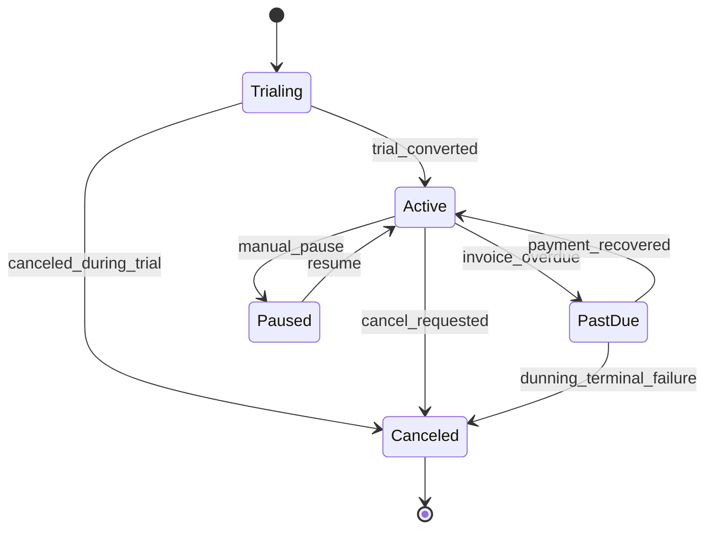
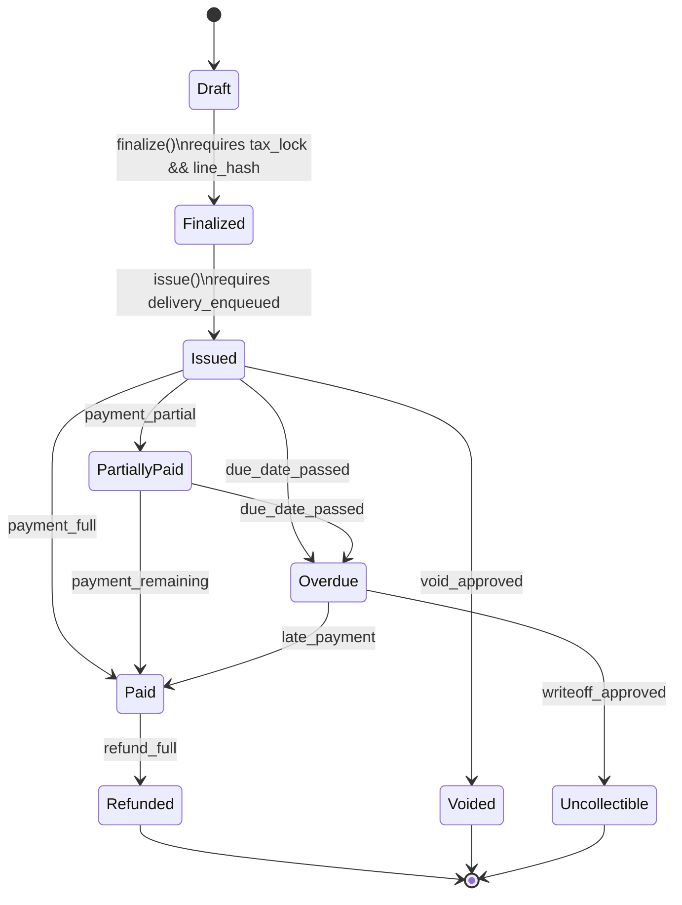
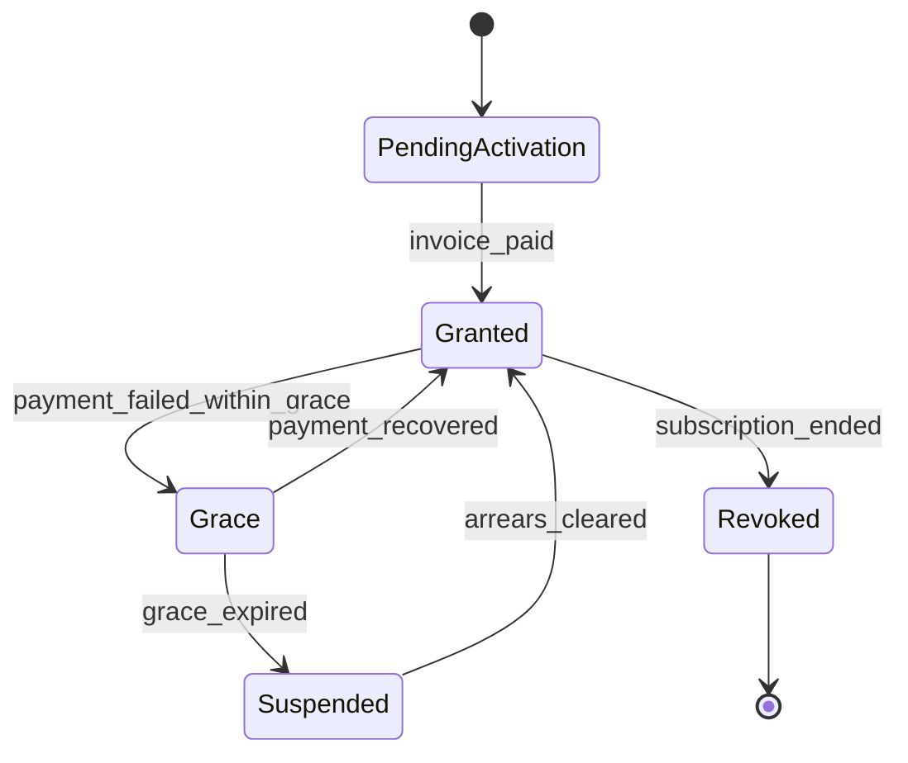
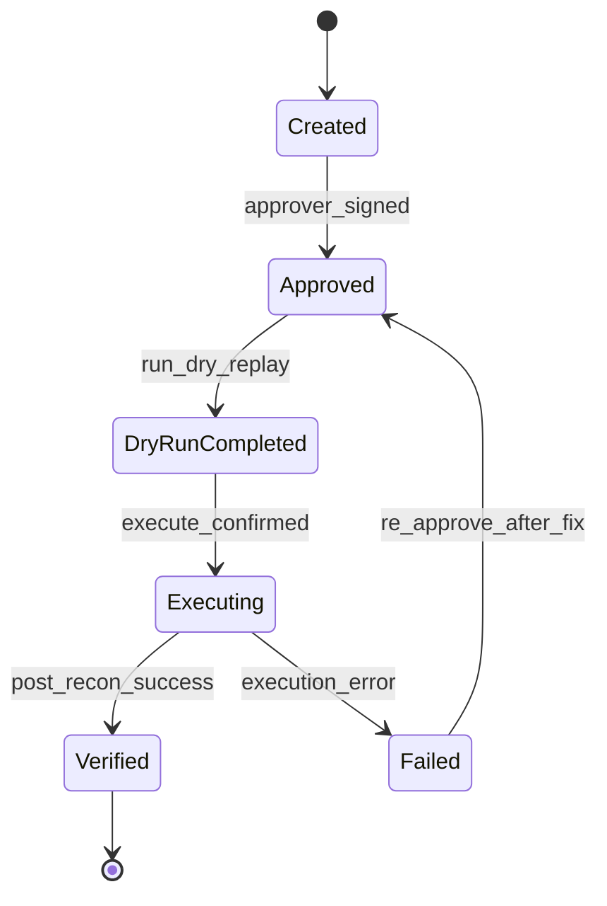

# State Machine Diagrams (Implementation Ready)

## 1. Subscription Lifecycle

## 2. Invoice Lifecycle with Guard Conditions

## 3. Entitlement Lifecycle with Grace Rules

## 4. Recovery Action Lifecycle

## 5. Transition Validation Rules
- Prohibit backward transitions that mutate settled financial truth.
- Require immutable transition log entry before state change commit.
- Couple transitions to side-effect dispatch only after persistence.
- Reject transitions without correlation ID for auditability.
