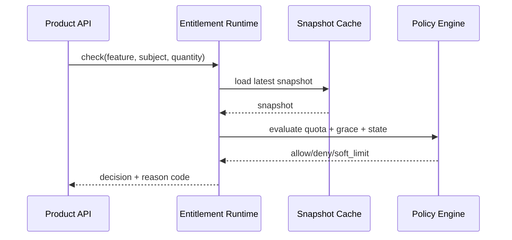

# Usage Metering and Entitlements (Implementation Ready)

## 1. Scope
Define ingestion, normalization, rating, and entitlement enforcement so usage-based billing and access control remain consistent under retries, delays, and corrections.

## 2. Metering Pipeline

```mermaid
flowchart LR
    Emit[Product emits usage event] --> Validate[Schema + auth validation]
    Validate --> Normalize[Normalize units/timezone]
    Normalize --> Dedup[Idempotency + duplicate detection]
    Dedup --> Persist[Append to usage ledger]
    Persist --> Rate[Apply price component versions]
    Rate --> InvoiceLines[Produce rated invoice lines]
    InvoiceLines --> ReconFeed[Feed reconciliation facts]
```


## 3. Event Shape (Minimum)
```json
{
  "event_id": "use_001",
  "tenant_id": "t_001",
  "subject_id": "acct_42",
  "metric_key": "api_calls",
  "quantity": 250,
  "occurred_at": "2026-03-28T11:00:00Z",
  "idempotency_key": "svcA-20260328-11-001",
  "correlation_id": "corr_123"
}
```

## 4. Rating Rules
- Resolve plan/version and active price component by event timestamp.
- Apply tiering or flat rates deterministically.
- Respect currency precision and configured rounding mode.
- Persist rating result with input checksum for replay verification.

## 5. Entitlement Decision Paths

### 5.1 Runtime Path (Hard Gate)


### 5.2 Projection Path (Control Plane)
- Billing/payment/subscription events update entitlement snapshots asynchronously.
- Projection lag SLO enforced via alert thresholds.
- Support tools read projection state, not runtime cache internals.

## 6. Correction and Backfill Strategy
- Late usage events are accepted with `occurred_at` semantics and rated into correction invoices or credit notes.
- Backfills require bounded windows and dry-run previews before write mode.
- Every backfill must generate a reconciliation report to validate convergence.

## 7. Failure Modes and Controls
| Failure Mode | Detection | Recovery |
|---|---|---|
| Duplicate usage events | idempotency-key collision metrics | ignore duplicate, retain audit record |
| Out-of-order usage batches | watermark lag monitor | hold window + reorder/replay |
| Entitlement stale snapshot | lag SLO breach alert | refresh snapshot + temporary grace |
| Rating mismatch after catalog update | drift in usage↔invoice recon | rerate + compensating adjustment |

## 8. Operational Readiness Checklist
- Metering ingestion supports replay without duplicate billing.
- Rating outputs can be recomputed from immutable inputs.
- Entitlement runtime can serve decisions within latency SLO under degraded conditions.
- Recon confirms usage, invoice, and entitlement agreement daily.
