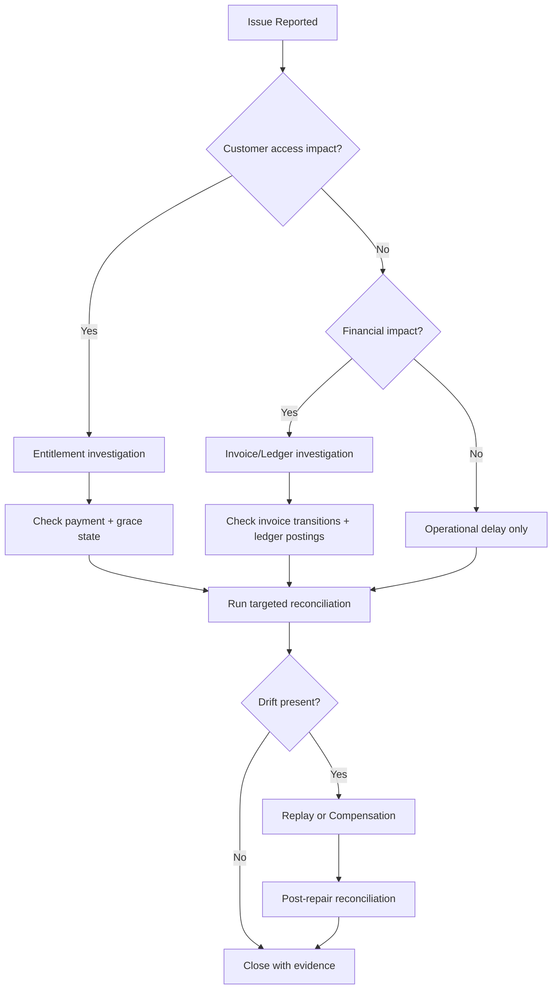

# Edge Cases - Subscription Billing and Entitlements Platform

This pack captures high-risk edge scenarios for Subscription Billing workflows.
Each document includes failure mode, detection, containment, recovery, and prevention guidance.

## Included Categories
- Domain-specific failure modes
- API/UI reliability concerns
- Security and compliance controls
- Operational incident and runbook procedures

## New Cross-Cutting Scenarios to Validate
- Plan version roll-forward/rollback during active billing cycles
- Invoice state transition race conditions (payment vs void/write-off)
- Proration determinism on repeated amendment retries
- Entitlement downgrade timing during dunning grace windows
- Reconciliation drift closure and post-repair verification

## Beginner Triage Flow
When an issue is reported, use this order:
1. Check if the issue is customer-access impact (entitlement) or money impact (invoice/ledger).
2. Determine whether data is wrong or only delayed.
3. Review reconciliation output for related correlation IDs.
4. Choose replay vs compensation based on whether financial artifacts were finalized.
5. Confirm closure with a post-repair reconciliation run.

## Triage Decision Diagram (Mermaid)

