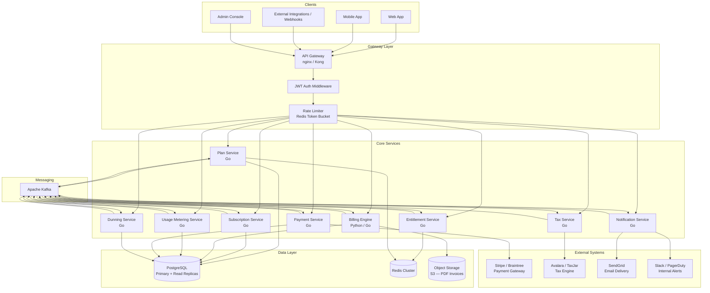

# Architecture Diagram — Subscription Billing and Entitlements Platform

## Overview

The Subscription Billing and Entitlements Platform is a cloud-native, microservices-based system designed to handle plan management, subscription lifecycle, metered usage, invoicing, payment processing, dunning, and entitlement enforcement at scale. It is built around domain-driven boundaries, event-driven communication, and a strong emphasis on idempotency and auditability.

---

## High-Level Architecture Diagram

---

## Service Descriptions

### 1. API Gateway (nginx / Kong)

**Purpose:** Single entry point for all client and integration traffic. Handles TLS termination, routing, JWT validation, rate limiting, and request tracing.

**Responsibilities:**
- Route requests to upstream microservices based on path and method
- Enforce authentication by validating JWT tokens (RS256, JWKS endpoint)
- Apply per-tenant and per-IP rate limiting using Redis token buckets
- Inject `X-Request-ID` and `X-Tenant-ID` headers for distributed tracing
- Strip internal headers before forwarding to services
- Enforce request payload size limits (default 1 MB)

**Technology Choices:**
- Kong Gateway (OSS) with custom Lua plugins for JWT validation
- Redis for rate limit counters
- Prometheus metrics exported via `/metrics` endpoint

**Scaling Strategy:**
- Stateless; horizontal scaling behind a cloud load balancer
- Kong's declarative config managed via Helm + GitOps pipeline

---

### 2. Plan Service

**Purpose:** Manages the product catalog — plans, pricing models, features, trial configurations, and plan versioning.

**Responsibilities:**
- CRUD operations for plans and pricing tiers
- Maintains plan version history (Draft → Published → Deprecated → Archived)
- Exposes plan lookup APIs used by the Subscription Service at checkout
- Publishes `plan.published` and `plan.deprecated` events to Kafka
- Validates plan configurations (e.g., minimum price, currency consistency)

**Technology Choices:** Go, PostgreSQL (plans, prices, features tables), Redis (plan catalog cache with 5-minute TTL)

**Scaling Strategy:** Mostly read-heavy; Redis caches plan catalog. Write path is low-volume. Single active instance with a standby is sufficient; cache invalidation on writes.

---

### 3. Subscription Service

**Purpose:** Manages the full lifecycle of customer subscriptions — creation, upgrades, downgrades, pauses, cancellations, and renewals.

**Responsibilities:**
- Create and validate subscriptions against plan rules
- Apply trial periods, proration logic on mid-cycle changes
- Emit `subscription.created`, `subscription.updated`, `subscription.cancelled` domain events
- Coordinate with the Entitlement Service to grant or revoke entitlements
- Maintain the subscription state machine (Trialing → Active → PastDue → Paused → Cancelled → Expired)
- Record every state transition with actor, timestamp, and reason for audit

**Technology Choices:** Go, PostgreSQL (subscriptions, subscription_line_items, entitlement_grants tables), Kafka

**Scaling Strategy:** Horizontally scalable; each instance is stateless. Database write contention avoided via optimistic locking on subscription rows (version column).

---

### 4. Usage Metering Service

**Purpose:** Ingests, validates, deduplicates, and aggregates usage events from customers. Feeds rated usage into the Billing Engine.

**Responsibilities:**
- Accept usage events via HTTP (SDK/API) and Kafka (webhook relay)
- Idempotent ingestion using `event_id` deduplication (Redis set with 24h TTL, then PostgreSQL)
- Aggregate raw events into metered counters (per subscription, per billing period)
- Expose usage query APIs for real-time customer dashboards
- Publish `usage.aggregated` events at the end of each billing period

**Technology Choices:** Go, PostgreSQL (usage_records, usage_aggregates), Redis (hot aggregation counters and dedup set), Kafka (event relay)

**Scaling Strategy:** High-throughput write path. Multiple instances behind the API Gateway. Redis counter increments are atomic. Kafka consumer group for event relay with partition-per-tenant where feasible.

---

### 5. Billing Engine

**Purpose:** Orchestrates the invoice generation pipeline — pulling usage data, applying pricing rules, calculating discounts, computing proration, and producing finalized invoices.

**Responsibilities:**
- Triggered by a billing scheduler (cron or Kafka `billing.cycle.due` event)
- Retrieve usage aggregates and fixed subscription charges for the period
- Apply coupon/discount logic and proration amounts for mid-cycle changes
- Request tax calculations from the Tax Service
- Assemble the invoice draft, validate line items, and finalize
- Publish `invoice.created` and `invoice.finalized` events
- Store finalized invoices and generate PDF via a templating engine (stored in S3)

**Technology Choices:** Python (for rich numeric/decimal arithmetic), PostgreSQL, S3 for PDF storage

**Scaling Strategy:** Jobs are parallelized per subscription cohort (by billing anchor date). Work queue pattern: Kafka topic partitioned by `account_id` ensures one worker per account at a time.

---

### 6. Payment Service

**Purpose:** Handles all interactions with external payment gateways — charging stored payment methods, processing refunds, and recording payment outcomes.

**Responsibilities:**
- Receive `invoice.finalized` events and initiate charge attempts
- Communicate with Stripe (primary) or Braintree (fallback) via their SDKs
- Persist all payment intents and outcomes with gateway reference IDs
- Emit `payment.succeeded`, `payment.failed`, `payment.refunded` events
- Enforce idempotency on all gateway calls using `idempotency_key` headers
- Support manual charge override via admin APIs

**Technology Choices:** Go, PostgreSQL (payments, payment_methods tables), Stripe SDK

**Scaling Strategy:** Stateless; horizontally scalable. Circuit breaker around Stripe API calls (exponential backoff, max 3 retries). Separate worker pool for refund processing to avoid head-of-line blocking.

---

### 7. Dunning Service

**Purpose:** Manages the retry and grace-period workflow after a payment failure, applying configurable retry schedules and ultimately suspending or cancelling subscriptions.

**Responsibilities:**
- Consume `payment.failed` events and start a dunning cycle
- Apply the dunning schedule (Day 1, Day 3, Day 7, Day 14 retries)
- Track attempts, outcomes, and the current dunning state per subscription
- Publish `dunning.retry.scheduled`, `dunning.grace_period.started`, `dunning.completed` events
- Coordinate with Entitlement Service to restrict access during grace period
- Coordinate with Subscription Service to cancel if all retries exhaust

**Technology Choices:** Go, PostgreSQL (dunning_cycles, dunning_attempts tables), Kafka

**Scaling Strategy:** Cron-scheduled retry dispatcher runs as a singleton with leader election (via PostgreSQL advisory lock) to avoid duplicate retries.

---

### 8. Entitlement Service

**Purpose:** Enforces feature access and usage limits in real time, acting as the authoritative source of truth for what a subscriber is allowed to do.

**Responsibilities:**
- Maintain entitlement grants per subscription (features, usage limits, quotas)
- Expose a low-latency `check` API (`GET /entitlements/{account_id}/{feature_key}`)
- Write entitlement state to Redis for sub-millisecond read performance
- Consume `subscription.created`, `subscription.updated`, `subscription.cancelled` events to grant/revoke
- Support entitlement overrides (manual grants via admin console)
- Publish `entitlement.granted` and `entitlement.revoked` events

**Technology Choices:** Go, Redis (primary entitlement store — hash per account), PostgreSQL (audit trail, overrides)

**Scaling Strategy:** Reads served entirely from Redis (hot path). Writes triggered by Kafka events. Redis Cluster for horizontal scaling of the cache layer.

---

### 9. Tax Service

**Purpose:** Calculates applicable tax amounts for invoices based on customer jurisdiction, product tax codes, and applicable exemptions.

**Responsibilities:**
- Accept a tax calculation request with line items, customer address, and product codes
- Integrate with Avalara AvaTax (primary) or TaxJar (fallback) for jurisdiction-aware tax rates
- Cache tax rate lookups by jurisdiction + product code (Redis, 1-hour TTL)
- Return an itemized tax breakdown per line item
- Handle tax exemption certificates stored against customer accounts

**Technology Choices:** Go, Avalara SDK, Redis (rate cache), PostgreSQL (exemption certificates, tax audit log)

**Scaling Strategy:** Mostly stateless request-response. Caching reduces external API calls by ~80% for repeat billing runs. Rate limit compliance with Avalara enforced via client-side throttling.

---

### 10. Notification Service

**Purpose:** Delivers transactional notifications to customers and internal teams across multiple channels (email, in-app, webhook, Slack).

**Responsibilities:**
- Consume domain events from Kafka (subscription events, payment events, invoice events)
- Render notifications from versioned templates (Handlebars/Jinja2)
- Deliver via SendGrid (email), internal WebSocket push (in-app), or Slack webhook (ops alerts)
- Track delivery status and retry on failure (exponential backoff, dead-letter queue)
- Respect customer communication preferences and unsubscribe lists

**Technology Choices:** Go, SendGrid API, PostgreSQL (notification log, preferences), Kafka

**Scaling Strategy:** Kafka consumer group with multiple instances. Delivery is idempotent using a `notification_id` tracked per recipient + event combination.

---

## Cross-Cutting Concerns

### Authentication and Authorization

All API requests carry a JWT (RS256) issued by the Identity Platform. The API Gateway validates the token signature against the JWKS endpoint. Claims include:
- `sub`: Account or user identifier
- `tenant_id`: Multi-tenant isolation key
- `roles`: Array of granted roles (e.g., `billing:read`, `billing:admin`)
- `exp`: Token expiry (15-minute access tokens, 7-day refresh tokens)

Service-to-service calls use short-lived machine JWTs issued by the internal IdP. mTLS is enforced on the service mesh (Istio) for all east-west traffic.

### Rate Limiting

Implemented in the API Gateway using a Redis token bucket per `(tenant_id, endpoint)` pair:
- Default: 1000 requests/minute per tenant
- Usage ingestion endpoint: 10,000 events/minute per tenant
- Admin endpoints: 100 requests/minute per user

Responses include `X-RateLimit-Limit`, `X-RateLimit-Remaining`, and `X-RateLimit-Reset` headers. Requests exceeding the limit receive HTTP 429 with a `Retry-After` header.

### Idempotency

All mutating API endpoints accept an `Idempotency-Key` header (UUID v4). The API Gateway or the target service stores the key → response mapping in Redis with a 24-hour TTL. Duplicate requests within the window return the cached response without re-executing the operation.

Payment Service enforces idempotency at the gateway call level by passing the `Idempotency-Key` through to Stripe, preventing double charges.

### Circuit Breakers

External calls (Stripe, Avalara, SendGrid) are wrapped with circuit breakers (Go `sony/gobreaker` or Resilience4j equivalent):
- **Closed → Open:** 5 consecutive failures within 10 seconds
- **Open → Half-Open:** After 30-second cooldown, allow 1 probe request
- **Half-Open → Closed:** Probe succeeds; resume normal traffic
- **Half-Open → Open:** Probe fails; restart cooldown

Fallback behavior: Tax Service uses cached rates; Payment Service queues retries; Notification Service writes to a dead-letter queue for later delivery.

### Distributed Tracing

Every request carries `X-Request-ID` and `X-Trace-ID` (OpenTelemetry `traceparent` format). All services emit traces to Jaeger via the OTLP exporter. Spans include service name, operation, `tenant_id`, and key attributes (subscription_id, invoice_id).

---

## Kafka Topology

### Topics and Partitioning

| Topic | Partitions | Partition Key | Consumers |
|---|---|---|---|
| `billing.events` | 32 | `account_id` | Billing Engine, Notification Service |
| `usage.events` | 64 | `subscription_id` | Usage Metering Service |
| `payment.events` | 32 | `account_id` | Dunning Service, Notification Service |
| `subscription.events` | 32 | `account_id` | Entitlement Service, Notification Service |
| `plan.events` | 8 | `plan_id` | Subscription Service, Entitlement Service |
| `dunning.events` | 16 | `subscription_id` | Dunning Service, Notification Service |
| `invoice.events` | 32 | `account_id` | Payment Service, Notification Service |

### Key Events

- `subscription.created`, `subscription.updated`, `subscription.cancelled`, `subscription.paused`
- `usage.ingested`, `usage.aggregated`, `usage.period_closed`
- `billing.cycle.due`, `invoice.drafted`, `invoice.finalized`
- `payment.attempted`, `payment.succeeded`, `payment.failed`, `payment.refunded`
- `dunning.started`, `dunning.retry.scheduled`, `dunning.grace_period.started`, `dunning.completed`
- `entitlement.granted`, `entitlement.revoked`, `entitlement.limit_exceeded`

### Retention and Replay

All topics retain messages for 14 days. Compacted topics (`plan.events`) retain the last value per key indefinitely for bootstrap on new consumer startup. Dead-letter topics (e.g., `billing.events.dlq`) capture messages that fail processing after 3 attempts, with full error context attached as a header.

---

## Cache Strategy (Redis)

| Cache Key Pattern | TTL | Purpose |
|---|---|---|
| `plan:{plan_id}:v{version}` | 5 min | Plan catalog — invalidated on publish/deprecate |
| `entitlement:{account_id}` | No expiry (event-driven invalidation) | Live entitlement hash per account |
| `rate_limit:{tenant_id}:{endpoint}` | 60 sec | Token bucket counters |
| `idempotency:{key}` | 24 hours | Idempotent request cache |
| `tax_rate:{jurisdiction}:{product_code}` | 1 hour | External tax rate cache |
| `usage_counter:{subscription_id}:{period}` | Until period close | Real-time usage accumulator |
| `dedup:{event_id}` | 24 hours | Usage event deduplication |

Redis is deployed as a 3-node cluster (1 primary + 2 replicas per shard) with 6 shards. Sentinel provides automatic failover with a 10-second detection window. All cached values are JSON-serialized with the schema version embedded.

---

## Database Strategy (PostgreSQL)

### Topology

- **Primary:** Handles all writes and latency-sensitive reads
- **Read Replicas (×2):** Handle read-heavy workloads (reporting queries, usage dashboards, admin console)
- **Connection Pooling:** PgBouncer in transaction mode, pool size 25 per service instance
- **Max Connections:** 200 on primary (across all poolers)

### Key Design Decisions

- **Optimistic Locking:** Subscriptions and invoices carry a `version` integer column incremented on every update. Concurrent modifications raise a conflict error, which callers retry with backoff.
- **Soft Deletes:** No hard deletes on financial records (subscriptions, invoices, payments). Rows carry `deleted_at` timestamps and are excluded from queries via a `WHERE deleted_at IS NULL` convention, enforced by partial indexes.
- **Tenant Isolation:** All tables carry a `tenant_id` UUID column. Row-level security (RLS) policies enforce isolation at the database level for multi-tenant deployments.
- **Partitioning:** `usage_records` and `payment_audit_log` are range-partitioned by month. Partitions older than 24 months are moved to cold storage (S3 via `pg_partman` + foreign data wrapper).
- **Schema Migrations:** Managed by Flyway. All migrations are backward-compatible (add-only for columns; separate cleanup migrations after traffic cutover).

### Indexing Strategy

- B-tree indexes on all foreign keys and `(tenant_id, created_at)` for common filtering patterns
- Partial indexes on active/non-deleted rows (e.g., `WHERE status = 'active' AND deleted_at IS NULL`)
- GIN indexes on JSONB columns (plan metadata, entitlement feature flags)
- BRIN indexes on append-only tables (`usage_records`, `audit_log`) for efficient range scans
