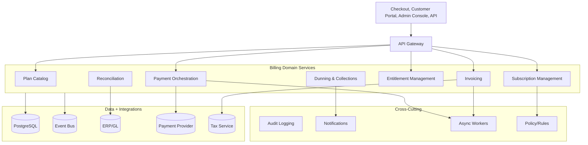

# Architecture Diagram

```mermaid
flowchart TB
    Channels[Checkout, Customer Portal, Admin Console, API] --> Edge[API Gateway]

    subgraph Services[Billing Domain Services]
      Catalog[Plan Catalog]
      Subscription[Subscription Management]
      Billing[Invoicing]
      Payment[Payment Orchestration]
      Entitlement[Entitlement Management]
      Dunning[Dunning & Collections]
      Reconciliation[Reconciliation]
    end

    Edge --> Catalog
    Edge --> Subscription
    Edge --> Billing
    Edge --> Payment
    Edge --> Entitlement

    subgraph CrossCutting[Cross-Cutting]
      Audit[Audit Logging]
      Notify[Notifications]
      Jobs[Async Workers]
      Policy[Policy/Rules]
    end

    Billing --> Jobs
    Payment --> Jobs
    Dunning --> Notify
    Subscription --> Policy

    subgraph DataInfra[Data + Integrations]
      DB[(PostgreSQL)]
      Bus[(Event Bus)]
      ERP[(ERP/GL)]
      PSP[(Payment Provider)]
      Tax[(Tax Service)]
    end

    Services --> DB
    Services --> Bus
    Payment --> PSP
    Billing --> Tax
    Reconciliation --> ERP
```
