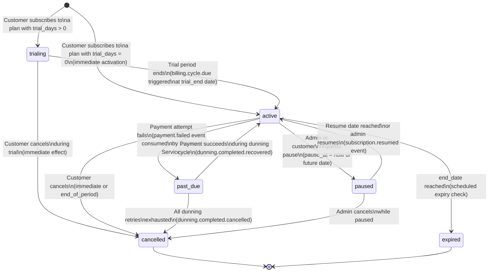
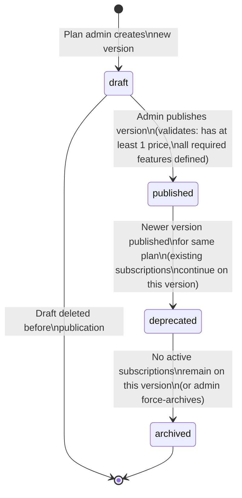

# Billing Lifecycle and Versioning — Subscription Billing and Entitlements Platform

## Overview

This document provides a deep-dive into four operational domains that govern the correctness and predictability of the billing platform: the subscription lifecycle state machine, plan version management, billing cycle mechanics, and revenue recognition. These topics directly affect data integrity, financial accuracy, and regulatory compliance.

---

## 1. Subscription Lifecycle

A subscription moves through a defined set of states, driven by explicit system actions and external events. Every transition is recorded in the `subscription_state_history` table with the actor ID, reason, and timestamp, providing a complete audit trail.

### State Definitions

| State | Description |
|---|---|
| `trialing` | Subscription is in a free trial period. Entitlements are active. No billing until trial ends. |
| `active` | Subscription is in good standing. Billing runs on the anchor date each cycle. Full entitlements active. |
| `past_due` | Latest invoice is unpaid. A dunning cycle is active. Entitlements may be partially restricted in grace period. |
| `paused` | Subscription is suspended. No billing. Entitlements are inactive. A resume date may be set. |
| `cancelled` | Subscription is permanently ended. No further billing. Entitlements revoked. Cannot be reactivated (a new subscription must be created). |
| `expired` | Subscription reached its defined end date (common for fixed-term contracts). System-driven cancellation with no action required. |

### State Diagram



### Transition Details and Business Rules

#### `[*] → trialing`

**Trigger:** Customer creates a subscription for a plan version with `trial_days > 0`.

**Actions:**
1. Set `status = trialing`, `trial_start = now()`, `trial_end = now() + trial_days`
2. Set `current_period_start = trial_end`, `current_period_end = trial_end + billing_interval`
3. Grant entitlements based on plan features (full access during trial)
4. Schedule a `billing.cycle.due` event for `trial_end` date
5. Validate: account must not have a prior trial for this plan (anti-abuse rule, configurable per tenant)
6. Send welcome + trial start email

**No payment method is required at trial start** (configurable — tenants may require a card on file).

#### `trialing → active`

**Trigger:** The billing scheduler fires a `billing.cycle.due` event at `trial_end`.

**Actions:**
1. Billing Engine generates the first invoice for the new billing period
2. Subscription status transitions to `active` after the first payment succeeds (or immediately if the plan has a zero-cost base)
3. If no payment method is on file, subscription transitions to `past_due` immediately, triggering the dunning flow

#### `active → past_due`

**Trigger:** `payment.failed` event with `attempt_count = 1`.

**Actions:**
1. `status = past_due`, `past_due_since = now()`
2. Dunning Service creates a `dunning_cycle` record
3. Notification Service sends payment failure email with update link

**Note:** Entitlements remain fully active when transitioning to `past_due`. Restrictions only begin at the grace period stage of dunning (Day 7 retry).

#### `past_due → active` (Recovery)

**Trigger:** `dunning.completed.recovered` event (payment succeeded during dunning cycle).

**Actions:**
1. `status = active`, clear `past_due_since`
2. Dunning cycle resolved as `recovered`
3. Entitlement restrictions removed
4. Next billing cycle scheduled from the current `current_period_end`

#### `active → paused`

**Trigger:** Customer or admin requests pause via API or Admin Console.

**Conditions:** Pausing is only allowed for plans that have `pausable = true` in the plan version configuration. Minimum pause duration and maximum cumulative pause per year may be configured per plan.

**Actions:**
1. `status = paused`, `paused_at = now()`, `resume_at = (requested resume date or NULL)`
2. Billing suspended — no `billing.cycle.due` events fired during pause
3. Entitlements revoked (customer loses product access during pause)
4. Current period is preserved — billing resumes from `current_period_end` at resume time (the pause does not extend the billing period by default; this is configurable)

#### `paused → active`

**Trigger:** `resume_at` date reached (scheduler) or explicit admin resume action.

**Actions:**
1. `status = active`, clear `paused_at` and `resume_at`
2. Re-grant entitlements from plan features
3. If pause extended beyond `current_period_end`: advance `current_period_start` and `current_period_end` to the new cycle starting from resume date (if tenant configures "resume resets billing anchor")

#### `active → cancelled`

**Trigger:** Customer cancellation request or admin cancellation.

**Cancellation Effects:**

| Effect | `ended_at` | Billing | Entitlements |
|---|---|---|---|
| `immediate` | `now()` | Proration credit for unused days issued | Revoked immediately |
| `end_of_period` | `current_period_end` | No credit; subscription runs to period end | Active until `ended_at` |

**Actions (immediate):**
1. `status = cancelled`, `cancelled_at = now()`, `ended_at = now()`
2. Generate a credit note for the unused portion of the current period
3. Revoke all entitlements
4. Publish `subscription.cancelled` event

**Actions (end_of_period):**
1. `status = active` (remains active until period end), `cancelled_at = now()`, `ended_at = current_period_end`
2. Suppress next billing cycle generation
3. Entitlements remain active until `ended_at`
4. On reaching `ended_at`, a final transition job sets `status = cancelled`

---

## 2. Plan Version Management

### Why Versions Exist

Plan versioning solves three critical problems:

1. **Audit Trail:** Every pricing decision is immutable. What a customer was charged at any point in time can be reproduced by replaying the plan version pinned to their subscription.
2. **Grandfathering:** When pricing changes, existing subscribers keep the old pricing until they explicitly migrate or the plan is archived. New subscribers get the new pricing.
3. **Coordinated Releases:** New pricing can be prepared and reviewed in `Draft` state before being activated for new subscriptions without affecting existing ones.

### Version Lifecycle



### Version States

| State | New Subscriptions | Existing Subscriptions | Editable |
|---|---|---|---|
| `draft` | Not available | N/A | Yes — full edits allowed |
| `published` | Available for new signups | Continue normally | No — immutable |
| `deprecated` | Not available | Continue on this version | No — immutable |
| `archived` | Not available | Migration required or force-cancelled | No — immutable |

### Immutability Enforcement

Once a plan version transitions to `published`, the following fields are locked:

- All `Price` records (amount, currency, pricing model, tiers, billing interval)
- All `Feature` records (key, type, limit values)
- `trial_days`
- `billing_interval` and `interval_count`

Attempts to modify these fields via the API return HTTP 409 Conflict with the error `plan_version_immutable`. The only way to change pricing or features is to create a new version.

**Mutable even in `published` state:** Display name, description, marketing copy fields (these do not affect billing behavior).

### How Subscriptions Pin to Versions

When a subscription is created, the Subscription Service records `plan_version_id` (pointing to the specific, immutable version, not just the plan). This pin persists through renewals.

```
subscription.plan_version_id → plan_versions.id (immutable reference)
```

When generating an invoice, the Billing Engine reads prices from `plan_versions.prices` using `subscription.plan_version_id`. This ensures that a price change (new version) never retroactively affects an existing subscription's invoice.

### Migration Mechanics

When a customer or admin upgrades or downgrades a subscription to a new plan version:

1. **Scheduled Migration (end_of_period):** The current `plan_version_id` is preserved for the remainder of the billing period. At the next renewal, the subscription's `plan_version_id` is updated to the new version. No proration.

2. **Immediate Migration (mid-cycle):** The `plan_version_id` is updated immediately. The `ProrationCalculator` computes:
   - Credit for the unused days on the old version's price
   - Charge for the remaining days on the new version's price
   - The net proration appears as a `InvoiceLineItem` on the next invoice (or immediately on a mid-cycle invoice if `proration_behavior = invoice_now` is configured)

3. **Bulk Migration (tenant-driven):** When a tenant wants to move all grandfathered subscribers to a new version (e.g., enforcing a mandatory price increase), a migration job runs:
   - Reads all active subscriptions on the deprecated version
   - Creates migration records in `subscription_plan_migrations` table
   - Sends advance notice emails (configurable lead time, default 30 days)
   - On the migration effective date, updates `plan_version_id` in batch

---

## 3. Billing Cycle Management

### Monthly vs Annual Cycles

Subscriptions use a `billing_interval` field that specifies the cycle length:

| Interval | interval_count | Description |
|---|---|---|
| `month` | 1 | Standard monthly billing |
| `month` | 3 | Quarterly billing |
| `month` | 6 | Semi-annual billing |
| `year` | 1 | Annual billing (often with a discount vs monthly) |

For annual subscriptions, a single invoice is generated at the start of the period covering the full year. Deferred revenue is recognized monthly (see Revenue Recognition section).

### Billing Anchor Dates

The **billing anchor date** is the day-of-month (or day-of-year for annual) on which the billing cycle starts. It is set at subscription creation time to `now()` (the signup date) and never changes unless the customer explicitly requests a billing anchor shift.

```
Example:
  Signup date: March 15th
  Billing anchor: 15th of each month
  Periods: March 15 → April 15, April 15 → May 15, ...
```

The anchor date is stored as `billing_anchor_day` (integer 1–28) on the subscription. Day 29, 30, and 31 are normalized to 28 to avoid February edge cases (see below).

### Cycle Boundary Calculations

The Billing Engine computes period boundaries using the following algorithm:

```
function computeNextPeriodEnd(currentPeriodStart, interval, intervalCount, anchorDay):
  if interval == 'month':
    targetMonth = currentPeriodStart.month + intervalCount
    targetYear = currentPeriodStart.year + floor(targetMonth / 12)
    targetMonth = targetMonth % 12
    lastDayOfTargetMonth = daysInMonth(targetYear, targetMonth)
    targetDay = min(anchorDay, lastDayOfTargetMonth)
    return Date(targetYear, targetMonth, targetDay) at 00:00:00 UTC
  if interval == 'year':
    return Date(currentPeriodStart.year + intervalCount,
                currentPeriodStart.month,
                min(anchorDay, daysInMonth(currentPeriodStart.year + intervalCount,
                                           currentPeriodStart.month)))
```

All period boundaries are stored and computed in **UTC**. Display to customers may be localized, but all billing decisions use UTC timestamps to prevent DST-related double-billing or gaps.

### Handling February Edge Cases

February has 28 days (29 in leap years). Subscriptions anchored on day 29, 30, or 31 must handle this gracefully.

**Resolution:** The billing anchor is stored as the intended day (e.g., 31), but period boundaries are computed using `min(anchor_day, days_in_month(year, month))`. This means:

- A subscription anchored on the 31st bills on: Jan 31, Feb 28 (or 29), Mar 31, Apr 30, ...
- The anchor "snaps" to the last day of the month when the month is shorter
- The anchor does not permanently shift — March still bills on the 31st, not the 28th

```
Example:
  Anchor day: 31
  Jan 31 → Feb 28 (snap to last day, 28-day Feb)
  Feb 28 → Mar 31 (anchor restored)
  Mar 31 → Apr 30 (snap to last day, 30-day April)
  Apr 30 → May 31 (anchor restored)
```

This behavior is predictable, well-documented in customer-facing billing terms, and validated by integration tests covering all 12 months including leap year February.

### Pro-Rating on Mid-Cycle Changes

When a plan change, seat addition, or cancellation occurs mid-cycle, the platform computes a prorated charge or credit:

**Formula:**
```
proration_amount = full_period_price × (remaining_days / total_days_in_period)
```

**Rounding:** Proration amounts are rounded to 2 decimal places using banker's rounding (round half to even) to minimize systematic rounding bias across large volumes of invoices.

**Proration Behavior (configurable per tenant):**

| Behavior | Description |
|---|---|
| `create_prorations` | Calculate proration and add as a pending credit/charge on the next invoice |
| `invoice_now` | Generate a new invoice immediately containing the proration items |
| `none` | No proration — full charge at next cycle start, no credit for downgrade |

**Upgrade Proration Example:**
```
Current plan: $100/month, $3.33/day
Upgrade on Day 10 of a 31-day period (21 remaining days)
Old plan credit: $3.33 × 21 = $69.93
New plan ($200/month, $6.45/day) charge: $6.45 × 21 = $135.48
Net proration: $135.48 - $69.93 = $65.55 due immediately
```

---

## 4. Revenue Recognition

### Deferred Revenue Tracking

When a customer pays for an annual subscription upfront, the entire payment is received in a single transaction, but revenue is earned ratably over the 12-month service period (ASC 606 / IFRS 15 compliance).

The platform tracks this via a `deferred_revenue_schedule` table:

```sql
CREATE TABLE deferred_revenue_schedule (
    id              UUID PRIMARY KEY,
    invoice_id      UUID NOT NULL REFERENCES invoices(id),
    subscription_id UUID NOT NULL REFERENCES subscriptions(id),
    total_amount    NUMERIC(14,2) NOT NULL,
    currency        CHAR(3) NOT NULL,
    period_start    DATE NOT NULL,
    recognition_periods JSONB NOT NULL,  -- [{month, amount, recognized: bool}]
    created_at      TIMESTAMPTZ NOT NULL DEFAULT now()
);
```

Each `recognition_periods` entry represents one month of revenue to recognize. At the start of each month, a recognition job marks the month's amount as recognized and records it in the `revenue_recognition_log` table.

### Monthly Recognition for Annual Prepaid Subscriptions

**Example:** Annual plan at $1,200/year, billed January 1.

| Month | Recognized Revenue | Deferred Balance |
|---|---|---|
| January | $100.00 | $1,100.00 |
| February | $100.00 | $1,000.00 |
| March | $100.00 | $900.00 |
| ... | $100.00 | ... |
| December | $100.00 | $0.00 |

If a subscription is cancelled mid-year, the remaining deferred balance is either:
- **Refunded:** Recognized as a refund liability; remaining months set to `$0 recognized`
- **Non-refundable:** Recognized immediately as accelerated revenue (based on the subscription's cancellation policy)

The recognition schedule is recomputed on:
- Plan upgrades or downgrades (new schedule from change date)
- Proration credits applied to the invoice
- Partial refunds

### ASC 606 Compliance Considerations

The platform is designed to support the five-step revenue recognition model of ASC 606:

**Step 1 — Identify the contract:** Each subscription agreement maps to a contract. The `Subscription` entity represents the contract; `SubscriptionLineItem` records represent distinct performance obligations.

**Step 2 — Identify performance obligations:** Each plan feature or service tier constitutes a separate performance obligation. The plan version's `Feature` records define the obligations.

**Step 3 — Determine the transaction price:** The transaction price is the `Invoice.total` after discounts, credits, and variable consideration estimates (usage-based components).

**Step 4 — Allocate the transaction price:** For bundled plans (e.g., base subscription + metered usage + premium support), the transaction price is allocated to each performance obligation based on its Standalone Selling Price (SSP). SSPs are configured per feature in the plan catalog.

**Step 5 — Recognize revenue:** Revenue is recognized when (or as) the performance obligation is satisfied. For subscription services, obligations are satisfied ratably over time (the service period). For one-time setup fees, recognition occurs at the point the setup is completed.

**Variable Consideration (Metered Usage):** Usage-based revenue is recognized in the period it is earned. The platform does not recognize usage revenue in advance. Usage aggregates are finalized at period close; the associated invoice line item revenue is recognized at the point of invoice finalization.

**Practical Expedient:** For contracts with a duration of one year or less, the platform applies the practical expedient under ASC 606-10-50-14 to omit disclosure of the remaining performance obligation. For multi-year contracts, remaining performance obligations are tracked in the `deferred_revenue_schedule` table and surfaced in the revenue reporting API.

**Refunds and Credits:** Credit notes reduce recognized revenue in the period issued. The platform ensures that credit notes reference the original invoice and are recorded in the same reporting period as the refund decision, not the original sale period.

**Revenue Reporting:** A dedicated revenue recognition report is generated monthly, showing:
- MRR (Monthly Recurring Revenue) by plan, cohort, and currency
- New MRR (new subscriptions)
- Expansion MRR (upgrades)
- Contraction MRR (downgrades)
- Churn MRR (cancellations)
- Deferred revenue balance by aging bucket
- Recognized vs collected cash (billings vs revenue)

This report is generated from the `revenue_recognition_log` table and exported to the Data Warehouse (Snowflake) for further analysis.
