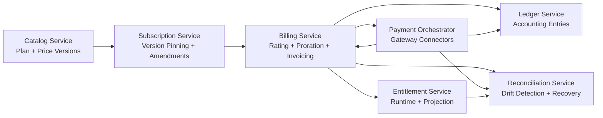
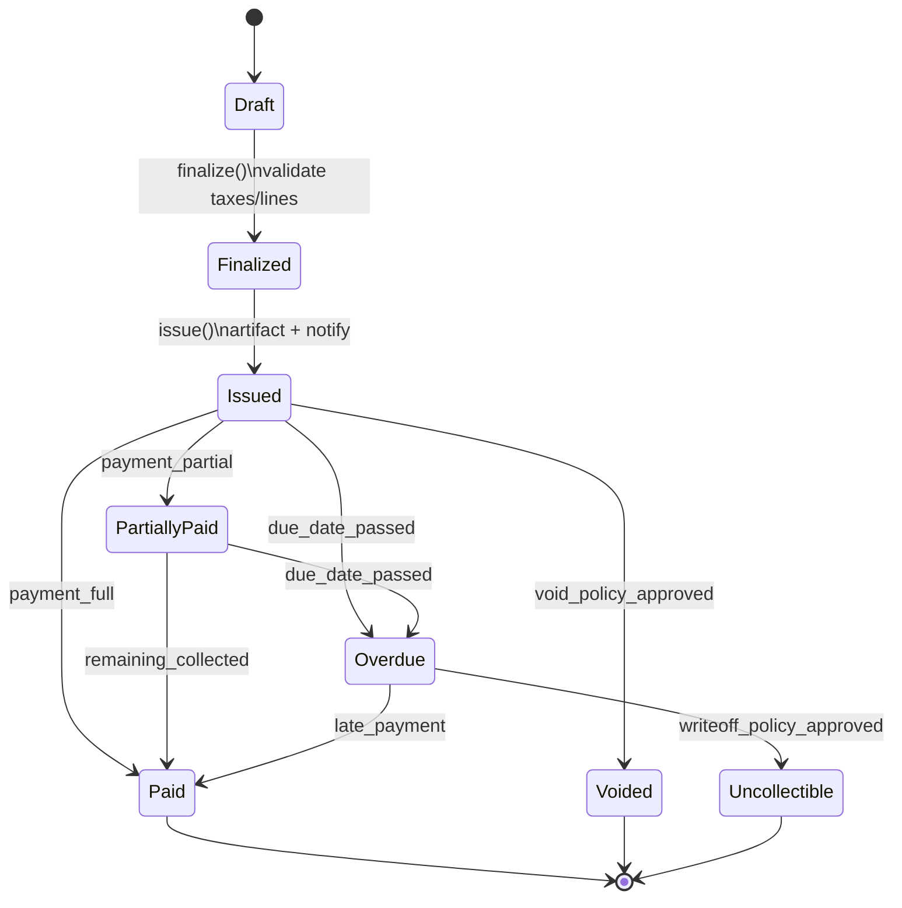

# High-Level Design: Commercial Versioning, Invoice Lifecycle, Proration, Entitlement Paths, and Reconciliation

## Architecture Additions

### Core Bounded Contexts
1. **Catalog Context**
   - Plan + add-on definitions
   - Immutable plan/price versions
2. **Subscription Context**
   - Subscriber contracts pinned to catalog versions
   - Term boundaries and migration scheduling
3. **Billing Context**
   - Rating, proration, invoice generation and lifecycle transitions
4. **Entitlement Context**
   - Real-time access checks and projection stores
5. **Financial Integrity Context**
   - Reconciliation pipelines and recovery orchestration

## Plan Versioning Model
- Catalog publishes `PlanVersionPublished` events.
- Subscription context resolves eligible versions by effective date + tenant policy.
- Active subscriptions keep pinned version references until migration trigger.
- Billing engine always rates against subscription-pinned version metadata.

## Invoice Lifecycle (Service Interaction)
1. Billing scheduler assembles draft lines.
2. Tax/discount services enrich and validate.
3. Finalization service locks monetary structure.
4. Document service issues customer-facing invoice.
5. Collection service advances status via payment outcomes.
6. AR workflow handles exceptions (void, uncollectible, credit-note adjustments).

## Proration Strategy (High-Level)
- Triggered by amendment events (upgrade/downgrade/seat delta).
- Policy resolver chooses proration mode by tenant contract rules.
- Rating service computes time-sliced debit/credit components.
- Generated proration lines are linked to amendment event for replay safety.

## Entitlement Enforcement Paths

### Online Path (Hard Gate)
- API Gateway → Entitlement Decision Service → policy cache + grace evaluator.
- Used for request-time access control and quota checks.

### Offline Path (Projection)
- Event bus → entitlement projector → query tables/search index.
- Used for admin consoles, support diagnostics, and reporting.

## Reconciliation + Error Recovery Strategy
- Streaming validators perform near-real-time assertions.
- Daily batch reconciliation produces finance sign-off datasets.
- Drift above thresholds routes to incident queue with severity scoring.
- Recovery orchestrator supports replay, compensation, and manual override workflows.

## Availability and Correctness Guarantees
- At-least-once event delivery + idempotent consumers.
- Monotonic version references (never rewrite historical invoice semantics).
- Eventual consistency for projections with bounded staleness SLO.
- Strong consistency for finalization and ledger posting operations.

## Beginner Mental Model
A good high-level model answers three questions:
1. **Where does truth live?** (catalog versions, invoice state, ledger entries)
2. **What can be cached?** (entitlement projections, query views)
3. **What must never be rewritten?** (finalized invoices and ledger history)

## Why These Boundaries Matter
- Catalog changes often and should not directly mutate historical subscriptions.
- Billing needs correctness controls around finalization and collection transitions.
- Entitlement checks prioritize low latency; projections prioritize diagnostics and reporting.
- Reconciliation centralizes trust verification across independent services.

## New-Team Onboarding Tips
- Start by tracing one customer journey from plan purchase to entitlement check.
- Identify event contracts first; implementation choices become easier afterward.
- Validate error paths (retries, delayed events, replay) before scale testing.

## High-Level Component Diagram (Mermaid)

## Invoice Lifecycle State Diagram (Mermaid)

## Architecture Quality Attributes and Tactics
| Quality Attribute | Risk | Tactic |
|---|---|---|
| Consistency | Cross-service drift | reconciliation service + closure rules |
| Auditability | manual changes without trace | append-only transition and override logs |
| Availability | gateway outage | retry + graceful entitlement window |
| Determinism | repeated proration mismatch | idempotency keys + immutable inputs |
| Operability | unclear incident path | standardized replay/compensation workflows |

## Build Readiness Gates
1. Event schemas versioned and validated in CI.
2. Invoice state machine contract tests pass.
3. Proration golden-vector tests pass for all supported currencies.
4. Entitlement stale-cache safeguards tested under delayed webhook simulation.
5. Reconciliation dry-run and repair loop demonstrated in staging.
