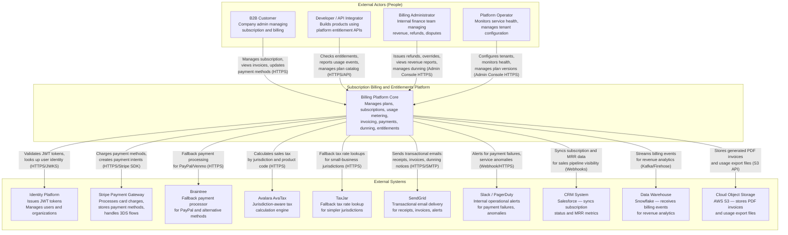

# C4 Architecture Diagrams — Subscription Billing and Entitlements Platform

## Overview

This document presents the Subscription Billing and Entitlements Platform architecture at two levels of abstraction using the C4 model:

- **Level 1 — System Context:** Shows the billing platform as a black box, with the external people and systems that interact with it.
- **Level 2 — Container Diagram:** Zooms into the billing platform and shows the technology containers (services, databases, queues, storage) and how they communicate.

---

## Level 1 — System Context Diagram

The System Context diagram positions the Subscription Billing and Entitlements Platform within its broader ecosystem. It shows every external actor and external system that the platform exchanges data with, and the nature of those exchanges.



### Actor Descriptions

| Actor | Type | Interaction |
|---|---|---|
| B2B Customer | Person | Self-service portal — manages subscription plan, payment methods, views invoices and billing history |
| Developer / API Integrator | Person | Programmatic API access — reports usage events, reads entitlements, manages plan configurations via REST API |
| Billing Administrator | Person | Internal admin console — issues refunds, manual credits, manages dunning overrides, views financial reports |
| Platform Operator | Person | Internal admin console — manages tenant configuration, plan versions, deployment configuration |

### External System Descriptions

| System | Role | Protocol |
|---|---|---|
| Identity Platform | JWT issuance and JWKS endpoint for token verification | HTTPS |
| Stripe | Primary payment gateway — card charging, PaymentIntents, stored payment methods | HTTPS / Stripe SDK |
| Braintree | Fallback gateway — PayPal, Venmo, alternative payment methods | HTTPS / Braintree SDK |
| Avalara AvaTax | Real-time tax calculation by jurisdiction, product code, and customer exemption | HTTPS / Avalara SDK |
| TaxJar | Fallback tax rate lookup for simpler use cases | HTTPS |
| SendGrid | Transactional email delivery (receipts, invoices, dunning notices, alerts) | HTTPS / SMTP |
| Slack / PagerDuty | Operational alerts for payment failures, service degradation | HTTPS Webhooks |
| CRM (Salesforce) | Subscription status and MRR data sync for sales pipeline visibility | HTTPS Webhooks |
| Data Warehouse (Snowflake) | Receives billing events stream for revenue analytics and reporting | Kafka / Kinesis Firehose |
| Cloud Object Storage (S3) | Stores generated PDF invoices and bulk usage export files | AWS S3 API |

---

## Level 2 — Container Diagram

The Container Diagram decomposes the billing platform into its individual deployable units (containers). Each container is a separately deployable process with its own technology stack and responsibilities.

```mermaid
graph TD
    subgraph Clients["External Clients"]
        WEB_APP[Web Application\nReact SPA]
        MOBILE[Mobile App\niOS / Android]
        EXT_API[External API Clients\nServer-side integrations]
    end

    subgraph AdminFrontend["Admin Layer"]
        ADMIN[Admin Console\nReact SPA\nHosted on CDN\nCommunicates over HTTPS]
    end

    subgraph Gateway["Gateway Layer"]
        AG[API Gateway\nnginx / Kong\nTLS termination, JWT validation,\nrate limiting, routing\nPort: 443]
    end

    subgraph CoreServices["Core Microservices"]
        direction TB
        PS[Plan Catalog Service\nNode.js / Go\nGRPC + REST\nPort: 8001\nManages plan versions, prices, features]
        SS[Subscription Service\nGo\nGRPC + REST\nPort: 8002\nSubscription lifecycle, state machine,\nproration logic]
        UMS[Usage Metering Service\nGo\nREST (high throughput)\nPort: 8003\nEvent ingestion, dedup, aggregation\n10k+ events/sec per instance]
        BE[Billing Engine\nPython / Go\nInternal gRPC\nPort: 8004\nInvoice generation pipeline,\nrating, discounts, PDF generation]
        PAY[Payment Service\nGo\nInternal gRPC\nPort: 8005\nGateway integration, charge lifecycle,\nrefunds, payment method management]
        DUN[Dunning Service\nGo\nInternal gRPC\nPort: 8006\nRetry scheduling, grace period mgmt,\ncancellation on exhaustion]
        ENT[Entitlement Service\nGo\nGRPC + REST\nPort: 8007\nReal-time feature checks,\nRedis-backed sub-millisecond reads]
        TAX[Tax Service\nGo\nInternal gRPC\nPort: 8008\nAvalara integration, exemption mgmt,\ntax breakdown per line item]
        NOTIF[Notification Service\nGo\nKafka consumer\nPort: 8009\nEmail/webhook/in-app delivery,\ntemplate rendering]
    end

    subgraph Messaging["Event Bus"]
        KAFKA[Apache Kafka\n3-broker cluster\nZooKeeper / KRaft mode\n14-day retention\nTopics: billing.events, payment.events,\nsubscription.events, usage.events,\ndunning.events, plan.events]
    end

    subgraph Data["Data Layer"]
        PG_PRIMARY[(PostgreSQL Primary\nVersion 15\nAll writes\nConnection pool via PgBouncer\nMax 200 connections)]
        PG_REPLICA[(PostgreSQL Read Replicas ×2\nRead-heavy queries\nReporting, admin dashboards\nAsynchronous replication)]
        REDIS[(Redis Cluster\n3 primary + 3 replica shards\nPlan cache, entitlements,\nrate limiting, dedup,\nusage counters, tax rate cache)]
        S3[(Object Storage\nAWS S3\nPDF invoices, usage exports\nSSE-S3 encryption\n7-year retention for compliance)]
    end

    subgraph ExternalAPIs["External Systems"]
        STRIPE[Stripe\nPayment Gateway]
        AVALARA[Avalara\nTax Engine]
        SENDGRID[SendGrid\nEmail Delivery]
        IDP[Identity Platform\nJWKS / Token endpoint]
    end

    WEB_APP & MOBILE & EXT_API -- "HTTPS" --> AG
    ADMIN -- "HTTPS" --> AG

    AG -- "HTTP/gRPC\nJWT + tenant headers" --> PS
    AG -- "HTTP/gRPC\nJWT + tenant headers" --> SS
    AG -- "HTTP\nhigh-throughput write\nbatch accepted" --> UMS
    AG -- "HTTP\nAdmin + reporting reads" --> BE
    AG -- "HTTP\nAdmin refund + method mgmt" --> PAY
    AG -- "HTTP\nEntitlement check API" --> ENT

    SS -- "gRPC\nplan lookup" --> PS
    BE -- "gRPC\ntax calculation" --> TAX
    PAY -- "HTTPS\nStripe SDK" --> STRIPE
    TAX -- "HTTPS\nAvalatara SDK" --> AVALARA
    NOTIF -- "HTTPS\nSendGrid API" --> SENDGRID
    AG -- "HTTPS\nJWKS verification" --> IDP

    PS -- "Reads + Writes" --> PG_PRIMARY
    SS -- "Reads + Writes" --> PG_PRIMARY
    UMS -- "Writes (async batch)" --> PG_PRIMARY
    BE -- "Reads + Writes" --> PG_PRIMARY
    PAY -- "Reads + Writes" --> PG_PRIMARY
    DUN -- "Reads + Writes" --> PG_PRIMARY
    ENT -- "Writes (audit trail)" --> PG_PRIMARY
    TAX -- "Writes (tax log)" --> PG_PRIMARY
    NOTIF -- "Writes (notification log)" --> PG_PRIMARY

    BE -- "Reporting reads" --> PG_REPLICA
    SS -- "List/query reads" --> PG_REPLICA
    PAY -- "History reads" --> PG_REPLICA

    PS -- "Plan catalog cache" --> REDIS
    ENT -- "Entitlement hash store" --> REDIS
    UMS -- "Usage counters, dedup" --> REDIS
    AG -- "Rate limit counters" --> REDIS
    TAX -- "Tax rate cache" --> REDIS
    SS -- "Idempotency keys" --> REDIS

    BE -- "PUT invoice PDF" --> S3
    NOTIF -- "GET pre-signed invoice URL" --> S3

    PS & SS & UMS & BE & PAY & DUN & ENT & TAX & NOTIF -- "Publish events" --> KAFKA
    KAFKA -- "Subscribe to events" --> SS & UMS & BE & PAY & DUN & ENT & NOTIF
```

### Container Descriptions

#### API Gateway (nginx / Kong)

- **Technology:** Kong Gateway OSS on nginx, Lua plugins, OpenTelemetry
- **Port:** 443 (HTTPS), 80 → 443 redirect
- **Responsibilities:** TLS termination, JWT validation (RS256 against JWKS endpoint), per-tenant rate limiting (Redis token bucket), request routing to upstream services, injection of `X-Request-ID` and `X-Tenant-ID` headers, payload size enforcement (1 MB default)
- **Scaling:** Stateless; horizontally scaled behind a cloud load balancer. Kong configuration managed declaratively via Helm.

#### Plan Catalog Service

- **Technology:** Go (or Node.js for catalog flexibility), PostgreSQL, Redis
- **Responsibilities:** Full CRUD for plans, plan versions, prices, features, trial configurations. Enforces plan version immutability. Publishes `plan.published` and `plan.deprecated` events to Kafka.
- **Scaling:** Read-heavy; Redis cache with 5-minute TTL absorbs catalog reads. Write path is low-volume (plan changes are infrequent).

#### Subscription Service

- **Technology:** Go, PostgreSQL, Kafka
- **Responsibilities:** Subscription state machine management (Trialing → Active → PastDue → Paused → Cancelled → Expired), proration calculation for mid-cycle changes, grace period coordination. Optimistic locking on subscription rows to prevent concurrent modification.
- **Scaling:** Stateless; horizontally scalable. Kafka consumer group for event-driven updates.

#### Usage Metering Service

- **Technology:** Go, PostgreSQL, Redis, Kafka
- **Responsibilities:** High-throughput event ingestion (10,000+ events/sec per instance), idempotent deduplication using Redis SETNX, real-time accumulation in Redis HINCRBY counters, async bulk insert to PostgreSQL, period close aggregation, reconciliation.
- **Scaling:** Multiple instances behind the API Gateway. Redis Cluster provides horizontal counter scaling.

#### Billing Engine

- **Technology:** Python (financial arithmetic precision) or Go, PostgreSQL, S3
- **Responsibilities:** Invoice generation orchestration — retrieves usage aggregates, applies pricing models, calculates proration, applies discounts and credits, requests tax from Tax Service, assembles and finalizes invoices, generates PDF and stores in S3.
- **Scaling:** Job-per-subscription parallelism using Kafka consumer groups partitioned by `account_id`.

#### Payment Service

- **Technology:** Go, PostgreSQL, Stripe SDK
- **Responsibilities:** Charge execution against Stripe (primary) or Braintree (fallback), PaymentIntent lifecycle management, refund processing, payment method CRUD, outcome recording. All Stripe calls carry idempotency keys.
- **Scaling:** Stateless; horizontally scalable. Circuit breaker around Stripe API with 3-retry exponential backoff.

#### Dunning Service

- **Technology:** Go, PostgreSQL, Kafka
- **Responsibilities:** Dunning cycle CRUD, configurable retry schedule execution (Day 1/3/7/14), grace period management, entitlement restriction coordination, subscription cancellation on exhaustion.
- **Scaling:** Singleton retry dispatcher with PostgreSQL advisory lock for leader election. Kafka consumer for event-driven cycle state updates.

#### Entitlement Service

- **Technology:** Go, Redis (primary), PostgreSQL (audit)
- **Responsibilities:** Real-time feature access checks (`/entitlements/{account_id}/{feature_key}`), Redis hash-based entitlement store, event-driven grant/revoke on subscription changes, admin override support.
- **Scaling:** Read path served entirely from Redis Cluster — sub-millisecond p99 latency. Write path event-driven from Kafka.

#### Tax Service

- **Technology:** Go, Avalara SDK, Redis, PostgreSQL
- **Responsibilities:** Tax calculation requests to Avalara AvaTax, jurisdiction + product code rate caching in Redis (1-hour TTL), exemption certificate management, tax audit log persistence.
- **Scaling:** Stateless; horizontally scalable. Redis cache reduces Avalara API calls by ~80% on repeat billing runs.

#### Notification Service

- **Technology:** Go, SendGrid API, PostgreSQL, Kafka
- **Responsibilities:** Event-driven notification dispatch — consumes Kafka domain events, renders Handlebars/Jinja2 templates, delivers via SendGrid (email), internal WebSocket (in-app), or Slack webhook (ops). Tracks delivery status, retries on failure, respects unsubscribe preferences.
- **Scaling:** Kafka consumer group with multiple instances. Idempotency via `notification_id` keyed on `(recipient, event_id)`.

#### Apache Kafka

- **Technology:** Apache Kafka 3.x, KRaft mode (no ZooKeeper), 3-broker cluster
- **Responsibilities:** Asynchronous event bus for all domain events. Provides durability, replay capability (14-day retention), and decoupling between services.
- **Topics:** `billing.events`, `payment.events`, `subscription.events`, `usage.events`, `dunning.events`, `plan.events`, and corresponding `.dlq` dead-letter topics.

#### PostgreSQL Primary + Replicas

- **Technology:** PostgreSQL 15, PgBouncer connection pooler (transaction mode)
- **Responsibilities:** Source of truth for all transactional data — subscriptions, invoices, payments, dunning cycles, entitlement grants, audit logs.
- **Topology:** 1 primary (all writes), 2 read replicas (reporting queries, admin console, list APIs). Streaming replication with synchronous commit on 1 replica for durability.

#### Redis Cluster

- **Technology:** Redis 7.x, Cluster mode, 3 primary + 3 replica shards
- **Responsibilities:** Plan catalog cache, entitlement hash store, usage counters, deduplication sets, idempotency key cache, rate limit counters, tax rate cache.
- **Persistence:** AOF (append-only file) enabled on all shards for crash recovery. Sentinel-based automatic failover.

#### Object Storage (S3)

- **Technology:** AWS S3, SSE-S3 server-side encryption
- **Responsibilities:** Persistent storage for generated PDF invoices and bulk usage export files. Lifecycle policy: standard tier for 12 months, then Glacier for 6 years (7-year compliance retention).

#### Admin Console

- **Technology:** React SPA, hosted on CloudFront CDN
- **Responsibilities:** Internal UI for billing administrators and platform operators. Features: subscription management, manual invoice adjustments, dunning overrides, plan version management, revenue dashboards, tenant configuration.
- **Access:** Restricted to internal network or VPN. SSO via Identity Platform. Role-based access control enforced at the API Gateway level.
