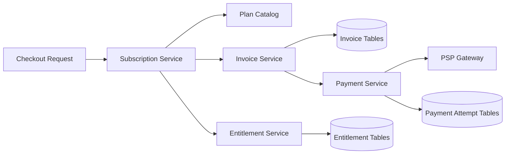
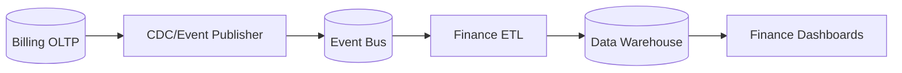

# Data Flow Diagrams

## Subscription and Billing Data Flow

```mermaid
flowchart LR
    Checkout[Checkout Request] --> SubSvc[Subscription Service]
    SubSvc --> PlanRead[Plan Catalog]
    SubSvc --> InvoiceSvc[Invoice Service]
    InvoiceSvc --> InvoiceStore[(Invoice Tables)]
    InvoiceSvc --> PaymentSvc[Payment Service]
    PaymentSvc --> PSP[PSP Gateway]
    PaymentSvc --> Ledger[(Payment Attempt Tables)]
    SubSvc --> EntSvc[Entitlement Service]
    EntSvc --> EntStore[(Entitlement Tables)]
```

## Revenue Reporting Flow

```mermaid
flowchart LR
    OLTP[(Billing OLTP)] --> CDC[CDC/Event Publisher]
    CDC --> Bus[(Event Bus)]
    Bus --> ETL[Finance ETL]
    ETL --> WH[(Data Warehouse)]
    WH --> FinanceDash[Finance Dashboards]
```
