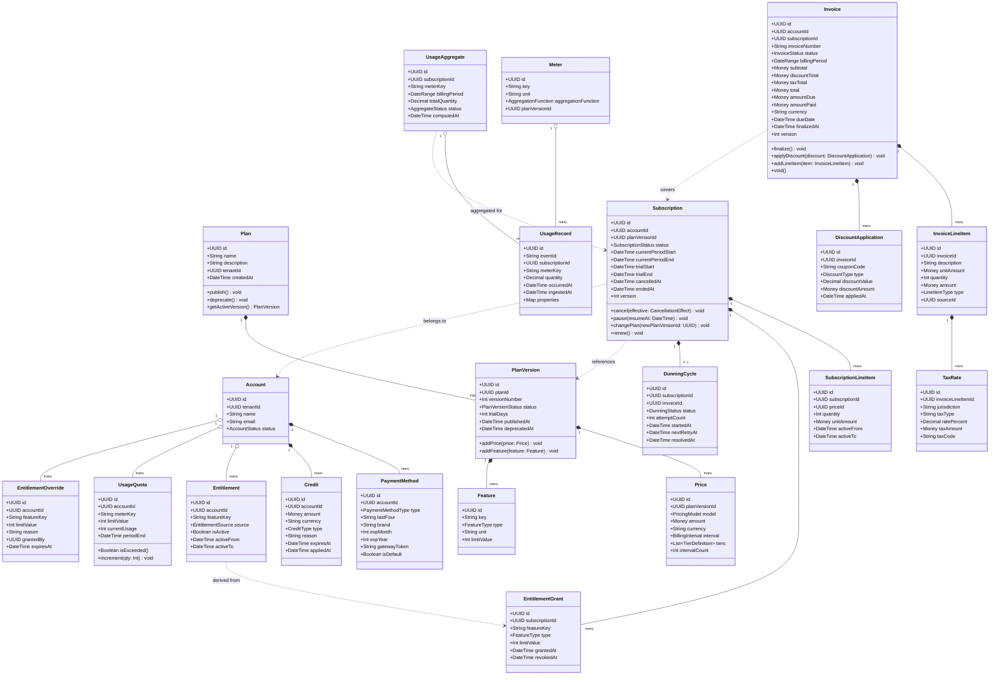

# Domain Model — Subscription Billing and Entitlements Platform

## Overview

The domain model is organized around five bounded contexts, each owning a distinct slice of the problem space. Contexts communicate through well-defined domain events and anti-corruption layers, avoiding tight coupling between the persistence models of different teams.

---

## Bounded Contexts

### 1. Plan Catalog Context

**Responsibility:** Defines what can be sold — the catalog of plans, pricing structures, feature entitlements, trial configurations, and plan versions.

**Core Concepts:**
- A **Plan** is the top-level product offering (e.g., "Pro Monthly"). It is versioned; customers subscribe to a specific `PlanVersion`.
- A **Price** represents how a plan charges: flat rate, per-seat, tiered, volume, or pay-as-you-go. A plan may have multiple prices in different currencies.
- A **Feature** is an entitlement capability attached to a plan version (e.g., `api_calls_per_month: 50000`, `seats: 5`).
- Plan versions follow a lifecycle: `Draft → Published → Deprecated → Archived`.

**Aggregate Root:** `Plan`
**Key Invariants:**
- A plan must have at least one published price before it can be published.
- A plan version, once published, is immutable. Changes require creating a new version.
- Archiving a version is only permitted if no active subscriptions are pinned to it.

---

### 2. Subscription Context

**Responsibility:** Manages the relationship between a customer account and a plan version over time — including trials, lifecycle state, pauses, and renewals.

**Core Concepts:**
- A **Subscription** binds an `Account` to a `PlanVersion` for a defined billing interval.
- A **SubscriptionLineItem** represents a chargeable component of the subscription (e.g., base fee, additional seat).
- An **EntitlementGrant** records which features are active for the subscription and their current limits.
- A **DunningCycle** tracks payment retry state when a subscription enters a `PastDue` state.

**Aggregate Root:** `Subscription`
**Key Invariants:**
- A subscription must reference a published `PlanVersion`.
- Only one active subscription per account per plan is permitted (configurable per tenant).
- Cancellation with `immediate` effect sets `ended_at` to now; `end_of_period` sets it to the current period end.
- Trial periods cannot exceed the maximum trial days defined on the `PlanVersion`.

---

### 3. Metering Context

**Responsibility:** Ingests raw usage events from customers, deduplicates them, and produces aggregated usage totals that feed into billing.

**Core Concepts:**
- A **UsageRecord** is a single, raw, idempotent usage event tied to a subscription and a meter key (e.g., `api_calls`).
- A **UsageAggregate** is the pre-computed sum of usage for a given `(subscription_id, meter_key, billing_period)`.
- A **Meter** defines the unit, aggregation function (sum, max, unique count), and billing mapping for a measurable event type.

**Aggregate Root:** `UsageAggregate`
**Key Invariants:**
- Usage records are idempotent on `event_id`. Duplicate events are silently dropped.
- Usage records cannot be added to a billing period that has already been closed and invoiced.
- Aggregates are immutable once the billing period closes.

---

### 4. Billing Context

**Responsibility:** Generates invoices by combining fixed charges, metered usage, discounts, proration, and taxes. Manages the invoice lifecycle through to payment.

**Core Concepts:**
- An **Invoice** represents a financial document owed by an account for a billing period.
- An **InvoiceLineItem** is a single charge within an invoice — it carries amount, description, and references to its source (subscription line item or usage aggregate).
- A **DiscountApplication** records a coupon or credit applied to the invoice, tracking both the discount value and the originating coupon code.
- A **TaxRate** captures the jurisdiction, rate percentage, and tax type (VAT, GST, sales tax) for a line item.

**Aggregate Root:** `Invoice`
**Key Invariants:**
- An invoice total must equal the sum of all line item amounts minus discounts plus taxes.
- Finalized invoices are immutable. Corrections are issued as credit notes, not edits.
- An invoice can only be finalized if a valid payment method exists on the account.
- Invoice numbers are sequential and gap-free within a tenant (enforced by a sequence lock).

---

### 5. Entitlements Context

**Responsibility:** Enforces feature access and usage quotas in real time. Acts as the authorization layer for product features.

**Core Concepts:**
- An **Entitlement** is an active grant of a feature or quota to an account.
- A **FeatureFlag** is a boolean entitlement (access granted or not).
- A **UsageQuota** is a numeric entitlement with a current usage count and a maximum limit.
- An **EntitlementOverride** is a manually granted entitlement applied by an admin outside of the subscription plan.

**Aggregate Root:** `Account` (in this context, representing the entitlement profile of an account)
**Key Invariants:**
- Entitlements are derived from the active subscription's plan version. Overrides augment but do not replace plan-based entitlements.
- When a subscription is cancelled, all non-override entitlements are revoked at the effective cancellation timestamp.
- Usage quota checks are atomic increments against the Redis counter; limit enforcement is strictly consistent.

---

## Class Diagram



---

## Domain Events

Domain events are the primary mechanism through which bounded contexts communicate without direct coupling.

### Plan Catalog → Subscription Context

| Event | Trigger | Payload |
|---|---|---|
| `plan.version.published` | A plan version transitions to Published | `plan_id`, `version_id`, `effective_at` |
| `plan.version.deprecated` | A plan version transitions to Deprecated | `plan_id`, `version_id`, `replacement_version_id` |

### Subscription Context → Entitlements Context

| Event | Trigger | Payload |
|---|---|---|
| `subscription.created` | New subscription activated | `subscription_id`, `account_id`, `plan_version_id`, `entitlement_grants[]` |
| `subscription.upgraded` | Plan change to higher tier | `subscription_id`, `new_plan_version_id`, `effective_at` |
| `subscription.downgraded` | Plan change to lower tier | `subscription_id`, `new_plan_version_id`, `effective_at` |
| `subscription.cancelled` | Subscription cancellation confirmed | `subscription_id`, `account_id`, `effective_at` |
| `subscription.paused` | Subscription paused | `subscription_id`, `resume_at` |

### Subscription Context → Billing Context

| Event | Trigger | Payload |
|---|---|---|
| `billing.cycle.due` | Billing anchor date reached | `subscription_id`, `account_id`, `period_start`, `period_end` |
| `subscription.upgraded` | Mid-cycle plan change | `subscription_id`, `proration_credit`, `new_charges` |

### Metering Context → Billing Context

| Event | Trigger | Payload |
|---|---|---|
| `usage.period.closed` | Billing period ends for usage aggregation | `subscription_id`, `meter_key`, `period`, `total_quantity` |

### Billing Context → Payment Context

| Event | Trigger | Payload |
|---|---|---|
| `invoice.finalized` | Invoice is finalized and ready to charge | `invoice_id`, `account_id`, `amount_due`, `currency`, `due_date` |

### Payment Context → Dunning Context

| Event | Trigger | Payload |
|---|---|---|
| `payment.failed` | Payment attempt declined | `invoice_id`, `subscription_id`, `failure_reason`, `attempt_count` |
| `payment.succeeded` | Payment collected | `invoice_id`, `subscription_id`, `amount_paid` |

### Dunning Context → Subscription Context + Entitlements Context

| Event | Trigger | Payload |
|---|---|---|
| `dunning.grace_period.started` | Dunning cycle moves to grace period | `subscription_id`, `account_id`, `grace_period_end` |
| `dunning.completed.cancelled` | All retries exhausted | `subscription_id`, `account_id`, `final_failure_reason` |
| `dunning.completed.recovered` | Payment succeeded during dunning | `subscription_id`, `account_id`, `invoice_id` |

---

## Value Objects

Value objects have no identity — they are defined entirely by their attributes and are immutable after creation.

### Money

```
Money {
  amount: Decimal (scale 8 for crypto, scale 2 for fiat)
  currency: ISO 4217 currency code (e.g., "USD", "EUR")
}
```

Operations: `add(Money)`, `subtract(Money)`, `multiply(Decimal)`, `negate()`. All operations return a new `Money` instance. Currency mismatch raises a domain exception.

### DateRange

```
DateRange {
  start: DateTime (inclusive, UTC)
  end: DateTime (exclusive, UTC)
}
```

Operations: `contains(DateTime)`, `overlaps(DateRange)`, `durationDays()`, `durationSeconds()`. Used for billing periods, entitlement active windows, and trial periods.

### TaxAmount

```
TaxAmount {
  baseAmount: Money
  taxableAmount: Money
  ratePercent: Decimal
  jurisdiction: String
  taxType: Enum(VAT, GST, SALES_TAX, NONE)
  taxAmount: Money  (computed: taxableAmount × ratePercent)
}
```

### ProrationAmount

```
ProrationAmount {
  fullPeriodAmount: Money
  billedDays: Int
  totalDays: Int
  proratedAmount: Money  (computed: fullPeriodAmount × billedDays / totalDays)
  creditAmount: Money    (computed: fullPeriodAmount − proratedAmount, for downgrades)
}
```

---

## Domain Services

Domain services contain logic that does not naturally belong to a single aggregate.

### ProrationCalculator

Calculates the credit owed for unused days when a subscription changes mid-cycle, and the charge for the new plan for the remaining days.

**Input:** Current subscription, old plan price, new plan price, change date
**Output:** `ProrationAmount` (credit for old plan, charge for new plan)

**Algorithm:**
1. Compute `remainingDays = currentPeriodEnd - changeDate`
2. Compute `totalDays = currentPeriodEnd - currentPeriodStart`
3. Credit = `oldPlanPrice × (remainingDays / totalDays)` — rounded down to 2 decimal places
4. NewCharge = `newPlanPrice × (remainingDays / totalDays)` — rounded up to 2 decimal places
5. Net proration = NewCharge − Credit (positive = customer owes more; negative = customer gets credit)

### TaxCalculationService

Coordinates between the Billing Context and the Tax Service microservice, enriching invoice line items with jurisdiction-specific tax rates.

**Input:** List of `InvoiceLineItem`, customer billing address, account tax exemptions
**Output:** List of `TaxAmount` per line item

**Responsibilities:**
- Determine applicable tax nexus based on the customer's billing address
- Look up product tax codes (mapped per plan feature type)
- Apply exemption certificates if available for the account
- Return a full tax breakdown per line item (not just a total)

### UsageRatingService

Converts raw `UsageAggregate` quantities into monetary amounts by applying the pricing model defined on the `Meter` and `Price`.

**Input:** `UsageAggregate`, `Price` (with pricing model and tier definitions)
**Output:** `InvoiceLineItem` with the rated amount

**Pricing Model Support:**
- **Flat:** Fixed amount regardless of usage (included in subscription)
- **Per Unit:** `quantity × unitPrice`
- **Tiered:** Each tier uses its own unit price; quantity consumed in each tier separately
- **Volume:** Entire quantity priced at the unit price of the tier containing the total quantity
- **Stairstep:** Flat rate determined by the tier containing the total quantity
