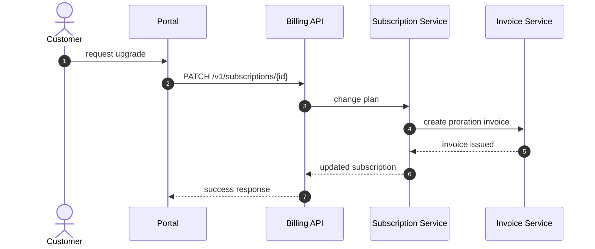
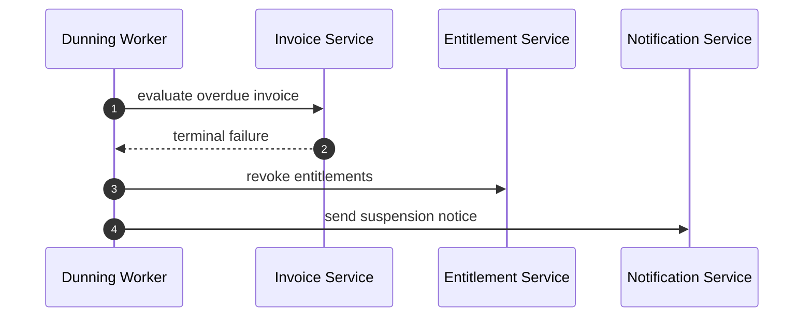

# System Sequence Diagrams

## System Sequence: Upgrade Plan

```mermaid
sequenceDiagram
    autonumber
    actor C as Customer
    participant UI as Portal
    participant API as Billing API
    participant SUB as Subscription Service
    participant INV as Invoice Service

    C->>UI: request upgrade
    UI->>API: PATCH /v1/subscriptions/{id}
    API->>SUB: change plan
    SUB->>INV: create proration invoice
    INV-->>SUB: invoice issued
    SUB-->>API: updated subscription
    API-->>UI: success response
```

## System Sequence: Entitlement Revocation on Failed Dunning

```mermaid
sequenceDiagram
    autonumber
    participant Job as Dunning Worker
    participant INV as Invoice Service
    participant ENT as Entitlement Service
    participant Notify as Notification Service

    Job->>INV: evaluate overdue invoice
    INV-->>Job: terminal failure
    Job->>ENT: revoke entitlements
    Job->>Notify: send suspension notice
```
