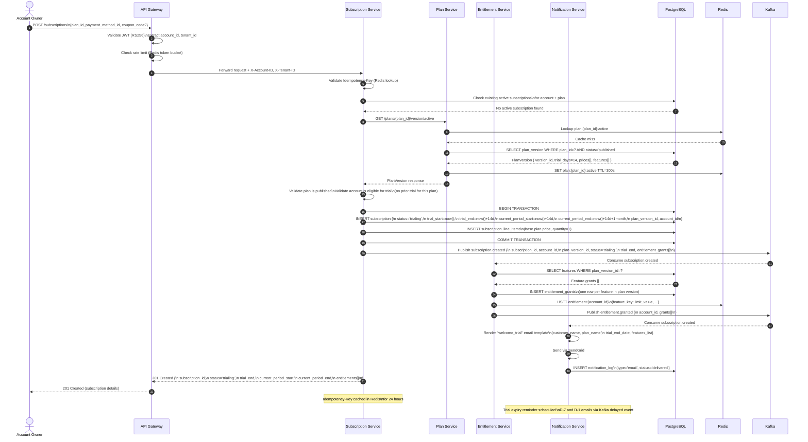
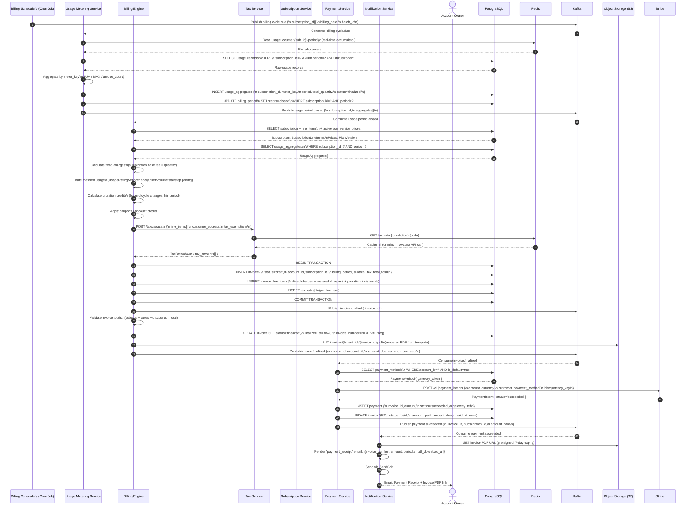
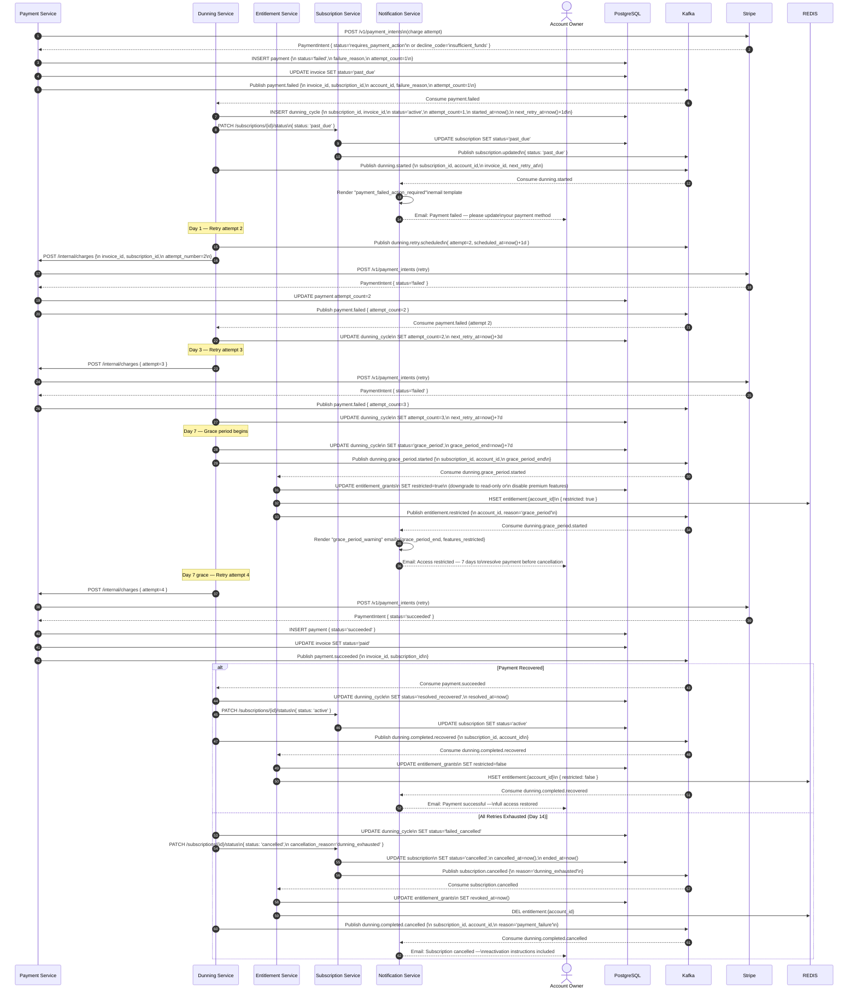

# System Sequence Diagrams — Subscription Billing and Entitlements Platform

## Overview

This document captures the detailed interaction sequences for three critical business flows: subscription creation with a trial period, the monthly billing cycle, and the failed payment dunning flow. Each diagram is expressed in Mermaid `sequenceDiagram` notation and accompanied by detailed narrative descriptions of each step.

---

## Flow 1: Subscription Creation with Trial Period

This flow covers the end-to-end process a new customer follows when subscribing to a plan that includes a trial period. It spans validation, plan resolution, trial period setup, entitlement provisioning, and customer notification.

### Narrative

**Steps 1–3:** The account owner submits a subscription creation request. The API Gateway validates the JWT, extracts the `account_id` and `tenant_id`, and enforces rate limiting.

**Steps 4–5:** The Subscription Service checks the idempotency key to guard against duplicate submissions. It then verifies that no conflicting active subscription already exists for this account and plan combination.

**Steps 6–11:** The Subscription Service fetches the active plan version from the Plan Service. The Plan Service checks its Redis cache first; on a miss, it queries PostgreSQL and populates the cache with a 5-minute TTL.

**Steps 12–13:** The Subscription Service validates that the plan is published and that this account has not previously received a trial for this plan (preventing abuse).

**Steps 14–19:** Within a PostgreSQL transaction, the service inserts the subscription in `trialing` status, sets `trial_end` to `now() + trial_days`, and inserts the subscription line items. The transaction commits atomically.

**Steps 20–24:** A `subscription.created` event is published to Kafka. The Entitlement Service consumes it, reads the plan features, inserts `entitlement_grants`, and writes the entitlement hash to Redis for low-latency checks.

**Steps 25–28:** The Notification Service consumes the same `subscription.created` event, renders the welcome/trial email template, dispatches it via SendGrid, and logs the notification.

**Steps 29–30:** The Subscription Service returns the created subscription details (including entitlements) to the API Gateway, which forwards the 201 response to the account owner.

---

## Flow 2: Monthly Billing Cycle

This flow describes the automated monthly billing run. It starts with a scheduled trigger and proceeds through usage aggregation, invoice generation, tax calculation, finalization, payment collection, and customer notification.

### Narrative

**Steps 1–2:** The Billing Scheduler publishes a `billing.cycle.due` event for all subscriptions whose billing anchor date has been reached. The batch may contain thousands of subscriptions, partitioned by `account_id` across Kafka partitions.

**Steps 3–11:** The Usage Metering Service reads real-time Redis counters and cross-checks with the raw usage records in PostgreSQL. It computes final aggregates per meter key, writes them to `usage_aggregates` with `status='finalized'`, closes the billing period, and publishes `usage.period.closed`.

**Steps 12–23:** The Billing Engine picks up the usage period closure event. It retrieves the subscription's plan prices and line items, rates the metered usage using the `UsageRatingService`, computes proration for any mid-cycle plan changes, and applies coupons and account credits.

**Steps 24–27:** Tax calculation is delegated to the Tax Service, which uses cached rates where available and calls Avalara for misses. The result is an itemized tax breakdown per line item.

**Steps 28–35:** The Billing Engine assembles the invoice within a database transaction. After commit, it validates the totals, finalizes the invoice, generates a PDF and stores it in S3, then publishes `invoice.finalized`.

**Steps 36–44:** The Payment Service charges the account's default payment method via Stripe, records the outcome, updates the invoice to `paid`, and publishes `payment.succeeded`.

**Steps 45–49:** The Notification Service generates a payment receipt email with a pre-signed link to the invoice PDF and delivers it to the account owner.

---

## Flow 3: Failed Payment Dunning Flow

This flow handles the scenario where a payment fails and the platform must apply a configurable retry schedule, manage the subscription's grace period, and eventually either recover the payment or cancel the subscription.

### Narrative

**Steps 1–5:** The Payment Service makes the initial charge attempt. Stripe declines it (insufficient funds, card expired, or authentication required). The service records the failed payment, marks the invoice as `past_due`, and publishes `payment.failed`.

**Steps 6–12:** The Dunning Service consumes the failure event and opens a dunning cycle. It sets the next retry for Day 1 and updates the subscription status to `past_due`. A `dunning.started` event is published.

**Step 13:** The Notification Service sends a "payment failed" email prompting the account owner to update their payment method.

**Steps 14–20:** Day 1 retry attempt fails. The dunning cycle records attempt 2 and advances the next retry to Day 3.

**Steps 21–25:** Day 3 retry attempt also fails. Next retry scheduled for Day 7.

**Steps 26–34:** At Day 7, the dunning service transitions the cycle to `grace_period`. The Entitlement Service receives the `dunning.grace_period.started` event and downgrades the account's entitlements to restricted mode (disabling premium features while allowing read access). A grace period warning email is sent.

**Steps 35–39:** Day 7 within the grace period — a 4th charge attempt succeeds.

**Recovery Branch (Steps 40–48):** The dunning cycle resolves as `recovered`. The subscription returns to `active`. The Entitlement Service lifts restrictions. The customer receives a payment success and access restoration email.

**Cancellation Branch (Steps 49–60):** If the Day 14 retry (final attempt) also fails, the dunning cycle marks itself as `failed_cancelled`. The Subscription Service cancels the subscription immediately. The Entitlement Service revokes all grants and removes the Redis entitlement hash. A cancellation email with reactivation instructions is sent to the account owner.
