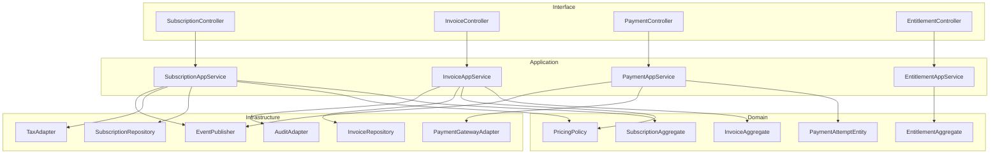

# C4 Code Diagram

```mermaid
flowchart TB
    subgraph Interface
      SubscriptionController
      InvoiceController
      PaymentController
      EntitlementController
    end

    subgraph Application
      SubscriptionAppService
      InvoiceAppService
      PaymentAppService
      EntitlementAppService
    end

    subgraph Domain
      SubscriptionAggregate
      InvoiceAggregate
      PaymentAttemptEntity
      EntitlementAggregate
      PricingPolicy
    end

    subgraph Infrastructure
      SubscriptionRepository
      InvoiceRepository
      PaymentGatewayAdapter
      TaxAdapter
      EventPublisher
      AuditAdapter
    end

    SubscriptionController --> SubscriptionAppService --> SubscriptionAggregate
    InvoiceController --> InvoiceAppService --> InvoiceAggregate
    PaymentController --> PaymentAppService --> PaymentAttemptEntity
    EntitlementController --> EntitlementAppService --> EntitlementAggregate

    SubscriptionAppService --> PricingPolicy
    InvoiceAppService --> PricingPolicy

    SubscriptionAppService --> SubscriptionRepository
    InvoiceAppService --> InvoiceRepository
    PaymentAppService --> PaymentGatewayAdapter
    SubscriptionAppService --> TaxAdapter

    SubscriptionAppService --> EventPublisher
    PaymentAppService --> EventPublisher
    InvoiceAppService --> AuditAdapter
```
