# C4 Level 4 — Code Diagram: Invoice Generator

## Overview

This document describes the C4 Level 4 (Code) diagram for the **Invoice Generator**, the most critical orchestration component in the Subscription Billing and Entitlements Platform. The Invoice Generator coordinates all subsystems involved in producing a finalized, legally compliant invoice: usage rating, proration, discounts, credits, tax, persistence, PDF generation, storage, and customer notification.

The diagram uses the C4 model convention for code-level views: classes (or structs in Go), their responsibilities, and the dependency relationships between them. In Go, these are concrete structs bound to interfaces; the diagram reflects the dependency injection graph as wired by the service container.

---

## Class Responsibilities

### InvoiceGeneratorService

The top-level orchestrator. Invoked by the Billing Scheduler worker. Coordinates the complete invoice generation pipeline in a single transactional unit. Exposes a single public method `GenerateInvoice(ctx, req)`. All dependencies are injected via constructor.

**Fields:**
- `subscriptionRepo SubscriptionRepository`
- `usageRatingService UsageRatingService`
- `prorationEngine ProrationEngine`
- `creditApplicator CreditApplicator`
- `discountEngine DiscountEngine`
- `taxService TaxCalculationService`
- `invoiceRepo InvoiceRepository`
- `eventPublisher KafkaEventPublisher`
- `pdfGenerator PDFGeneratorService`
- `storageAdapter S3StorageAdapter`
- `notificationService NotificationService`
- `logger *zap.Logger`
- `tracer trace.Tracer`

**Methods:**
- `GenerateInvoice(ctx context.Context, req GenerateInvoiceRequest) (*Invoice, error)`
- `buildLineItems(ctx, sub, planVersion, usageRecords) ([]LineItem, error)` — private orchestration step
- `applyFinancialAdjustments(ctx, invoice) error` — private; applies credits, discounts, tax in order
- `finalizeAndPersist(ctx, invoice) error` — private; persists, publishes event, generates PDF

### SubscriptionRepository

Abstracts all PostgreSQL queries related to subscriptions and plan versions. Implements read-through caching for plan version data (30-minute TTL in Redis) since plan versions are immutable after activation.

**Methods:**
- `GetSubscriptionByID(ctx, id) (*Subscription, error)`
- `GetActivePlanVersion(ctx, subscriptionID) (*PlanVersion, error)`
- `GetPricesForPlanVersion(ctx, planVersionID) ([]Price, error)`
- `UpdateSubscriptionPeriod(ctx, subscriptionID, newStart, newEnd time.Time) error`
- `LockSubscriptionForBilling(ctx, subscriptionID) (*Subscription, error)` — issues `SELECT ... FOR UPDATE`

### UsageRatingService

Fetches raw usage aggregates for the billing period and applies the plan's pricing model to produce rated monetary amounts. Supports flat, graduated, volume, and package pricing models.

**Methods:**
- `GetUsageAggregates(ctx, subscriptionID, periodStart, periodEnd time.Time) ([]UsageAggregate, error)`
- `RateUsage(planVersion *PlanVersion, aggregates []UsageAggregate) ([]RatedUsage, error)`
- `applyGraduatedTiers(tiers []PriceTier, quantity int64) int64` — private
- `applyVolumeTiers(tiers []PriceTier, quantity int64) int64` — private
- `applyPackagePricing(unitSize int64, unitPrice int64, quantity int64) int64` — private

### ProrationEngine

Calculates monetary adjustments for mid-cycle plan changes. Reads the `proration_adjustments` table for any pending adjustments tied to the subscription for the current period.

**Methods:**
- `GetPendingAdjustments(ctx, subscriptionID, periodStart, periodEnd time.Time) ([]ProrationAdjustment, error)`
- `CalculateProration(oldPlan, newPlan *PlanVersion, changeDate, periodStart, periodEnd time.Time) (*ProrationResult, error)`
- `ToLineItems(adjustments []ProrationAdjustment) []LineItem`
- `MarkAdjustmentsApplied(ctx, adjustmentIDs []uuid.UUID) error`

### CreditApplicator

Queries the account's available credit balance (from open credit notes) and applies them against the invoice subtotal. Generates a `credit_applied` line item. Creates a `credit_note_application` record for each applied credit note.

**Methods:**
- `GetAvailableCredits(ctx, accountID) ([]CreditNote, error)`
- `ApplyCredits(ctx, invoice *Invoice, credits []CreditNote) (int64, []LineItem, error)` — returns applied amount and credit line items
- `RecordApplication(ctx, creditNoteID, invoiceID uuid.UUID, amount int64) error`

### DiscountEngine

Validates and applies active coupons for the account. Respects stackability rules: if the coupon has `stackable = false`, only the highest-value coupon is applied. Multiple stackable coupons are applied in descending order of value. Discount is applied before tax.

**Methods:**
- `GetActiveCoupons(ctx, accountID, subscriptionID) ([]CouponRedemption, error)`
- `ApplyDiscounts(subtotal int64, coupons []CouponRedemption) (int64, []LineItem, error)` — returns discount total and line items
- `ValidateCoupon(coupon *Coupon, subscription *Subscription) error`
- `IncrementRedemptionCount(ctx, couponID uuid.UUID) error`

### TaxCalculationService

Calls the Avalara AvaTax adapter to compute applicable taxes for the invoice. Falls back to the cached jurisdiction rate if Avalara is unavailable. Records the Avalara `transactionCode` on the invoice for audit reconciliation.

**Methods:**
- `CalculateTax(ctx, req TaxCalculationRequest) (*TaxCalculationResult, error)`
- `VoidTransaction(ctx, transactionCode string) error`
- `GetCachedRate(ctx, jurisdictionCode string) (float64, error)`
- `CacheTaxRate(ctx, jurisdictionCode string, rate float64, ttl time.Duration) error`

**Depends on:** `AvalaraTaxAdapter` (external HTTP client to Avalara API)

### InvoiceRepository

Handles all invoice and line item persistence. Uses PostgreSQL transactions to ensure the invoice header and all line items are persisted atomically. Implements an upsert pattern on `idempotency_key` to prevent duplicate invoices on scheduler retries.

**Methods:**
- `CreateDraftInvoice(ctx, invoice *Invoice) error`
- `AddLineItems(ctx, invoiceID uuid.UUID, items []LineItem) error`
- `FinalizeInvoice(ctx, invoiceID uuid.UUID) (*Invoice, error)` — sets status=open, sets finalized_at
- `GetInvoiceByID(ctx, id uuid.UUID) (*Invoice, error)`
- `GetInvoiceByIdempotencyKey(ctx, key string) (*Invoice, error)`
- `VoidInvoice(ctx, invoiceID uuid.UUID, reason string) error`
- `UpdateAvalara TransactionCode(ctx, invoiceID uuid.UUID, code string) error`

### KafkaEventPublisher

Publishes domain events to Kafka topics after invoice finalization. Uses the Kafka `transactional.id` producer to guarantee exactly-once delivery. The `InvoiceGenerated` event is consumed by the Notification Service, Revenue Recognition module, and external webhook dispatcher.

**Methods:**
- `PublishInvoiceGenerated(ctx, event InvoiceGeneratedEvent) error`
- `PublishPaymentRequested(ctx, event PaymentRequestedEvent) error`
- `publish(ctx, topic string, key string, payload []byte) error` — private

**Event schema (InvoiceGeneratedEvent):**
- `EventID uuid`
- `InvoiceID uuid`
- `AccountID uuid`
- `SubscriptionID uuid`
- `TotalCents int64`
- `Currency string`
- `PeriodStart time.Time`
- `PeriodEnd time.Time`
- `FinalizedAt time.Time`
- `PDFUrl string`

### PDFGeneratorService

Renders an invoice PDF by templating invoice data into an HTML template and submitting to Gotenberg for headless Chrome rendering. Returns the PDF bytes.

**Methods:**
- `GenerateInvoicePDF(ctx, invoice *Invoice, account *Account) ([]byte, error)`
- `renderTemplate(invoice *Invoice, account *Account) (string, error)` — private; uses `html/template`
- `submitToGotenberg(ctx, html string) ([]byte, error)` — private; HTTP POST to Gotenberg API

### S3StorageAdapter

Stores generated PDFs in the `billing-invoices` S3 bucket. Uses server-side encryption (SSE-KMS). Returns the public-facing pre-signed URL (valid 7 days) or the S3 object key for internal reference.

**Methods:**
- `UploadInvoicePDF(ctx, invoiceID uuid.UUID, pdf []byte) (objectKey string, err error)`
- `GeneratePresignedURL(ctx, objectKey string, expiry time.Duration) (string, error)`
- `DeleteObject(ctx, objectKey string) error`

### NotificationService

Sends the invoice notification to the customer via the configured channel (email via SendGrid by default). Reads the account's notification preferences before sending. Falls back to email if SMS is unavailable.

**Methods:**
- `SendInvoiceReady(ctx, req InvoiceReadyNotification) error`
- `SendPaymentFailed(ctx, req PaymentFailedNotification) error`
- `SendDunningReminder(ctx, req DunningReminderNotification) error`
- `getAccountPreferences(ctx, accountID uuid.UUID) (*NotificationPreferences, error)` — private

---

## Class Diagram

```mermaid
classDiagram
    class InvoiceGeneratorService {
        -subscriptionRepo SubscriptionRepository
        -usageRatingService UsageRatingService
        -prorationEngine ProrationEngine
        -creditApplicator CreditApplicator
        -discountEngine DiscountEngine
        -taxService TaxCalculationService
        -invoiceRepo InvoiceRepository
        -eventPublisher KafkaEventPublisher
        -pdfGenerator PDFGeneratorService
        -storageAdapter S3StorageAdapter
        -notificationService NotificationService
        -logger zap.Logger
        -tracer trace.Tracer
        +GenerateInvoice(ctx, req) Invoice
        -buildLineItems(ctx, sub, planVersion, usageRecords) []LineItem
        -applyFinancialAdjustments(ctx, invoice) error
        -finalizeAndPersist(ctx, invoice) error
    }

    class SubscriptionRepository {
        -db pgxpool.Pool
        -cache redis.Client
        +GetSubscriptionByID(ctx, id) Subscription
        +GetActivePlanVersion(ctx, subscriptionID) PlanVersion
        +GetPricesForPlanVersion(ctx, planVersionID) []Price
        +UpdateSubscriptionPeriod(ctx, subscriptionID, newStart, newEnd) error
        +LockSubscriptionForBilling(ctx, subscriptionID) Subscription
    }

    class UsageRatingService {
        -usageAggregateRepo UsageAggregateRepository
        +GetUsageAggregates(ctx, subscriptionID, start, end) []UsageAggregate
        +RateUsage(planVersion, aggregates) []RatedUsage
        -applyGraduatedTiers(tiers, quantity) int64
        -applyVolumeTiers(tiers, quantity) int64
        -applyPackagePricing(unitSize, unitPrice, quantity) int64
    }

    class ProrationEngine {
        -prorationRepo ProrationAdjustmentRepository
        +GetPendingAdjustments(ctx, subscriptionID, start, end) []ProrationAdjustment
        +CalculateProration(oldPlan, newPlan, changeDate, start, end) ProrationResult
        +ToLineItems(adjustments) []LineItem
        +MarkAdjustmentsApplied(ctx, ids) error
    }

    class CreditApplicator {
        -creditNoteRepo CreditNoteRepository
        +GetAvailableCredits(ctx, accountID) []CreditNote
        +ApplyCredits(ctx, invoice, credits) int64, []LineItem
        +RecordApplication(ctx, creditNoteID, invoiceID, amount) error
    }

    class DiscountEngine {
        -couponRepo CouponRepository
        +GetActiveCoupons(ctx, accountID, subscriptionID) []CouponRedemption
        +ApplyDiscounts(subtotal, coupons) int64, []LineItem
        +ValidateCoupon(coupon, subscription) error
        +IncrementRedemptionCount(ctx, couponID) error
    }

    class TaxCalculationService {
        -avalaraAdapter AvalaraTaxAdapter
        -cache redis.Client
        +CalculateTax(ctx, req) TaxCalculationResult
        +VoidTransaction(ctx, transactionCode) error
        +GetCachedRate(ctx, jurisdictionCode) float64
        +CacheTaxRate(ctx, jurisdictionCode, rate, ttl) error
    }

    class AvalaraTaxAdapter {
        -httpClient http.Client
        -baseURL string
        -accountID string
        -licenseKey string
        +CreateTransaction(ctx, req AvalaraTransactionRequest) AvalaraTransactionResponse
        +VoidTransaction(ctx, transactionCode string) error
    }

    class InvoiceRepository {
        -db pgxpool.Pool
        +CreateDraftInvoice(ctx, invoice) error
        +AddLineItems(ctx, invoiceID, items) error
        +FinalizeInvoice(ctx, invoiceID) Invoice
        +GetInvoiceByID(ctx, id) Invoice
        +GetInvoiceByIdempotencyKey(ctx, key) Invoice
        +VoidInvoice(ctx, invoiceID, reason) error
        +UpdateAvalaraTransactionCode(ctx, invoiceID, code) error
    }

    class KafkaEventPublisher {
        -producer sarama.SyncProducer
        -topicMap map[string]string
        +PublishInvoiceGenerated(ctx, event) error
        +PublishPaymentRequested(ctx, event) error
        -publish(ctx, topic, key, payload) error
    }

    class PDFGeneratorService {
        -gotenbergURL string
        -httpClient http.Client
        -templateFS embed.FS
        +GenerateInvoicePDF(ctx, invoice, account) []byte
        -renderTemplate(invoice, account) string
        -submitToGotenberg(ctx, html) []byte
    }

    class S3StorageAdapter {
        -s3Client aws.S3Client
        -bucket string
        -kmsKeyID string
        +UploadInvoicePDF(ctx, invoiceID, pdf) string
        +GeneratePresignedURL(ctx, objectKey, expiry) string
        +DeleteObject(ctx, objectKey) error
    }

    class NotificationService {
        -sendgridClient sendgrid.Client
        -twilioClient twilio.Client
        -templateRepo NotificationTemplateRepository
        +SendInvoiceReady(ctx, req) error
        +SendPaymentFailed(ctx, req) error
        +SendDunningReminder(ctx, req) error
        -getAccountPreferences(ctx, accountID) NotificationPreferences
    }

    InvoiceGeneratorService --> SubscriptionRepository : fetches subscription\nand plan version
    InvoiceGeneratorService --> UsageRatingService : rates usage records\nagainst price tiers
    InvoiceGeneratorService --> ProrationEngine : retrieves and converts\nproration adjustments
    InvoiceGeneratorService --> CreditApplicator : applies account\ncredits to invoice
    InvoiceGeneratorService --> DiscountEngine : applies active\ncoupons
    InvoiceGeneratorService --> TaxCalculationService : calculates tax\nper line item
    InvoiceGeneratorService --> InvoiceRepository : persists draft\nand finalized invoice
    InvoiceGeneratorService --> KafkaEventPublisher : publishes\nInvoiceGenerated event
    InvoiceGeneratorService --> PDFGeneratorService : renders invoice\nto PDF
    InvoiceGeneratorService --> S3StorageAdapter : stores PDF\nin S3
    InvoiceGeneratorService --> NotificationService : sends invoice\nemail to customer

    TaxCalculationService --> AvalaraTaxAdapter : delegates to\nAvalara REST API
```



---

## Sequence: Invoice Generation Flow

The following sequence describes the exact execution order within `GenerateInvoice`:

```
BillingScheduler
    → InvoiceGeneratorService.GenerateInvoice(ctx, req)
        → SubscriptionRepository.LockSubscriptionForBilling(ctx, subscriptionID)
        → SubscriptionRepository.GetActivePlanVersion(ctx, subscriptionID)
        → InvoiceRepository.GetInvoiceByIdempotencyKey(ctx, key)  [idempotency check]
        IF invoice already exists → return existing invoice (idempotent)
        → InvoiceRepository.CreateDraftInvoice(ctx, draft)
        → SubscriptionRepository.GetPricesForPlanVersion(ctx, planVersionID)
        → UsageRatingService.GetUsageAggregates(ctx, subscriptionID, start, end)
        → UsageRatingService.RateUsage(planVersion, aggregates)
        → ProrationEngine.GetPendingAdjustments(ctx, subscriptionID, start, end)
        → ProrationEngine.ToLineItems(adjustments)
        → InvoiceRepository.AddLineItems(ctx, invoiceID, subscriptionAndUsageLineItems)
        → DiscountEngine.GetActiveCoupons(ctx, accountID, subscriptionID)
        → DiscountEngine.ApplyDiscounts(subtotal, coupons)
        → InvoiceRepository.AddLineItems(ctx, invoiceID, discountLineItems)
        → TaxCalculationService.CalculateTax(ctx, taxRequest)
            → AvalaraTaxAdapter.CreateTransaction(ctx, avalaraRequest)
        → InvoiceRepository.AddLineItems(ctx, invoiceID, taxLineItems)
        → InvoiceRepository.UpdateAvalaraTransactionCode(ctx, invoiceID, transactionCode)
        → CreditApplicator.GetAvailableCredits(ctx, accountID)
        → CreditApplicator.ApplyCredits(ctx, invoice, credits)
        → InvoiceRepository.AddLineItems(ctx, invoiceID, creditLineItems)
        → InvoiceRepository.FinalizeInvoice(ctx, invoiceID)
        → ProrationEngine.MarkAdjustmentsApplied(ctx, adjustmentIDs)
        → DiscountEngine.IncrementRedemptionCount(ctx, couponID)
        → CreditApplicator.RecordApplication(ctx, creditNoteID, invoiceID, amount)
        → KafkaEventPublisher.PublishInvoiceGenerated(ctx, event)
        → PDFGeneratorService.GenerateInvoicePDF(ctx, invoice, account)
        → S3StorageAdapter.UploadInvoicePDF(ctx, invoiceID, pdfBytes)
        → S3StorageAdapter.GeneratePresignedURL(ctx, objectKey, 7 days)
        → NotificationService.SendInvoiceReady(ctx, notificationRequest)
        → return finalized invoice
```

---

## Error Handling and Rollback Strategy

The invoice generation pipeline is designed to be **resumable**, not purely transactional. The following table describes the behavior at each failure point:

| Failure Point | Behavior | Recovery |
|---------------|----------|----------|
| `LockSubscriptionForBilling` fails | Return error; scheduler retries after back-off | Automatic retry by scheduler |
| Idempotency check finds existing draft | Resume from draft state; skip creation | Automatic; idempotent |
| `RateUsage` returns error | Return error; invoice remains in `draft` | Scheduler retries; draft is updated |
| `CalculateTax` (Avalara) returns 5xx | Use cached jurisdiction rate; flag for review | Tax review queue; no invoice blocking |
| `FinalizeInvoice` fails | Invoice stays in `draft`; rollback DB transaction | Scheduler retries |
| `PublishInvoiceGenerated` fails | Invoice is finalized; Kafka publish retried with back-off | Outbox pattern (fallback polling) |
| `GenerateInvoicePDF` fails | Invoice is finalized; PDF generation retried async | Background job retries up to 5 times |
| `SendInvoiceReady` fails | Invoice is finalized; notification retried by Notification Service | Notification retry queue |

The **transactional boundary** is the PostgreSQL transaction containing `CreateDraftInvoice`, `AddLineItems`, `FinalizeInvoice`, and auxiliary updates. Kafka publishing, PDF generation, and notifications happen **outside** the DB transaction using the outbox pattern and async workers.

---

## Dependency Injection Wiring (Go)

All dependencies are wired in `cmd/billing-engine/main.go` using constructor injection:

```go
invoiceGen := invoicegenerator.NewInvoiceGeneratorService(
    invoicegenerator.Deps{
        SubscriptionRepo:    postgres.NewSubscriptionRepository(db, redisClient),
        UsageRatingService:  rating.NewUsageRatingService(usageAggregateRepo),
        ProrationEngine:     proration.NewProrationEngine(prorationRepo),
        CreditApplicator:    credits.NewCreditApplicator(creditNoteRepo),
        DiscountEngine:      discounts.NewDiscountEngine(couponRepo),
        TaxService:          tax.NewTaxCalculationService(avalaraAdapter, redisClient),
        InvoiceRepo:         postgres.NewInvoiceRepository(db),
        EventPublisher:      kafka.NewKafkaEventPublisher(producer, topicConfig),
        PDFGenerator:        pdf.NewPDFGeneratorService(gotenbergURL, templateFS),
        StorageAdapter:      s3.NewS3StorageAdapter(s3Client, bucketName, kmsKeyID),
        NotificationService: notifications.NewNotificationService(sendgridClient, templateRepo),
        Logger:              logger,
        Tracer:              tracer,
    },
)
```

This wiring is validated by Go's compile-time interface checks — if any implementation does not satisfy its interface, the build fails.

---

## Package Structure

```
internal/
├── invoicegenerator/
│   ├── service.go          # InvoiceGeneratorService
│   ├── service_test.go
│   └── types.go            # Request/response types
├── subscriptions/
│   ├── repository.go       # SubscriptionRepository
│   └── repository_test.go
├── rating/
│   ├── service.go          # UsageRatingService
│   ├── tiers.go            # Tier calculation helpers
│   └── service_test.go
├── proration/
│   ├── engine.go           # ProrationEngine
│   └── engine_test.go
├── credits/
│   ├── applicator.go       # CreditApplicator
│   └── applicator_test.go
├── discounts/
│   ├── engine.go           # DiscountEngine
│   └── engine_test.go
├── tax/
│   ├── service.go          # TaxCalculationService
│   ├── avalara_adapter.go  # AvalaraTaxAdapter
│   └── service_test.go
├── invoices/
│   ├── repository.go       # InvoiceRepository
│   └── repository_test.go
├── events/
│   ├── publisher.go        # KafkaEventPublisher
│   └── publisher_test.go
├── pdf/
│   ├── service.go          # PDFGeneratorService
│   ├── templates/          # HTML invoice templates
│   └── service_test.go
├── storage/
│   ├── s3_adapter.go       # S3StorageAdapter
│   └── s3_adapter_test.go
└── notifications/
    ├── service.go          # NotificationService
    └── service_test.go
```
