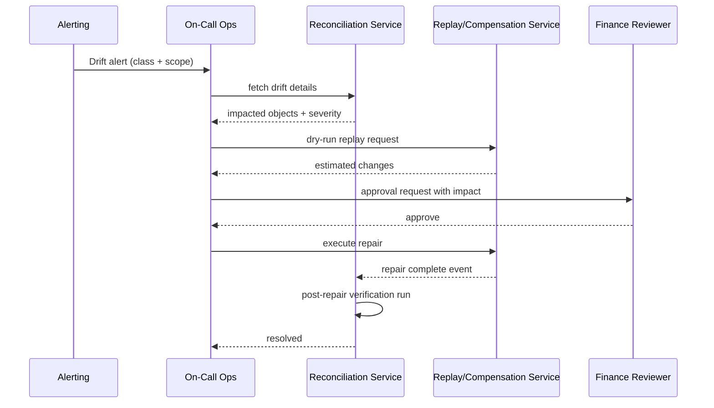

# Implementation Playbook: Versioning, Lifecycle, Proration, Entitlements, and Reconciliation

## Delivery Tracks

### Track 1: Plan/Price Versioning
- Introduce immutable plan version tables and publish workflows.
- Add subscription version pinning and migration scheduler.
- Add compatibility tests for historical invoice replay.

### Track 2: Invoice Lifecycle Hardening
- Implement explicit state machine guards.
- Add finalization locking, transition audit rows, and event emission contracts.
- Build invoice document issuance retry with deduplication keys.

### Track 3: Proration Engine
- Build deterministic proration calculator library with policy plug-ins.
- Add golden test vectors by currency/rounding mode.
- Enforce idempotency keys for amendment-driven invoice line generation.

### Track 4: Entitlement Enforcement
- Implement low-latency decision API with grace handling.
- Build event projector and lag monitors.
- Add fallback behavior for temporary projection staleness.

### Track 5: Reconciliation and Recovery
- Implement hourly/daily recon jobs and drift classifier.
- Implement replay and compensation workflows with authorization gates.
- Add closure validation step to prevent unresolved drift.

## Recommended Rollout Sequence
1. Ship versioning schema behind write-disabled feature flag.
2. Enable invoice state machine auditing.
3. Enable proration engine in shadow mode and compare outputs.
4. Cut over entitlement runtime checks with soft-enforcement logging.
5. Activate reconciliation alerts as warn-only, then enforce incident routing.

## Test Strategy
- Unit: formula correctness, state transition guards, policy resolution.
- Integration: subscription amendment to invoice lines to entitlement outcomes.
- E2E: failed payment + grace period + suspension + recovery.
- Non-functional: load test entitlement checks and batch recon completion windows.

## Runbook Hooks
- Every critical alert links to a remediation runbook and replay command template.
- Every manual repair requires incident ID and post-incident reconciliation report.

## Beginner Execution Guide
If your team is new to billing systems, do this first:
1. Build observability and audit logging before enabling automated recovery.
2. Roll out proration in shadow mode and compare with expected reference outputs.
3. Enable entitlement hard-blocks only after grace and fallback behavior are validated.
4. Gate recovery actions behind RBAC + approval workflows.

## Definition of Done (Per Track)
- **Versioning track**: historical invoice replay passes for existing subscriptions.
- **Lifecycle track**: illegal state transitions are blocked and audited.
- **Proration track**: deterministic outputs for repeated runs.
- **Entitlement track**: latency SLO and consistency lag thresholds are met.
- **Reconciliation track**: drift closes with documented operator steps.

## Suggested Team Ownership
- Billing team: plan/versioning, invoice lifecycle, proration engine.
- Platform team: event bus reliability, replay services, observability.
- Identity/Access team: runtime entitlement checks and projection consumers.
- Finance ops: reconciliation policy, sign-off criteria, compensating actions.

## End-to-End Delivery Phases (Implementation Ready)

### Phase 0 - Foundation
- Create schema migrations for plan_version, invoice transitions, and recon entities.
- Add event schema registry and compatibility checks in CI.
- Implement correlation ID propagation library.

### Phase 1 - Core Billing Controls
- Implement invoice lifecycle state machine and guard validations.
- Implement deterministic proration module with currency abstraction.
- Add contract tests for webhook and payment-state transitions.

### Phase 2 - Entitlement Coupling
- Build entitlement runtime decision API + projection updater.
- Add grace-policy evaluator and safe defaults for delayed payment states.
- Introduce shadow evaluation mode before hard enforcement.

### Phase 3 - Reconciliation and Repair
- Implement hourly/daily recon jobs with drift classifier.
- Build replay engine with dry-run compare and signed approvals.
- Implement compensation workflow for finalized financial artifacts.

## Runbook: Drift Resolution (Step-by-Step)
1. Identify drift class and affected scope (`invoice_ids`, tenant, period).
2. Pause conflicting automation if Class A/Sev-1.
3. Execute replay in dry-run mode and inspect impact summary.
4. Obtain required approvals for non-dry-run replay or compensation.
5. Execute repair action; collect correlation IDs.
6. Re-run targeted reconciliation and verify zero unresolved drift.
7. Publish post-incident summary and preventive action items.

## Mermaid Sequence: Incident to Closure

## CI/CD Quality Gates
- Block deploy if event schema compatibility check fails.
- Block deploy if proration golden tests fail.
- Block deploy if invoice lifecycle transition tests fail.
- Warn-only gate for entitlement lag in early rollout; strict gate after stabilization.
