# Cloud Architecture

**Platform:** Subscription Billing and Entitlements Platform  
**Primary Region:** us-east-1 (N. Virginia)  
**DR Region:** us-west-2 (Oregon)  
**Compliance:** PCI DSS 4.0, SOC 2 Type II  
**Last Updated:** 2025

---

## Architecture Overview

The platform is deployed entirely on AWS and is organised into two compliance zones: the **Cardholder Data Environment (CDE)** zone, which processes and stores payment data, and the **Non-CDE** zone, which handles public-facing traffic and content delivery. Zone separation is enforced at the VPC subnet level, with distinct IAM roles, KMS keys, and CloudTrail trails per zone.

```mermaid
graph TB
    subgraph "Non-CDE Zone"
        CF[CloudFront CDN\nstatic assets, API caching]
        R53[Route 53\nDNS + health-based routing]
        S3_STATIC[S3: static-assets\npublic, versioned]
        ACM_PUB[ACM Public Certificate]
    end

    subgraph "Edge (Public Subnets)"
        ALB[Application Load Balancer\nHTTPS:443]
        WAF[AWS WAF + Shield Advanced]
        NLB[Network Load Balancer\noptional TCP passthrough]
    end

    subgraph "CDE Zone — Application Tier (Private Subnets)"
        EKS[EKS Cluster\nbilling-platform namespace]
        VAULT[HashiCorp Vault\nsecrets management]
        ECR[ECR Private Registry\ncontainer images]
        SQS[SQS Queues\nasync job processing]
        SNS[SNS Topics\nfan-out notifications]
        MSK[Amazon MSK\nKafka billing events]
    end

    subgraph "CDE Zone — Data Tier (Isolated Subnets)"
        RDS[RDS PostgreSQL 16\nMulti-AZ Primary + 2 Replicas]
        REDIS[ElastiCache Redis 7\nCluster Mode, 6 shards]
        S3_INV[S3: invoice-pdfs\nencrypted, versioned, lifecycle]
        KMS[AWS KMS\nper-resource encryption keys]
    end

    subgraph "Security and Compliance"
        CT[CloudTrail\nmulti-region trail]
        CFG[AWS Config\ncontinuous compliance]
        GD[GuardDuty\nthreat detection]
        INS[Inspector\nvulnerability scanning]
        SH[Security Hub\ncentralised findings]
        MACIE[Macie\nS3 sensitive data discovery]
    end

    subgraph "Observability"
        CW[CloudWatch\nmetrics + logs + alarms]
        CW_DASH[CloudWatch Dashboards]
        CW_ALARM[CloudWatch Alarms → SNS]
    end

    subgraph "DR Region: us-west-2"
        RDS_DR[RDS Read Replica\ncross-region]
        S3_DR[S3: cross-region replication\ninvoice PDFs]
        ECR_DR[ECR Replication\ncontainer images]
    end

    R53 --> CF & ALB
    CF --> S3_STATIC
    WAF --> ALB
    ALB --> EKS
    EKS --> RDS & REDIS & MSK & SQS & SNS
    EKS --> S3_INV & VAULT & ECR
    KMS -.->|encrypts| RDS & REDIS & S3_INV & SQS
    RDS --> RDS_DR
    S3_INV --> S3_DR
    CT & CFG & GD & INS & SH --> CW
    CW --> CW_ALARM --> SNS
```



---

## AWS Regions

### Primary Region: us-east-1

All production workloads run in us-east-1. This region is chosen for its lowest latency to US financial infrastructure, its full service availability for all required AWS services, and its colocation with major payment gateway data centres.

**Resources in us-east-1:**
- EKS cluster (3 worker node groups across 3 AZs)
- RDS PostgreSQL Multi-AZ primary + 2 read replicas
- ElastiCache Redis cluster (6 shards, 3 AZs)
- Amazon MSK (3 brokers, 3 AZs)
- ALB, WAF, Shield Advanced
- CloudFront distribution (edge, global but origin in us-east-1)
- All KMS keys (CMKs)
- S3 buckets (primary)

### Disaster Recovery Region: us-west-2

The DR region maintains a warm standby capable of accepting traffic within **60 minutes** (RTO) with a maximum data loss of **15 minutes** (RPO).

**Resources in us-west-2:**
- RDS cross-region read replica (promoted to primary during failover)
- S3 buckets with cross-region replication (CRR) enabled
- ECR replication for all production container images
- Route53 health check + failover routing policy
- Pre-deployed EKS node groups (scaled to 0, scale-up procedure automated via runbook)

---

## PCI DSS Zone Separation

### CDE Zone

The CDE encompasses all resources that process, store, or transmit cardholder data:

| Resource | PCI DSS Requirement | Control |
|---|---|---|
| RDS PostgreSQL | Req 3: Protect stored account data | Encryption at rest (KMS CMK), TDE |
| ElastiCache Redis | Req 3: Protect stored account data | Encryption at rest and in-transit |
| payment-service (EKS) | Req 6: Secure systems and software | Container image scanning, no root |
| billing-engine (EKS) | Req 6: Secure systems and software | Container image scanning, no root |
| MSK (Kafka) | Req 4: Protect data in transit | TLS 1.2+, client certificate auth |
| S3: invoice-pdfs | Req 3: Protect stored data | SSE-KMS, no public access |

### Non-CDE Zone

Resources that do not process cardholder data but are in the network path:

| Resource | Scope Reduction Control |
|---|---|
| CloudFront CDN | Never caches CHD; TLS termination only |
| S3: static-assets | No CHD; public read-only bucket |
| Route53 | DNS only; no data storage |
| SQS / SNS | Message payloads are tokenised references only |

---

## EKS Configuration

### Cluster Setup

```
Cluster Name:   billing-platform-prod
Kubernetes:     1.29
CNI:            AWS VPC CNI (pod IPs from VPC CIDR)
Service Mesh:   Istio 1.21 (strict mTLS)
Node Groups:
  - application-nodes: m6i.2xlarge × 9 (3 per AZ), 8 vCPU, 32GB RAM
  - storage-nodes:     r6i.4xlarge × 3 (1 per AZ), 16 vCPU, 128GB RAM (for stateful sets)
  - system-nodes:      m6i.xlarge × 3 (1 per AZ), 4 vCPU, 16GB RAM (Istio, CoreDNS, etc.)
```

### EKS Add-ons

| Add-on | Version | Purpose |
|---|---|---|
| aws-ebs-csi-driver | Latest | EBS volume provisioning |
| aws-efs-csi-driver | Latest | EFS shared storage |
| vpc-cni | Latest | Pod networking |
| kube-proxy | Matches K8s version | Service networking |
| coredns | Latest | DNS resolution |

### IRSA (IAM Roles for Service Accounts)

Each service has a dedicated IAM Role with the minimum required permissions, bound to its Kubernetes service account via IRSA. No service uses node-level IAM roles for data access.

```
billing-engine-sa → iam-role-billing-engine
  Permissions: rds:DescribeDBInstances, s3:PutObject (invoice-pdfs), kms:GenerateDataKey
  
payment-service-sa → iam-role-payment-service
  Permissions: secretsmanager:GetSecretValue (stripe credentials), kms:Decrypt
  
notification-service-sa → iam-role-notification-service
  Permissions: ses:SendEmail, sns:Publish, sqs:ReceiveMessage, sqs:DeleteMessage
```

---

## RDS PostgreSQL

```
Engine:             PostgreSQL 16.2
Instance (Primary): db.r6g.4xlarge (16 vCPU, 128GB RAM)
Instance (Replica): db.r6g.2xlarge (8 vCPU, 64GB RAM) × 2
Storage:            gp3, 2TB, 6000 IOPS, 250 MB/s throughput
Encryption:         aws/rds KMS CMK (CDE-specific key)
Multi-AZ:           Enabled (automatic failover, ~60s)
Read Replicas:      2 in us-east-1 (read scale-out)
                    1 in us-west-2 (cross-region DR)
Automated Backups:  Enabled, 35-day retention
Backup Window:      02:00–03:00 UTC daily
Maintenance Window: Sun 04:00–05:00 UTC
Parameter Group:    ssl=1, rds.force_ssl=1
Deletion Protection: Enabled
```

### Automated Backup Strategy

- **Automated snapshots:** RDS takes daily snapshots during the backup window. Retention is 35 days (maximum PCI DSS audit coverage).
- **Transaction log backups:** Continuous, 5-minute intervals, enabling point-in-time recovery (PITR) to any second within the retention window.
- **Manual snapshots:** Taken before every schema migration and retained for 90 days.
- **Cross-region copy:** Daily automated snapshot is copied to us-west-2 for DR, achieving the 15-minute RPO when combined with the cross-region read replica replication lag.

---

## ElastiCache Redis

```
Engine:            Redis 7.2
Mode:              Cluster Mode Enabled
Shards:            6 (3 primary + 3 replica, one per AZ)
Node Type:         cache.r7g.xlarge (4 vCPU, 26.32GB RAM)
Encryption:        At-rest (AWS KMS CMK) + In-transit (TLS 1.2+)
Auth:              Redis AUTH token (stored in Secrets Manager)
Automatic Failover: Enabled
Backup:            Daily, 7-day retention
```

**Cache usage by service:**

| Service | Cache Keys | TTL | Purpose |
|---|---|---|---|
| entitlement-service | `ent:{account_id}:{feature}` | 5 min | Feature flag / quota cache |
| usage-service | `usage:{account_id}:{period}` | 1 hour | Aggregated usage counters |
| billing-engine | `idem:{key}` | 24 hours | Idempotency store |
| api-gateway | `ratelimit:{tenant_id}` | 1 min | Rate limiter counters |
| subscription-service | `sub:{account_id}` | 10 min | Subscription state cache |

---

## Amazon MSK (Kafka)

```
Version:           3.6.0
Brokers:           3 (one per AZ)
Instance Type:     kafka.m5.2xlarge (8 vCPU, 32GB RAM)
Storage:           2TB EBS gp3 per broker
Encryption:        TLS in-transit (TLS 1.2+), SSE-KMS at rest
Authentication:    mTLS (client certificates via ACM Private CA)
Replication Factor: 3 (all topics)
Min In-Sync Replicas: 2
```

**Kafka Topics:**

| Topic | Partitions | Retention | Consumers |
|---|---|---|---|
| billing-events | 24 | 7 days | billing-engine, dunning-service |
| invoice-events | 12 | 30 days | notification-service, audit-service |
| payment-events | 12 | 30 days | dunning-service, reconciliation-job |
| entitlement-events | 12 | 7 days | entitlement-service |
| subscription-lifecycle | 12 | 30 days | billing-engine, notification-service |
| usage-ingest | 48 | 1 day | usage-service (high-throughput) |

---

## Amazon ECR

```
Registry Type:    Private
Encryption:       SSE-KMS (CDE KMS CMK)
Image Scanning:   Enhanced scanning (Amazon Inspector) on push
Immutable Tags:   Enabled (no tag overwrite)
Lifecycle Policy:
  - Keep last 10 tagged production images per repository
  - Delete untagged images older than 7 days
  - Delete images tagged "dev-*" older than 30 days
Cross-Region Replication: us-east-1 → us-west-2 (all repositories)
```

All container images are built in CI/CD (GitHub Actions) and pushed to ECR. Images are not pulled from Docker Hub in production; all base images are mirrored to ECR on a scheduled basis and scanned before use.

---

## S3 Buckets

### `billing-invoice-pdfs-{account-id}` (CDE)

```
Access:           Private (no public access block: all enabled)
Encryption:       SSE-KMS (CDE KMS CMK)
Versioning:       Enabled
Object Lock:      Compliance mode, 7-year retention (financial records)
Replication:      CRR to us-west-2 (billing-invoice-pdfs-dr-{account-id})
Lifecycle:
  - Transition to S3 Intelligent-Tiering after 90 days
  - Transition to S3 Glacier Flexible Retrieval after 2 years
Access Logging:   Enabled → billing-access-logs bucket
```

### `billing-static-assets-{account-id}` (Non-CDE)

```
Access:           Public read (via CloudFront OAC only)
Encryption:       SSE-S3 (AES-256)
Versioning:       Enabled
CloudFront OAC:   Origin access control — direct S3 access blocked
Cache-Control:    max-age=31536000 (immutable assets), max-age=300 (index.html)
```

### `billing-audit-logs-{account-id}`

```
Access:           Private, accessible only by audit IAM role
Encryption:       SSE-KMS (audit-specific KMS CMK)
Object Lock:      Compliance mode, 12-month retention (PCI DSS Req 10.7)
Replication:      CRR to us-west-2
MFA Delete:       Enabled
```

---

## KMS Key Management

Separate CMKs are used for different data classifications, following the principle that a compromise of one key does not expose all data.

| Key Alias | Key Type | Key Usage | Services | Rotation |
|---|---|---|---|---|
| `alias/billing-cde-rds` | Symmetric | ENCRYPT_DECRYPT | RDS (all DBs) | Annual (auto) |
| `alias/billing-cde-redis` | Symmetric | ENCRYPT_DECRYPT | ElastiCache | Annual (auto) |
| `alias/billing-cde-s3-invoices` | Symmetric | ENCRYPT_DECRYPT | S3 invoice PDFs | Annual (auto) |
| `alias/billing-cde-secrets` | Symmetric | ENCRYPT_DECRYPT | Secrets Manager | Annual (auto) |
| `alias/billing-cde-msk` | Symmetric | ENCRYPT_DECRYPT | MSK | Annual (auto) |
| `alias/billing-audit` | Symmetric | ENCRYPT_DECRYPT | CloudTrail, audit logs | Annual (auto) |
| `alias/billing-eks-secrets` | Symmetric | ENCRYPT_DECRYPT | EKS secrets encryption | Annual (auto) |

Key policies enforce that only the designated IAM roles can use each key, and key usage events are logged in CloudTrail for forensic investigation.

---

## Route53

```
Hosted Zone:          billing.example.com (public)
Internal Zone:        billing.internal (private, VPC-bound)
Health Checks:
  - api.billing.example.com: HTTP health check every 10s, 3 consecutive failures = unhealthy
  - Failover policy: PRIMARY (us-east-1 ALB) → SECONDARY (us-west-2 ALB)
  - Evaluate target health: enabled on alias records
DNSSEC:               Enabled
Query Logging:        Enabled → CloudWatch Logs
```

### DNS Records

| Record | Type | Target | TTL |
|---|---|---|---|
| `api.billing.example.com` | A (Alias) | ALB us-east-1 | 60s |
| `admin.billing.example.com` | A (Alias) | ALB us-east-1 | 60s |
| `assets.billing.example.com` | A (Alias) | CloudFront distribution | 300s |
| `api-dr.billing.example.com` | A (Alias) | ALB us-west-2 (manual failover) | 60s |

---

## SQS and SNS

### SQS Queues

| Queue | Type | Visibility Timeout | DLQ After | Encryption |
|---|---|---|---|---|
| billing-invoice-generation | Standard | 300s | 3 attempts | SSE-KMS |
| billing-payment-processing | Standard | 120s | 3 attempts | SSE-KMS |
| billing-dunning-schedule | Standard | 600s | 3 attempts | SSE-KMS |
| billing-notification-dispatch | Standard | 60s | 5 attempts | SSE-KMS |
| billing-reconciliation-job | Standard | 3600s | 2 attempts | SSE-KMS |
| billing-invoice-generation-dlq | Standard | 3600s | — | SSE-KMS |
| billing-payment-processing-dlq | Standard | 3600s | — | SSE-KMS |

All dead letter queue messages trigger a CloudWatch alarm and a PagerDuty alert within 5 minutes of the first message arriving.

### SNS Topics

| Topic | Subscribers | Purpose |
|---|---|---|
| billing-payment-success | SQS, Lambda (webhook), notification-service | Payment confirmed |
| billing-payment-failed | SQS, dunning-service, notification-service | Payment failed |
| billing-subscription-created | SQS, entitlement-service | New subscription |
| billing-subscription-cancelled | SQS, entitlement-service, billing-engine | Subscription ended |
| billing-invoice-issued | SQS, notification-service, S3 writer | Invoice ready |
| billing-alerts | PagerDuty, Slack webhook | Operational alerts |

---

## CloudWatch Monitoring

### Key Metrics and Alarms

| Alarm | Metric | Threshold | Action |
|---|---|---|---|
| API Error Rate High | `5xx / total_requests` | > 1% for 5 min | PagerDuty P2 |
| API Latency P99 High | `TargetResponseTime P99` | > 2s for 5 min | PagerDuty P3 |
| Payment Failure Rate | `payment_failures / attempts` | > 5% for 10 min | PagerDuty P1 |
| DLQ Message Count | `ApproximateNumberOfMessagesVisible` | > 0 | PagerDuty P2 |
| RDS CPU High | `CPUUtilization` | > 80% for 10 min | PagerDuty P3 |
| RDS Storage Low | `FreeStorageSpace` | < 100GB | PagerDuty P2 |
| Redis Memory High | `DatabaseMemoryUsagePercentage` | > 80% for 5 min | PagerDuty P3 |
| EKS Node CPU High | `node_cpu_utilization` | > 85% for 5 min | Auto-scaling |
| Billing Engine Lag | `kafka_consumer_lag` | > 5000 messages | PagerDuty P2 |
| Invoice Gen Failures | `invoice_generation_errors` | > 10 in 5 min | PagerDuty P1 |

### Log Groups

| Log Group | Retention | Source |
|---|---|---|
| `/aws/eks/billing-platform/application` | 90 days | All application pods |
| `/aws/eks/billing-platform/audit` | 365 days | Kubernetes audit log |
| `/aws/rds/postgresql/billing` | 90 days | PostgreSQL slow query + error |
| `/aws/msk/billing/broker` | 30 days | Kafka broker logs |
| `/aws/cloudtrail/billing` | 365 days | CloudTrail (via S3 export) |
| `/aws/vpc/flowlogs` | 90 days | VPC Flow Logs |

---

## PCI DSS Security Controls

### AWS Security Services

| Service | PCI DSS Requirement | Configuration |
|---|---|---|
| CloudTrail | Req 10: Log and monitor all access | Multi-region, S3 + CloudWatch, 12-month retention |
| AWS Config | Req 2, 6: Secure configurations | All resources, all regions, 12-month history |
| GuardDuty | Req 11: Test security systems | S3 threat detection, malware scan on EKS enabled |
| Inspector | Req 6: Secure systems and software | Continuous ECR scanning, EC2/Lambda scanning |
| Security Hub | Req 2, 6, 10: Centralised findings | AWS Foundational + PCI DSS standard enabled |
| Macie | Req 3: Protect stored data | Automated PAN discovery in S3 buckets |
| IAM Access Analyzer | Req 7: Restrict access | External access findings, unused permissions |

### CloudTrail Configuration

```
Trail Name:         billing-platform-trail
Multi-Region:       Yes (covers all regions)
Global Services:    Yes (IAM, STS events)
S3 Bucket:          billing-audit-logs-{account-id}
CloudWatch Logs:    /aws/cloudtrail/billing
S3 Data Events:     Yes (billing-invoice-pdfs bucket)
Management Events:  All (Read + Write)
Encryption:         SSE-KMS (alias/billing-audit)
Log File Validation: Enabled
```

---

## Disaster Recovery

### DR Strategy

| Metric | Target | Mechanism |
|---|---|---|
| RTO (Recovery Time Objective) | 60 minutes | Pre-warmed EKS + Route53 failover |
| RPO (Recovery Point Objective) | 15 minutes | RDS cross-region replica lag + MSK replication |

### DR Runbook Summary

1. **Detect failure** — Route53 health check marks us-east-1 ALB as unhealthy (within 30 seconds, 3 health check failures × 10s interval).
2. **Automated DNS failover** — Route53 fails over `api.billing.example.com` to us-west-2 ALB (within 60 seconds of health check failure).
3. **Scale up EKS in us-west-2** — Automated Lambda function triggered by Route53 health check SNS notification scales EKS node group from 0 to target capacity (approximately 10 minutes for node readiness).
4. **Promote RDS replica** — DBA promotes the cross-region read replica to standalone primary in us-west-2 (approximately 5 minutes, automated via runbook script).
5. **Update application secrets** — Vault in us-west-2 is updated with new DB endpoint (automated).
6. **Verify service health** — End-to-end smoke tests run against us-west-2 endpoints.
7. **Communicate** — Incident page updated; stakeholders notified.

### DR Testing

DR failover is tested quarterly using a full simulated failover exercise. The test is performed in a dedicated staging environment that mirrors production. Actual production failover drills are performed annually during scheduled maintenance windows.
