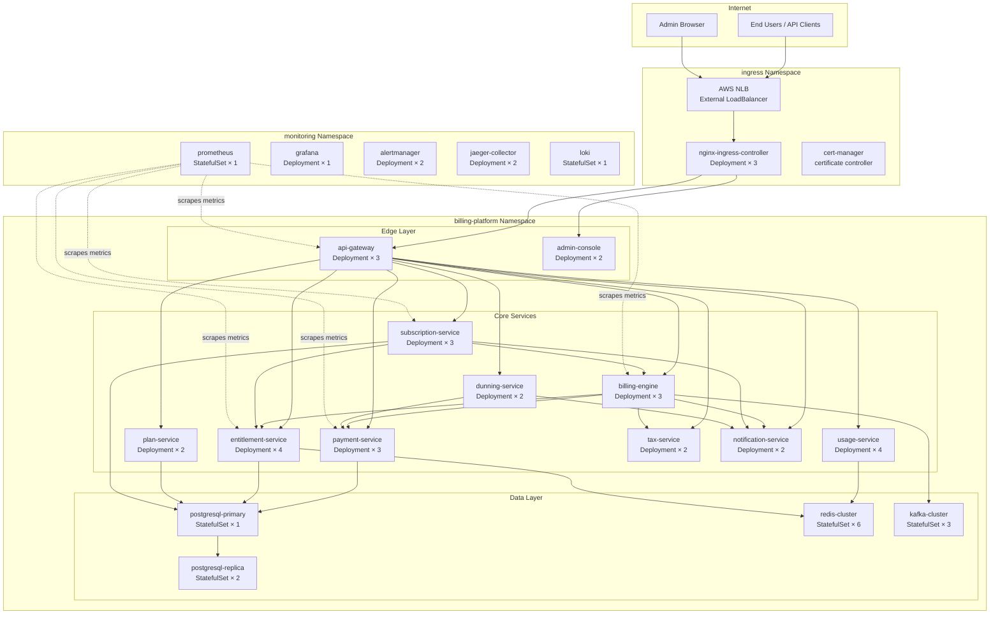

# Kubernetes Deployment Architecture

**Platform:** Subscription Billing and Entitlements Platform  
**Orchestrator:** Kubernetes 1.29+  
**Container Runtime:** containerd 1.7+  
**Last Updated:** 2025

---

## Cluster Topology Overview

The platform runs on a multi-node Kubernetes cluster organized into three namespaces: `billing-platform` (application services), `monitoring` (observability stack), and `ingress` (edge traffic management). The cluster spans three availability zones to meet the 99.99% uptime SLA required for a financial processing system.



---

## Namespaces

### `billing-platform`
Houses all application services. Resource quotas are enforced at the namespace level to prevent noisy-neighbour effects.

```yaml
apiVersion: v1
kind: ResourceQuota
metadata:
  name: billing-platform-quota
  namespace: billing-platform
spec:
  hard:
    requests.cpu: "80"
    requests.memory: 160Gi
    limits.cpu: "160"
    limits.memory: 320Gi
    pods: "200"
    services: "50"
    persistentvolumeclaims: "30"
```

### `monitoring`
Hosts Prometheus, Grafana, Alertmanager, Jaeger, and Loki. Isolated to prevent metrics traffic from affecting billing workloads.

### `ingress`
Dedicated namespace for the nginx-ingress-controller and cert-manager. Ensures ingress configuration changes do not interfere with application rollouts.

---

## Deployments: Resource Requirements

All resource values are based on load-tested P99 performance benchmarks at 10,000 concurrent subscriptions and 500 invoice-generation events per minute.

### api-gateway

```yaml
apiVersion: apps/v1
kind: Deployment
metadata:
  name: api-gateway
  namespace: billing-platform
spec:
  replicas: 3
  selector:
    matchLabels:
      app: api-gateway
  template:
    spec:
      containers:
        - name: api-gateway
          image: billing-platform/api-gateway:latest
          resources:
            requests:
              cpu: "500m"
              memory: "512Mi"
            limits:
              cpu: "2000m"
              memory: "1Gi"
          ports:
            - containerPort: 8080
          readinessProbe:
            httpGet:
              path: /healthz
              port: 8080
            initialDelaySeconds: 10
            periodSeconds: 5
          livenessProbe:
            httpGet:
              path: /healthz
              port: 8080
            initialDelaySeconds: 30
            periodSeconds: 10
```

### Service Resource Table

| Service | Replicas | CPU Request | CPU Limit | Memory Request | Memory Limit |
|---|---|---|---|---|---|
| api-gateway | 3 | 500m | 2000m | 512Mi | 1Gi |
| plan-service | 2 | 250m | 1000m | 256Mi | 512Mi |
| subscription-service | 3 | 500m | 2000m | 512Mi | 1Gi |
| usage-service | 4 | 1000m | 4000m | 1Gi | 2Gi |
| billing-engine | 3 | 1000m | 4000m | 1Gi | 2Gi |
| payment-service | 3 | 500m | 2000m | 512Mi | 1Gi |
| dunning-service | 2 | 250m | 1000m | 256Mi | 512Mi |
| entitlement-service | 4 | 500m | 2000m | 512Mi | 1Gi |
| tax-service | 2 | 250m | 1000m | 256Mi | 512Mi |
| notification-service | 2 | 250m | 1000m | 256Mi | 512Mi |
| admin-console | 2 | 250m | 1000m | 256Mi | 512Mi |

---

## StatefulSets

### postgresql-primary

```yaml
apiVersion: apps/v1
kind: StatefulSet
metadata:
  name: postgresql-primary
  namespace: billing-platform
spec:
  serviceName: postgresql-primary
  replicas: 1
  selector:
    matchLabels:
      app: postgresql-primary
  template:
    spec:
      containers:
        - name: postgresql
          image: postgres:16.2
          resources:
            requests:
              cpu: "4000m"
              memory: "8Gi"
            limits:
              cpu: "8000m"
              memory: "16Gi"
          env:
            - name: POSTGRES_DB
              valueFrom:
                secretKeyRef:
                  name: postgresql-credentials
                  key: database
            - name: POSTGRES_USER
              valueFrom:
                secretKeyRef:
                  name: postgresql-credentials
                  key: username
            - name: POSTGRES_PASSWORD
              valueFrom:
                secretKeyRef:
                  name: postgresql-credentials
                  key: password
          volumeMounts:
            - name: postgresql-data
              mountPath: /var/lib/postgresql/data
  volumeClaimTemplates:
    - metadata:
        name: postgresql-data
      spec:
        accessModes: ["ReadWriteOnce"]
        storageClassName: gp3-encrypted
        resources:
          requests:
            storage: 500Gi
```

### postgresql-replica

```yaml
apiVersion: apps/v1
kind: StatefulSet
metadata:
  name: postgresql-replica
  namespace: billing-platform
spec:
  serviceName: postgresql-replica
  replicas: 2
  template:
    spec:
      containers:
        - name: postgresql
          image: postgres:16.2
          resources:
            requests:
              cpu: "2000m"
              memory: "4Gi"
            limits:
              cpu: "4000m"
              memory: "8Gi"
  volumeClaimTemplates:
    - metadata:
        name: postgresql-data
      spec:
        accessModes: ["ReadWriteOnce"]
        storageClassName: gp3-encrypted
        resources:
          requests:
            storage: 500Gi
```

### redis-cluster

```yaml
apiVersion: apps/v1
kind: StatefulSet
metadata:
  name: redis-cluster
  namespace: billing-platform
spec:
  serviceName: redis-cluster
  replicas: 6
  template:
    spec:
      containers:
        - name: redis
          image: redis:7.2-alpine
          resources:
            requests:
              cpu: "500m"
              memory: "2Gi"
            limits:
              cpu: "2000m"
              memory: "4Gi"
          command: ["redis-server", "/conf/redis.conf"]
          volumeMounts:
            - name: redis-data
              mountPath: /data
            - name: redis-config
              mountPath: /conf
  volumeClaimTemplates:
    - metadata:
        name: redis-data
      spec:
        accessModes: ["ReadWriteOnce"]
        storageClassName: gp3-encrypted
        resources:
          requests:
            storage: 50Gi
```

### kafka-cluster

```yaml
apiVersion: apps/v1
kind: StatefulSet
metadata:
  name: kafka-cluster
  namespace: billing-platform
spec:
  serviceName: kafka-cluster
  replicas: 3
  template:
    spec:
      containers:
        - name: kafka
          image: confluentinc/cp-kafka:7.6.0
          resources:
            requests:
              cpu: "2000m"
              memory: "4Gi"
            limits:
              cpu: "4000m"
              memory: "8Gi"
  volumeClaimTemplates:
    - metadata:
        name: kafka-data
      spec:
        accessModes: ["ReadWriteOnce"]
        storageClassName: gp3-encrypted
        resources:
          requests:
            storage: 200Gi
```

---

## HorizontalPodAutoscaler Configurations

HPA is configured for the four highest-throughput services. Scaling is based on CPU utilisation combined with custom metrics (requests-per-second from Prometheus) via the custom metrics API.

### usage-service HPA

```yaml
apiVersion: autoscaling/v2
kind: HorizontalPodAutoscaler
metadata:
  name: usage-service-hpa
  namespace: billing-platform
spec:
  scaleTargetRef:
    apiVersion: apps/v1
    kind: Deployment
    name: usage-service
  minReplicas: 4
  maxReplicas: 20
  metrics:
    - type: Resource
      resource:
        name: cpu
        target:
          type: Utilization
          averageUtilization: 65
    - type: Pods
      pods:
        metric:
          name: http_requests_per_second
        target:
          type: AverageValue
          averageValue: "500"
  behavior:
    scaleUp:
      stabilizationWindowSeconds: 60
      policies:
        - type: Pods
          value: 4
          periodSeconds: 60
    scaleDown:
      stabilizationWindowSeconds: 300
      policies:
        - type: Pods
          value: 2
          periodSeconds: 120
```

### entitlement-service HPA

```yaml
apiVersion: autoscaling/v2
kind: HorizontalPodAutoscaler
metadata:
  name: entitlement-service-hpa
  namespace: billing-platform
spec:
  scaleTargetRef:
    apiVersion: apps/v1
    kind: Deployment
    name: entitlement-service
  minReplicas: 4
  maxReplicas: 16
  metrics:
    - type: Resource
      resource:
        name: cpu
        target:
          type: Utilization
          averageUtilization: 60
    - type: Pods
      pods:
        metric:
          name: entitlement_check_rate
        target:
          type: AverageValue
          averageValue: "1000"
  behavior:
    scaleUp:
      stabilizationWindowSeconds: 30
    scaleDown:
      stabilizationWindowSeconds: 300
```

### billing-engine HPA

```yaml
apiVersion: autoscaling/v2
kind: HorizontalPodAutoscaler
metadata:
  name: billing-engine-hpa
  namespace: billing-platform
spec:
  scaleTargetRef:
    apiVersion: apps/v1
    kind: Deployment
    name: billing-engine
  minReplicas: 3
  maxReplicas: 12
  metrics:
    - type: Resource
      resource:
        name: cpu
        target:
          type: Utilization
          averageUtilization: 70
    - type: External
      external:
        metric:
          name: kafka_consumer_lag
          selector:
            matchLabels:
              topic: billing-events
        target:
          type: AverageValue
          averageValue: "1000"
```

### api-gateway HPA

```yaml
apiVersion: autoscaling/v2
kind: HorizontalPodAutoscaler
metadata:
  name: api-gateway-hpa
  namespace: billing-platform
spec:
  scaleTargetRef:
    apiVersion: apps/v1
    kind: Deployment
    name: api-gateway
  minReplicas: 3
  maxReplicas: 10
  metrics:
    - type: Resource
      resource:
        name: cpu
        target:
          type: Utilization
          averageUtilization: 60
```

---

## PersistentVolumeClaims

All persistent storage uses the `gp3-encrypted` StorageClass which provisions AWS EBS gp3 volumes with AES-256 encryption via the default AWS KMS key for the account. This is mandatory for PCI DSS compliance (Requirement 3.5).

```yaml
apiVersion: storage.k8s.io/v1
kind: StorageClass
metadata:
  name: gp3-encrypted
provisioner: ebs.csi.aws.com
parameters:
  type: gp3
  encrypted: "true"
  kmsKeyId: "arn:aws:kms:us-east-1:ACCOUNT_ID:key/billing-platform-key"
  throughput: "250"
  iops: "4000"
volumeBindingMode: WaitForFirstConsumer
reclaimPolicy: Retain
allowVolumeExpansion: true
```

| Volume | Size | IOPS | Throughput | Service |
|---|---|---|---|---|
| postgresql-primary-data | 500Gi | 4000 | 250 MB/s | postgresql-primary |
| postgresql-replica-data | 500Gi | 3000 | 125 MB/s | postgresql-replica × 2 |
| redis-cluster-data | 50Gi | 3000 | 125 MB/s | redis-cluster × 6 |
| kafka-cluster-data | 200Gi | 4000 | 250 MB/s | kafka-cluster × 3 |
| prometheus-data | 100Gi | 3000 | 125 MB/s | prometheus |
| loki-data | 200Gi | 3000 | 125 MB/s | loki |

---

## ConfigMaps and Secrets Management

### Approach: HashiCorp Vault + Kubernetes Secrets Operator

Secrets are managed by HashiCorp Vault running in a dedicated `vault` namespace. The Vault Secrets Operator (VSO) synchronises Vault secrets into Kubernetes Secrets, which are then projected into pods as environment variables or volume mounts. Kubernetes Secrets themselves are encrypted at rest using AWS KMS via the Kubernetes KMS provider plugin.

```
Vault (source of truth)
  └─► Vault Secrets Operator (watches VaultStaticSecret CRDs)
        └─► Kubernetes Secret (encrypted at rest via KMS)
              └─► Pod (env var injection / mounted volume)
```

**Vault secret paths:**

| Secret Path | Contents | Rotation Period |
|---|---|---|
| `billing/postgresql` | DB username, password, connection string | 90 days |
| `billing/redis` | Redis AUTH password | 90 days |
| `billing/stripe` | API key, webhook secret | 30 days |
| `billing/paypal` | Client ID, client secret | 30 days |
| `billing/jwt` | JWT signing key (RS256 private key) | 365 days |
| `billing/encryption` | Field-level encryption keys | 365 days |
| `billing/smtp` | SMTP credentials for notifications | 180 days |

**VaultStaticSecret example:**

```yaml
apiVersion: secrets.hashicorp.com/v1beta1
kind: VaultStaticSecret
metadata:
  name: postgresql-credentials
  namespace: billing-platform
spec:
  type: kv-v2
  mount: billing
  path: postgresql
  destination:
    name: postgresql-credentials
    create: true
  refreshAfter: 1h
  vaultAuthRef: billing-platform-auth
```

### Non-sensitive Configuration: ConfigMaps

```yaml
apiVersion: v1
kind: ConfigMap
metadata:
  name: billing-engine-config
  namespace: billing-platform
data:
  BILLING_CYCLE_CRON: "0 2 * * *"
  INVOICE_DUE_DAYS: "14"
  GRACE_PERIOD_DAYS: "3"
  MAX_RETRY_ATTEMPTS: "4"
  DUNNING_INTERVAL_DAYS: "3,7,14,21"
  TAX_SERVICE_TIMEOUT_MS: "5000"
  PAYMENT_GATEWAY_TIMEOUT_MS: "30000"
  KAFKA_BILLING_TOPIC: "billing-events"
  KAFKA_INVOICE_TOPIC: "invoice-events"
  LOG_LEVEL: "info"
  OTEL_EXPORTER_OTLP_ENDPOINT: "http://jaeger-collector.monitoring:4317"
```

---

## Service Definitions

### ClusterIP Services (Internal)

All inter-service communication uses ClusterIP services. Service discovery relies on Kubernetes DNS (`service-name.namespace.svc.cluster.local`).

```yaml
apiVersion: v1
kind: Service
metadata:
  name: billing-engine
  namespace: billing-platform
spec:
  type: ClusterIP
  selector:
    app: billing-engine
  ports:
    - name: grpc
      port: 9090
      targetPort: 9090
    - name: metrics
      port: 9091
      targetPort: 9091
```

| Service | Type | Port | Protocol |
|---|---|---|---|
| api-gateway | LoadBalancer | 443 | HTTPS |
| admin-console | LoadBalancer | 443 | HTTPS |
| plan-service | ClusterIP | 9090 | gRPC |
| subscription-service | ClusterIP | 9090 | gRPC |
| usage-service | ClusterIP | 9090 | gRPC |
| billing-engine | ClusterIP | 9090 | gRPC |
| payment-service | ClusterIP | 9090 | gRPC |
| dunning-service | ClusterIP | 9090 | gRPC |
| entitlement-service | ClusterIP | 9090 | gRPC |
| tax-service | ClusterIP | 9090 | gRPC |
| notification-service | ClusterIP | 9090 | gRPC |
| postgresql-primary | ClusterIP | 5432 | TCP |
| postgresql-replica | ClusterIP | 5432 | TCP |
| redis-cluster | ClusterIP | 6379 | TCP |
| kafka-cluster | ClusterIP | 9092 | TCP |

---

## Ingress Rules with TLS Termination

TLS certificates are provisioned automatically by cert-manager using Let's Encrypt (production) for public endpoints. The certificate is a wildcard cert for `*.billing.example.com`.

```yaml
apiVersion: networking.k8s.io/v1
kind: Ingress
metadata:
  name: billing-platform-ingress
  namespace: billing-platform
  annotations:
    kubernetes.io/ingress.class: nginx
    cert-manager.io/cluster-issuer: letsencrypt-production
    nginx.ingress.kubernetes.io/ssl-redirect: "true"
    nginx.ingress.kubernetes.io/force-ssl-redirect: "true"
    nginx.ingress.kubernetes.io/proxy-body-size: "10m"
    nginx.ingress.kubernetes.io/proxy-read-timeout: "60"
    nginx.ingress.kubernetes.io/proxy-connect-timeout: "10"
    nginx.ingress.kubernetes.io/limit-rps: "200"
    nginx.ingress.kubernetes.io/limit-connections: "50"
    nginx.ingress.kubernetes.io/enable-modsecurity: "true"
    nginx.ingress.kubernetes.io/enable-owasp-core-rules: "true"
spec:
  tls:
    - hosts:
        - api.billing.example.com
        - admin.billing.example.com
      secretName: billing-platform-tls
  rules:
    - host: api.billing.example.com
      http:
        paths:
          - path: /v1/plans
            pathType: Prefix
            backend:
              service:
                name: api-gateway
                port:
                  number: 8080
          - path: /v1/subscriptions
            pathType: Prefix
            backend:
              service:
                name: api-gateway
                port:
                  number: 8080
          - path: /v1/usage
            pathType: Prefix
            backend:
              service:
                name: api-gateway
                port:
                  number: 8080
          - path: /v1/invoices
            pathType: Prefix
            backend:
              service:
                name: api-gateway
                port:
                  number: 8080
          - path: /v1/entitlements
            pathType: Prefix
            backend:
              service:
                name: api-gateway
                port:
                  number: 8080
          - path: /webhooks
            pathType: Prefix
            backend:
              service:
                name: api-gateway
                port:
                  number: 8080
    - host: admin.billing.example.com
      http:
        paths:
          - path: /
            pathType: Prefix
            backend:
              service:
                name: admin-console
                port:
                  number: 8080
```

### Minimum TLS Configuration (nginx-ingress)

```yaml
apiVersion: v1
kind: ConfigMap
metadata:
  name: nginx-configuration
  namespace: ingress
data:
  ssl-protocols: "TLSv1.2 TLSv1.3"
  ssl-ciphers: "ECDHE-ECDSA-AES128-GCM-SHA256:ECDHE-RSA-AES128-GCM-SHA256:ECDHE-ECDSA-AES256-GCM-SHA384:ECDHE-RSA-AES256-GCM-SHA384:ECDHE-ECDSA-CHACHA20-POLY1305:ECDHE-RSA-CHACHA20-POLY1305"
  ssl-prefer-server-ciphers: "true"
  hsts: "true"
  hsts-include-subdomains: "true"
  hsts-max-age: "31536000"
  hsts-preload: "true"
```

---

## Network Policies

Inter-namespace and intra-namespace traffic is restricted using Kubernetes NetworkPolicy resources. The default posture is deny-all, with explicit allow rules for required communication paths.

```yaml
apiVersion: networking.k8s.io/v1
kind: NetworkPolicy
metadata:
  name: default-deny-all
  namespace: billing-platform
spec:
  podSelector: {}
  policyTypes:
    - Ingress
    - Egress
---
apiVersion: networking.k8s.io/v1
kind: NetworkPolicy
metadata:
  name: allow-api-gateway-ingress
  namespace: billing-platform
spec:
  podSelector:
    matchLabels:
      app: api-gateway
  policyTypes:
    - Ingress
  ingress:
    - from:
        - namespaceSelector:
            matchLabels:
              kubernetes.io/metadata.name: ingress
      ports:
        - protocol: TCP
          port: 8080
---
apiVersion: networking.k8s.io/v1
kind: NetworkPolicy
metadata:
  name: allow-billing-engine-to-databases
  namespace: billing-platform
spec:
  podSelector:
    matchLabels:
      app: postgresql-primary
  policyTypes:
    - Ingress
  ingress:
    - from:
        - podSelector:
            matchLabels:
              db-access: "true"
      ports:
        - protocol: TCP
          port: 5432
```

---

## Pod Disruption Budgets

PDBs ensure that rolling updates and node drains do not take down more instances than the service can tolerate.

```yaml
apiVersion: policy/v1
kind: PodDisruptionBudget
metadata:
  name: billing-engine-pdb
  namespace: billing-platform
spec:
  minAvailable: 2
  selector:
    matchLabels:
      app: billing-engine
---
apiVersion: policy/v1
kind: PodDisruptionBudget
metadata:
  name: payment-service-pdb
  namespace: billing-platform
spec:
  minAvailable: 2
  selector:
    matchLabels:
      app: payment-service
---
apiVersion: policy/v1
kind: PodDisruptionBudget
metadata:
  name: postgresql-primary-pdb
  namespace: billing-platform
spec:
  minAvailable: 1
  selector:
    matchLabels:
      app: postgresql-primary
```

---

## Node Affinity and Topology Spread

Critical stateful services are pinned to dedicated node groups using node affinity rules. Application pods are spread across availability zones using topology spread constraints.

```yaml
# Topology spread for subscription-service
spec:
  topologySpreadConstraints:
    - maxSkew: 1
      topologyKey: topology.kubernetes.io/zone
      whenUnsatisfiable: DoNotSchedule
      labelSelector:
        matchLabels:
          app: subscription-service
  affinity:
    nodeAffinity:
      requiredDuringSchedulingIgnoredDuringExecution:
        nodeSelectorTerms:
          - matchExpressions:
              - key: node-type
                operator: In
                values:
                  - application
```

```yaml
# Node affinity for postgresql-primary (pinned to storage-optimised nodes)
spec:
  affinity:
    nodeAffinity:
      requiredDuringSchedulingIgnoredDuringExecution:
        nodeSelectorTerms:
          - matchExpressions:
              - key: node-type
                operator: In
                values:
                  - storage
    podAntiAffinity:
      requiredDuringSchedulingIgnoredDuringExecution:
        - labelSelector:
            matchLabels:
              app: postgresql-replica
          topologyKey: kubernetes.io/hostname
```

---

## Security Context

All pods run with a non-root security context and a read-only root filesystem where possible.

```yaml
securityContext:
  runAsNonRoot: true
  runAsUser: 1000
  runAsGroup: 1000
  fsGroup: 1000
  seccompProfile:
    type: RuntimeDefault
containers:
  - name: billing-engine
    securityContext:
      allowPrivilegeEscalation: false
      readOnlyRootFilesystem: true
      capabilities:
        drop:
          - ALL
```
