# Network Infrastructure

**Platform:** Subscription Billing and Entitlements Platform  
**Compliance:** PCI DSS 4.0, SOC 2 Type II  
**Last Updated:** 2025

---

## Overview

The platform's network architecture is designed around the principle of **defence in depth**: every tier has independent perimeter controls, all traffic is encrypted in transit, and access is granted on a least-privilege basis. The architecture explicitly separates the **Cardholder Data Environment (CDE)** from all other network zones in accordance with PCI DSS Requirement 1.

The three primary network tiers are:

| Tier | Subnet Type | PCI DSS Scope | Hosts |
|---|---|---|---|
| Edge | Public | Out-of-scope (no CHD) | Load balancers, WAF, NAT gateways |
| Application | Private | In-scope (processes CHD) | All application services, API gateway |
| Data | Isolated | In-scope (stores CHD) | PostgreSQL, Redis, Kafka |

---

## Network Topology

```mermaid
graph TB
    INTERNET([Internet])

    subgraph "AWS Region us-east-1"
        subgraph "VPC: 10.0.0.0/16"
            subgraph "Public Subnets (Edge Tier)"
                PUB_AZ1["Public AZ-1\n10.0.0.0/24"]
                PUB_AZ2["Public AZ-2\n10.0.16.0/24"]
                PUB_AZ3["Public AZ-3\n10.0.32.0/24"]
                ALB[Application Load Balancer]
                WAF[AWS WAF + Shield Advanced]
                NAT1[NAT Gateway AZ-1]
                NAT2[NAT Gateway AZ-2]
                NAT3[NAT Gateway AZ-3]
            end

            subgraph "Private Subnets (Application Tier / CDE)"
                PRIV_AZ1["Private AZ-1\n10.0.64.0/24"]
                PRIV_AZ2["Private AZ-2\n10.0.80.0/24"]
                PRIV_AZ3["Private AZ-3\n10.0.96.0/24"]
                EKS[EKS Worker Nodes\nbilling-platform namespace]
                VAULT[HashiCorp Vault]
                BASTION[SSM Session Manager\nno bastion host]
            end

            subgraph "Isolated Subnets (Data Tier / CDE)"
                ISO_AZ1["Isolated AZ-1\n10.0.128.0/24"]
                ISO_AZ2["Isolated AZ-2\n10.0.144.0/24"]
                ISO_AZ3["Isolated AZ-3\n10.0.160.0/24"]
                RDS_PRI[RDS PostgreSQL Primary]
                RDS_REP[RDS PostgreSQL Replica × 2]
                REDIS[ElastiCache Redis Cluster]
                MSK[Amazon MSK\nKafka Cluster]
            end

            subgraph "Management Subnet"
                MGMT["Management\n10.0.200.0/24"]
                PROM[Prometheus / Grafana]
                LOG[Centralized Log Aggregator]
            end
        end

        subgraph "VPN / Transit"
            VPN[AWS Site-to-Site VPN\nor AWS Direct Connect]
            CORP[Corporate Network]
        end
    end

    INTERNET --> WAF --> ALB
    ALB --> EKS
    EKS --> RDS_PRI & REDIS & MSK
    EKS --> NAT1 & NAT2 & NAT3
    NAT1 & NAT2 & NAT3 --> INTERNET
    CORP --> VPN --> MGMT
    MGMT --> EKS & RDS_PRI & REDIS
    EKS --> VAULT
```



---

## VPC Design

### CIDR Allocation

| Zone | CIDR Block | AZs | Purpose |
|---|---|---|---|
| VPC | 10.0.0.0/16 | All | Master CIDR |
| Public AZ-1 | 10.0.0.0/24 | us-east-1a | ALB, NAT Gateway |
| Public AZ-2 | 10.0.16.0/24 | us-east-1b | ALB, NAT Gateway |
| Public AZ-3 | 10.0.32.0/24 | us-east-1c | ALB, NAT Gateway |
| Private AZ-1 | 10.0.64.0/24 | us-east-1a | EKS nodes, Vault |
| Private AZ-2 | 10.0.80.0/24 | us-east-1b | EKS nodes |
| Private AZ-3 | 10.0.96.0/24 | us-east-1c | EKS nodes |
| Isolated AZ-1 | 10.0.128.0/24 | us-east-1a | RDS Primary, Redis |
| Isolated AZ-2 | 10.0.144.0/24 | us-east-1b | RDS Replica |
| Isolated AZ-3 | 10.0.160.0/24 | us-east-1c | RDS Replica, MSK |
| Management | 10.0.200.0/24 | us-east-1a | Monitoring, audit tools |
| VPN / Transit | 10.0.240.0/24 | All | VPN endpoints |

### Routing Architecture

- **Public subnets** have a route to the internet gateway (`0.0.0.0/0 → igw-*`).
- **Private subnets** have a default route to their AZ-local NAT gateway (`0.0.0.0/0 → nat-*`). There is no direct inbound path from the internet.
- **Isolated subnets** have no default route. All traffic must originate from within the VPC; no NAT gateway routes exist. This prevents any data-tier resource from initiating outbound connections to the internet.
- **Management subnet** routes to the VPN gateway for administrator access.

---

## Security Groups

Security groups act as stateful firewalls at the instance/ENI level. All rules follow explicit-allow, implicit-deny.

### SG: alb-public-sg (Edge Tier)

| Direction | Protocol | Port | Source | Purpose |
|---|---|---|---|---|
| Inbound | TCP | 443 | 0.0.0.0/0 | HTTPS from internet |
| Inbound | TCP | 80 | 0.0.0.0/0 | HTTP redirect to HTTPS |
| Outbound | TCP | 8080 | sg-app-tier | Forward to EKS pods |
| Outbound | TCP | 443 | sg-app-tier | Webhook callbacks |

### SG: app-tier-sg (Application Tier / CDE)

| Direction | Protocol | Port | Source | Purpose |
|---|---|---|---|---|
| Inbound | TCP | 8080 | sg-alb-public | From load balancer |
| Inbound | TCP | 9090 | sg-app-tier | Inter-service gRPC |
| Inbound | TCP | 9091 | sg-monitoring | Prometheus scrape |
| Inbound | TCP | 8200 | sg-app-tier | Vault API |
| Outbound | TCP | 5432 | sg-data-tier | PostgreSQL |
| Outbound | TCP | 6379 | sg-data-tier | Redis |
| Outbound | TCP | 9092 | sg-data-tier | Kafka |
| Outbound | TCP | 443 | 0.0.0.0/0 | Egress via NAT (Stripe, PayPal, tax) |
| Outbound | TCP | 587 | 0.0.0.0/0 | SMTP for notifications |

### SG: data-tier-sg (Isolated Data Tier / CDE)

| Direction | Protocol | Port | Source | Purpose |
|---|---|---|---|---|
| Inbound | TCP | 5432 | sg-app-tier | PostgreSQL from app |
| Inbound | TCP | 6379 | sg-app-tier | Redis from app |
| Inbound | TCP | 9092 | sg-app-tier | Kafka from app |
| Inbound | TCP | 5432 | sg-management | DBA access via VPN |
| Outbound | — | — | — | No outbound rules (isolated) |

### SG: management-sg

| Direction | Protocol | Port | Source | Purpose |
|---|---|---|---|---|
| Inbound | TCP | 443 | VPN CIDR 10.0.240.0/24 | Admin HTTPS |
| Inbound | TCP | 22 | — | Denied – SSH disabled |
| Outbound | TCP | 5432 | sg-data-tier | DBA access |
| Outbound | TCP | 443 | sg-app-tier | Admin API calls |

---

## Network ACLs

NACLs provide a stateless, subnet-level defence layer that complements security groups.

### NACL: public-subnets-nacl

| Rule | Direction | Protocol | Port Range | Source | Action |
|---|---|---|---|---|---|
| 100 | Inbound | TCP | 443 | 0.0.0.0/0 | ALLOW |
| 110 | Inbound | TCP | 80 | 0.0.0.0/0 | ALLOW |
| 120 | Inbound | TCP | 1024-65535 | 0.0.0.0/0 | ALLOW (return traffic) |
| 200 | Inbound | TCP | 22 | 0.0.0.0/0 | DENY |
| 210 | Inbound | TCP | 3389 | 0.0.0.0/0 | DENY |
| 900 | Inbound | ALL | ALL | 0.0.0.0/0 | DENY |
| 100 | Outbound | TCP | 443 | 0.0.0.0/0 | ALLOW |
| 110 | Outbound | TCP | 8080 | 10.0.64.0/18 | ALLOW |
| 120 | Outbound | TCP | 1024-65535 | 0.0.0.0/0 | ALLOW |
| 900 | Outbound | ALL | ALL | 0.0.0.0/0 | DENY |

### NACL: private-subnets-nacl (CDE)

| Rule | Direction | Protocol | Port Range | Source | Action |
|---|---|---|---|---|---|
| 100 | Inbound | TCP | 8080 | 10.0.0.0/18 | ALLOW |
| 110 | Inbound | TCP | 9090-9091 | 10.0.64.0/18 | ALLOW |
| 120 | Inbound | TCP | 1024-65535 | 0.0.0.0/0 | ALLOW (return traffic) |
| 130 | Inbound | TCP | 443 | 10.0.200.0/24 | ALLOW (management) |
| 900 | Inbound | ALL | ALL | 0.0.0.0/0 | DENY |
| 100 | Outbound | TCP | 5432 | 10.0.128.0/18 | ALLOW |
| 110 | Outbound | TCP | 6379 | 10.0.128.0/18 | ALLOW |
| 120 | Outbound | TCP | 9092 | 10.0.128.0/18 | ALLOW |
| 130 | Outbound | TCP | 443 | 0.0.0.0/0 | ALLOW (NAT → internet) |
| 140 | Outbound | TCP | 1024-65535 | 0.0.0.0/0 | ALLOW (return traffic) |
| 900 | Outbound | ALL | ALL | 0.0.0.0/0 | DENY |

### NACL: isolated-subnets-nacl (CDE Data)

| Rule | Direction | Protocol | Port Range | Source | Action |
|---|---|---|---|---|---|
| 100 | Inbound | TCP | 5432 | 10.0.64.0/18 | ALLOW (app tier) |
| 110 | Inbound | TCP | 6379 | 10.0.64.0/18 | ALLOW |
| 120 | Inbound | TCP | 9092 | 10.0.64.0/18 | ALLOW |
| 130 | Inbound | TCP | 5432 | 10.0.200.0/24 | ALLOW (management) |
| 900 | Inbound | ALL | ALL | 0.0.0.0/0 | DENY |
| 100 | Outbound | TCP | 1024-65535 | 10.0.64.0/18 | ALLOW (return traffic) |
| 110 | Outbound | TCP | 1024-65535 | 10.0.200.0/24 | ALLOW |
| 900 | Outbound | ALL | ALL | 0.0.0.0/0 | DENY |

---

## PCI DSS Network Requirements

### Requirement 1: Install and Maintain Network Security Controls

- All network boundaries between CDE and non-CDE are protected by security groups and NACLs operating in default-deny mode.
- Firewall rule reviews are conducted quarterly. Rules without documented business justification are removed.
- The CDE boundary is formally documented: any service that processes, stores, or transmits cardholder data (payment-service, billing-engine, postgresql-primary) resides in private or isolated subnets.

### Requirement 1.3: Prohibited Inbound/Outbound Traffic

The following inbound traffic is explicitly prohibited at the NACL level regardless of security group rules:

| Service | Direction | Action | Rationale |
|---|---|---|---|
| Telnet (TCP 23) | Inbound/Outbound | DENY | Cleartext credential transmission |
| FTP (TCP 20/21) | Inbound/Outbound | DENY | Cleartext data transmission |
| SSH (TCP 22) | Inbound from Internet | DENY | Admin access via SSM only |
| RDP (TCP 3389) | Inbound from Internet | DENY | No Windows workloads |
| HTTP (TCP 80) | Inbound to CDE | DENY | All CDE traffic must be TLS |
| SNMP v1/v2 (UDP 161) | All | DENY | Insecure protocol |

### Requirement 1.4: Network Connections Between Trusted/Untrusted Networks

The ALB and WAF form the only approved path from untrusted (internet) to the CDE. Direct connectivity from any client IP to private or isolated subnets is architecturally impossible — there are no public IP addresses assigned to resources in those subnets.

---

## TLS Everywhere Policy

All communication paths enforce TLS. The minimum version is **TLS 1.2**; **TLS 1.3** is preferred and negotiated by default for all modern clients.

### Approved Cipher Suites (TLS 1.2)

```
ECDHE-ECDSA-AES256-GCM-SHA384
ECDHE-RSA-AES256-GCM-SHA384
ECDHE-ECDSA-AES128-GCM-SHA256
ECDHE-RSA-AES128-GCM-SHA256
ECDHE-ECDSA-CHACHA20-POLY1305
ECDHE-RSA-CHACHA20-POLY1305
```

Cipher suites using RC4, DES, 3DES, MD5, SHA-1, or non-forward-secret key exchange (RSA key exchange) are explicitly disabled.

### TLS Coverage by Connection Type

| Connection | TLS Version | Certificate Source | mTLS |
|---|---|---|---|
| Client → ALB | TLS 1.2+ | ACM (public CA) | No |
| ALB → EKS pods | TLS 1.2+ | ACM private CA | No |
| EKS pod → EKS pod | TLS 1.3 | Istio / SPIFFE X.509 | Yes |
| EKS pod → RDS | TLS 1.2+ | ACM private CA | No |
| EKS pod → Redis | TLS 1.2+ | ACM private CA | No |
| EKS pod → Kafka | TLS 1.2+ | ACM private CA | No |
| EKS pod → Stripe API | TLS 1.3 | Stripe CA (pinned) | No |
| EKS pod → PayPal API | TLS 1.3 | PayPal CA (pinned) | No |
| Admin VPN → Management | TLS 1.3 | Internal PKI | Yes |

---

## API Gateway Security

### AWS WAF Rule Groups

The following AWS WAF managed rule groups are active on the ALB:

| Rule Group | Action | Purpose |
|---|---|---|
| AWSManagedRulesCommonRuleSet | Block | OWASP Top 10 baseline protection |
| AWSManagedRulesKnownBadInputsRuleSet | Block | Log4j, Spring4Shell, known exploits |
| AWSManagedRulesSQLiRuleSet | Block | SQL injection prevention |
| AWSManagedRulesAmazonIpReputationList | Block | Botnets and known malicious IPs |
| AWSManagedRulesAnonymousIpList | Count + Alert | Tor, VPN, proxy detection |

**Custom WAF rules:**

```
# Block requests with invalid content-type on API endpoints
Rule: ContentTypeEnforcement
  IF request.uri starts_with "/v1/"
  AND request.headers["content-type"] does NOT match "application/json"
  AND request.method IN [POST, PUT, PATCH]
  THEN BLOCK

# Rate limit per source IP on authentication endpoints
Rule: AuthRateLimit
  IF request.uri matches "/v1/auth/*"
  THEN rate-limit to 20 req/5min per IP

# Enforce JWT presence on protected routes
Rule: JWTPresenceCheck
  IF request.uri matches "/v1/subscriptions/*"
  AND request.headers["authorization"] is ABSENT
  THEN BLOCK (return 401)
```

### AWS Shield Advanced

AWS Shield Advanced is enabled on the ALB and Route53 hosted zone. This provides:
- Layer 3/4 volumetric DDoS protection (automatic)
- Layer 7 DDoS protection with AWS WAF integration
- DDoS cost protection (AWS absorbs traffic surge costs during attacks)
- 24/7 access to the AWS DDoS Response Team (DRT)
- Proactive engagement for detected threats

### API Rate Limiting

Rate limits are enforced at three levels:

| Level | Scope | Limit | Window |
|---|---|---|---|
| WAF | Per source IP | 2,000 req | 5 minutes |
| API Gateway | Per API key | 500 req | 1 minute |
| API Gateway | Per tenant | 100 req | 10 seconds |
| Service-level | Per endpoint | Configurable | Per service |

---

## Service Mesh: Istio mTLS

Istio is deployed in the `istio-system` namespace and operates in `STRICT` mTLS mode within the `billing-platform` namespace. This means every pod-to-pod communication is mutually authenticated using SPIFFE-issued X.509 certificates, regardless of whether the calling code uses TLS explicitly.

### Istio PeerAuthentication (Strict mTLS)

```yaml
apiVersion: security.istio.io/v1beta1
kind: PeerAuthentication
metadata:
  name: default
  namespace: billing-platform
spec:
  mtls:
    mode: STRICT
```

### Istio AuthorizationPolicy

```yaml
# Only billing-engine may call payment-service
apiVersion: security.istio.io/v1beta1
kind: AuthorizationPolicy
metadata:
  name: payment-service-authz
  namespace: billing-platform
spec:
  selector:
    matchLabels:
      app: payment-service
  action: ALLOW
  rules:
    - from:
        - source:
            principals:
              - "cluster.local/ns/billing-platform/sa/billing-engine"
              - "cluster.local/ns/billing-platform/sa/dunning-service"
```

### Certificate Rotation

SPIFFE certificates issued by Istio's built-in CA (Istiod) have a 24-hour TTL and are rotated automatically. The root CA certificate is rotated annually using a documented, tested procedure.

---

## VPN Requirements for Admin Access

There are no bastion hosts. All administrative access to the cluster, databases, and management subnet is controlled via:

1. **AWS Systems Manager (SSM) Session Manager** — for EKS worker node shell access. No SSH port is open.
2. **AWS Site-to-Site VPN** (or AWS Direct Connect for high-bandwidth operations) — for connectivity from the corporate network to the management subnet.
3. **Corporate VPN client** — all administrators must be connected to the corporate VPN before any AWS Console or CLI access is permitted (enforced via IAM condition `aws:SourceIp`).

```json
{
  "Version": "2012-10-17",
  "Statement": [
    {
      "Effect": "Deny",
      "Action": "rds:*",
      "Resource": "*",
      "Condition": {
        "NotIpAddress": {
          "aws:SourceIp": ["10.0.200.0/24", "10.0.240.0/24"]
        }
      }
    }
  ]
}
```

---

## Egress Controls for Payment Gateway and Tax Service

All outbound calls to external payment gateways (Stripe, PayPal) and tax calculation services (Avalara, TaxJar) are routed through NAT gateways with fixed Elastic IP addresses. These IPs are whitelisted on the payment gateway side for IP-based allow-listing.

### Fixed Egress IPs

| Elastic IP | AZ | Whitelisted At |
|---|---|---|
| 52.x.x.1 | us-east-1a | Stripe, PayPal, Avalara |
| 52.x.x.2 | us-east-1b | Stripe, PayPal, Avalara |
| 52.x.x.3 | us-east-1c | Stripe, PayPal, Avalara |

### Egress Security Controls

- All outbound HTTPS traffic is inspected by AWS Network Firewall before exiting the VPC.
- Domain-based allow-list restricts outbound HTTPS to approved external domains only:
  - `api.stripe.com`
  - `api.paypal.com`
  - `api.avalara.com`
  - `api.taxjar.com`
  - `smtp.sendgrid.net`
- Outbound traffic to all other internet destinations not on the approved list is blocked at the Network Firewall level.

```
AWS Network Firewall Rule Group: approved-egress-domains
  PASS TCP 443 → api.stripe.com
  PASS TCP 443 → api.paypal.com
  PASS TCP 443 → api.avalara.com
  PASS TCP 443 → api.taxjar.com
  PASS TCP 587 → smtp.sendgrid.net
  DROP TCP 443 → *  (default deny)
  DROP ALL     → *  (default deny)
```

---

## VPC Flow Logs and Audit Trail

VPC Flow Logs are enabled on the VPC at the ENI level (not VPC level) to capture all accepted and rejected traffic. Logs are shipped to an S3 bucket with a 365-day retention policy and replicated to the DR region.

### Flow Log Destinations

| Log Type | Destination | Retention | Encryption |
|---|---|---|---|
| VPC Flow Logs (accepted) | S3: `billing-flowlogs-accepted` | 365 days | SSE-KMS |
| VPC Flow Logs (rejected) | S3: `billing-flowlogs-rejected` | 365 days | SSE-KMS |
| VPC Flow Logs (all) | CloudWatch Logs: `/aws/vpc/flowlogs` | 90 days | KMS |

### Security Alerting Rules (CloudWatch / GuardDuty)

| Alert | Trigger | Severity |
|---|---|---|
| Data exfiltration attempt | >100MB outbound from isolated subnet | CRITICAL |
| Port scan detected | >50 distinct ports in 60s from single source | HIGH |
| Rejected traffic spike | >500 REJECT events/min from single IP | HIGH |
| SSH attempt on CDE | Any TCP port 22 inbound to private subnet | MEDIUM |
| Unexpected internal lateral movement | New source/dest pair within CDE | MEDIUM |

### PCI DSS Requirement 10: Audit Trails

All network access to CDE resources is logged with:
- Source IP, destination IP, port
- Protocol
- Accept/reject decision
- Timestamp (UTC, millisecond precision)
- Network interface ID

Logs are immutable (S3 Object Lock with Governance mode, 12-month retention) and reviewed weekly via automated anomaly detection with human review of flagged events.

---

## DNS Security

- **Route53 Resolver DNS Firewall** blocks outbound DNS queries to malicious or unapproved domains from within the VPC.
- **DNSSEC** is enabled for the `billing.example.com` hosted zone.
- Internal service discovery uses CoreDNS within the Kubernetes cluster; external DNS resolution is handled by Route53 Resolver.
- DNS query logs are enabled and shipped to CloudWatch Logs for forensic investigation capability.
