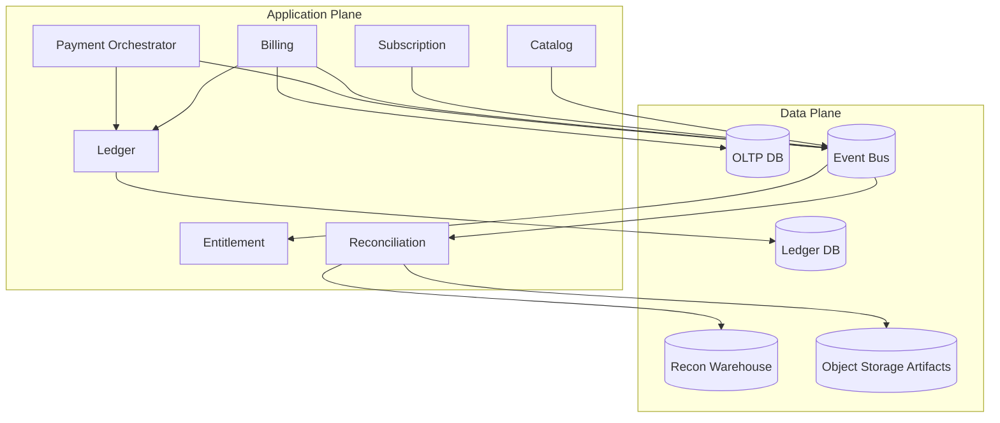

# Infrastructure Design: Reconciliation and Error Recovery Architecture

## Goals
Provide resilient infrastructure for:
- Invoice lifecycle reliability
- Proration determinism under retries
- Entitlement propagation guarantees
- Financial reconciliation and controlled recovery

## Runtime Topology
- Event bus with durable topics for catalog, subscription, billing, payment, and entitlement domains.
- Stateful stream processors for near-real-time validation.
- Batch reconciliation workers running on schedule queues.
- Recovery control plane services with strict RBAC and audit logging.

## Data and Storage Patterns
- Immutable event log retention for replay horizon (minimum 90 days hot + archival).
- OLTP store for invoice and subscription authoritative state.
- Ledger store with strict append-only semantics.
- Analytics/recon warehouse for multi-source variance joins.

## Reliability Controls
- Idempotent consumer keys on all write paths.
- Dead-letter queues segmented by domain and severity.
- Circuit breakers for payment/tax integrations.
- Priority retry lanes for payment-confirmation and entitlement updates.

## Security and Compliance
- KMS-backed encryption for event payloads containing financial or identity data.
- Dual-approval workflow for manual replay and compensation actions.
- Tamper-evident audit logs shipped to centralized SIEM.

## Reconciliation Execution Model
- Hourly micro-recon for payment-to-ledger confirmation.
- Daily full recon for usage→invoice→ledger→entitlement chain.
- Result artifacts stored with checksum and generation metadata.

## Error Recovery Strategy
1. Detect drift or processing failure.
2. Classify by domain and severity.
3. Attempt automated replay (dry-run compare first).
4. If unresolved, create compensation plan and require operator approval.
5. Re-run reconciliation scope to prove closure.

## Operational SLOs
- Reconciliation pipeline availability: 99.9% monthly.
- Critical drift alerting latency: < 10 minutes.
- Recovery action completion target (Class A): < 60 minutes.

## Beginner-Friendly Deployment Notes
- Keep **authoritative stores** (invoice + ledger) separate from analytical/recon stores.
- Treat replay as a first-class operation: retention, indexing, and runbook support are required.
- Use dead-letter queues per domain so billing failures do not block entitlement recovery.

## Practical Monitoring Starter Set
- Queue lag for payment and entitlement topics.
- Reconciliation job duration and success/failure rate.
- Count of drift items by class (A/B/C) and age.
- Number of manual recovery actions per week.

## Recovery Drill Recommendation
Run quarterly game-days where teams simulate:
1. Delayed payment events
2. Corrupted invoice projection
3. Ledger posting timeout
Then verify replay and compensation procedures close drift end-to-end.

## Deployment Diagram (Mermaid)

## Data Protection and Backup Strategy
- Point-in-time recovery enabled for OLTP and ledger stores.
- Daily encrypted backups with cross-region replication.
- Recovery validation drill at least monthly for invoice + ledger datasets.
- Recon artifacts stored immutably with lifecycle rules.

## Capacity and Scaling Guidance
- Partition event topics by tenant and domain to isolate hotspots.
- Autoscale entitlement runtime service on p95 latency + request volume.
- Schedule reconciliation windows to avoid collision with heavy billing runs.
- Enforce backpressure thresholds before downstream queues saturate.

## Incident Severity Mapping
| Severity | Example Trigger | Required Action |
|---|---|---|
| Sev-1 | Class A drift on many invoices | freeze close + incident bridge + immediate repair |
| Sev-2 | persistent entitlement mismatch | limited rollout + targeted replay + customer comms |
| Sev-3 | delayed projection with eventual convergence | monitor + auto-recheck |
