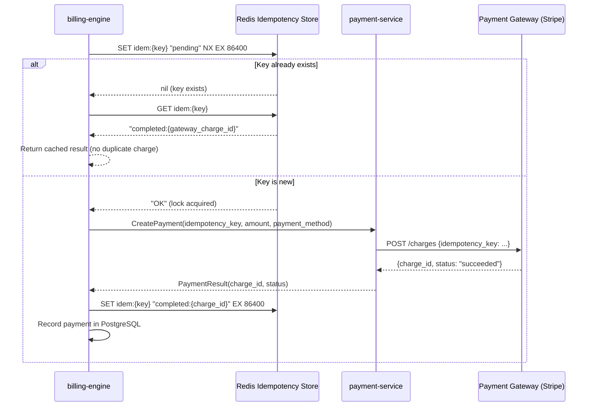
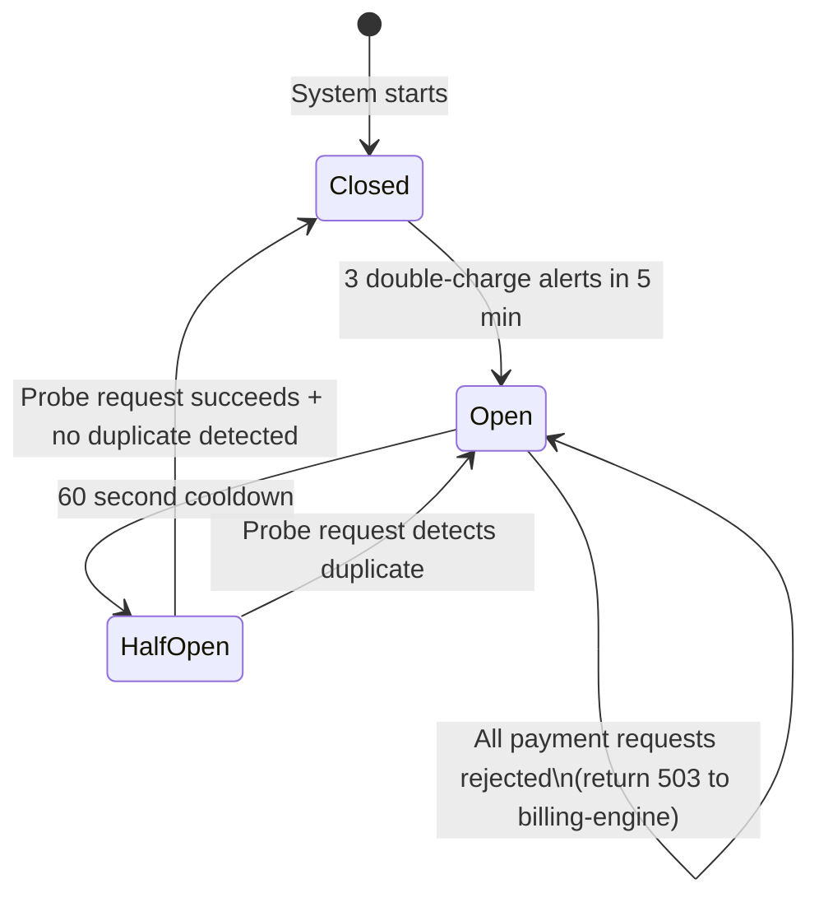
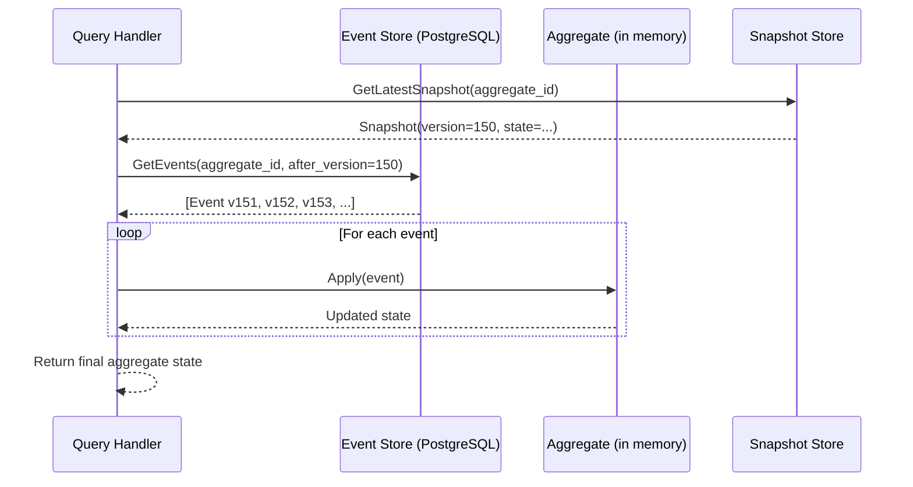
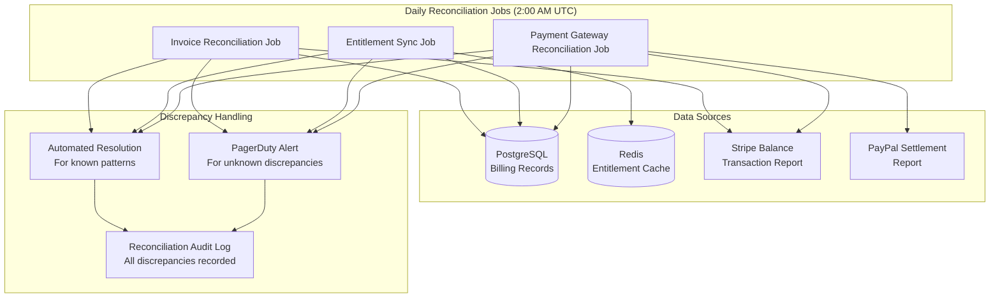
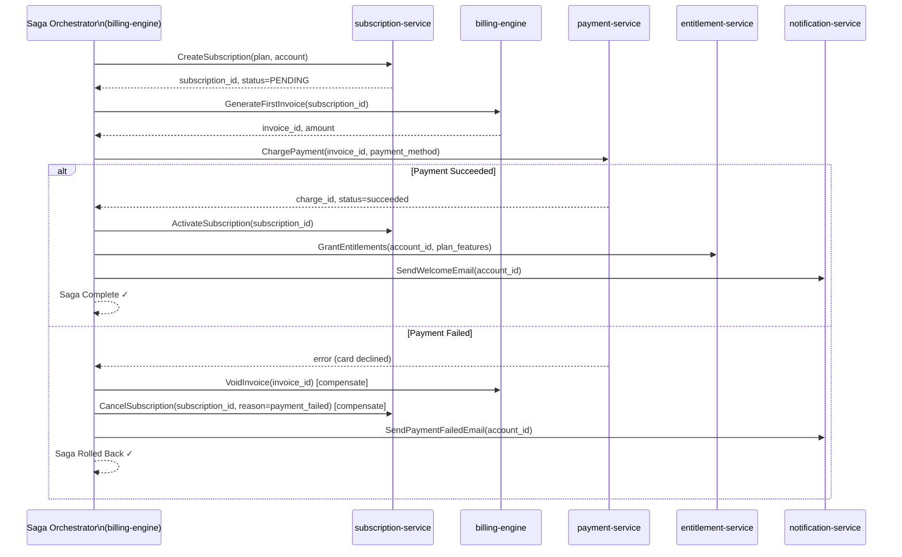
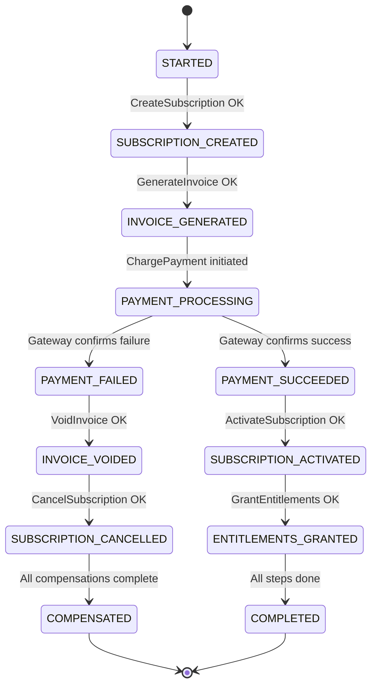
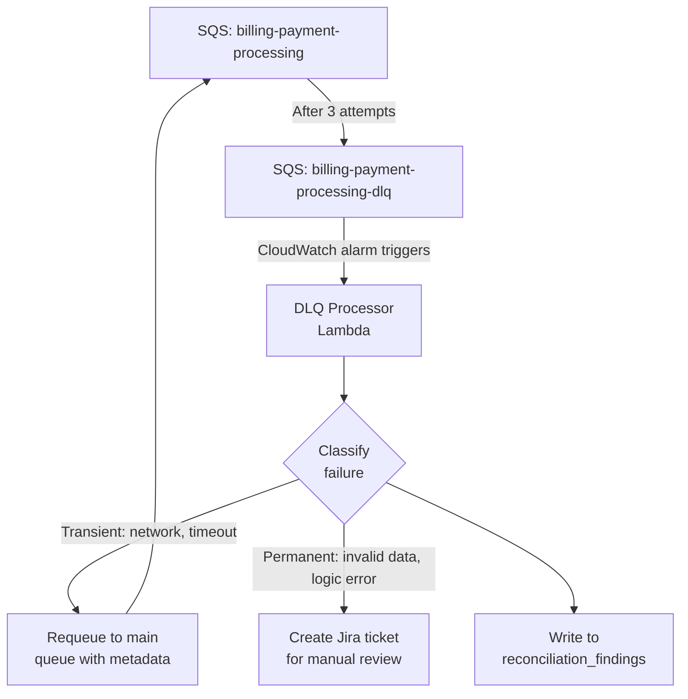
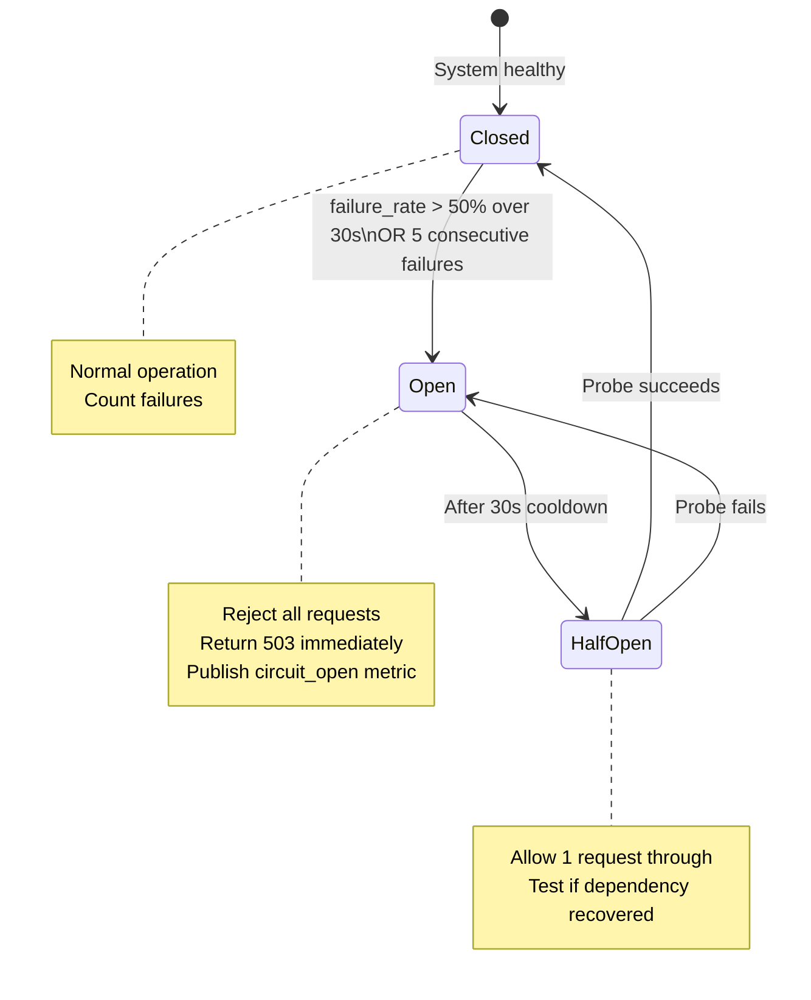
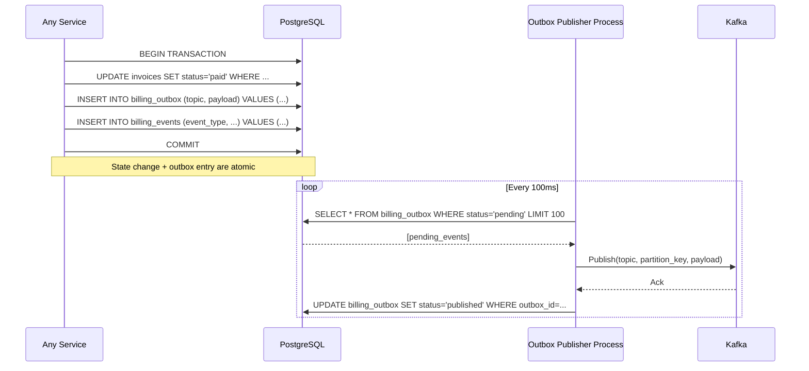

# Reconciliation and Recovery Architecture

**Platform:** Subscription Billing and Entitlements Platform  
**Compliance:** PCI DSS 4.0, SOC 2 Type II  
**Last Updated:** 2025

---

## Overview

Financial systems require correctness guarantees that go beyond normal software reliability requirements. A missed payment, a double charge, or an incorrect entitlement grant has direct business, legal, and reputational consequences. This document defines the architectural patterns used to ensure that every billing event is processed **exactly once**, every payment is attributed to exactly one invoice, and any inconsistency is automatically detected and either resolved or escalated.

The four pillars of this architecture are:

1. **Payment Idempotency** — preventing duplicate charges regardless of network failures or retries
2. **Event Sourcing** — maintaining a complete, immutable audit log of all state transitions
3. **Billing Reconciliation** — daily automated verification that internal records match external reality
4. **Recovery Patterns** — structured approaches to failure handling that guarantee eventual consistency

---

## Part 1: Payment Idempotency Architecture

### The Problem

Payment processing is inherently unreliable at the transport layer. A request to the payment gateway may succeed, but the response may never arrive due to a network timeout. Without idempotency, the obvious retry logic results in the customer being charged twice.

### Idempotency Key Design

Every payment attempt is identified by a composite idempotency key:

```
{account_id}-{invoice_id}-{attempt_number}
```

**Example:**
```
acct_01HQ3XYZABC-inv_01HQ3XYZDEF-001
acct_01HQ3XYZABC-inv_01HQ3XYZDEF-002  (first retry)
acct_01HQ3XYZABC-inv_01HQ3XYZDEF-003  (second retry)
```

The `attempt_number` is incremented only by the dunning system when it deliberately schedules a new payment attempt after a previous attempt has definitively failed. It is **not** incremented by network-level retries. This distinction ensures that:
- Retrying a timed-out request uses the same key → idempotent, no double charge
- The dunning system scheduling a new attempt uses a new key → correct, separate charge

### Idempotency Store

The idempotency store is Redis with a 24-hour TTL per key. Redis is used because it provides atomic operations (SET NX) and sub-millisecond latency.



### Redis Idempotency Key States

| State | Meaning | Next Action |
|---|---|---|
| `pending` | Payment request sent, no response yet | Retry → return cached state |
| `completed:{charge_id}` | Payment succeeded | Return success, do not retry |
| `failed:{error_code}` | Payment definitively failed (card declined, etc.) | Dunning system creates new attempt |
| `refunded:{refund_id}` | Payment was subsequently refunded | Block re-charge |

### Idempotency Store Implementation

```go
// Payment service: idempotency check before gateway call
func (s *PaymentService) ProcessPayment(ctx context.Context, req *PaymentRequest) (*PaymentResult, error) {
    key := fmt.Sprintf("idem:%s-%s-%03d", req.AccountID, req.InvoiceID, req.AttemptNumber)

    // Attempt to acquire idempotency lock
    set, err := s.redis.SetNX(ctx, key, "pending", 24*time.Hour).Result()
    if err != nil {
        return nil, fmt.Errorf("idempotency store unavailable: %w", err)
    }

    if !set {
        // Key exists: return cached result
        cached, err := s.redis.Get(ctx, key).Result()
        if err != nil {
            return nil, fmt.Errorf("failed to read idempotency state: %w", err)
        }
        return parseIdempotencyState(cached), nil
    }

    // Key is new: proceed with gateway call
    result, err := s.gatewayClient.Charge(ctx, &GatewayChargeRequest{
        IdempotencyKey: key,
        Amount:         req.Amount,
        Currency:       req.Currency,
        PaymentMethod:  req.PaymentMethodID,
    })

    if err != nil {
        s.redis.Set(ctx, key, "failed:"+classifyError(err), 24*time.Hour)
        return nil, err
    }

    finalState := fmt.Sprintf("completed:%s", result.ChargeID)
    s.redis.Set(ctx, key, finalState, 24*time.Hour)

    return &PaymentResult{ChargeID: result.ChargeID, Status: "succeeded"}, nil
}
```

### Duplicate Detection: Payment Gateway Layer

Stripe and PayPal both support server-side idempotency keys. The same idempotency key is passed to the payment gateway. If the gateway receives a second request with the same key within 24 hours, it returns the original response without creating a new charge. This provides a second layer of duplicate protection independent of the Redis store.

### Double-Charge Prevention Circuit Breaker



The circuit breaker monitors a Prometheus counter `payment_duplicate_detected_total`. When this counter increments more than 3 times within a 5-minute window, the circuit opens and all payment processing halts. An immediate PagerDuty P1 alert fires. The circuit can only be closed by a manual confirmation from the on-call engineer after root cause analysis, or automatically after 60 seconds if no further duplicates are detected in a probe request.

---

## Part 2: Event Sourcing for Audit

### Design Principles

All state changes to billing entities (subscriptions, invoices, payments, entitlements) are recorded as immutable events in an append-only event store. The current state of any entity is always derivable by replaying its event history from the beginning. This design provides:

- A complete, tamper-evident audit trail for PCI DSS Requirement 10
- The ability to reconstruct any entity's state at any point in time
- A basis for billing reconciliation by replaying events against expected state
- An event stream that downstream services can subscribe to

### Event Store Schema

```sql
CREATE TABLE billing_events (
    event_id        UUID PRIMARY KEY DEFAULT gen_random_uuid(),
    aggregate_type  VARCHAR(64)  NOT NULL,  -- 'subscription', 'invoice', 'payment', 'entitlement'
    aggregate_id    VARCHAR(128) NOT NULL,
    event_type      VARCHAR(128) NOT NULL,  -- 'InvoiceCreated', 'PaymentSucceeded', etc.
    event_version   INTEGER      NOT NULL,
    event_data      JSONB        NOT NULL,
    metadata        JSONB        NOT NULL,  -- actor, correlation_id, causation_id, source_service
    occurred_at     TIMESTAMPTZ  NOT NULL DEFAULT NOW(),
    recorded_at     TIMESTAMPTZ  NOT NULL DEFAULT NOW(),
    checksum        VARCHAR(64)  NOT NULL   -- SHA-256 of (aggregate_id + event_version + event_data)
);

-- Optimistic concurrency index
CREATE UNIQUE INDEX idx_billing_events_aggregate_version
    ON billing_events (aggregate_id, event_version);

-- Query index for aggregate replay
CREATE INDEX idx_billing_events_aggregate_type_id
    ON billing_events (aggregate_type, aggregate_id, event_version ASC);

-- Time-range queries for reconciliation
CREATE INDEX idx_billing_events_occurred_at
    ON billing_events (occurred_at DESC);
```

**Immutability enforcement:** No `UPDATE` or `DELETE` grants exist on the `billing_events` table for application service accounts. The table is append-only enforced at the PostgreSQL role level. A `ROW SECURITY` policy further prevents modification of rows older than 5 minutes (allowing a short correction window for accidental inserts, after which records are permanent).

### Event Types Catalogue

| Aggregate | Event Type | Triggered By |
|---|---|---|
| Subscription | SubscriptionCreated | Plan selection + payment method setup |
| Subscription | SubscriptionActivated | First payment succeeded |
| Subscription | SubscriptionPaused | Customer or admin action |
| Subscription | SubscriptionResumed | Customer or auto-resume |
| Subscription | SubscriptionCancelled | Customer request or dunning failure |
| Subscription | PlanChanged | Upgrade / downgrade |
| Invoice | InvoiceCreated | Billing engine cycle trigger |
| Invoice | InvoiceFinalized | Invoice sealed, sent to customer |
| Invoice | InvoiceVoided | Corrective action by admin |
| Invoice | InvoicePaid | Payment succeeded |
| Invoice | InvoiceWrittenOff | Uncollectable after dunning |
| Payment | PaymentAttempted | billing-engine initiated |
| Payment | PaymentSucceeded | Gateway confirmed |
| Payment | PaymentFailed | Gateway declined |
| Payment | PaymentRefunded | Refund issued |
| Payment | ChargebackReceived | Dispute filed by cardholder |
| Entitlement | EntitlementGranted | Subscription activated or plan changed |
| Entitlement | EntitlementRevoked | Subscription cancelled |
| Entitlement | QuotaIncremented | Usage event recorded |
| Entitlement | QuotaReset | Billing period renewal |

### Aggregate Reconstruction from Events



**Snapshots** are taken every 100 events per aggregate to avoid replaying the entire event history on every read. Snapshots are stored in a separate `billing_snapshots` table and are treated as optimisations only — they are always verifiable against the full event log.

### Event Replay for Reconciliation

The reconciliation system can replay any time range of events to reconstruct expected state and compare it against the actual state stored in the read model (PostgreSQL) and cache (Redis).

```
ReconciliationReplay(start_time, end_time, aggregate_type):
  1. Load all events for aggregate_type in [start_time, end_time]
  2. Group by aggregate_id
  3. For each aggregate: replay events → compute expected_state
  4. Load actual_state from read model
  5. Compare expected_state vs actual_state
  6. Emit reconciliation_discrepancy event for any mismatch
```

### Audit Trail Requirements

Per PCI DSS Requirement 10.3.3, audit trail data must be retained for at least 12 months with the most recent 3 months immediately available for analysis.

| Requirement | Implementation |
|---|---|
| Immutability | Append-only table with no UPDATE/DELETE grants; row-level policy |
| Completeness | Every state transition generates an event; gaps trigger alerts |
| Integrity verification | SHA-256 checksum per event; nightly checksum verification job |
| Retention | 7 years in PostgreSQL (billing_events table), S3 Glacier for archives |
| Immediate availability | 3 months in hot PostgreSQL storage, remainder in S3 Intelligent-Tiering |

---

## Part 3: Billing Reconciliation Architecture



### Daily Invoice Reconciliation

**Job Schedule:** 02:00 UTC daily  
**Duration target:** < 30 minutes for up to 500,000 invoices  
**Ownership:** billing-engine, reconciliation CronJob

The job verifies three invariants for every invoice in the current billing period:

1. **Invoice ↔ Payment match:** Every `PAID` invoice has exactly one `PaymentSucceeded` event with a matching gateway charge ID.
2. **Amount integrity:** The sum of all line item amounts equals the invoice total, which equals the payment amount charged.
3. **Status consistency:** No invoice is in `FINALIZED` state without a corresponding `InvoiceFinalized` event; no invoice is `PAID` without a corresponding payment record.

```sql
-- Example: Find invoices marked PAID without a matching payment record
SELECT
    i.invoice_id,
    i.account_id,
    i.total_amount,
    i.status,
    i.updated_at
FROM invoices i
LEFT JOIN payments p ON p.invoice_id = i.invoice_id
    AND p.status = 'succeeded'
WHERE i.status = 'paid'
  AND p.payment_id IS NULL
  AND i.updated_at >= NOW() - INTERVAL '48 hours';
```

### Nightly Entitlement Sync

**Job Schedule:** 03:30 UTC daily  
**Duration target:** < 15 minutes  
**Ownership:** entitlement-service reconciliation worker

The entitlement sync verifies that every entitlement record in Redis matches the canonical state in PostgreSQL. Redis is treated as a cache; PostgreSQL is the source of truth.

```
EntitlementSyncJob:
  1. For each active subscription in PostgreSQL:
     a. Load expected_entitlements from subscription plan definition
     b. Load cached_entitlements from Redis: HGETALL ent:{account_id}
     c. Compare: find missing, extra, or mismatched entitlement entries
     d. For each discrepancy:
        - If missing from Redis → HSET Redis with correct value (auto-heal)
        - If extra in Redis → HDEL from Redis (auto-heal)
        - If value mismatch → Log discrepancy, correct Redis, raise alert
  2. Publish reconciliation_report event with counts
```

Any discrepancy between Redis and PostgreSQL that affects a quota (not just a feature flag) triggers a PagerDuty P2 alert, as quota discrepancies can result in services being incorrectly blocked or incorrectly over-served.

### Payment Gateway Reconciliation

**Job Schedule:** 04:00 UTC daily (after Stripe/PayPal settlement files are available)  
**Duration target:** < 45 minutes  
**Ownership:** payment-service reconciliation worker

The gateway reconciliation downloads the previous day's balance transaction report from Stripe and settlement report from PayPal, then matches every transaction against the internal payment records.

**Matching algorithm:**

```
GatewayReconciliation(date):
  1. Download Stripe balance transactions for date (via Stripe API or S3 file export)
  2. Download PayPal settlement report for date
  3. For each gateway transaction:
     a. Look up internal payment record by gateway_charge_id
     b. Verify: amount matches, currency matches, account_id matches
     c. Verify: status matches (succeeded/refunded/disputed)
  4. For each internal payment marked "succeeded" on date:
     a. Verify gateway transaction exists
     b. Verify amounts match
  5. Classify discrepancies:
     - AMOUNT_MISMATCH: amounts differ by any value
     - MISSING_INTERNAL: gateway has charge, internal does not
     - MISSING_GATEWAY: internal has charge, gateway does not
     - STATUS_MISMATCH: different final status
```

### Discrepancy Handling

| Discrepancy Type | Frequency | Auto-Resolution | Escalation Threshold |
|---|---|---|---|
| Missing Redis entitlement | Expected (cache miss) | Write correct value | > 1000 in single run |
| Extra Redis entitlement | Rare (cache poisoning) | Delete extra key | Any occurrence |
| Amount mismatch (< $0.01) | Rare (rounding) | Log only | > 10 in single run |
| Amount mismatch (≥ $0.01) | Critical | No auto-resolution | Immediate P1 alert |
| Missing internal payment record | Critical | No auto-resolution | Immediate P1 alert |
| Missing gateway transaction | Critical | No auto-resolution | Immediate P1 alert |
| Invoice/payment status mismatch | Rare | Trigger state machine correction | > 5 in single run |

All discrepancies, regardless of severity, are written to the `reconciliation_findings` table with full details for audit purposes.

```sql
CREATE TABLE reconciliation_findings (
    finding_id      UUID PRIMARY KEY DEFAULT gen_random_uuid(),
    job_run_id      UUID NOT NULL,
    job_type        VARCHAR(64) NOT NULL,
    severity        VARCHAR(16) NOT NULL,  -- 'info', 'warning', 'critical'
    discrepancy_type VARCHAR(128) NOT NULL,
    entity_type     VARCHAR(64) NOT NULL,
    entity_id       VARCHAR(128) NOT NULL,
    expected_value  JSONB,
    actual_value    JSONB,
    resolution      VARCHAR(64),  -- 'auto_corrected', 'escalated', 'acknowledged'
    resolved_at     TIMESTAMPTZ,
    resolved_by     VARCHAR(128),
    notes           TEXT,
    created_at      TIMESTAMPTZ NOT NULL DEFAULT NOW()
);
```

---

## Part 4: Recovery Patterns

### Saga Pattern for Multi-Step Billing Operations

A subscription activation involves multiple services and must succeed as a whole or roll back completely. The saga pattern decomposes this into a sequence of local transactions with compensating actions for each step.



### Saga State Machine



### Compensating Transactions

| Original Action | Compensating Action | Condition |
|---|---|---|
| CreateSubscription | CancelSubscription(reason=saga_rollback) | Any subsequent step fails |
| GenerateInvoice | VoidInvoice | Payment fails |
| ChargePayment | IssueRefund | Entitlement grant fails post-payment |
| GrantEntitlements | RevokeEntitlements | Downstream confirmation fails |
| SendWelcomeEmail | SendCorrectionEmail | Subsequent rollback detected |

Compensating transactions are idempotent. If a compensation fails, it is retried with exponential backoff. If compensation ultimately cannot complete, the saga is placed in a `COMPENSATION_FAILED` terminal state and a P1 alert is raised for manual intervention.

### Dead Letter Queue Processing

Failed events that exceed their retry limit are moved to dead letter queues (DLQs). DLQ processing is a separate concern from the main processing path.



**DLQ processing rules:**

| Error Classification | Examples | Action |
|---|---|---|
| Transient | Network timeout, 503 from gateway, Redis unavailable | Requeue after 30-minute delay |
| Rate-limited | 429 from payment gateway, 429 from tax service | Requeue after calculated backoff |
| Retryable business | Card temporarily blocked, processor timeout | Requeue, increment dunning counter |
| Permanent business | Card permanently declined, account closed | Mark as terminal, notify customer |
| Data error | Null payment method, invalid currency | Create Jira ticket, halt processing |

### Circuit Breaker Pattern



**Circuit breakers by dependency:**

| Service | Dependency | Failure Threshold | Cooldown | Fallback |
|---|---|---|---|---|
| payment-service | Stripe API | 50% / 30s | 30s | Return 503, queue for retry |
| payment-service | PayPal API | 50% / 30s | 30s | Return 503, queue for retry |
| billing-engine | tax-service | 3 consecutive | 60s | Use cached tax rate (max 24h old) |
| entitlement-service | Redis | 5 consecutive | 10s | Read from PostgreSQL directly |
| billing-engine | payment-service | 50% / 60s | 60s | Pause billing cycle, alert on-call |

### Retry Strategy with Exponential Backoff and Jitter

All retry logic in the platform uses exponential backoff with full jitter to avoid retry storms. The algorithm is:

```
wait_time = min(cap, base * 2^attempt) * random(0.5, 1.5)
```

Where:
- `base` = 1 second (initial wait)
- `cap` = maximum wait time (varies by operation)
- `attempt` = current attempt number (0-indexed)
- `random(0.5, 1.5)` = jitter multiplier drawn from uniform distribution

**Retry configuration by operation:**

| Operation | Max Attempts | Base | Cap | On Exhaustion |
|---|---|---|---|---|
| Payment gateway call | 3 | 1s | 30s | Move to DLQ |
| Tax service call | 3 | 500ms | 10s | Use cached rate |
| Database write | 5 | 100ms | 5s | Fail with error |
| Kafka publish | 5 | 200ms | 10s | Store in outbox table |
| Redis write | 3 | 100ms | 2s | Fallback to PostgreSQL |
| Email notification | 5 | 2s | 300s | Log failure, skip |
| Webhook delivery | 10 | 5s | 3600s | Mark webhook as failed |

**Implementation pattern (Go):**

```go
func RetryWithBackoff(ctx context.Context, maxAttempts int, base, cap time.Duration, fn func() error) error {
    var lastErr error
    for attempt := 0; attempt < maxAttempts; attempt++ {
        if err := fn(); err != nil {
            lastErr = err
            if !isRetryable(err) {
                return err // Don't retry permanent errors
            }
            waitMs := float64(base.Milliseconds()) * math.Pow(2, float64(attempt))
            waitMs = math.Min(waitMs, float64(cap.Milliseconds()))
            jitter := 0.5 + rand.Float64() // [0.5, 1.5)
            wait := time.Duration(waitMs*jitter) * time.Millisecond
            select {
            case <-time.After(wait):
            case <-ctx.Done():
                return ctx.Err()
            }
            continue
        }
        return nil
    }
    return fmt.Errorf("max attempts (%d) exhausted: %w", maxAttempts, lastErr)
}
```

### Outbox Pattern for Reliable Kafka Publishing

When a billing state change must be published to Kafka, the event is first written to an `outbox` table in the same PostgreSQL transaction as the state change. A separate outbox publisher process polls this table and publishes to Kafka, then marks the row as published. This guarantees that an event is never lost even if Kafka is temporarily unavailable.

```sql
CREATE TABLE billing_outbox (
    outbox_id       UUID PRIMARY KEY DEFAULT gen_random_uuid(),
    topic           VARCHAR(128) NOT NULL,
    partition_key   VARCHAR(256) NOT NULL,
    payload         JSONB        NOT NULL,
    headers         JSONB,
    status          VARCHAR(16)  NOT NULL DEFAULT 'pending',
    attempts        INTEGER      NOT NULL DEFAULT 0,
    created_at      TIMESTAMPTZ  NOT NULL DEFAULT NOW(),
    published_at    TIMESTAMPTZ,
    error_message   TEXT
);

CREATE INDEX idx_billing_outbox_pending ON billing_outbox (status, created_at)
    WHERE status = 'pending';
```



The outbox publisher guarantees **at-least-once delivery** to Kafka. Consumers are responsible for idempotent processing of duplicate messages (using the `event_id` from the payload as a deduplication key).
