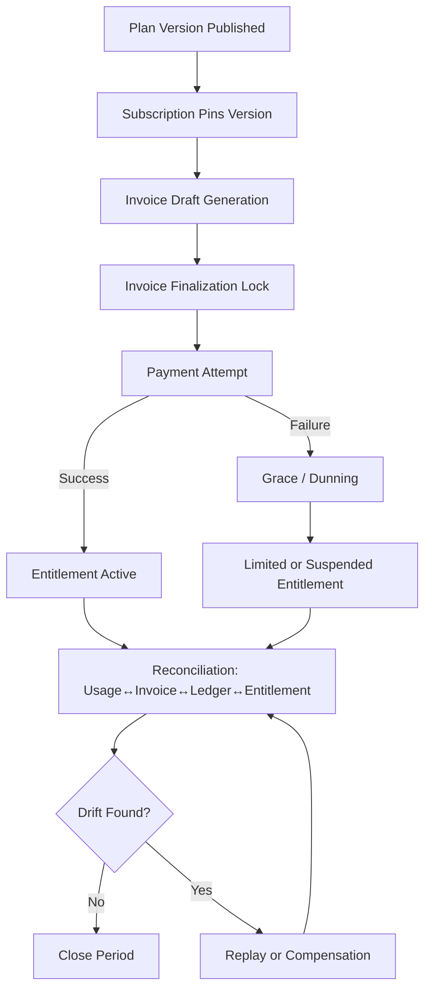

# Plan, Versioning, Invoice Lifecycle, and Reconciliation Requirements

## Objective
Define explicit product requirements for:
- Plan and price versioning models
- Invoice lifecycle behavior
- Proration consistency
- Entitlement enforcement paths
- Reconciliation and error recovery

## Plan and Price Versioning Requirements

### Functional Requirements
1. The platform MUST support immutable **PlanVersion** records so historical subscriptions remain replayable.
2. A plan MAY have multiple active regional price books; each price book MUST carry an effective start/end window.
3. Existing subscriptions MUST continue on their pinned version unless explicitly migrated.
4. Migration policies MUST support immediate, next-billing-cycle, and contract-renewal cutover modes.
5. Plan deprecation MUST block new sales while preserving renewals for grandfathered subscribers.

### Non-Functional Requirements
- Plan/price version resolution latency ≤ 50 ms at p95 for checkout and billing jobs.
- Version history MUST be retained for at least 7 years for financial audit.

## Invoice Lifecycle Requirements

### Lifecycle States
Draft → Finalized → Issued → (Paid | Partially Paid | Overdue | Voided | Uncollectible)

### Functional Requirements
1. Draft invoices MUST be editable only before finalization and only by authorized roles.
2. Finalization MUST lock monetary lines, tax totals, and exchange-rate snapshots.
3. Issuance MUST produce an immutable customer-visible invoice artifact and send notification events.
4. Payment allocation MUST support partial capture and overpayment credits.
5. Overdue invoices MUST trigger dunning policy schedules with configurable retries and channels.

## Proration Requirements
1. Mid-cycle upgrades/downgrades MUST create deterministic proration entries using second-level time boundaries.
2. Proration policy MUST support at least:
   - Credit-unused-time + charge-new-plan-time
   - No-credit immediate upgrade
   - End-of-term downgrade
3. Rounding strategy MUST be configurable by currency (bankers-rounding vs half-up) and applied consistently.
4. Taxes for prorated lines MUST be recomputed from normalized taxable bases.

## Entitlement Enforcement Requirements
1. Entitlements MUST be derived from active subscription items and effective feature flags.
2. Enforcement MUST support two paths:
   - **Synchronous token check** for API gating
   - **Asynchronous materialized view** for UI/admin projections
3. Entitlement updates MUST propagate within 30 seconds after payment/plan events.
4. Grace period rules MUST allow soft enforcement during dunning state transitions.

## Reconciliation and Error Recovery Requirements
1. Daily reconciliation MUST compare:
   - Rated usage vs invoice line quantities
   - Payment provider settlements vs ledger postings
   - Entitlement grants vs paid eligibility
2. Variance thresholds MUST be configurable per tenant and event type.
3. Failed workflows MUST be recoverable via idempotent replay from event logs.
4. Recovery actions MUST record operator, reason, before/after states, and correlation IDs.
5. All automated recovery jobs MUST publish outcome metrics and alerts.

## Acceptance Criteria
- Given a plan version change, when an existing subscription renews, then invoice lines use pinned price version unless migration policy says otherwise.
- Given a mid-cycle upgrade, when proration runs, then credit/debit lines reconcile to elapsed/remaining term proportions.
- Given payment failure and grace policy, when entitlement check occurs, then access is downgraded according to policy tier and date.
- Given reconciliation drift, when threshold exceeds policy, then incident is raised and replay/repair procedure is executable without double-posting.

## Beginner-Friendly Explanation
This chapter translates business language into implementation expectations:
- **Why immutable versions?** Because invoices must remain explainable years later.
- **Why invoice states?** They prevent accidental edits after financial commitments are locked.
- **Why proration policy options?** Different businesses choose different fairness/commercial rules.
- **Why separate entitlement paths?** Runtime decisions need speed; reporting needs richer history.
- **Why reconciliation?** Distributed systems fail in small ways; recon catches silent drift.

## Example Scenario (End-to-End)
A customer upgrades from Basic to Pro on day 12 of a 30-day cycle:
1. System reads current subscription's pinned version.
2. System calculates unused Basic time credit and remaining Pro charge.
3. Invoice line items are generated with traceable version references.
4. Payment succeeds; entitlement moves from Basic limits to Pro limits.
5. Recon job later verifies usage, invoice totals, payment settlement, and entitlement status match.

## Out-of-Scope Clarification
To keep this chapter readable, it does not define:
- Region-specific tax formulas (covered by tax domain docs).
- Payment processor-specific retry semantics (covered by dunning docs).
- UI copy/UX details (covered by product specs).

## Implementation Readiness Details

### Capability Matrix (Must-Have vs Should-Have)
| Capability | Must-Have (MVP) | Should-Have (Phase 2) |
|---|---|---|
| Immutable plan versions | ✅ | |
| Scheduled migrations | ✅ | |
| Bulk customer migration simulator | | ✅ |
| Invoice state machine with guardrails | ✅ | |
| Proration policy plug-ins | ✅ | |
| Entitlement grace policy | ✅ | |
| Automated reconciliation jobs | ✅ | |
| Auto-remediation suggestions | | ✅ |

### Data Retention and Compliance Requirements
- Plan/price/version and invoice transition history must be retained for statutory financial retention windows.
- Reconciliation outputs must be versioned, signed (checksum), and reproducible from source snapshots.
- Manual overrides must include reason code taxonomy and ticket linkage for audit.

### Non-Functional Targets by Domain
| Domain | p95 Latency | Freshness / SLA | Durability |
|---|---|---|---|
| Entitlement check API | 100 ms | <= 30 sec propagation after payment | 99.99% decision availability |
| Invoice finalization | 2 s | same transaction commit | no partial finalize writes |
| Proration calculation | 200 ms per amendment | deterministic replay | idempotent output keys |
| Reconciliation batch | N/A | daily completion by 08:00 local tenant time | reproducible reports |

## Requirement Diagram (Traceability)

## Open Design Decisions (To Resolve Before Build)
1. Whether proration uses calendar-month exact boundaries or normalized 30-day equivalents for all plans.
2. Whether entitlement hard-block begins at dunning stage N or after contractual grace_end timestamp only.
3. Whether reconciliation should block period close on Class B drift or only Class A drift.
