# Activity Diagrams — Supply Chain Management Platform

Activity diagrams in this document model the primary business processes of the Supply Chain Management Platform using UML-style flowchart notation. Each diagram uses `flowchart TD` to represent sequential and branching flows with decision points, parallel tracks, and process-boundary annotations. Swim-lane responsibilities are indicated in node labels and section comments. All diagrams are drawn at the business-process level, abstracting away implementation details so that process analysts, product owners, and system integrators can validate correctness against policy rules before implementation work begins.

---

## Procure-to-Pay (P2P) Flow

The Procure-to-Pay process governs every purchasing transaction from the moment an internal user identifies a business need through to payment settlement and ERP ledger posting. The diagram below captures the authorisation tiers (L1, L2, CFO), the three-way match gate, and the payment approval sub-flow. Approval-level thresholds are configurable per organisation; the values shown ($5,000 and $50,000) represent a typical mid-market configuration.

```mermaid
flowchart TD
    A([Start: Business Need Identified]) --> B[Identify Budget Code\nGL Account + Cost Centre]
    B --> C{Real-Time Budget\nAvailability Check via ERP}
    C -- Insufficient Funds --> D[Submit Budget\nReallocation Request to Finance]
    D --> E{Finance Director\nApproves Reallocation?}
    E -- Rejected --> F([End: Requisition Cannot Proceed])
    E -- Approved --> G
    C -- Budget Available --> G[Create Purchase Requisition\nLine items, qty, estimated unit price, delivery date]
    G --> H[Attach Supporting Documents\nSpecs, sole-source justification, prior quotes]
    H --> I{Determine Approval Tier\nby PR Total Value}

    I -- "Under $5,000" --> J[Route to L1 Approver\nDirect Line Manager]
    I -- "$5,000 – $50,000" --> K[Route to L2 Approver\nProcurement Manager]
    I -- "Above $50,000" --> L[Route to CFO\nFinance Director]

    J --> M{L1 Decision}
    M -- Approved --> N{Need Competitive\nSourcing Event?}
    M -- Rejected with Comments --> O[Notify Requester\nof Rejection Reason]
    O --> P{Requester\nRevises PR?}
    P -- Yes --> G
    P -- No --> F

    K --> Q{L2 Decision}
    Q -- Approved --> N
    Q -- Rejected --> O
    Q -- Returned for Revision --> G

    L --> R{CFO Decision}
    R -- Approved --> N
    R -- Rejected --> O
    R -- Returned --> G

    N -- "Value > $25,000\nor Policy Requires" --> S[Initiate RFQ / RFP\nSourcing Event]
    S --> T[Award Contract /\nSelect Supplier]
    T --> U
    N -- "Approved Supplier Exists\nor Value < $25,000" --> U[Convert PR to\nPurchase Order]

    U --> V{Is Supplier\nQualified on ASL?}
    V -- Not Qualified --> W[Trigger Supplier\nOnboarding Process]
    W --> X{Onboarding\nPassed?}
    X -- Failed --> Y[Select Alternative\nSupplier from ASL]
    Y --> V
    X -- Passed --> Z
    V -- Qualified --> Z[Assign PO Number\nand Finalize PO Lines]

    Z --> AA[Transmit PO to Supplier\nEDI / Portal / Email-PDF]
    AA --> AB{Supplier PO\nAcknowledgement Received?}
    AB -- "No: After 48 Hours" --> AC[Send Reminder\nEscalate to Procurement Manager]
    AC --> AD{Ack Received\nAfter Follow-up?}
    AD -- No --> AE[Place PO on\nAcknowledgement Exception Log]
    AD -- Yes --> AF
    AB -- Yes --> AF{Any Line\nChanges in ORDRSP?}
    AF -- Price or Date Changed --> AG[Review Supplier\nCounterproposal]
    AG --> AH{Accept\nCounterproposal?}
    AH -- Yes --> AI[Amend PO and\nRe-Acknowledge]
    AH -- No --> AJ[Negotiate with Supplier]
    AJ --> AH
    AI --> AK
    AF -- Confirmed as Sent --> AK[Monitor Expected\nDelivery Date]

    AK --> AL{ASN Received\nfrom Supplier?}
    AL -- "No: 3 Days Before EDD" --> AM[Chase Supplier\nfor ASN / ETA Update]
    AM --> AL
    AL -- Yes --> AN[Schedule Dock\nAppointment in WMS]
    AN --> AO[Physical Goods Arrive\nat Warehouse Dock]
    AO --> AP[Count and Verify Quantity\nAgainst ASN and PO Lines]

    AP --> AQ{Quantity\nVariance?}
    AQ -- "Shortage > Tolerance" --> AR[Record Short Delivery\non GRN — Partial Receipt]
    AQ -- "Overage" --> AS[Reject Excess Quantity\nDocument on GRN — Notify Supplier]
    AQ -- Within Tolerance --> AT
    AR --> AT[Create Goods Receipt Note\nGRN with lots, batches, serial numbers]
    AS --> AT

    AT --> AU[Post GRN Accrual Journal\nto ERP — Debit Stock Credit Accruals]
    AU --> AV{Quality Inspection\nRequired per Inspection Plan?}
    AV -- Yes --> AW[Queue for Quality\nInspection Assignment]
    AW --> AX[QC Team Executes\nInspection per Test Plan]
    AX --> AY{Inspection\nOutcome}
    AY -- Pass --> AZ[Release to Unrestricted\nStock — Update GRN Status]
    AY -- Fail --> BA[Move to Quarantine Stock\nRaise Non-Conformance Report]
    BA --> BB[Initiate Return-to-Vendor\nRTV Document]
    BB --> BC[Notify Supplier of Rejection\nExpect Credit Note within 14 days]
    BC --> BD{Credit Note\nReceived?}
    BD -- Yes --> BE[Apply Credit Note\nto AP Ledger]
    BD -- "No: After 14 Days" --> BF[Escalate to Procurement\nManager — Dispute Supplier]
    BE --> BG
    AV -- Not Required --> AZ
    AZ --> BG{Supplier Invoice\nReceived?}

    BG -- "No: After 30 Days" --> BH[Send Invoice\nRequest to Supplier]
    BH --> BG
    BG -- Yes --> BI[Validate Invoice Format\nand Mandatory Fields]
    BI --> BJ{Duplicate\nInvoice Check}
    BJ -- Duplicate Found --> BK[Reject Duplicate\nNotify Supplier with Original Ref]
    BJ -- Unique --> BL[Execute Three-Way Match\nPO Line x GRN Line x Invoice Line]

    BL --> BM{Match\nResult}
    BM -- "Within Tolerance ±2% or $50" --> BN[Auto-Approve Invoice\nSchedule for Payment Run]
    BM -- Price Discrepancy --> BO[Flag Price Mismatch\nRoute to AP Clerk]
    BM -- Quantity Discrepancy --> BP[Flag Qty Mismatch\nRoute to AP Clerk]

    BO --> BQ{AP Clerk\nResolution Path}
    BP --> BQ
    BQ -- Supplier Error — Credit Note Needed --> BR[Raise Invoice Dispute\nNotify Supplier]
    BR --> BS{Supplier Responds\nwith Credit Note?}
    BS -- Yes --> BT[Apply Credit Note\nRe-execute Match]
    BT --> BL
    BS -- "No: After SLA" --> BU[Escalate to\nProcurement Manager]
    BQ -- Internal PO Error --> BV[Raise PO Amendment\nRe-execute Match]
    BV --> BL

    BN --> BW{Payment Batch\nApproval Required?}
    BW -- "Invoice < $10,000\nAuto-Pay Threshold" --> BX[Include in Next\nScheduled Payment Run]
    BW -- "Invoice ≥ $10,000" --> BY[Route Payment Batch\nto Finance Director]
    BY --> BZ{Finance Director\nApproves Batch?}
    BZ -- Approved --> BX
    BZ -- Rejected --> CA[Return to AP Clerk\nwith Rejection Comments]

    BX --> CB[Generate ISO 20022\npain.001 Payment File]
    CB --> CC[Encrypt with Bank PGP Key\nSFTP to Banking Gateway]
    CC --> CD[Receive camt.054\nDebit Confirmation from Bank]
    CD --> CE[Mark Invoice as Paid\nRecord Payment Reference]
    CE --> CF[Post Payment Journal\nto ERP — Debit AP Credit Cash]
    CF --> CG[Send Payment Advice\nNotification to Supplier]
    CG --> CH([End: P2P Cycle Complete])
```

---

## Supplier Onboarding Flow

Supplier onboarding is a controlled qualification process that must be completed before a supplier can receive a purchase order. It validates legal existence, financial health, compliance posture, and operational capability. The process is initiated either proactively by a Category Manager adding a new source or reactively when a purchase requisition references an unapproved supplier.

```mermaid
flowchart TD
    A([Start: Onboarding Trigger]) --> B{Trigger Source}
    B -- "Category Manager\nProactive Sourcing" --> C[Category Manager Sends\nSupplier Invitation Email via SCMP]
    B -- "PR References\nUnqualified Supplier" --> D[System Generates\nAuto-Invitation from PR Data]
    C --> E[Supplier Receives\nPortal Registration Link — 7-Day Expiry]
    D --> E

    E --> F{Supplier Accepts\nInvitation?}
    F -- "No: Link Expired" --> G[Send One-Time Reminder\nafter 3 Days]
    G --> H{Accepted\nAfter Reminder?}
    H -- No --> I[Mark Invitation as\nLapsed — Archive]
    I --> J([End: Supplier Not Onboarded])
    H -- Yes --> K
    F -- Yes --> K[Supplier Completes\nSelf-Registration Form]

    K --> L[Supplier Uploads\nRequired Documents]
    L --> M{Mandatory Document\nChecklist Complete?}

    M -- Missing Documents --> N[System Flags\nMissing Items to Supplier]
    N --> O[Supplier Uploads\nRemaining Documents]
    O --> M

    M -- Complete --> P{Automated Format\nand Expiry Validation}
    P -- "Invalid Format\nor Expired Certificate" --> Q[Reject Document\nRequest Re-upload with Reason]
    Q --> O
    P -- All Valid --> R[Trigger Credit and\nRisk Scoring Service Check]

    R --> S{Risk Score\nResult}
    S -- "Sanctions Match\nor Prohibited Entity" --> T[Automatic Rejection\nNotify Procurement Manager]
    T --> U([End: Supplier Blocked])
    S -- "High Risk Score\n> 750 — Refer for Review" --> V[Escalate to Compliance\nTeam for Manual Review]
    V --> W{Compliance Team\nDecision}
    W -- Block --> T
    W -- "Accept with Conditions\nEnhanced Monitoring" --> X
    W -- Accept --> X
    S -- "Low to Medium Risk\n< 750 — Auto-Proceed" --> X

    X[Route to Qualification\nReview Committee]
    X --> Y[Category Manager Reviews\nCapability and Capacity]
    Y --> Z[Compliance Team Reviews\nLegal and Insurance Documents]
    Z --> AA{Qualification\nCommittee Decision}
    AA -- Rejected --> AB[Send Rejection Notice\nwith Reasons to Supplier]
    AB --> AC([End: Supplier Rejected])
    AA -- "Approved Conditionally\nMissing Info" --> AD[Request Additional\nInformation from Supplier]
    AD --> AE{Supplier Provides\nInfo Within 5 Days?}
    AE -- No --> AB
    AE -- Yes --> AA
    AA -- Approved --> AF[Add Supplier to\nApproved Supplier List]

    AF --> AG[Assign Commodity\nCategories and Spend Tiers]
    AG --> AH[Set Payment Terms\nCurrency and IBAN]
    AH --> AI[Sync Vendor Record\nto ERP via API]
    AI --> AJ{ERP Sync\nSuccessful?}
    AJ -- Failed --> AK[Raise Integration\nAlert to System Admin]
    AK --> AL{Admin Resolves\nSync Error?}
    AL -- Yes --> AI
    AL -- "No: After 4 Hours" --> AM[Manual ERP Vendor\nCreation by Finance]
    AM --> AN
    AJ -- Success --> AN[Provision Supplier\nPortal Credentials via IdP]
    AN --> AO[Send Welcome Email\nwith Portal URL and User Guide]
    AO --> AP[Notify Category Manager\nSupplier is Active]
    AP --> AQ([End: Supplier Fully Onboarded])
```

---

## Goods Receipt and Quality Inspection Flow

The goods receipt process begins when the warehouse receives a supplier advance shipment notice (ASN) and ends when received goods are either placed into unrestricted stock or returned to the vendor. Quality inspection is conditionally triggered based on the item's inspection plan, which specifies 100% inspection, AQL sampling, or skip-lot sampling logic.

```mermaid
flowchart TD
    A([Start: ASN Received from Supplier\nor EDI DESADV Message]) --> B[Parse and Validate ASN\nAgainst Open PO Lines]
    B --> C{ASN References\nValid Open PO?}
    C -- No Match Found --> D[Reject ASN\nNotify Supplier with Error Detail]
    D --> E([End: ASN Rejected])
    C -- PO Found --> F{Quantity in ASN\nExceeds PO Balance?}
    F -- "Overage > 5%" --> G[Flag Overage Warning\nAlert Procurement Manager]
    G --> H{Procurement Manager\nApproves Receipt of Overshipment?}
    H -- No --> I[Instruct Supplier to\nReduce Delivery Quantity]
    H -- Yes --> J
    F -- Within Tolerance --> J[Create Inbound\nDelivery Record from ASN]

    J --> K[Warehouse Manager\nSchedules Dock Appointment]
    K --> L[Assign Dock Bay\nand Unloading Crew]
    L --> M[Supplier Vehicle\nArrives at Dock]
    M --> N[Physical Unloading\nof Goods]
    N --> O[Count Cartons / Pallets\nAgainst Delivery Note]
    O --> P{Outer Packaging\nDamage Observed?}
    P -- Yes --> Q[Photograph Damage\nNote on Delivery Receipt]
    Q --> R[Continue Receipt Under\nConditional Acceptance]
    P -- No --> R

    R --> S[Scan / Record\nItem Barcodes or GS1-128 Labels]
    S --> T{Barcode Scan\nMatches ASN Item?}
    T -- Mismatch --> U[Segregate Mismatched Items\nRaise Discrepancy Note]
    U --> V[Notify Supplier and\nProcurement Manager]
    T -- Match --> W[Enter Actual Received\nQuantity per Line]
    W --> X{Quantity vs\nPO Balance Variance}
    X -- "Shortage > 0" --> Y[Record Partial\nGRN — Open Balance Remains on PO]
    X -- "Overage Within\nPolicy Tolerance" --> Z[Accept Overage\nRecord on GRN with Note]
    X -- "Exact Match" --> AA
    Y --> AA
    Z --> AA[Create Goods Receipt\nNote — GRN]

    AA --> AB[Assign Lot Number\nand Batch Attributes]
    AB --> AC{Serial Number\nTracking Required?}
    AC -- Yes --> AD[Scan and Register\nAll Serial Numbers on GRN]
    AD --> AE
    AC -- No --> AE[Post GRN Accrual\nJournal to ERP]
    AE --> AF{Quality Inspection\nPlan for This Item?}

    AF -- "No Inspection Plan\nDirect to Stock" --> AG[Move to Unrestricted\nStock Location]
    AG --> AH[Update Inventory\nBalance in System]
    AH --> AI[Notify Procurement\nand AP — GRN Posted]
    AI --> AJ([End: Goods in Unrestricted Stock])

    AF -- "100% Inspection Plan" --> AK[Trigger Full\nInspection Lot for All Units]
    AF -- "AQL Sampling Plan" --> AL[Calculate Sample Size\nper AQL Level II Table]
    AL --> AM[Trigger Inspection\nLot for Sample Qty]
    AF -- "Skip-Lot Plan\nEvery Nth Delivery" --> AN{Is This\nDelivery Subject to Inspection?}
    AN -- No → Skip --> AG
    AN -- Yes --> AM

    AK --> AO[Assign Inspection Lot\nto Available QC Inspector]
    AM --> AO
    AO --> AP[QC Inspector Performs\nTests per Test Plan]
    AP --> AQ{Inspection\nResult}
    AQ -- "All Tests Pass\nWithin Spec" --> AR[Record Pass Result\nClose Inspection Lot]
    AR --> AS{Packaging Damage\nNoted Earlier?}
    AS -- Yes --> AT[Raise Supplier\nDamage Claim]
    AT --> AU[Move Undamaged Units\nto Unrestricted Stock]
    AS -- No --> AU
    AU --> AV[Notify AP Clerk\nGRN and Quality Cleared]
    AV --> AJ

    AQ -- "One or More Tests\nFail — Below Spec" --> AW[Record Fail Result\nwith Test Values on NCR]
    AW --> AX{Non-Conformance\nSeverity}
    AX -- "Critical — Safety\nor Regulatory Risk" --> AY[Immediate Quarantine\nNotify QA Manager and Procurement]
    AX -- "Major — Functional\nDefect" --> AZ[Quarantine Affected\nLot — Hold for Decision]
    AX -- "Minor — Cosmetic\nDefect" --> BA{Accept Under\nDeviation?}
    BA -- "Yes — With\nPrice Concession" --> BB[Request Supplier\nCredit Note for Agreed Reduction]
    BB --> AU
    BA -- No --> AZ

    AY --> BC[Initiate Return-to-Vendor\nRTV for Full Quantity]
    AZ --> BD{Disposition\nDecision}
    BD -- Sort and Segregate\nAccept Conforming Units --> AU
    BD -- Return to Vendor\nFull Quantity --> BC

    BC --> BE[Generate RTV\nDocument with NCR Reference]
    BE --> BF[Arrange Collection\nor Outbound Shipment]
    BF --> BG[Notify Supplier:\nRejection with NCR Detail]
    BG --> BH[Revert GRN Accrual\nJournal in ERP]
    BH --> BI{Replacement\nDelivery Required?}
    BI -- Yes --> BJ[Raise Corrective\nDelivery Request to Supplier]
    BJ --> BK([End: RTV Complete — Awaiting Replacement])
    BI -- "No — Cancel\nPO Line" --> BL[Cancel PO Line\nFree Budget Commitment]
    BL --> BM([End: RTV Complete — PO Line Cancelled])
```

---

## RFQ-to-Contract Flow

The RFQ-to-Contract process manages competitive sourcing events from initial need identification through to contract execution and price-list activation. This process is triggered whenever procurement policy requires competitive tendering (typically above a defined spend threshold or when establishing a new category agreement) or when a Category Manager proactively decides to re-tender an expiring contract.

```mermaid
flowchart TD
    A([Start: Sourcing Need Identified]) --> B{Sourcing Trigger}
    B -- "Spend Above\nCompetitive-Bid Threshold" --> C
    B -- "Expiring Contract\nRenewal" --> C
    B -- "New Category\nor Supplier Diversity Goal" --> C
    C[Category Manager Creates\nSourcing Event in SCMP]

    C --> D[Define Evaluation\nCriteria and Weightings]
    D --> E{Event Type\nSelection}
    E -- "RFQ — Standard\nPrice and Terms" --> F[Set Up RFQ with\nLine Items, Specs, and Delivery Requirements]
    E -- "RFP — Complex\nWith Technical Evaluation" --> G[Set Up RFP with\nTechnical and Commercial Lots]
    E -- "Reverse Auction\nCost-Optimised" --> H[Configure Auction\nFloor Price and Duration Rules]
    F --> I
    G --> I
    H --> I

    I[Build Pre-Qualified\nSupplier Invite List]
    I --> J{Minimum Suppliers\nPolicy Met — Usually 3?}
    J -- Not Met --> K[Request Approval to\nWaive Minimum — Sole Source]
    K --> L{Waiver\nApproved?}
    L -- No --> M[Expand Supplier\nSearch — Add New Candidates]
    M --> N[Onboard New Candidate\nSuppliers if Not on ASL]
    N --> I
    L -- Yes --> O
    J -- Met --> O[Attach NDA\nto Event if Required]
    O --> P[Send Event Invitations\nto Suppliers via Portal and Email]

    P --> Q[Bid Submission Window\nOpens — Configurable Duration]
    Q --> R{Supplier Queries\nReceived?}
    R -- Yes --> S[Post Q&A Clarification\nto All Invited Suppliers]
    S --> Q
    R -- No --> T{Bid Submission\nWindow Closes}
    T --> U[System Validates\nBid Completeness per Checklist]
    U --> V{Minimum Bids\nReceived — Usually 3?}
    V -- "Fewer Than Minimum" --> W{Extend Window\nor Accept?}
    W -- "Extend — Max\nOne Extension Allowed" --> X[Notify Suppliers\nof Extended Deadline]
    X --> T
    W -- "Accept Fewer\nwith Approval" --> Y[Obtain Category Director\nApproval to Proceed]
    Y --> AA
    V -- "Minimum Received" --> AA[Lock Bids\nNo Further Submission Allowed]

    AA --> AB[Distribute Bids to\nEvaluation Committee Members]
    AB --> AC[Committee Scores\nTechnical Responses per Criteria]
    AC --> AD[System Calculates\nWeighted Evaluation Score per Supplier]
    AD --> AE{Any Clarifications\nNeeded from Suppliers?}
    AE -- Yes --> AF[Issue Clarification\nRequests via Portal]
    AF --> AG[Suppliers Respond\nWithin 48 Hours]
    AG --> AE
    AE -- No --> AH[Generate Award\nRecommendation Report]

    AH --> AI{Value Above\nBoard Approval Threshold?}
    AI -- Yes --> AJ[Submit Award\nRecommendation to Board / Executive Committee]
    AJ --> AK{Board\nApproves Award?}
    AK -- Rejected --> AL[Revise Strategy\nor Re-tender]
    AL --> C
    AK -- Approved --> AM
    AI -- No --> AM[Notify Unsuccessful\nSuppliers with Feedback]

    AM --> AN[Notify Winning\nSupplier of Intended Award]
    AN --> AO{Negotiation\nRequired?}
    AO -- Yes --> AP[Conduct Commercial\nNegotiations — Price, Terms, SLAs]
    AP --> AQ{Negotiation\nSuccessful?}
    AQ -- Deadlock --> AR[Escalate or\nApproach Second-Place Supplier]
    AR --> AN
    AQ -- Agreed --> AS
    AO -- No --> AS[Draft Contract\nfrom Approved Clause Library]

    AS --> AT[Legal Review\nand Redline Round]
    AT --> AU{Legal Approval\nGranted?}
    AU -- Further Redlines --> AT
    AU -- Approved --> AV[Route Contract for\nInternal Signature — Finance + CPO]
    AV --> AW[Route to Supplier\nfor Countersignature via E-Sign]
    AW --> AX{Contract\nFully Executed?}
    AX -- "No: After 5\nBusiness Days" --> AY[Follow Up with\nSupplier on Signature]
    AY --> AX
    AX -- Yes --> AZ[Archive Executed\nContract to DMS]

    AZ --> BA[Activate Price List\nin SCMP Catalogue]
    BA --> BB[Create Blanket\nPurchase Order if Applicable]
    BB --> BC[Set Contract Expiry\nRenewal Reminder — 90 Days Prior]
    BC --> BD[Notify All\nApproved Requisitioners of New Pricing]
    BD --> BE([End: Contract Active — Pricing Available])
```

---

## Invoice Processing and Matching Flow

Invoice processing covers the full journey of a supplier invoice from its point of entry into the platform through validation, duplicate detection, three-way matching, exception handling, and final payment scheduling. The platform accepts invoices through three channels: supplier portal upload, EDI INVOIC message, and email with OCR extraction. Regardless of entry channel, all invoices enter a common processing pipeline after initial parsing.

```mermaid
flowchart TD
    A([Start: Invoice Arrives]) --> B{Entry Channel}
    B -- "Supplier Portal\nManual Upload" --> C[Supplier Uploads PDF\nor XML e-Invoice via Portal]
    B -- "EDI INVOIC\nMessage" --> D[EDI Gateway Receives\nEDIFACT INVOIC or X12 810]
    B -- "Email\nInbound" --> E[Email Parser Extracts\nAttachment from Inbox]

    C --> F[Format Detection:\nPDF / UBL 2.1 / PEPPOL BIS 3.0 / EDIFACT]
    D --> F
    E --> G[OCR / IDP Engine\nExtracts Invoice Fields]
    G --> H{Confidence Score\nAbove Threshold 85%?}
    H -- "Below 85%" --> I[Route to AP Clerk\nfor Manual Field Correction]
    I --> J[AP Clerk Validates\nand Corrects Extracted Fields]
    J --> F
    H -- "Above 85%" --> F

    F --> K{Format\nSchema Validation}
    K -- "Invalid Format\nor Missing Mandatory Fields" --> L[Reject Invoice\nReturn to Supplier with Error List]
    L --> M([End: Invoice Rejected — Resubmit Required])
    K -- Valid --> N[Assign Internal\nInvoice Processing ID]

    N --> O{Duplicate\nInvoice Detection}
    O --> P[Fuzzy Match on:\nSupplier ID + Invoice Number + Gross Amount + Date ±30 Days]
    P --> Q{Probable Duplicate\nFound?}
    Q -- "Match > 90%\nConfidence" --> R[Reject as Duplicate\nNotify Supplier with Original Invoice Ref]
    R --> S([End: Duplicate Invoice — No Processing])
    Q -- "No Match or\nMatch < 90%" --> T[Validate Supplier\nID Against Approved Supplier List]

    T --> U{Supplier\nActive on ASL?}
    U -- "Not Active or\nBlocked" --> V[Reject Invoice\nNotify AP Clerk — Supplier Status Issue]
    V --> W([End: Invoice Rejected — Supplier Issue])
    U -- Active --> X[Extract PO Reference\nFrom Invoice Header]

    X --> Y{PO Reference\nFound and Open?}
    Y -- "No PO Reference\nor PO Closed" --> Z[Route to AP Clerk\nfor PO Matching Assistance]
    Z --> AA{AP Clerk Locates\nMatching PO?}
    AA -- No --> AB[Reject Invoice\nSupplier Must Resubmit with Valid PO Ref]
    AB --> M
    AA -- Yes --> AC
    Y -- PO Found and Open --> AC[Retrieve All GRN Lines\nLinked to This PO]

    AC --> AD{GRN Lines\nExist for PO?}
    AD -- "No GRN Posted\nGoods Not Yet Received" --> AE[Park Invoice\nPending Goods Receipt]
    AE --> AF{GRN Posted\nWithin 30 Days?}
    AF -- "No: After 30 Days" --> AG[Escalate to Procurement Manager\nDelivery Confirmation Required]
    AF -- Yes --> AH
    AD -- GRN Lines Available --> AH[Execute Three-Way Match\nPO Line x GRN Line x Invoice Line]

    AH --> AI{Match\nResult per Line}
    AI -- "All Lines Within\nConfigured Tolerance\n±2% price / ±1% qty" --> AJ[Mark Invoice\nFully Matched]
    AI -- "One or More Lines\nOutside Tolerance" --> AK[Flag Discrepant\nLines for Review]

    AK --> AL{Discrepancy\nType}
    AL -- "Unit Price\nHigher Than PO" --> AM[Route Price Discrepancy\nto AP Clerk for Resolution]
    AL -- "Invoiced Quantity\nExceeds GRN Quantity" --> AN[Route Quantity Discrepancy\nto AP Clerk for Resolution]
    AL -- "Tax or Charge\nNot on PO" --> AO[Route Charge Discrepancy\nto AP Clerk for Resolution]

    AM --> AP{AP Clerk\nDetermines Root Cause}
    AN --> AP
    AO --> AP
    AP -- "Supplier Error —\nCredit Note Needed" --> AQ[Create Invoice\nDispute Record]
    AQ --> AR[Send Dispute\nNotification to Supplier via Portal]
    AR --> AS{Supplier Responds\nWithin SLA — 5 Business Days}
    AS -- "Issues Credit Note" --> AT[Validate Credit Note\nApply Against Invoice]
    AT --> AU[Re-Execute\nThree-Way Match]
    AU --> AI
    AS -- "Disputes the Dispute" --> AV[Escalate to Procurement\nManager for Mediation]
    AV --> AW{Mediation\nResolved?}
    AW -- "Partial Acceptance\nCredit Note Issued" --> AT
    AW -- "Internal Error —\nPO Amendment Required" --> AX[Raise PO Amendment\nRe-execute Match After Update]
    AX --> AH
    AS -- "No Response After SLA" --> AY[Escalate to\nCategory Manager]
    AY --> AZ{Escalation\nResult}
    AZ -- "Supplier Corrects" --> AT
    AZ -- "Unresolvable —\nWrite Off or Legal" --> BA[Refer to Finance\nfor Write-Off Approval]

    AJ --> BB{Invoice Value\nRequires Finance Director Approval?}
    BB -- "Value ≥ $10,000" --> BC[Route to Finance Director\nPayment Batch Review]
    BC --> BD{Finance Director\nApproves Batch?}
    BD -- "Approved" --> BE
    BD -- "Rejected — Query" --> BF[Return to AP Clerk\nwith Rejection Note]
    BF --> BG{Query\nResolved?}
    BG -- Yes --> BB
    BG -- No → Write Off --> BA
    BB -- "Value < $10,000\nAuto-Pay Eligible" --> BE[Add to Scheduled\nPayment Run Queue]

    BE --> BH{Payment Run\nWindow Reached?}
    BH -- Not Yet --> BI[Invoice Sits\nin Approved Queue]
    BI --> BH
    BH -- Yes --> BJ[Consolidate Payment\nBatch for This Supplier]
    BJ --> BK[Generate ISO 20022\npain.001 Payment File]
    BK --> BL[Encrypt with Bank\nPGP Key and SFTP Upload]
    BL --> BM[Receive camt.054\nDebit Confirmation]
    BM --> BN[Update Invoice Status\nto Paid — Record Payment Ref and Date]
    BN --> BO[Post Payment Journal\nto ERP — Debit AP Credit Bank]
    BO --> BP[Send Payment Advice\nEmail to Supplier with Remittance Detail]
    BP --> BQ([End: Invoice Paid and Ledger Posted])
```

---

## Process Summary Reference

| Process | Start Trigger | End State | Key Decision Points | Integrations Involved |
|---|---|---|---|---|
| Procure-to-Pay | Business need identified by requester | Payment confirmed, journals posted, supplier advised | Budget availability, approval tier (L1/L2/CFO), supplier qualification, three-way match tolerance, payment approval threshold | ERP (budget, journals), EDI (PO/ASN), Banking (payment), Notification (approvals, advice) |
| Supplier Onboarding | Invitation from Category Manager or PR auto-trigger | Supplier active on ASL with portal access | Invitation acceptance, document completeness, sanctions screening result, qualification committee decision, ERP sync success | Risk Scoring Service, ERP (vendor sync), IdP (portal credentials), DMS (document storage), Notification |
| Goods Receipt and Quality Inspection | ASN received from supplier | Goods in unrestricted stock or RTV complete | ASN–PO match, quantity variance, quality inspection plan type, inspection pass/fail, disposition decision | ERP (GRN accrual, accrual reversal on RTV), EDI (ASN DESADV), Notification (AP and procurement alerts) |
| RFQ to Contract | Sourcing need above bid threshold or expiring contract | Contract executed, price list active, PO committed | Minimum supplier count, waiver for sole-source, board approval threshold, negotiation outcome, legal approval | DMS (contract archival), Notification (supplier invitations, award), ERP (blanket PO), IdP (supplier portal access) |
| Invoice Processing and Matching | Invoice received via portal, EDI, or email | Invoice paid, ERP payment journal posted, supplier advised | OCR confidence, duplicate detection, active ASL check, three-way match tolerance, Finance Director approval threshold | ERP (journals), Banking (payment file), EDI (INVOIC), DMS (invoice archival), Notification (dispute and payment advice) |
