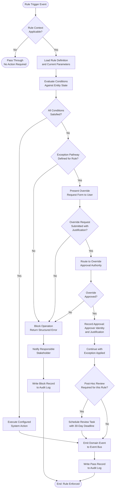

# Business Rules — Supply Chain Management Platform

This document catalogues the enforceable business rules governing procurement workflows within the Supply Chain Management Platform. Rules are classified as either system-enforced (applied programmatically and not bypassable at the application layer) or policy-enforced (subject to documented override procedures requiring explicit approval). Each entry defines the trigger condition, evaluation logic, system action, and any permissible exception pathway.

Business rules in this document are numbered sequentially in the `BR-XXX` series. New rules and amendments require Change Advisory Board (CAB) approval and must be reflected in this document — with a recorded change reason — prior to deployment in any environment above development.

---

## Enforceable Rules

### Rule Registry

The following table provides a concise index of all active business rules. Detailed specifications for each rule appear in the sections below.

| Rule ID | Name | Classification | Trigger Domain | Override Permitted |
|---|---|---|---|---|
| BR-001 | Approval Thresholds | Policy-Enforced | Procurement | Yes — CFO only |
| BR-002 | Supplier Approval Gate | System-Enforced | Procurement | Yes — CFO + Legal |
| BR-003 | Three-Way Match | Policy-Enforced | Accounts Payable | Yes — Finance Director |
| BR-004 | RFQ Requirements | Policy-Enforced | Sourcing | Yes — Director of Procurement |
| BR-005 | Delivery Tolerance | Policy-Enforced | Warehouse | Yes — Procurement Manager |
| BR-006 | Payment Terms Enforcement | Policy-Enforced | Finance | Yes — Finance Director |
| BR-007 | Supplier Performance Scoring | System-Enforced | Vendor Management | Yes — VP Supply Chain |
| BR-008 | Emergency Procurement | Policy-Enforced | Procurement | Not applicable |

---

### BR-001 — Approval Thresholds

Purchase requisitions and purchase orders require escalating levels of organisational approval based on total monetary value. This tiered structure ensures appropriate financial oversight proportional to expenditure risk, while minimising approval latency for low-value routine procurement that does not warrant manual review.

Approval SLA timers are started the moment a document enters an approval queue. Breaching an SLA triggers an automatic escalation to the next level in the approver's management chain and generates an alert to the Procurement Operations team.

| Rule ID | Name | Description | Trigger | Condition | Action | Exception |
|---|---|---|---|---|---|---|
| BR-001 | Approval Thresholds | Tiered approval routing based on total procurement value | Requisition submitted or PO created | Amount < $1,000 → auto-approve; $1,000–$10,000 → Manager; $10,001–$50,000 → Director; > $50,000 → CFO | Route to appropriate approval queue; start SLA timer per tier; send in-app and email notification to approver | Emergency procurement flagged under BR-008 bypasses standard thresholds with dual executive sign-off |

**Approval Tier Reference:**

| Tier | Amount Range | Required Approver | SLA (Business Hours) | Escalation On SLA Breach |
|---|---|---|---|---|
| Auto-Approve | < $1,000 | System | Immediate | Not applicable |
| Manager | $1,000 – $10,000 | Department Manager | 8 hours | Department Director |
| Director | $10,001 – $50,000 | Department Director | 24 hours | CFO |
| CFO | > $50,000 | Chief Financial Officer | 48 hours | Board Audit Committee notification |

---

### BR-002 — Supplier Approval Gate

Purchase Orders may only be issued to suppliers holding an `ACTIVE` status in the supplier master record. This rule prevents inadvertent engagement of suppliers who are under compliance review, suspended due to performance issues, or blacklisted following fraud or sanctions screening findings.

Suppliers classified as `HIGH` risk tier require an additional compliance check on file — confirmed within the last 90 days — before a PO may be issued. This check verifies current sanctions list status, insurance certificates, and any outstanding audit findings.

| Rule ID | Name | Description | Trigger | Condition | Action | Exception |
|---|---|---|---|---|---|---|
| BR-002 | Supplier Approval Gate | Restricts PO issuance exclusively to approved, active suppliers | PO creation attempted against any supplier | `supplier.status = ACTIVE`; if `risk_tier = HIGH` then a compliance check dated within 90 days must be on file | Block PO creation if condition unmet; surface supplier status to the buyer; notify Procurement Manager with remediation options | Pre-approved vendor list override permitted with CFO and Legal Counsel written authorisation; documented in audit trail with 90-day validity |

---

### BR-003 — Three-Way Match

Supplier invoices must be validated against both the originating Purchase Order and the recorded Goods Receipt before payment is authorised. This three-way match detects quantity discrepancies and unauthorised price changes, protecting the organisation from overpayment and fraudulent invoicing.

Tolerances are configurable per organisational unit at the system administration level. The default tolerances defined below apply unless a unit-specific configuration has been established and approved by the Finance Director.

| Rule ID | Name | Description | Trigger | Condition | Action | Exception |
|---|---|---|---|---|---|---|
| BR-003 | Three-Way Match | Invoice quantity and amount must match the PO and Goods Receipt within defined tolerances | Invoice received for a PO that has at least one associated Goods Receipt in `ACCEPTED` or `VERIFIED` status | `\|invoice_qty − gr_qty\| / po_qty ≤ 2%` AND `\|invoice_amount − po_amount\| / po_amount ≤ 1%` | Auto-approve invoice if within tolerance and proceed to payment scheduling; set status to `DISPUTED` and assign to AP team if outside tolerance | Documented price adjustment with Finance Director approval; variance memo required and attached to invoice record |

**Default Match Tolerance Reference:**

| Match Dimension | Default Tolerance | Outcome When Within Tolerance | Outcome When Outside Tolerance |
|---|---|---|---|
| Quantity variance | ≤ 2% of PO quantity | Proceed — invoice auto-approved | Flag `DISPUTED`; manual AP review required |
| Amount variance | ≤ 1% of PO amount | Proceed — invoice auto-approved | Flag `DISPUTED`; manual AP review required |
| Both dimensions exceeded | Any value | — | Escalate to Finance Director for resolution |

---

### BR-004 — RFQ Requirements

To ensure competitive pricing and procurement integrity, purchases above the defined value threshold require a minimum number of independent competitive quotations before a Purchase Order may be created. This rule does not apply when an active contract with the target supplier already covers the goods or services being procured.

The buyer is responsible for initiating the RFQ event and ensuring all invited suppliers hold `ACTIVE` status at the time of quotation submission. Quotations from the same corporate group as a sole-source submission do not count as independent competitive bids.

| Rule ID | Name | Description | Trigger | Condition | Action | Exception |
|---|---|---|---|---|---|---|
| BR-004 | RFQ Requirements | Competitive sourcing mandatory for purchases above threshold | Requisition approved with `total_amount > $5,000` and no active contract covering the scope | Minimum 3 quotations required; all from distinct `ACTIVE` suppliers; all received within the RFQ validity window; no two suppliers from the same corporate group | Block PO creation until RFQ condition is satisfied; prompt buyer in UI to initiate a sourcing event | Sole-source justification document approved by Director of Procurement allows single-supplier procurement; justification retained on requisition record |

---

### BR-005 — Delivery Tolerance

Goods receipts must fall within an acceptable quantity variance band relative to the corresponding Purchase Order line to prevent inventory discrepancies, warehouse space misallocation, and supplier overpayment. Both under-delivery and over-delivery beyond the tolerance trigger a review workflow.

Where a partial delivery is expected due to known supply constraints, the supplier should provide advance written notification to the buyer. Buyer acceptance of the advance notification constitutes a pre-approved tolerance exception for that specific delivery.

| Rule ID | Name | Description | Trigger | Condition | Action | Exception |
|---|---|---|---|---|---|---|
| BR-005 | Delivery Tolerance | Received quantity must be within ±5% of the ordered PO line quantity | Goods receipt line recorded against a PO line item | `\|received_qty − po_qty\| / po_qty ≤ 5%` | Accept the receipt and update PO fulfilment status if within tolerance; set GR status to `DISCREPANCY` and notify the responsible buyer if outside tolerance | Supplier advance written notification of out-of-tolerance delivery, accepted by the buyer in writing prior to dispatch, constitutes a valid pre-approved exception for that shipment |

---

### BR-006 — Payment Terms Enforcement

Invoice payment scheduling must adhere strictly to the contractually agreed or PO-specified payment terms. Where early payment discount terms exist (e.g. `2/10 NET30`), the discount must be applied automatically when payment is executed within the discount window to capture available working capital benefits.

Manual overrides of calculated due dates must be rare, justified, and require Finance Director approval. All overrides are logged to the audit trail and reviewed as part of the monthly AP quality assurance process.

| Rule ID | Name | Description | Trigger | Condition | Action | Exception |
|---|---|---|---|---|---|---|
| BR-006 | Payment Terms Enforcement | Payment scheduling must comply with agreed contractual or PO payment terms | Invoice approved for payment | `due_date = invoice_date + payment_term_days`; if `payment_date ≤ invoice_date + discount_window_days` then apply early payment discount to net payable | Schedule payment run on `due_date`; compute and apply early payment discount if within discount window; generate remittance advice to supplier | Manual override of due date requires written Finance Director approval; override is logged to the immutable audit trail with mandatory justification text |

---

### BR-007 — Supplier Performance Scoring

Supplier performance is assessed quarterly using a weighted KPI model covering delivery reliability, quality acceptance, price competitiveness, and responsiveness. Scores drive risk tier assignments and inform strategic sourcing decisions. Suppliers with consistently poor scores enter a mandatory Supplier Improvement Plan process.

A minimum transaction volume of five completed Purchase Orders in the scoring period is required for statistical validity. Suppliers below the minimum transaction threshold are not scored and retain their current risk tier until the following quarter.

| Rule ID | Name | Description | Trigger | Condition | Action | Exception |
|---|---|---|---|---|---|---|
| BR-007 | Supplier Performance Scoring | Quarterly KPI calculation across four weighted performance dimensions | Scheduled job executing at 23:59 UTC on the last calendar day of each quarter | Minimum 5 completed POs in the scoring period; all four KPI data points must be available | Calculate weighted score: delivery 40% + quality 30% + price 20% + responsiveness 10%; update `risk_tier` to `HIGH` if score < 60; trigger Supplier Improvement Plan process if score < 50 for two consecutive quarters | Force majeure events — natural disasters, geopolitical disruptions, confirmed logistics network failures — excluded from the relevant period's score upon VP Supply Chain documented approval |

**KPI Weighting Model:**

| KPI Dimension | Weight | Measurement Basis | Data Source |
|---|---|---|---|
| On-Time Delivery | 40% | Percentage of PO lines delivered on or before `delivery_date` | GoodsReceipt `receipt_date` vs PO `delivery_date` |
| Quality Acceptance | 30% | Percentage of GR lines accepted without `DISCREPANCY` status | GoodsReceipt line `condition_code` |
| Price Competitiveness | 20% | Variance of invoiced unit prices from category benchmark pricing | Invoice line data vs `ref_benchmark_prices` |
| Responsiveness | 10% | Mean hours between PO issuance and supplier `OrderConfirmed` event | Event timestamps on `PurchaseOrderIssued` and `OrderConfirmed` |

---

### BR-008 — Emergency Procurement

Emergency procurement provisions enable expedited single-source purchasing without the standard RFQ competitive sourcing requirement when genuine operational continuity is at risk. This pathway is subject to the most stringent dual executive approval requirement and mandates a post-hoc audit to validate the emergency classification.

Emergency procurement must not become a routine mechanism for circumventing sourcing controls. The platform tracks the frequency of BR-008 invocations per department per quarter and alerts the CFO when usage exceeds the defined threshold.

| Rule ID | Name | Description | Trigger | Condition | Action | Exception |
|---|---|---|---|---|---|---|
| BR-008 | Emergency Procurement | Expedited single-source procurement for genuine operational emergencies | Requisition submitted with `priority = EMERGENCY` | Dual approval required from both the Department Head and the CFO; emergency reason must be documented, specific, and attached to the requisition record | Bypass RFQ minimum quote requirement (BR-004 suspended); activate expedited approval workflow with 4-hour SLA; schedule mandatory post-hoc procurement audit within 30 calendar days of PO closure | BR-002 (Supplier Approval Gate) remains fully enforced — the supplier must hold `ACTIVE` status. BR-008 cannot be invoked more than 3 times per department per quarter without triggering a CFO-level governance review |

---

## Rule Evaluation Pipeline

The following flowchart describes the execution path taken by the Rule Engine when a business rule is triggered. Every evaluation outcome — pass, block, or override — is persisted to the immutable `rule_audit_events` log regardless of result.

---

## Exception and Override Handling

### Override Request Process

When a rule evaluation fails and the rule's exception pathway is open, an authorised user may submit an override request through the platform's structured exception management workflow. Override requests must include all of the following for the system to route them for approval:

- A specific business justification narrative explaining why the rule cannot be satisfied in the current circumstances
- The identifier of the rule being overridden (`BR-XXX`)
- The affected document reference (PO number, Invoice number, Requisition number as applicable)
- The expected business impact of proceeding without rule compliance
- The requestor's acknowledgement that a post-hoc audit may be triggered

Incomplete override requests are rejected by the system at submission time with a validation error identifying the missing fields. This prevents incomplete requests from consuming approver time.

### Override Approval Matrix

Override approvals are routed to the authority defined in the matrix below. The approving authority may not be the same individual as the requestor. All approvals are electronically signed within the platform; no email or verbal approval is accepted as a valid override authorisation.

| Rule | Override Authority | Maximum Override Validity | Frequency Limit | Post-Hoc Review |
|---|---|---|---|---|
| BR-001 — Approval Thresholds | CFO | Per transaction only | No limit | Not required |
| BR-002 — Supplier Gate | CFO + Legal Counsel (joint) | 90 calendar days | 2 per supplier per year | Required within 30 days |
| BR-003 — Three-Way Match | Finance Director | Per invoice only | No limit | Required if variance > 5% |
| BR-004 — RFQ Requirements | Director of Procurement | Per sourcing event | No limit | Required within 30 days |
| BR-005 — Delivery Tolerance | Procurement Manager | Per GR line | No limit | Not required |
| BR-006 — Payment Terms | Finance Director | Per payment run | No limit | Required if > NET + 30 days |
| BR-007 — Score Exclusion | VP Supply Chain | Per quarter per supplier | No limit | Required in next quarter's review |
| BR-008 — Emergency | Not applicable (BR-008 is itself the exception pathway) | Per requisition | 3 per dept per quarter | Always required |

### Audit Trail Requirements

Every rule evaluation, enforcement action, exception invocation, override request, and override approval is written as an immutable record to the `rule_audit_events` table. Each record captures:

- UTC event timestamp
- Rule identifier (`BR-XXX`)
- Document type and document identifier
- Evaluation outcome (`PASS`, `BLOCK`, `OVERRIDE_REQUESTED`, `OVERRIDE_APPROVED`, `OVERRIDE_REJECTED`)
- Operator identity (user ID and display name)
- Override approver identity, where applicable
- Full justification text
- A point-in-time snapshot of the entity fields evaluated by the rule

Records in `rule_audit_events` are append-only; no update or delete operation is permitted. Retention is a minimum of seven years to satisfy financial audit and regulatory compliance obligations. Amendment of historical audit context is achieved exclusively through compensating entries that reference the original record.

### Conflicting Rules Resolution

Where two or more rules are triggered simultaneously on the same document and produce conflicting outcomes, the following precedence hierarchy applies:

1. BR-002 (Supplier Approval Gate) takes absolute precedence — a non-active supplier blocks all other rule evaluations.
2. BR-008 (Emergency Procurement) supersedes BR-004 (RFQ Requirements) when dual executive approval is confirmed.
3. BR-003 (Three-Way Match) and BR-006 (Payment Terms) are evaluated independently; both must pass or be individually overridden before payment proceeds.
4. BR-001 (Approval Thresholds) applies to the document total; line-level rules (BR-005, BR-003) are evaluated independently per line.

Conflicting rule outcomes are surfaced to the operator as a consolidated exception summary, presenting all blocking conditions in a single notification to avoid sequential discovery of compliance gaps.

### Post-Override Review

Override approvals under BR-001, BR-002, and BR-008 are subject to a mandatory post-hoc review within 30 calendar days of the override date. The reviewing authority is the CFO's office. Reviews validate that the override was genuinely warranted given the circumstances at the time, and that standard processes have been updated or corrective action has been initiated to reduce the likelihood of recurrence.

Review outcomes — including whether the override was retrospectively ratified or flagged as improper use — are recorded in the audit trail. A quarterly summary of all override activity and post-hoc review outcomes is escalated to the Audit Committee as part of the Supply Chain Governance report.

## Enforced Rule Summary

1. Purchase orders above $5,000 require manager approval; above $50,000 require VP approval; above $500,000 require CFO sign-off.
2. Suppliers must maintain active approved status; orders cannot be placed with suspended or blacklisted suppliers.
3. Three-way match (PO + Goods Receipt + Invoice) must be completed before payment instruction is generated.
4. RFQ is mandatory for strategic purchases above $10,000; single-source justification required to bypass RFQ.
5. Goods receipt quantity may vary ±5% from PO line; variances outside tolerance trigger approval workflow.
6. Payment terms are governed by the active contract; ad-hoc payment term overrides require finance director approval.
7. Quarterly supplier scorecards are mandatory; suppliers scoring below 60/100 are placed on performance improvement plan.
8. Emergency procurement bypass requires CFO sign-off within 24 hours and retrospective RFQ within 30 days.
