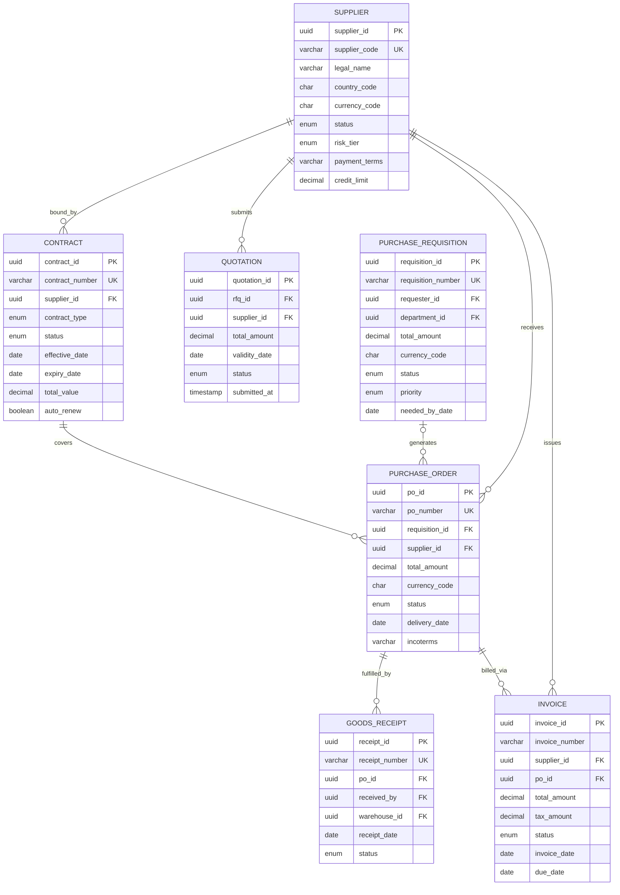

# Data Dictionary — Supply Chain Management Platform

This document serves as the authoritative reference for all persistent data entities within the Supply Chain Management Platform. It defines canonical field names, data types, nullability constraints, validation rules, and the business semantics that govern data storage, exchange, and quality across the platform's bounded contexts.

All service teams implementing persistence layers, data migrations, analytics pipelines, or external API contract definitions must treat this dictionary as the single source of truth. Deviations require a formal data governance review and must be reflected in a versioned amendment to this document before deployment.

---

## Core Entities

### Supplier

The `Supplier` entity represents an external organisation or individual registered as a potential or active vendor within the platform. Supplier records are the anchor entity for all procurement activity; every purchase order, contract, quotation, and invoice is ultimately associated with a supplier record. The lifecycle spans from initial prospecting through active trading to potential suspension or blacklisting, with each state carrying distinct operational and compliance implications.

| Field | Type | Description | Constraints |
|---|---|---|---|
| `supplier_id` | `UUID` | Immutable primary key, system-generated on record creation | `PK`, `NOT NULL` |
| `supplier_code` | `VARCHAR(20)` | Short human-readable code used in downstream integrations and document references | `UNIQUE`, `NOT NULL`, pattern `^SUP-[A-Z0-9]{5,15}$` |
| `legal_name` | `VARCHAR(255)` | Official registered legal name of the supplier entity | `NOT NULL` |
| `trade_name` | `VARCHAR(255)` | Operating or brand name; may differ from legal name for subsidiaries or franchise entities | Nullable |
| `tax_id` | `VARCHAR(50)` | Government-issued tax identification number (VAT, EIN, GST, CRN, etc.) | Nullable; format validated against `country_code` |
| `country_code` | `CHAR(2)` | ISO 3166-1 alpha-2 country code of primary registration | `NOT NULL`; must exist in `ref_countries` |
| `currency_code` | `CHAR(3)` | Default transaction currency per ISO 4217 | `NOT NULL`; must exist in `ref_currencies` |
| `status` | `ENUM` | Lifecycle state: `PROSPECTIVE`, `ACTIVE`, `SUSPENDED`, `BLACKLISTED` | `NOT NULL`; default `PROSPECTIVE`; state machine enforced |
| `risk_tier` | `ENUM` | Procurement risk classification: `LOW`, `MEDIUM`, `HIGH` | `NOT NULL`; default `MEDIUM`; recalculated quarterly via BR-007 |
| `onboarded_at` | `TIMESTAMP` | UTC timestamp when supplier first achieved `ACTIVE` status | Nullable; set automatically on first activation |
| `payment_terms` | `VARCHAR(50)` | Standard payment terms code, e.g. `NET30`, `NET60`, `2/10 NET30` | Nullable; validated against `ref_payment_terms` |
| `credit_limit` | `DECIMAL(15,2)` | Maximum outstanding payables permitted at any point in time | Nullable; must be ≥ 0 |
| `contact_email` | `VARCHAR(255)` | Primary business contact email address | Nullable; RFC 5322 format validation |
| `website` | `VARCHAR(500)` | Supplier's official website URL | Nullable; must begin with `https://` if provided |
| `created_at` | `TIMESTAMP` | UTC timestamp of record creation | `NOT NULL`; system-managed; immutable after write |
| `updated_at` | `TIMESTAMP` | UTC timestamp of most recent field modification | `NOT NULL`; system-managed; auto-updated on every change |

---

### PurchaseRequisition

A `PurchaseRequisition` represents an internal request from a department or cost centre seeking authorisation to procure goods or services. Requisitions initiate the procurement workflow and are subject to tiered approval thresholds before a Purchase Order may be raised. A single requisition may yield one or more Purchase Orders depending on sourcing outcomes.

| Field | Type | Description | Constraints |
|---|---|---|---|
| `requisition_id` | `UUID` | Immutable primary key | `PK`, `NOT NULL` |
| `requisition_number` | `VARCHAR(30)` | System-generated human-readable reference; used in all communications and audit logs | `UNIQUE`, `NOT NULL`, pattern `^REQ-[0-9]{4}-[0-9]{6}$` |
| `requester_id` | `UUID` | Reference to the employee who submitted the requisition | `FK → users.user_id`, `NOT NULL` |
| `department_id` | `UUID` | Reference to the department budget against which the requisition is charged | `FK → departments.department_id`, `NOT NULL` |
| `total_amount` | `DECIMAL(15,2)` | Aggregate estimated value of all requisition line items | `NOT NULL`; must be > 0 |
| `currency_code` | `CHAR(3)` | ISO 4217 currency of the requisition total | `NOT NULL`; must exist in `ref_currencies` |
| `status` | `ENUM` | Workflow state: `DRAFT`, `SUBMITTED`, `UNDER_REVIEW`, `APPROVED`, `REJECTED`, `PO_CREATED`, `CANCELLED` | `NOT NULL`; default `DRAFT`; state machine enforced |
| `priority` | `ENUM` | Procurement urgency classification: `ROUTINE`, `URGENT`, `EMERGENCY` | `NOT NULL`; default `ROUTINE` |
| `needed_by_date` | `DATE` | Requested delivery or readiness date for the items | Nullable; must be ≥ current calendar date at time of creation |
| `justification` | `TEXT` | Business justification narrative; mandatory when `total_amount` exceeds Director approval threshold | Nullable; required if `total_amount` > 10,000 |
| `created_at` | `TIMESTAMP` | UTC timestamp of record creation | `NOT NULL`; system-managed |
| `updated_at` | `TIMESTAMP` | UTC timestamp of most recent modification | `NOT NULL`; system-managed |

---

### PurchaseOrder

A `PurchaseOrder` is the binding commercial document issued to a supplier, authorising procurement of specified goods or services under agreed pricing and delivery terms. A PO may be derived from an approved requisition or created directly against an active contract for blanket order releases.

| Field | Type | Description | Constraints |
|---|---|---|---|
| `po_id` | `UUID` | Immutable primary key | `PK`, `NOT NULL` |
| `po_number` | `VARCHAR(30)` | System-generated human-readable reference; transmitted to the supplier on issuance | `UNIQUE`, `NOT NULL`, pattern `^PO-[0-9]{4}-[0-9]{6}$` |
| `requisition_id` | `UUID` | Optional link to the originating purchase requisition | `FK → purchase_requisitions.requisition_id`; Nullable |
| `supplier_id` | `UUID` | Supplier to whom the order is addressed | `FK → suppliers.supplier_id`, `NOT NULL` |
| `total_amount` | `DECIMAL(15,2)` | Aggregate value of all PO line items inclusive of applicable taxes and charges | `NOT NULL`; must be > 0 |
| `currency_code` | `CHAR(3)` | ISO 4217 transaction currency; must match supplier default unless explicitly overridden | `NOT NULL`; must exist in `ref_currencies` |
| `status` | `ENUM` | Lifecycle state: `DRAFT`, `ISSUED`, `CONFIRMED`, `PARTIALLY_RECEIVED`, `RECEIVED`, `INVOICED`, `PAID`, `CLOSED`, `CANCELLED` | `NOT NULL`; default `DRAFT`; state machine enforced |
| `payment_terms` | `VARCHAR(50)` | Payment terms in effect for this PO; overrides supplier default if contract specifies alternative terms | Nullable; validated against `ref_payment_terms` |
| `delivery_date` | `DATE` | Contractually agreed delivery date communicated to the supplier | Nullable |
| `ship_to_address` | `TEXT` | Full delivery address; structured as free text or serialised per the platform `address_schema` | Nullable |
| `incoterms` | `VARCHAR(20)` | International Commercial Terms governing risk and cost transfer, e.g. `DDP`, `FOB`, `CIF` | Nullable; validated against `ref_incoterms` |
| `created_at` | `TIMESTAMP` | UTC timestamp of record creation | `NOT NULL`; system-managed |
| `updated_at` | `TIMESTAMP` | UTC timestamp of most recent modification | `NOT NULL`; system-managed |

---

### Quotation

A `Quotation` captures a supplier's formal commercial response to a Request for Quotation (RFQ). Quotations are evaluated comparatively during sourcing events prior to PO award. Only one quotation per RFQ per supplier is permitted in `SUBMITTED` or `UNDER_EVALUATION` state simultaneously.

| Field | Type | Description | Constraints |
|---|---|---|---|
| `quotation_id` | `UUID` | Immutable primary key | `PK`, `NOT NULL` |
| `rfq_id` | `UUID` | Reference to the parent Request for Quotation event | `FK → rfqs.rfq_id`, `NOT NULL` |
| `supplier_id` | `UUID` | Supplier who submitted the quotation | `FK → suppliers.supplier_id`, `NOT NULL` |
| `total_amount` | `DECIMAL(15,2)` | Total quoted value inclusive of all line items and applicable charges | `NOT NULL`; must be > 0 |
| `currency_code` | `CHAR(3)` | ISO 4217 currency in which the quotation is expressed | `NOT NULL`; must exist in `ref_currencies` |
| `validity_date` | `DATE` | Date through which quoted prices remain binding and actionable | `NOT NULL`; must be strictly after `submitted_at` |
| `status` | `ENUM` | Evaluation state: `DRAFT`, `SUBMITTED`, `UNDER_EVALUATION`, `AWARDED`, `REJECTED`, `EXPIRED` | `NOT NULL`; default `DRAFT`; state machine enforced |
| `submitted_at` | `TIMESTAMP` | UTC timestamp of formal supplier submission | Nullable; set automatically on transition to `SUBMITTED` |
| `notes` | `TEXT` | Supplier-provided commentary, clarifications, or exceptions to the RFQ specification | Nullable |
| `created_at` | `TIMESTAMP` | UTC timestamp of record creation | `NOT NULL`; system-managed |
| `updated_at` | `TIMESTAMP` | UTC timestamp of most recent modification | `NOT NULL`; system-managed |

---

### GoodsReceipt

A `GoodsReceipt` documents the physical or confirmed digital receipt of goods or services against an open Purchase Order. It provides the factual receipt record required for three-way match processing and serves as the trigger for inventory position updates in connected warehouse management systems.

| Field | Type | Description | Constraints |
|---|---|---|---|
| `receipt_id` | `UUID` | Immutable primary key | `PK`, `NOT NULL` |
| `receipt_number` | `VARCHAR(30)` | System-generated human-readable reference | `UNIQUE`, `NOT NULL`, pattern `^GR-[0-9]{4}-[0-9]{6}$` |
| `po_id` | `UUID` | Purchase Order against which goods or services are being received | `FK → purchase_orders.po_id`, `NOT NULL` |
| `received_by` | `UUID` | User who recorded and attested to the receipt transaction | `FK → users.user_id`, `NOT NULL` |
| `warehouse_id` | `UUID` | Destination warehouse, dock, or storage location | `FK → warehouses.warehouse_id`, `NOT NULL` |
| `receipt_date` | `DATE` | Calendar date the goods physically arrived or the service was confirmed as rendered | `NOT NULL` |
| `status` | `ENUM` | Processing state: `DRAFT`, `RECORDED`, `VERIFIED`, `DISCREPANCY`, `ACCEPTED` | `NOT NULL`; default `DRAFT` |
| `carrier_name` | `VARCHAR(255)` | Name of the logistics carrier or freight forwarder | Nullable |
| `tracking_number` | `VARCHAR(100)` | Carrier shipment or waybill tracking reference | Nullable |
| `notes` | `TEXT` | Receiver observations including damage notes, partial delivery explanations, or quality flags | Nullable |
| `created_at` | `TIMESTAMP` | UTC timestamp of record creation | `NOT NULL`; system-managed |
| `updated_at` | `TIMESTAMP` | UTC timestamp of most recent modification | `NOT NULL`; system-managed |

---

### Invoice

An `Invoice` represents a formal payment demand received from a supplier via EDI transmission, supplier portal upload, email parsing, or manual entry. Invoices undergo three-way matching against the corresponding Purchase Order and Goods Receipt before payment authorisation is granted.

| Field | Type | Description | Constraints |
|---|---|---|---|
| `invoice_id` | `UUID` | Immutable primary key | `PK`, `NOT NULL` |
| `invoice_number` | `VARCHAR(50)` | Internal platform-generated document reference | `NOT NULL` |
| `external_invoice_number` | `VARCHAR(100)` | Supplier's own invoice number as printed on the source document | Nullable |
| `supplier_id` | `UUID` | Supplier who issued the invoice | `FK → suppliers.supplier_id`, `NOT NULL` |
| `po_id` | `UUID` | Purchase Order to which this invoice is matched; nullable for unmatched invoices under review | `FK → purchase_orders.po_id`; Nullable |
| `total_amount` | `DECIMAL(15,2)` | Gross invoice total inclusive of all taxes and charges | `NOT NULL`; must be > 0 |
| `tax_amount` | `DECIMAL(15,2)` | Total tax component of the invoice | `NOT NULL`; must be ≥ 0 and ≤ `total_amount` |
| `currency_code` | `CHAR(3)` | ISO 4217 invoice currency | `NOT NULL`; must exist in `ref_currencies` |
| `status` | `ENUM` | Workflow state: `RECEIVED`, `UNDER_REVIEW`, `MATCHED`, `DISPUTED`, `APPROVED`, `PAID`, `CANCELLED` | `NOT NULL`; default `RECEIVED` |
| `invoice_date` | `DATE` | Date printed on the supplier's source invoice document | `NOT NULL` |
| `due_date` | `DATE` | Calculated payment due date derived from `invoice_date` plus applicable payment term days | `NOT NULL`; auto-derived; Finance Director approval required for manual override |
| `payment_method` | `VARCHAR(50)` | Intended settlement method: `WIRE`, `ACH`, `CHECK`, `CARD`, `VIRTUAL_CARD` | Nullable |
| `created_at` | `TIMESTAMP` | UTC timestamp of record creation | `NOT NULL`; system-managed |
| `updated_at` | `TIMESTAMP` | UTC timestamp of most recent modification | `NOT NULL`; system-managed |

---

### Contract

A `Contract` is a legally binding commercial agreement between the organisation and a supplier, establishing the scope, pricing, duration, and terms under which procurement activity may be conducted. Active contracts govern PO creation eligibility and may carry volume commitments, SLA obligations, pricing schedules, and automatic renewal provisions.

| Field | Type | Description | Constraints |
|---|---|---|---|
| `contract_id` | `UUID` | Immutable primary key | `PK`, `NOT NULL` |
| `contract_number` | `VARCHAR(30)` | System-generated human-readable reference | `UNIQUE`, `NOT NULL`, pattern `^CTR-[0-9]{4}-[0-9]{6}$` |
| `supplier_id` | `UUID` | Counterparty supplier bound by the contract | `FK → suppliers.supplier_id`, `NOT NULL` |
| `contract_type` | `ENUM` | Commercial classification: `MASTER`, `BLANKET`, `SPOT`, `FRAMEWORK` | `NOT NULL` |
| `status` | `ENUM` | Lifecycle state: `DRAFT`, `UNDER_REVIEW`, `APPROVED`, `ACTIVE`, `EXPIRING`, `EXPIRED`, `TERMINATED`, `RENEWED` | `NOT NULL`; default `DRAFT`; state machine enforced |
| `effective_date` | `DATE` | Date from which the contract terms become operative | `NOT NULL` |
| `expiry_date` | `DATE` | Date on which the contract lapses absent renewal | `NOT NULL`; must be strictly > `effective_date` |
| `total_value` | `DECIMAL(15,2)` | Maximum committed or estimated total contract value over its term | Nullable; must be ≥ 0 if provided |
| `currency_code` | `CHAR(3)` | ISO 4217 currency in which contract values are expressed | `NOT NULL`; must exist in `ref_currencies` |
| `auto_renew` | `BOOLEAN` | Indicates whether the contract automatically renews at `expiry_date` | `NOT NULL`; default `FALSE` |
| `renewal_notice_days` | `INT` | Minimum calendar days' advance notice required to prevent automatic renewal | Nullable; must be ≥ 1 when `auto_renew` is `TRUE` |
| `signed_at` | `TIMESTAMP` | UTC timestamp of final bilateral execution by both parties | Nullable; set automatically on transition to `ACTIVE` |
| `created_at` | `TIMESTAMP` | UTC timestamp of record creation | `NOT NULL`; system-managed |
| `updated_at` | `TIMESTAMP` | UTC timestamp of most recent modification | `NOT NULL`; system-managed |

---

## Canonical Relationship Diagram

The diagram below illustrates the structural relationships among all seven core procurement entities using Crow's Foot cardinality notation. Relationship labels describe the business semantics of each association. Reference entities (Users, Departments, Warehouses, RFQs) are omitted for clarity.

---

## Data Quality Controls

Data quality rules are evaluated in two stages: application-layer validation executes before persistence and returns structured field-level errors to the caller, while database-level constraints serve as a defence-in-depth mechanism. All validation failures are written to the platform audit trail with the originating request context, operator identity, and a snapshot of the submitted payload.

| Rule ID | Rule | Entity | Constraint Type | Action on Violation |
|---|---|---|---|---|
| DQ-001 | `supplier_code` must match the pattern `^SUP-[A-Z0-9]{5,15}$` | Supplier | Format Validation | Reject write; return `400 Bad Request` with field-level error detail |
| DQ-002 | `country_code` must be a valid ISO 3166-1 alpha-2 code present in `ref_countries` | Supplier, PurchaseOrder | Referential Integrity | Reject write; return validation error identifying the invalid value |
| DQ-003 | `currency_code` must be a valid ISO 4217 alpha-3 code present in `ref_currencies` | All entities with `currency_code` | Referential Integrity | Reject write; return validation error identifying the invalid value |
| DQ-004 | All monetary amount fields (`total_amount`, `credit_limit`, `tax_amount`, `total_value`) must be ≥ 0 | All monetary entities | Range Validation | Reject write; return `400 Bad Request` with the offending field name |
| DQ-005 | `tax_amount` must be less than or equal to `total_amount` on the same Invoice record | Invoice | Business Logic | Reject write; return descriptive validation error with both field values |
| DQ-006 | `expiry_date` must be strictly greater than `effective_date` | Contract | Range Validation | Reject write; return validation error with both date values |
| DQ-007 | `needed_by_date` must be equal to or greater than the current calendar date at the time of requisition creation | PurchaseRequisition | Range Validation | Reject write; return validation error showing the supplied and minimum acceptable dates |
| DQ-008 | `due_date` must equal `invoice_date` plus the applicable payment term days derived from the linked PO or supplier record | Invoice | Business Logic | Auto-derive on creation; write audit log entry if manually overridden by an authorised Finance user |
| DQ-009 | `renewal_notice_days` must be ≥ 1 when `auto_renew` is `TRUE` | Contract | Conditional Constraint | Reject write; return validation error with a remediation hint |
| DQ-010 | A supplier's `status` must not transition directly from `BLACKLISTED` to `ACTIVE` without completion of the re-onboarding compliance workflow | Supplier | State Machine Validation | Reject the status update; notify the Supplier Management team; log the violation to the audit trail |
| DQ-011 | `external_invoice_number` must be unique per `supplier_id` within the same calendar year to prevent duplicate invoice processing | Invoice | Uniqueness | Reject write; return a duplicate invoice error including the conflicting record's `invoice_id` and date |
| DQ-012 | `validity_date` on a Quotation must be strictly after `submitted_at` | Quotation | Range Validation | Reject write; return validation error with both timestamp values |
| DQ-013 | A PurchaseOrder transitioning to `ISSUED` status or later must reference a `supplier_id` belonging to a supplier with `status = ACTIVE` | PurchaseOrder | State + Referential | Reject the status transition; return an error referencing the supplier's current status |
| DQ-014 | `receipt_date` on a GoodsReceipt must not precede the `created_at` timestamp of the associated Purchase Order | GoodsReceipt | Referential Range | Reject write; return validation error including the PO creation date for context |
| DQ-015 | A Contract with `contract_type = BLANKET` must have a non-null `total_value` representing the maximum release value | Contract | Conditional Non-Null | Reject write; return validation error identifying the missing field and contract type requirement |
| DQ-016 | `incoterms` on a PurchaseOrder, when provided, must be a recognised code present in `ref_incoterms` | PurchaseOrder | Referential Integrity | Reject write; return validation error with the invalid code and a reference to the supported values list |
